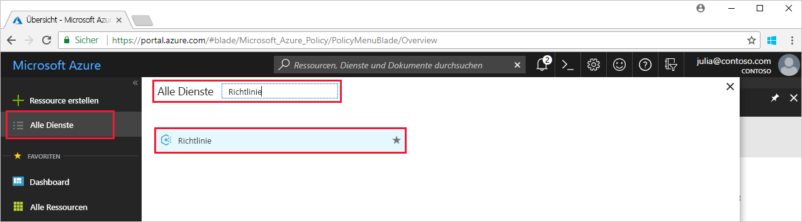
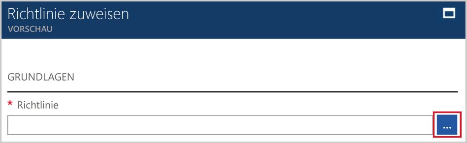

# <a name="create-and-manage-policies-to-enforce-compliance"></a>Erstellen und Verwalten von Richtlinien zur Konformitätserzwingung

Zur Einhaltung Ihrer Unternehmensstandards und Vereinbarungen zum Servicelevel müssen Sie mit der Erstellung und Verwaltung von Richtlinien in Azure vertraut sein. In diesem Tutorial erfahren Sie, wie Sie mithilfe von Azure Policy einige allgemeinere Aufgaben im Zusammenhang mit der organisationsweiten Erstellung, Zuweisung und Verwaltung von Richtlinien durchführen:

> [!div class="checklist"]
> * Zuweisen einer Richtlinie zur Erzwingung einer Bedingung für die spätere Erstellung von Ressourcen
> * Erstellen und Zuweisen einer Initiativdefinition zur Nachverfolgung der Konformität für mehrere Ressourcen
> * Beheben von Problemen mit einer nicht konformen oder abgelehnten Ressource
> * Implementieren einer neuen Richtlinie in der gesamten Organisation

Wenn Sie kein Azure-Abonnement besitzen, können Sie ein [kostenloses Konto](https://azure.microsoft.com/free/?WT.mc_id=A261C142F) erstellen, bevor Sie beginnen.

## <a name="opt-in-to-azure-policy"></a>Registrieren für Azure Policy

Azure Policy ist jetzt in einer eingeschränkten Vorschauversion verfügbar und kann erst nach vorheriger Registrierung verwendet werden.

1. Navigieren Sie zu Azure Policy (https://aka.ms/getpolicy), und klicken Sie im linken Bereich auf **Registrieren**.

   

2. Registrieren Sie sich für Azure Policy, indem Sie in der Abonnementliste die gewünschten **Abonnements** auswählen. Klicken Sie anschließend auf **Register** (Registrieren).

   Die Abonnementliste enthält alle Ihre Azure-Abonnements.

   

   Bei hoher Nachfrage kann es mehrere Tage dauern, bis wir Ihre Registrierungsanforderung akzeptieren. Wenn Ihre Anforderung akzeptiert wurde, werden Sie per E-Mail darüber informiert, dass Sie den Dienst nun verwenden können.

## <a name="assign-a-policy"></a>Zuweisen einer Richtlinie

Für die Konformitätserzwingung mit Azure Policy muss zunächst eine Richtliniendefinition zugewiesen werden. Eine Richtliniendefinition definiert, unter welcher Bedingung eine Richtlinie erzwungen wird und welche Maßnahme ergriffen werden soll. In diesem Beispiel weisen wir eine integrierte Richtliniendefinition namens *Require SQL Server Version 12.0* (SQL Server-Version 12.0 fordern) zu, um die Bedingung durchzusetzen, dass alle SQL Server-Datenbanken die Version 12.0 besitzen müssen, um die Konformitätsanforderungen zu erfüllen.

1. Starten Sie den Azure Policy-Dienst über das Azure-Portal, indem Sie im linken Bereich nach **Policy** suchen und die entsprechende Option auswählen.

   

2. Klicken Sie im linken Bereich der Seite „Azure Policy“ auf **Zuweisungen**. Eine Zuweisung ist eine zugewiesene Richtlinie, die innerhalb eines bestimmten Bereichs angewendet werden soll.
3. Klicken Sie im oberen Bereich der Seite **Zuweisungen** auf **Richtlinie zuweisen**.

   

4. Klicken Sie auf der Seite **Richtlinie zuweisen** neben dem Feld **Richtlinie** auf die Schaltfläche , um die Liste mit den verfügbaren Definitionen zu öffnen.

   

5. Wählen Sie **Require SQL Server version 12.0** (SQL Server-Version 12.0 fordern) aus.

   

6. Geben Sie einen **Anzeigenamen** für die Richtlinienzuweisung an. In diesem Beispiel verwenden wir *Require SQL Server version 12.0* (SQL Server-Version 12.0 fordern). Geben Sie ggf. auch eine **Beschreibung** ein. In der Beschreibung wird erläutert, dass diese Richtlinienzuweisung sicherstellt, dass in dieser Umgebung nur SQL Server-Instanzen der Version 12.0 erstellt werden.
7. Ändern Sie den Tarif in **Standard**, um sicherzustellen, dass die Richtlinie auf bereits vorhandene Ressourcen angewendet wird.

   In Azure Policy stehen zwei Tarife zur Verfügung: *Free* und *Standard*. Mit dem Free-Tarif können Richtlinien nur für zukünftige Ressourcen erzwungen werden. Mit dem Standard-Tarif können Sie Richtlinien hingegen auch für bereits vorhandene Ressourcen erzwingen und Ihren Konformitätszustand besser nachvollziehen. Da es sich hierbei um eine eingeschränkte Vorschauversion handelt, haben wir noch kein Preismodell veröffentlicht, und Ihnen entstehen durch die Wahl von *Standard* keine Kosten. Weitere Informationen zu Preisen finden Sie auf der [Preisseite für Azure Policy](https://acom-milestone-ignite.azurewebsites.net/pricing/details/azure-policy/).

8. Wählen Sie den **Bereich** aus. Hierbei handelt es sich um das Abonnement (oder die Ressourcengruppe), das bzw. die Sie zuvor im Rahmen der Registrierung für Azure Policy registriert haben. Ein Bereich bestimmt, für welche Ressourcen oder Ressourcengruppe die Richtlinienzuweisung erzwungen wird. Er kann von einem Abonnement bis zu Ressourcengruppen reichen.

   In diesem Beispiel verwenden wir das Abonnement **Azure Analytics Capacity Dev**. Ihr Abonnement wird sich davon unterscheiden.

10. Wählen Sie **Zuweisen** aus.

## <a name="implement-a-new-custom-policy"></a>Implementieren einer neuen benutzerdefinierten Richtlinie

Nach dem Zuweisen der Richtliniendefinition erstellen wir eine neue Richtlinie zur Kosteneinsparung, die sicherstellt, dass in der gesamten Umgebung keine virtuellen Computer der G-Serie erstellt werden können. Wenn also ein Benutzer in Ihrer Organisation versucht, einen virtuellen Computer aus der G-Serie zu erstellen, wird die Anforderung abgelehnt.

1. Klicken Sie im linken Bereich unter **Authoring** (Erstellung) auf **Definitionen**.

   

2. Klicken Sie auf **+ Richtliniendefinition**.
3. Geben Sie Folgendes ein:

   - Den Namen der Richtliniendefinition: *Require VM SKUs smaller than the G series* (VM-SKUs müssen kleiner als die G-Serie sein)
   - Den Zweck der Richtliniendefinition: „This policy definition enforces that all VMs created in this scope have SKUs smaller than the G series to reduce cost.“ (Diese Richtliniendefinition dient zur Kostensenkung und bewirkt, dass die SKU von virtuellen Computern, die in diesem Bereich erstellt werden, kleiner als die G-Serie ist.)
   - Das Abonnement, zu dem die Richtliniendefinition gehört: In unserem Beispiel gehört die Richtliniendefinition zu **Advisor Analytics Capacity Dev**. Ihre Abonnementliste wird sich davon unterscheiden.
   - Schreiben Sie den JSON-Code mit Folgendem:
      - Richtlinienparameter
      - Richtlinienregeln/-bedingungen (in unserem Fall: VM-SKU-Größe gleich G-Serie)
      - Wirkung der Richtlinie (in unserem Fall: **deny**, also „Ablehnen“)

   Der JSON-Code sollte wie folgt aussehen:

```json
{
    "policyRule": {
      "if": {
        "allOf": [
          {
            "field": "type",
            "equals": "Microsoft.Compute/virtualMachines"
          },
          {
            "field": "Microsoft.Compute/virtualMachines/sku.name",
            "like": "Standard_G*"
          }
        ]
      },
      "then": {
        "effect": "deny"
      }
    }
}
```

<!-- Update the following link to the top level samples page
-->
   JSON-Codebeispiele finden Sie im Artikel [Vorlagen für Azure Policy](json-samples.md).

4. Wählen Sie **Speichern** aus.

## <a name="create-a-policy-definition-with-rest-api"></a>Erstellen einer Richtliniendefinition mit der REST-API

Sie können eine Richtlinie mit der REST-API für Richtliniendefinitionen erstellen. Die REST-API ermöglicht es Ihnen, Richtliniendefinitionen zu erstellen und zu löschen sowie Informationen zu vorhandenen Definitionen abzurufen.
Um eine Richtliniendefinition zu erstellen, verwenden Sie das folgende Beispiel:

```
PUT https://management.azure.com/subscriptions/{subscription-id}/providers/Microsoft.authorization/policydefinitions/{policyDefinitionName}?api-version={api-version}

```
Nehmen Sie einen Anforderungstext auf, der dem im folgenden Beispiel dargestellten ähnelt:

```
{
  "properties": {
    "parameters": {
      "allowedLocations": {
        "type": "array",
        "metadata": {
          "description": "The list of locations that can be specified when deploying resources",
          "strongType": "location",
          "displayName": "Allowed locations"
        }
      }
    },
    "displayName": "Allowed locations",
    "description": "This policy enables you to restrict the locations your organization can specify when deploying resources.",
    "policyRule": {
      "if": {
        "not": {
          "field": "location",
          "in": "[parameters('allowedLocations')]"
        }
      },
      "then": {
        "effect": "deny"
      }
    }
  }
}
```

## <a name="create-a-policy-definition-with-powershell"></a>Erstellen einer Richtliniendefinition mit PowerShell

Vergewissern Sie sich, dass Sie die neueste Version von Azure PowerShell installiert haben, bevor Sie mit dem PowerShell-Beispiel fortfahren. In Version 3.6.0 wurden Richtlinienparameter hinzugefügt. Bei Verwendung einer älteren Version wird bei den Beispielen ein Fehler mit dem Hinweis zurückgegeben, dass der Parameter nicht gefunden wurde.

Sie können eine Richtliniendefinition über das Cmdlet `New-AzureRmPolicyDefinition` erstellen.

Um eine Richtliniendefinition auf der Grundlage einer Datei zu erstellen, übergeben Sie den Pfad zur Datei. Verwenden Sie das folgende Beispiel für eine externe Datei:

```
$definition = New-AzureRmPolicyDefinition `
    -Name denyCoolTiering `
    -DisplayName "Deny cool access tiering for storage" `
    -Policy 'https://raw.githubusercontent.com/Azure/azure-policy-samples/master/samples/Storage/storage-account-access-tier/azurepolicy.rules.json'
```

Verwenden Sie das folgende Beispiel für eine lokale Datei:

```
$definition = New-AzureRmPolicyDefinition `
    -Name denyCoolTiering `
    -Description "Deny cool access tiering for storage" `
    -Policy "c:\policies\coolAccessTier.json"
```

Verwenden Sie zum Erstellen einer Richtliniendefinition mit einer Inline-Regel das folgende Beispiel:

```
$definition = New-AzureRmPolicyDefinition -Name denyCoolTiering -Description "Deny cool access tiering for storage" -Policy '{
  "if": {
    "allOf": [
      {
        "field": "type",
        "equals": "Microsoft.Storage/storageAccounts"
      },
      {
        "field": "kind",
        "equals": "BlobStorage"
      },
      {
        "not": {
          "field": "Microsoft.Storage/storageAccounts/accessTier",
          "equals": "cool"
        }
      }
    ]
  },
  "then": {
    "effect": "deny"
  }
}'
```

Die Ausgabe wird in einem `$definition`-Objekt gespeichert, das während der Richtlinienzuweisung verwendet wird.
Im folgenden Beispiel wird eine Richtliniendefinition mit Parametern erstellt:

```
$policy = '{
    "if": {
        "allOf": [
            {
                "field": "type",
                "equals": "Microsoft.Storage/storageAccounts"
            },
            {
                "not": {
                    "field": "location",
                    "in": "[parameters(''allowedLocations'')]"
                }
            }
        ]
    },
    "then": {
        "effect": "Deny"
    }
}'

$parameters = '{
    "allowedLocations": {
        "type": "array",
        "metadata": {
          "description": "The list of locations that can be specified when deploying storage accounts.",
          "strongType": "location",
          "displayName": "Allowed locations"
        }
    }
}'

$definition = New-AzureRmPolicyDefinition -Name storageLocations -Description "Policy to specify locations for storage accounts." -Policy $policy -Parameter $parameters
```

## <a name="view-policy-definitions"></a>Anzeigen von Richtliniendefinitionen

Verwenden Sie den folgenden Befehl, um alle Richtliniendefinitionen in Ihrem Abonnement anzuzeigen:

```
Get-AzureRmPolicyDefinition
```

Es gibt alle verfügbaren Richtliniendefinitionen, einschließlich integrierten Richtlinien, zurück. Jede Richtlinie wird im folgenden Format zurückgeben:

```
Name               : e56962a6-4747-49cd-b67b-bf8b01975c4c
ResourceId         : /providers/Microsoft.Authorization/policyDefinitions/e56962a6-4747-49cd-b67b-bf8b01975c4c
ResourceName       : e56962a6-4747-49cd-b67b-bf8b01975c4c
ResourceType       : Microsoft.Authorization/policyDefinitions
Properties         : @{displayName=Allowed locations; policyType=BuiltIn; description=This policy enables you to
                     restrict the locations your organization can specify when deploying resources. Use to enforce
                     your geo-compliance requirements.; parameters=; policyRule=}
PolicyDefinitionId : /providers/Microsoft.Authorization/policyDefinitions/e56962a6-4747-49cd-b67b-bf8b01975c4c
```

## <a name="create-a-policy-definition-with-azure-cli"></a>Erstellen einer Richtliniendefinition mit Azure CLI

Sie können eine Richtliniendefinition mit dem entsprechenden Befehl über Azure CLI erstellen.
Verwenden Sie zum Erstellen einer Richtliniendefinition mit einer Inline-Regel das folgende Beispiel:

```
az policy definition create --name denyCoolTiering --description "Deny cool access tiering for storage" --rules '{
  "if": {
    "allOf": [
      {
        "field": "type",
        "equals": "Microsoft.Storage/storageAccounts"
      },
      {
        "field": "kind",
        "equals": "BlobStorage"
      },
      {
        "not": {
          "field": "Microsoft.Storage/storageAccounts/accessTier",
          "equals": "cool"
        }
      }
    ]
  },
  "then": {
    "effect": "deny"
  }
}'
```

## <a name="view-policy-definitions"></a>Anzeigen von Richtliniendefinitionen

Verwenden Sie den folgenden Befehl, um alle Richtliniendefinitionen in Ihrem Abonnement anzuzeigen:

```
az policy definition list
```

Es gibt alle verfügbaren Richtliniendefinitionen, einschließlich integrierten Richtlinien, zurück. Jede Richtlinie wird im folgenden Format zurückgeben:

```
{                                                            
  "description": "This policy enables you to restrict the locations your organization can specify when deploying resources. Use to enforce your geo-compliance requirements.",                      
  "displayName": "Allowed locations",
  "id": "/providers/Microsoft.Authorization/policyDefinitions/e56962a6-4747-49cd-b67b-bf8b01975c4c",
  "name": "e56962a6-4747-49cd-b67b-bf8b01975c4c",
  "policyRule": {
    "if": {
      "not": {
        "field": "location",
        "in": "[parameters('listOfAllowedLocations')]"
      }
    },
    "then": {
      "effect": "Deny"
    }
  },
  "policyType": "BuiltIn"
}
```

## <a name="create-and-assign-an-initiative-definition"></a>Erstellen und Zuweisen einer Initiativdefinition

Mit einer Initiativdefinition können Sie mehrere Richtliniendefinitionen zu einer Gruppe zusammenfassen, um ein übergeordnetes Ziel zu erreichen. Eine Initiativdefinition stellt sicher, dass Ressourcen innerhalb des Definitionsbereichs mit den Richtliniendefinitionen konform sind, aus denen sich die Initiativdefinition zusammensetzt.  Weitere Informationen zu Initiativdefinitionen finden Sie in der [Übersicht über Azure Policy](./azure-policy-introduction.md).

### <a name="create-an-initiative-definition"></a>Erstellen einer Initiativdefinition

1. Klicken Sie im linken Bereich unter **Authoring** (Erstellung) auf **Definitionen**.

   

2. Klicken Sie im oberen Bereich der Seite auf **Initiative Definition** (Initiativdefinition), um zum gleichnamigen Formular zu gelangen.
3. Geben Sie den Namen und die Beschreibung der Initiative ein.

   In diesem Beispiel möchten wir sicherstellen, dass Ressourcen mit Richtliniendefinitionen zur Verbesserung der Sicherheit konform sind. Daher nennen wir die Initiative **Get Secure** (Sicherheit verbessern) und geben als Beschreibung Folgendes an: **This initiative has been created to handle all policy definitions associated with securing resources.** (Diese Initiative gilt für alle Richtliniendefinitionen, die mit dem Schutz von Ressourcen in Zusammenhang stehen.)

   

4. Navigieren Sie durch die Liste mit den verfügbaren **Definitionen**, und wählen Sie die Richtliniendefinitionen aus, die Sie der Initiative hinzufügen möchten. Fügen Sie für die Initiative **Get Secure** (Sicherheit verbessern) die folgenden integrierten Richtliniendefinitionen hinzu:
   - Require SQL Server version 12.0 (SQL Server-Version 12.0 fordern)
   - Monitor unprotected web applications in the security center (Ungeschützte Webanwendungen in Security Center überwachen)
   - Monitor permissive network across in Security Center (Gesamtes uneingeschränktes Netzwerk in Security Center überwachen)
   - Monitor possible app Whitelisting in Security Center (Mögliches App-Whitelisting in Security Center überwachen)
   - Monitor unencrypted VM Disks in Security Center (Unverschlüsselte VM-Datenträger in Security Center überwachen)

   

   Die ausgewählten Richtliniendefinitionen werden wie oben zu sehen unter **Policies and parameters** (Richtlinien und Parameter) angezeigt.

5. Klicken Sie auf **Erstellen**.

### <a name="assign-an-initiative-definition"></a>Zuweisen einer Initiativdefinition

1. Navigieren Sie unter **Authoring** (Erstellung) zur Registerkarte **Definitionen**.
2. Suchen Sie nach der erstellten Initiativdefinition **Get Secure** (Sicherheit verbessern).
3. Wählen Sie die Initiativdefinition aus, und klicken Sie anschließend auf **Zuweisen**.

   

4. Füllen Sie das Formular **Zuweisung** wie folgt aus:
   - Name: „Get secure assignment“ (Zuweisung für „Sicherheit verbessern“)
   - Beschreibung: „this initiative assignment is tailored towards enforcing this group of policy definitions in the **Azure Advisor Capacity Dev** subscription“ (Diese Initiativzuweisung dient zur Erzwingung dieser Gruppe von Richtliniendefinitionen im Abonnement „Azure Advisor Capacity Dev“.)
   - Tarif: Standard
   - Bereich, auf den diese Zuweisung angewendet werden soll: **Azure Advisor Capacity Dev**

5. Wählen Sie **Zuweisen** aus.

## <a name="resolve-a-non-compliant-or-denied-resource"></a>Beheben von Problemen mit einer nicht konformen oder abgelehnten Ressource

Das obige Beispiel bewirkt, dass nach dem Zuweisen der Richtliniendefinition zur Forderung der SQL Server-Version 12.0 die Erstellung einer SQL Server-Instanz mit einer anderen Version abgelehnt wird. In diesem Abschnitt erfahren Sie, wie Sie vorgehen können, wenn die Erstellung einer SQL Server-Instanz mit einer anderen Version abgelehnt wurde.

1. Klicken Sie im linken Bereich auf **Zuweisungen**.
2. Durchsuchen Sie alle Richtlinienzuweisungen, und starten Sie die Zuweisung *Require SQL Server version 12.0* (SQL Server-Version 12.0 fordern).
3. Fordern Sie einen Ausschluss für die Ressourcengruppen an, in denen Sie die SQL Server-Instanz erstellen möchten. In diesem Fall schließen wir unter „Microsoft.Sql/servers/databases“ Folgendes aus: *baconandbeer/Cheetos* und *baconandbeer/Chorizo*.

   

   Die Ablehnung einer Ressource kann auch auf andere Weise behandelt werden. So können Sie sich beispielsweise an den mit der Richtlinie verknüpften Kontakt wenden, wenn es einen wichtigen Grund für die Erstellung der SQL Server-Instanz gibt, oder Sie können die Richtlinie direkt bearbeiten, sofern Sie darauf zugreifen können.

4. Wählen Sie **Speichern** aus.

In diesem Abschnitt haben Sie einen Ausschluss der Ressourcen angefordert, um die Ablehnung der Erstellung einer SQL Server-Instanz mit Version 12.0 zu behandeln.

## <a name="clean-up-resources"></a>Bereinigen von Ressourcen

Wenn Sie mit weiteren Tutorials fortfahren möchten, überspringen Sie die Bereinigung der Ressourcen, die im Rahmen dieses Leitfadens erstellt wurden. Falls Sie nicht fortfahren möchten, führen Sie die folgenden Schritte aus, um alle weiter oben erstellten Zuweisungen oder Definitionen zu löschen:

1. Klicken Sie im linken Bereich auf **Definitionen** (oder auf **Zuweisungen**, wenn Sie eine Zuweisung löschen möchten).
2. Suchen Sie nach der neuen Initiative oder Richtliniendefinition (oder Zuweisung), die Sie gerade erstellt haben.
3. Klicken Sie am Ende der Definition oder Zuweisung auf die Auslassungspunkte und anschließend auf **Definition löschen** bzw. auf **Zuweisung löschen**.

## <a name="next-steps"></a>Nächste Schritte

In diesem Tutorial haben Sie Folgendes erreicht:

> [!div class="checklist"]
> * Sie haben eine Richtlinie zur Erzwingung einer Bedingung für die spätere Erstellung von Ressourcen zugewiesen.
> * Sie haben eine Initiativdefinition zur Nachverfolgung der Konformität für mehrere Ressourcen erstellt und zugewiesen.
> * Sie haben ein Problem mit einer nicht konformen oder abgelehnten Ressource behoben.
> * Sie haben eine neue Richtlinie in der gesamten Organisation implementiert.

Weitere Informationen zu den Strukturen von Richtliniendefinitionen finden Sie im folgenden Artikel:

> [!div class="nextstepaction"]
> [Struktur von Azure Policy-Definitionen](policy-definition.md)
