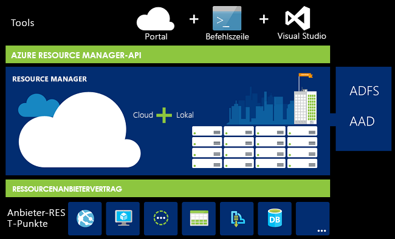
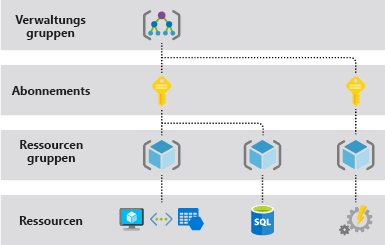
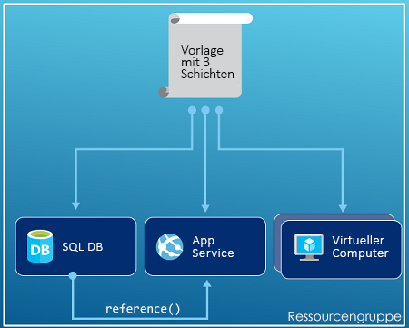
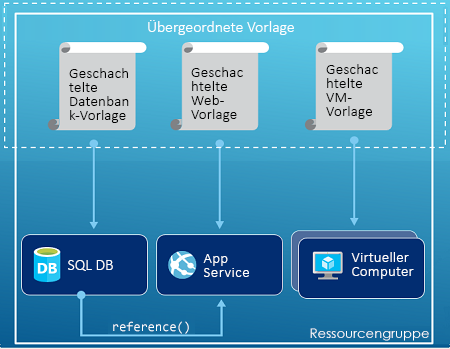
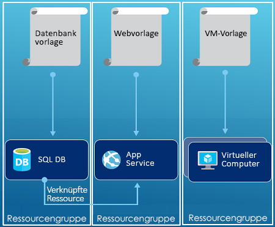

# <a name="azure-resource-manager-overview"></a>Übersicht über den Azure-Ressourcen-Manager

Azure Resource Manager ist der Bereitstellungs- und Verwaltungsdienst für Azure. Er bietet eine konsistente Verwaltungsebene, die das Erstellen, Aktualisieren und Löschen von Ressourcen in Ihrem Azure-Abonnement ermöglicht. Sie können seine Funktionen für Zugriffssteuerung, Überwachung und Kennzeichnung verwenden, um Ihre Ressourcen nach der Bereitstellung zu schützen und zu organisieren.

Wenn Sie Aktionen über das Portal, PowerShell, die Azure CLI, REST-APIs oder Client-SDKs ausführen, wird Ihre Anforderung von der Azure Resource Manager-API verarbeitet. Da alle Anforderungen von der gleichen API verarbeitet werden, stehen in allen Tools konsistente Ergebnisse und Funktionen zur Verfügung. Alle Funktionen, die über das Azure-Portal verfügbar sind, stehen auch über PowerShell, die Azure CLI, die REST-APIs und über Client-SDKs zur Verfügung. Funktionen, die ursprünglich über APIs veröffentlicht wurden, werden innerhalb von 180 Tagen ab der ursprünglichen Veröffentlichung in das Portal aufgenommen.

Die folgende Abbildung zeigt, wie alle Tools mit der Azure Resource Manager-API interagieren. Die API übergibt Anforderungen an den Resource Manager-Dienst, mit dem die Anforderungen authentifiziert und autorisiert werden. Resource Manager leitet die Anforderungen dann an den entsprechenden Dienst weiter.



## <a name="terminology"></a>Begriff

Wenn Sie mit dem Azure Resource Manager noch nicht vertraut sind, kennen Sie unter Umständen einige Begriffe noch nicht.

* **Ressource** : Ein verwaltbares Element, das über Azure verfügbar ist. Virtuelle Computer, Speicherkonten, Web-Apps, Datenbanken und virtuelle Netzwerke sind Beispiele für Ressourcen.
* **Ressourcengruppe** : Ein Container, der verwandte Ressourcen für eine Azure-Lösung enthält. Die Ressourcengruppe enthält die Ressourcen, die Sie als Gruppe verwalten möchten. Sie entscheiden in Abhängigkeit davon, was für Ihre Organisation am sinnvollsten ist, wie Sie die Ressourcen den Ressourcengruppen zuordnen. Weitere Informationen finden Sie unter [Ressourcengruppen](#resource-groups).
* **Ressourcenanbieter:** Ein Dienst, der Azure-Ressourcen bereitstellt. Ein allgemeiner Ressourcenanbieter ist beispielsweise **Microsoft.Compute**, der die VM-Ressource bereitstellt. **Microsoft.Storage** ist ein weiterer allgemeiner Ressourcenanbieter. Weitere Informationen finden Sie unter [Ressourcenanbieter](#resource-providers).
* **Resource Manager-Vorlage:** Eine JSON-Datei (JavaScript Object Notation), mit der eine oder mehrere Ressourcen zum Bereitstellen einer Ressourcengruppe oder eines Abonnements definiert werden. Die Vorlage kann zum konsistenten und wiederholten Bereitstellen der Ressourcen verwendet werden. Weitere Informationen finden Sie unter [Bereitstellung von Vorlagen](#template-deployment).
* **Deklarative Syntax** : Bei dieser Syntax können Sie beispielsweise „Here is what I intend to create“ (Dies möchte ich erstellen) eingeben, ohne dafür die Folge der Programmierbefehle für die Erstellung schreiben zu müssen. Die Resource Manager-Vorlage ist ein Beispiel für die deklarative Syntax. In der Datei definieren Sie die Eigenschaften für die Infrastruktur zum Bereitstellen für Azure.

## <a name="the-benefits-of-using-resource-manager"></a>Vorteile der Verwendung des Ressourcen-Managers

Der Ressourcen-Manager bietet mehrere Vorteile:

* Sie können alle Ressourcen für Ihre Lösung als Gruppe bereitstellen, verwalten und überwachen, anstatt diese Ressourcen einzeln zu verarbeiten.
* Sie können die Lösung während des gesamten Entwicklungslebenszyklus wiederholt bereitstellen und sicher sein, dass Ihre Ressourcen einheitlich bereitgestellt werden.
* Sie können zum Verwalten Ihrer Infrastruktur anstelle von Skripts auch deklarative Vorlagen verwenden.
* Sie können die Abhängigkeiten zwischen Ressourcen definieren, sodass diese in der richtigen Reihenfolge bereitgestellt werden.
* Sie können die Zugriffssteuerung auf alle Dienste in der Ressourcengruppe anwenden, da die rollenbasierte Zugriffssteuerung (Role-Based Access Control, RBAC) standardmäßig in die Verwaltungsplattform integriert ist.
* Sie können Tags auf Ressourcen anwenden, um alle Ressourcen in Ihrem Abonnement logisch zu organisieren.
* Indem Sie die Kosten für eine Gruppe mit Ressourcen anzeigen, für die das gleiche Tag verwendet wird, erhalten Sie die Abrechnungsinformationen für Ihre Organisation.

## <a name="understand-management-scope"></a>Grundlegendes zur Verwaltung

Azure bietet vier Verwaltungsebenen: [Verwaltungsgruppen](../governance/management-groups/index.md), Abonnements, [Ressourcengruppen](#resource-groups) und Ressourcen. Die folgende Abbildung zeigt ein Beispiel dieser Ebenen.



Sie wenden die Verwaltungseinstellungen auf einer dieser Bereichsebenen an. Die von Ihnen ausgewählte Ebene bestimmt, wie umfassend die Einstellung angewendet wird. Niedrigere Ebenen erben die Einstellungen von höheren Ebenen. Wenn Sie also beispielsweise eine [Richtlinie](../governance/policy/overview.md) auf das Abonnement anwenden, gilt diese für alle Ressourcengruppen und Ressourcen in Ihrem Abonnement. Wenn Sie eine Richtlinie auf die Ressourcengruppe anwenden, gilt diese für die Ressourcengruppe und alle dazugehörigen Ressourcen. Andere Ressourcengruppen sind von der Richtlinienzuweisung dagegen nicht betroffen.

## <a name="guidance"></a>Anleitungen

Die folgenden Vorschläge helfen Ihnen, bei der Arbeit mit Lösungen die Vorteile von Resource Manager zu nutzen.

* Definieren Sie die Infrastruktur mithilfe der deklarativen Syntax in Ressourcen-Manager-Vorlagen anstatt mit imperativen Befehlen, und stellen Sie sie so bereit.
* Definieren Sie alle Bereitstellungs- und Konfigurationsschritte in der Vorlage. Sie sollten keine manuellen Schritte zum Einrichten der Lösung durchführen müssen.
* Führen Sie imperative Befehle aus, um Ihre Ressourcen zu verwalten, z. B. Starten oder Beenden einer App oder des Computers.
* Gruppieren Sie Ressourcen mit dem gleichen Lebenszyklus in einer Ressourcengruppe. Verwenden Sie Tags für die weitere Organisation von Ressourcen.

Anleitungen dazu, wie Unternehmen Abonnements mit Resource Manager effektiv verwalten können, finden Sie unter [Azure-Unternehmensgerüst - Präskriptive Abonnementgovernance](/azure/architecture/cloud-adoption-guide/subscription-governance?toc=%2fazure%2fazure-resource-manager%2ftoc.json).

Empfehlungen zum Erstellen von Resource Manager-Vorlagen finden Sie unter [Bewährte Methoden für Azure Resource Manager-Vorlagen](template-best-practices.md).

## <a name="resource-groups"></a>Ressourcengruppen
Beim Definieren der Ressourcengruppe sind einige wichtige Faktoren zu beachten:

* Alle Ressourcen einer Gruppe sollten über den gleichen Lebenszyklus verfügen. Sie werden von Ihnen zusammen bereitgestellt, aktualisiert und gelöscht. Falls eine Ressource, z. B. ein Datenbankserver, in einem anderen Entwicklungszyklus vorhanden sein muss, sollte er in einer anderen Ressourcengruppe enthalten sein.
* Jede Ressource kann nur in einer Ressourcengruppe vorhanden sein.
* Sie können eine Ressource einer Ressourcengruppe jederzeit hinzufügen bzw. die Ressource daraus entfernen.
* Sie können eine Ressource aus einer Ressourcengruppe in eine andere Gruppe verschieben. Weitere Informationen finden Sie unter [Verschieben von Ressourcen in eine neue Ressourcengruppe oder ein neues Abonnement](resource-group-move-resources.md).
* Eine Ressourcengruppe kann Ressourcen enthalten, die sich in unterschiedlichen Regionen befinden.
* Eine Ressourcengruppe kann zum Festlegen der Zugriffssteuerung für administrative Aktionen verwendet werden.
* Eine Ressource kann mit Ressourcen in anderen Ressourcengruppen interagieren. Zu dieser Interaktion kommt es häufig, wenn die beiden Ressourcen zusammengehören, aber nicht den gleichen Lebenszyklus aufweisen (beispielsweise Web-Apps, die eine Verbindung mit einer Datenbank herstellen).

Beim Erstellen einer Ressourcengruppe müssen Sie einen Standort für die Ressourcengruppe angeben. Vielleicht stellen Sie sich hierbei die folgende Frage: „Warum wird für eine Ressourcengruppe ein Standort benötigt? Und wenn die Ressourcen andere Standorte als die Ressourcengruppe aufweisen können, warum ist der Standort der Ressourcengruppe dann überhaupt wichtig?“ In der Ressourcengruppe werden Metadaten zu den Ressourcen gespeichert. Wenn Sie einen Standort für die Ressourcengruppe angeben, legen Sie also fest, wo die Metadaten gespeichert werden. Aus Compliance-Gründen müssen Sie unter Umständen sicherstellen, dass Ihre Daten in einer bestimmten Region gespeichert werden.

Ist die Region der Ressourcengruppe vorübergehend nicht verfügbar, können Sie keine Ressourcen in der Ressourcengruppe aktualisieren, da die Metadaten nicht verfügbar sind. Die Ressourcen in anderen Regionen funktionieren weiterhin wie erwartet, doch können Sie diese nicht aktualisieren. Um das Risiko zu minimieren, platzieren Sie Ihre Ressourcengruppe und Ressourcen in der gleichen Region.

## <a name="resource-providers"></a>Ressourcenanbieter

Jeder Ressourcenanbieter stellt einen Satz mit Ressourcen und Vorgängen für die Arbeit mit diesen Ressourcen bereit. Wenn Sie beispielsweise Schlüssel und geheime Schlüssel speichern möchten, verwenden Sie den Ressourcenanbieter **Microsoft.KeyVault** . Dieser Ressourcenanbieter bietet einen Ressourcentyp mit dem Namen **vaults** zum Erstellen des Schlüsseltresors an.

Der Name eines Ressourcentyps hat folgendes Format: **{Ressourcenanbieter}/{Ressourcentyp}**. Der Ressourcentyp für einen Schlüsseltresor ist **Microsoft.KeyVault/vaults**.

Bevor Sie mit der Bereitstellung Ihrer Ressourcen beginnen, ist es ratsam, sich über die verfügbaren Ressourcenanbieter zu informieren. Wenn Sie die Namen der Ressourcenanbieter und Ressourcen kennen, können Sie besser definieren, welche Ressourcen Sie unter Azure bereitstellen möchten. Außerdem müssen Sie die gültigen Speicherorte und API-Versionen für jeden Ressourcentyp kennen. Weitere Informationen finden Sie unter [Ressourcenanbieter und -typen](resource-manager-supported-services.md).

Informationen zu allen von Ressourcenanbietern angebotenen Vorgängen finden Sie [Azure REST API Reference](/rest/api/azure/) (Referenz zu Azure-REST-APIs).

## <a name="template-deployment"></a>Bereitstellung von Vorlagen

Mit dem Resource Manager können Sie eine Vorlage (im JSON-Format) erstellen, mit der die Infrastruktur und Konfiguration der Azure-Lösung definiert wird. Mit einer Vorlage können Sie die Lösung während ihres Lebenszyklus wiederholt bereitstellen und sicher sein, dass Ihre Ressourcen einheitlich bereitgestellt werden.

Weitere Informationen zum Format der Vorlage und zur Erstellung finden Sie unter [Verstehen der Struktur und Syntax von Azure Resource Manager-Vorlagen](resource-group-authoring-templates.md). Die JSON-Syntax für Ressourcentypen finden Sie unter [Define resources in Azure Resource Manager templates](/azure/templates/) (Definieren von Ressourcen in Azure Resource Manager-Vorlagen).

Resource Manager verarbeitet die Vorlage wie andere Anforderungen auch. Er analysiert die Vorlage und konvertiert deren Syntax in REST-API-Vorgänge für die entsprechenden Ressourcenanbieter. Beispielsweise kann der Resource Manager eine Vorlage mit der folgenden Ressourcendefinition empfangen:

```json
"resources": [
  {
    "apiVersion": "2016-01-01",
    "type": "Microsoft.Storage/storageAccounts",
    "name": "mystorageaccount",
    "location": "westus",
    "sku": {
      "name": "Standard_LRS"
    },
    "kind": "Storage",
    "properties": {
    }
  }
]
```

Er konvertiert die Definition in den folgenden REST-API-Vorgang, der an den Microsoft.Storage-Ressourcenanbieter gesendet wird:

```HTTP
PUT
https://management.azure.com/subscriptions/{subscriptionId}/resourceGroups/{resourceGroupName}/providers/Microsoft.Storage/storageAccounts/mystorageaccount?api-version=2016-01-01
REQUEST BODY
{
  "location": "westus",
  "properties": {
  }
  "sku": {
    "name": "Standard_LRS"
  },
  "kind": "Storage"
}
```

Sie können völlig frei entscheiden, wie Sie Vorlagen und Ressourcengruppen definieren und Ihre Lösung verwalten möchten. Beispielsweise können Sie Ihre Anwendung mit drei Ebenen über eine einzelne Vorlage für eine einzelne Ressourcengruppe bereitstellen.



Sie müssen aber nicht die gesamte Infrastruktur in einer einzelnen Vorlage definieren. Oftmals ist es sinnvoll, die Bereitstellungsanforderungen in eine Gruppe von spezifischen, zweckgebundenen Vorlagen zu unterteilen. Sie können diese Vorlagen mühelos für verschiedene Lösungen erneut verwenden. Um eine bestimmte Lösung bereitzustellen, erstellen Sie eine Mastervorlage, die alle erforderlichen Vorlagen verknüpft. Die folgende Abbildung zeigt, wie Sie eine Lösung mit drei Ebenen über eine übergeordnete Vorlage bereitstellen, die drei geschachtelte Vorlagen enthält.



Wenn Ihre Ebenen über separate Lebenszyklen verfügen sollen, können Sie die drei Ebenen in separaten Ressourcengruppen bereitstellen. Beachten Sie, dass die Ressourcen weiterhin mit Ressourcen in anderen Ressourcengruppen verknüpft werden können.



Informationen zu geschachtelten Vorlagen finden Sie unter [Verwenden von verknüpften Vorlagen mit Azure Resource Manager](resource-group-linked-templates.md).

Azure Resource Manager analysiert Abhängigkeiten, um sicherzustellen, dass Ressourcen in der richtigen Reihenfolge erstellt werden. Wenn eine Ressource von einem Wert einer anderen Ressource abhängig ist (z.B. ein virtueller Computer, der ein Speicherkonto für Datenträger benötigt), legen Sie eine Abhängigkeit fest. Weitere Informationen finden Sie unter [Definieren von Abhängigkeiten in Azure-Ressourcen-Manager-Vorlagen](resource-group-define-dependencies.md).

Sie können die Vorlage auch für Aktualisierungen der Infrastruktur verwenden. Beispielsweise können Sie Ihrer Lösung eine Ressource sowie Konfigurationsregeln für die Ressourcen hinzufügen, die bereits bereitgestellt wurden. Wenn die Vorlage eine bereits vorhandene Ressource definiert, erstellt Resource Manager keine neue Ressource, sondern aktualisiert die vorhandene Ressource.

Der Resource Manager bietet Erweiterungen für Szenarien, in denen zusätzliche Vorgänge erforderlich sind – beispielsweise das Installieren bestimmter Software, die nicht Teil des Setups ist. Wenn Sie bereits einen Konfigurationsverwaltungsdienst verwenden (etwa DSC, Chef oder Puppet), können Sie ihn mithilfe von Erweiterungen auch weiter nutzen. Informationen zu Erweiterungen für virtuelle Computer finden Sie unter [Informationen zu Erweiterungen und Features für virtuelle Computer](../virtual-machines/windows/extensions-features.md?toc=%2fazure%2fvirtual-machines%2fwindows%2ftoc.json).

Wenn Sie eine Lösung über das Portal erstellen, enthält sie automatisch eine Bereitstellungsvorlage. Sie müssen die Vorlage nicht völlig neu erstellen, da Sie mit der Vorlage für Ihre Lösung beginnen und diese dann an die speziellen Anforderungen anpassen können. Ein Beispiel finden Sie unter [Schnellstart: Erstellen und Bereitstellen von Azure Resource Manager-Vorlagen über das Azure-Portal](./resource-manager-quickstart-create-templates-use-the-portal.md). Sie können auch eine Vorlage für eine vorhandene Ressourcengruppe abrufen, indem Sie entweder den aktuellen Zustand der Ressourcengruppe exportieren oder die Vorlage anzeigen, die für eine bestimmte Bereitstellung verwendet wurde. Das Anzeigen der [exportierten Vorlage](./manage-resource-groups-portal.md#export-resource-groups-to-templates) ist hilfreich, um sich über die Vorlagensyntax zu informieren.

Die Vorlage wird schließlich zu einem Teil des Quellcodes für Ihre App. Sie können sie in das Quellcoderepository einchecken und im Verlauf der App-Entwicklung aktualisieren. Sie können die Vorlage mit Visual Studio bearbeiten.

Nach dem Definieren der Vorlage können Sie die Ressourcen in Azure bereitstellen. Informationen zur Bereitstellung finden Sie hier:

* [Bereitstellen von Ressourcen mit Azure Resource Manager-Vorlagen und Azure PowerShell](resource-group-template-deploy.md)
* [Bereitstellen von Ressourcen mit Azure Resource Manager-Vorlagen und Azure-CLI](resource-group-template-deploy-cli.md)
* [Bereitstellen von Ressourcen mit Azure Resource Manager-Vorlagen und Azure-Portal](resource-group-template-deploy-portal.md)
* [Bereitstellen von Ressourcen mit Resource Manager-Vorlagen und Resource Manager-REST-API](resource-group-template-deploy-rest.md)

## <a name="safe-deployment-practices"></a>Sichere Bereitstellungsmethoden

Wenn Sie einen komplexen Dienst in Azure bereitstellen, müssen Sie den Dienst vielleicht in mehreren Regionen bereitstellen und seine Integrität überprüfen, bevor Sie mit dem nächsten Schritt fortfahren. Koordinieren Sie mit dem [Azure-Bereitstellungs-Manager](deployment-manager-overview.md) eine phasenweise Einführung des Diensts. Mit der phasenweisen Einführung des Diensts können Sie mögliche Probleme finden, bevor er in allen Regionen bereitgestellt ist. Wenn Sie diese Vorsichtsmaßnahmen nicht benötigen, sind die Bereitstellungsvorgänge im vorherigen Abschnitt die bessere Option.

Der Bereitstellungs-Manager befindet sich derzeit in der privaten Vorschauphase.

[!INCLUDE [arm-tutorials-quickstarts](../../includes/resource-manager-tutorials-quickstarts.md)]

## <a name="next-steps"></a>Nächste Schritte

In diesem Artikel haben Sie erfahren, wie Sie Azure Resource Manager für die Bereitstellung, Verwaltung und Zugriffssteuerung von Ressourcen in Azure verwenden. Im nächsten Artikel lernen Sie, wie Sie Ihre erste Azure Resource Manager-Vorlage erstellen.

> [!div class="nextstepaction"]
> [Schnellstart: Erstellen und Bereitstellen von Azure Resource Manager-Vorlagen über das Azure-Portal](./resource-manager-quickstart-create-templates-use-the-portal.md)
