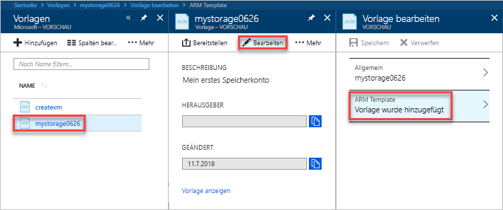

# <a name="quickstart-create-and-deploy-azure-resource-manager-templates-by-using-the-azure-portal"></a>Schnellstart: Erstellen und Bereitstellen von Azure Resource Manager-Vorlagen über das Azure-Portal

Hier erfahren Sie, wie Sie Ihre erste Azure Resource Manager-Vorlage erstellen, indem Sie eine entsprechende Vorlage über das Azure-Portal erstellen, und wie Sie sie über das Portal bearbeiten und bereitstellen.

Resource Manager-Vorlagen sind JSON-Dateien, mit denen die Ressourcen definiert werden, die Sie für Ihre Lösung bereitstellen müssen. Eine Vorlage muss nicht immer von Grund auf neu erstellt werden. In diesem Tutorial erfahren Sie, wie Sie eine Vorlage über das Azure-Portal generieren. Diese Vorlage können Sie anschließend anpassen und bereitstellen.

In diesem Tutorial wird ein Azure Storage-Konto erstellt. Der gleiche Prozess kann aber auch zur Erstellung anderer Azure-Ressourcen verwendet werden.

Wenn Sie kein Azure-Abonnement besitzen, können Sie ein [kostenloses Konto](https://azure.microsoft.com/free/) erstellen, bevor Sie beginnen.

## <a name="generate-a-template-using-the-portal"></a>Generieren einer Vorlage über das Portal

In diesem Abschnitt erstellen Sie ein Speicherkonto über das Azure-Portal. Vor dem Bereitstellen des Speicherkontos haben Sie die Möglichkeit, sich die Vorlage anzusehen, die durch das Portal auf der Grundlage Ihrer Konfigurationen generiert wurde. Die Vorlage kann gespeichert und später wiederverwendet werden.

1. Melden Sie sich beim [Azure-Portal](https://portal.azure.com) an.
2. Klicken Sie auf **Ressource erstellen** > **Speicher** > **Speicherkonto – Blob, Datei, Tabelle, Warteschlange**.

    
3. Geben Sie Folgendes ein: Klicken Sie im nächsten Schritt nicht auf **Erstellen**, sondern auf **Automatisierungsoptionen**, damit Sie sich die Vorlage vor der Bereitstellung ansehen können.

    - **Name**: Geben Sie einen eindeutigen Namen für Ihr Speicherkonto ein. Auf dem Screenshot lautet der Name *mystorage0626*.
    - **Ressourcengruppe**: Erstellen Sie eine neue Azure-Ressourcengruppe mit einem Namen Ihrer Wahl. Auf dem Screenshot lautet der Name der Ressourcengruppe *mystorage0626rg*.

    Für die restlichen Eigenschaften können Sie die Standardwerte verwenden.

    

    > [!NOTE]
    > Bei manchen der exportierten Vorlagen sind vor der Bereitstellung noch einige Änderungen erforderlich.

4. Klicken Sie am unteren Rand des Bildschirms auf **Automatisierungsoptionen**. Die Vorlage wird im Portal auf der Registerkarte **Vorlage** angezeigt:

    

    Im Hauptbereich wird die Vorlage angezeigt. Dabei handelt es sich um eine JSON-Datei mit vier übergeordneten Elementen. Weitere Informationen finden Sie unter [Verstehen der Struktur und Syntax von Azure Resource Manager-Vorlagen](./resource-group-authoring-templates.md).

    Unter dem Element **Parameter** sind fünf Parameter definiert. Klicken Sie zum Anzeigen der Werte, die Sie bei der Bereitstellung angegeben haben, auf die Registerkarte **Parameter**.

    

    Diese Werte haben Sie im vorherigen Abschnitt konfiguriert. Mit der Kombination aus Vorlagen- und Parameterdatei können Sie ein Azure-Speicherkonto erstellen.

5. Über den drei Registerkarten befinden sich drei Menüelemente:

    - **Herunterladen**: Laden Sie die Vorlagedatei und die Parameterdatei auf Ihren lokalen Computer herunter.
    - **Zu Bibliothek hinzufügen**: Fügen Sie die Vorlage der Bibliothek hinzu, um sie später wiederzuverwenden.
    - **Bereitstellen**: Stellen Sie das Azure-Speicherkonto in Azure bereit.

    In diesem Tutorial verwenden Sie die Option **Zu Bibliothek hinzufügen**.

6. Klicken Sie auf **Zu Bibliothek hinzufügen**.
7. Geben Sie unter **Name** einen Namen und unter **Beschreibung** eine Beschreibung ein, und klicken Sie anschließend auf **Speichern**.

> [!NOTE]
> Das Vorlagenbibliothek-Feature befindet sich in der Vorschauphase. Die meisten Benutzer speichern ihre Vorlagen auf dem lokalen Computer oder in einem öffentlichen Speicher (beispielsweise GitHub).  

## <a name="edit-and-deploy-the-template"></a>Bearbeiten und Bereitstellen der Vorlage

In diesem Abschnitt öffnen Sie die gespeicherte Vorlage aus der Vorlagenbibliothek, bearbeiten sie im Portal und stellen die überarbeitete Vorlage bereit. Komplexere Vorlagen sollten ggf. in [Visual Studio Code](./resource-manager-quickstart-create-templates-use-visual-studio-code.md) bearbeitet werden, da dort umfangreichere Bearbeitungsfunktionen zur Verfügung stehen.

Azure erfordert, dass jeder Azure-Dienst einen eindeutigen Namen aufweist. Die Bereitstellung schlägt fehl, wenn Sie einen bereits vorhandenen Speicherkontonamen eingeben. Um dieses Problem zu vermeiden, können Sie durch Aufrufen der Vorlagenfunktion „uniquestring()“ einen eindeutigen Speicherkontonamen generieren.

1. Klicken Sie im linken Menü des Azure-Portals auf **Alle Dienste**, geben Sie **Vorlage** in das Filterfeld ein, und klicken Sie auf **Vorlage (VORSCHAU)**.

    
2. Wählen Sie die Vorlage aus, die Sie im vorherigen Abschnitt gespeichert haben. Auf dem Screenshot lautet der Name *mystorage0626*.
3. Klicken Sie auf **Bearbeiten** und anschließend auf **Die Vorlage wurde hinzugefügt**.

    

4. Fügen Sie ein Element vom Typ **variables** und anschließend eine Variable hinzu, wie im folgenden Screenshot zu sehen:

    ```json
    "variables": {
        "storageAccountName": "[concat(uniquestring(resourceGroup().id), 'standardsa')]"
    },
    ```
    

    Hier werden zwei Funktionen verwendet: *concat()* und *uniqueString()*. Mit „uniqueString()“ können Sie einen eindeutigen Namen für eine Ressource erstellen.

5. Entfernen Sie den im vorherigen Screenshot hervorgehobenen Parameter **name**.
6. Aktualisieren Sie das Element „name“ der Ressource **Microsoft.Storage/storageAccounts**, um anstelle des Parameters die neu definierte Variable zu verwenden:

    ```json
    "name": "[variables('storageAccountName')]",
    ```

    Die endgültige Vorlage sollte wie folgt aussehen:

    ```json
    {
        "$schema": "https://schema.management.azure.com/schemas/2015-01-01/deploymentTemplate.json#",
        "contentVersion": "1.0.0.0",
        "parameters": {
            "location": {
                "type": "string"
            },
            "accountType": {
                "type": "string"
            },
            "kind": {
                "type": "string"
            },
            "httpsTrafficOnlyEnabled": {
                "type": "bool"
            }
        },
        "variables": {
            "storageAccountName": "[concat(uniquestring(resourceGroup().id), 'standardsa')]"
        },
        "resources": [
            {
                "apiVersion": "2018-02-01",
                "name": "[variables('storageAccountName')]",
                "location": "[parameters('location')]",
                "type": "Microsoft.Storage/storageAccounts",
                "sku": {
                    "name": "[parameters('accountType')]"
                },
                "kind": "[parameters('kind')]",
                "properties": {
                    "supportsHttpsTrafficOnly": "[parameters('httpsTrafficOnlyEnabled')]",
                    "encryption": {
                        "services": {
                            "blob": {
                                "enabled": true
                            },
                            "file": {
                                "enabled": true
                            }
                        },
                        "keySource": "Microsoft.Storage"
                    }
                },
                "dependsOn": []
            }
        ]
    }
    ```
7. Klicken Sie auf **OK** und anschließend auf **Speichern**, um die Änderungen zu speichern.
8. Klicken Sie auf **Bereitstellen**.
9. Geben Sie die folgenden Werte ein:

    - **Abonnement**: Wählen Sie Ihr Azure-Abonnement aus.
    - **Ressourcengruppe**: Versehen Sie Ihre Ressourcengruppe mit einem eindeutigen Namen.
    - **Standort**: Wählen Sie einen Standort für die Ressourcengruppe aus.
    - **Standort**: Wählen Sie einen Standort für das Speicherkonto aus.  Sie können den gleichen Standort verwenden wie für die Ressourcengruppe.
    - **Kontotyp**: Geben Sie für diese Schnellstartanleitung **Standard_LRS** ein.
    - **Art**: Geben Sie für diese Schnellstartanleitung **Speicher** ein.
    - **Https Traffic Only Enabled** (Nur HTTPS-Datenverkehr aktiviert):  Wählen Sie für diese Schnellstartanleitung die Option **false** aus.
    - **Ich stimme den oben genannten Geschäftsbedingungen zu**: Aktivieren Sie dieses Kontrollkästchen.

    Hier sehen Sie einen Screenshot einer Beispielbereitstellung:

    

10. Wählen Sie die Option **Kaufen**.
11. Klicken Sie am oberen Bildschirmrand auf das Glockensymbol (Benachrichtigungen), um den Bereitstellungsstatus anzuzeigen.

    

12. Wählen Sie im Benachrichtigungsbereich die Option **Zu Ressourcengruppe wechseln** aus. Ein Bildschirm wird angezeigt, der etwa wie folgt aussieht:

    

    Sie können sehen, dass der Bereitstellungsstatus erfolgreich war und nur ein Speicherkonto in der Ressourcengruppe vorhanden ist. Der Name des Speicherkontos ist eine eindeutige Zeichenfolge, die von der Vorlage generiert wird. Weitere Informationen zur Verwendung von Azure-Speicherkonten finden Sie unter [Schnellstart: Hochladen, Herunterladen und Auflisten von Blobs über das Azure-Portal](../storage/blobs/storage-quickstart-blobs-portal.md).

## <a name="clean-up-resources"></a>Bereinigen von Ressourcen

Wenn Sie die Azure-Ressourcen nicht mehr benötigen, löschen Sie die Ressourcengruppe, um die bereitgestellten Ressourcen zu bereinigen.

1. Klicken Sie im linken Menü des Azure-Portals auf **Ressourcengruppe**.
2. Geben Sie den Namen der Ressourcengruppe in das Feld **Nach Name filtern** ein.
3. Klicken Sie auf den Namen der Ressourcengruppe.  Das Speicherkonto in der Ressourcengruppe wird angezeigt.
4. Klicken Sie im oberen Menü auf **Ressourcengruppe löschen**.

## <a name="next-steps"></a>Nächste Schritte

In diesem Tutorial haben Sie gelernt, wie Sie über das Azure-Portal eine Vorlage generieren und anschließend bereitstellen. In dieser Schnellstartanleitung wurde eine einfache Vorlage mit einer einzelnen Azure-Ressource verwendet. Bei komplexeren Vorlagen empfiehlt es sich, die Vorlage unter Verwendung von Visual Studio Code oder Visual Studio zu entwickeln.

> [!div class="nextstepaction"]
> [Schnellstart: Erstellen von Azure Resource Manager-Vorlagen mit Visual Studio Code](./resource-manager-quickstart-create-templates-use-visual-studio-code.md)
