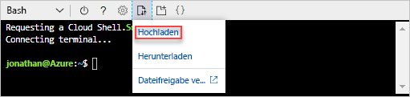
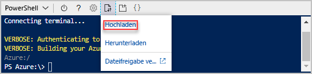

# <a name="quickstart-create-azure-resource-manager-templates-by-using-visual-studio-code"></a>Schnellstart: Erstellen von Azure Resource Manager-Vorlagen mit Visual Studio Code

Hier erfahren Sie, wie Sie Visual Studio Code und die Erweiterung „Azure Resource Manager-Tools“ verwenden, um Azure Resource Manager-Vorlagen zu erstellen und zu bearbeiten. Sie können Resource Manager-Vorlagen in Visual Studio Code auch ohne die Erweiterung erstellen, aber die Erweiterung verfügt über Optionen für die automatische Vervollständigung, die Ihnen die Entwicklung von Vorlagen vereinfachen. Weitere Informationen zu den Konzepten der Bereitstellung und Verwaltung Ihrer Azure-Lösungen finden Sie unter [Übersicht über Azure Resource Manager](resource-group-overview.md).

Wenn Sie kein Azure-Abonnement besitzen, können Sie ein [kostenloses Konto](https://azure.microsoft.com/free/) erstellen, bevor Sie beginnen.

[!INCLUDE [updated-for-az](../../includes/updated-for-az.md)]

## <a name="prerequisites"></a>Voraussetzungen

Damit Sie die Anweisungen in diesem Artikel ausführen können, benötigen Sie Folgendes:

- [Visual Studio Code](https://code.visualstudio.com/).
- Die Erweiterung „Azure Resource Manager-Tools“. Zum Installieren gehen Sie wie folgt vor:

    1. Öffnen Sie Visual Studio Code.
    2. Drücken Sie **STRG+UMSCHALT+X**, um den Bereich "Erweiterungen" zu öffnen.
    3. Suchen Sie nach **Azure Resource Manager-Tools**, und wählen Sie die Option **Installieren** aus.
    4. Wählen Sie die Option **Erneut laden**, um die Installation der Erweiterung abzuschließen.

## <a name="open-a-quickstart-template"></a>Öffnen einer Schnellstartvorlage

Anstatt eine Vorlage von Grund auf neu zu erstellen, können Sie auch eine Vorlage aus [Azure-Schnellstartvorlagen](https://azure.microsoft.com/resources/templates/) öffnen. „Azure-Schnellstartvorlagen“ ist ein Repository für Resource Manager-Vorlagen.

Die in dieser Schnellstartanleitung verwendete Vorlage heißt [Standardspeicherkonto erstellen](https://azure.microsoft.com/resources/templates/101-storage-account-create/). Die Vorlage definiert eine Azure Storage-Kontoressource.

1. Wählen Sie in Visual Studio Code **Datei**>**Datei öffnen** aus.
2. Fügen Sie in **Dateiname** die folgende URL ein:

    ```url
    https://raw.githubusercontent.com/Azure/azure-quickstart-templates/master/101-storage-account-create/azuredeploy.json
    ```
3. Wählen Sie **Öffnen** aus, um die Datei zu öffnen.
4. Wählen Sie **Datei**>**Speichern unter** aus, um die Datei als **azuredeploy.json** auf dem lokalen Computer zu speichern.

## <a name="edit-the-template"></a>Bearbeiten der Vorlage

Wenn Sie sich mit der Bearbeitung einer Vorlage über Visual Studio Code vertraut machen möchten, fügen Sie dem Bereich `outputs` ein weiteres Element hinzu, um den Speicher-URI anzuzeigen.

1. Fügen Sie der exportierten Vorlage eine weitere Ausgabe hinzu:

    ```json
    "storageUri": {
      "type": "string",
      "value": "[reference(variables('storageAccountName')).primaryEndpoints.blob]"
    }
    ```

    Wenn Sie fertig sind, sieht der Ausgabeabschnitt folgendermaßen aus:

    ```json
    "outputs": {
      "storageAccountName": {
        "type": "string",
        "value": "[variables('storageAccountName')]"
      },
      "storageUri": {
        "type": "string",
        "value": "[reference(variables('storageAccountName')).primaryEndpoints.blob]"
      }
    }
    ```

    Wenn Sie den Code in Visual Studio Code kopiert und eingefügt haben, versuchen Sie, das Element **value** erneut einzugeben, um die IntelliSense-Funktion der Erweiterung „Resource Manager-Tools“ zu testen.

    

2. Wählen Sie **Datei**>**Speichern** aus, um die Datei zu speichern.

## <a name="deploy-the-template"></a>Bereitstellen der Vorlage

Es gibt viele Methoden zum Bereitstellen von Vorlagen.  In dieser Schnellstartanleitung wird Azure Cloud Shell verwendet. Cloud Shell ist eine Webanwendung, die nicht konfiguriert werden muss. Cloud Shell unterstützt die Azure-Befehlszeilenschnittstelle (CLI) und Azure PowerShell.

1. Melden Sie sich bei [Azure Cloud Shell](https://shell.azure.com) an.

    
2. Wählen Sie Ihre bevorzugte Umgebung aus, indem Sie in der Ecke oben links **PowerShell** oder **Bash** wählen. Zur Verwendung der CLI müssen Sie eine Bash-Sitzung öffnen. Zur Ausführung von Azure PowerShell müssen Sie eine PowerShell-Sitzung öffnen. Wählen Sie den nach unten gerichteten Pfeil, um zwischen Bash und PowerShell zu wechseln. Betrachten Sie hierzu den vorherigen Screenshot. Bei einem Wechsel ist ein Neustart der Shell erforderlich.
3. Wählen Sie **Dateien hochladen/herunterladen** und dann **Hochladen** aus.

    # <a name="clitabcli"></a>[BEFEHLSZEILENSCHNITTSTELLE (CLI)](#tab/CLI)

    
   
    # <a name="powershelltabpowershell"></a>[PowerShell](#tab/PowerShell)
    
    
    
    ---

    Wählen Sie die Datei aus, die Sie im vorherigen Abschnitt gespeichert haben. Der Standardname lautet **azuredeploy.json**. Auf die Vorlagendatei muss über die Shell zugegriffen werden können.

    Sie können optional den Befehl **ls** und den Befehl **cat** verwenden, um zu überprüfen, ob die Datei hochgeladen wurde. 

    # <a name="clitabcli"></a>[BEFEHLSZEILENSCHNITTSTELLE (CLI)](#tab/CLI)

    
   
    # <a name="powershelltabpowershell"></a>[PowerShell](#tab/PowerShell)
    
    
    
    ---
4. Führen Sie in Cloud Shell die folgenden Befehle aus. Klicken Sie auf die Registerkarte, um den PowerShell-Code oder den CLI-Code anzuzeigen.

    # <a name="clitabcli"></a>[BEFEHLSZEILENSCHNITTSTELLE (CLI)](#tab/CLI)
    ```azurecli
    echo "Enter the Resource Group name:" &&
    read resourceGroupName &&
    echo "Enter the name for this deployment:" &&
    read deploymentName &&
    echo "Enter the location (i.e. centralus):" &&
    read location &&
    az group create --name $resourceGroupName --location $location &&
    az group deployment create --name $deploymentName --resource-group $resourceGroupName --template-file "azuredeploy.json"
    ```
   
    # <a name="powershelltabpowershell"></a>[PowerShell](#tab/PowerShell)
    
    ```azurepowershell
    $resourceGroupName = Read-Host -Prompt "Enter the Resource Group name"
    $deploymentName = Read-Host -Prompt "Enter the name for this deployment"
    $location = Read-Host -Prompt "Enter the location (i.e. centralus)"
    
    New-AzResourceGroup -Name $resourceGroupName -Location $location
    New-AzResourceGroupDeployment -Name $deploymentName -ResourceGroupName $resourceGroupName -TemplateFile "azuredeploy.json"
    ```
    
    ---

    Aktualisieren Sie den Namen der Vorlagendatei, wenn Sie die Datei nicht unter dem Namen **azuredeploy.json** gespeichert haben.

    Der folgende Screenshot zeigt eine Beispielbereitstellung:

    # <a name="clitabcli"></a>[BEFEHLSZEILENSCHNITTSTELLE (CLI)](#tab/CLI)

    
   
    # <a name="powershelltabpowershell"></a>[PowerShell](#tab/PowerShell)
    
    
    
    ---

    Der Speicherkontoname und die Speicher-URL im Ausgabeabschnitt sind auf dem Screenshot hervorgehoben. Den Speicherkontonamen benötigen Sie im nächsten Schritt.

5. Führen Sie den folgenden CLI- oder PowerShell-Befehl zum Auflisten des neu erstellen Speicherkontos aus:

    # <a name="clitabcli"></a>[BEFEHLSZEILENSCHNITTSTELLE (CLI)](#tab/CLI)
    ```azurecli
    echo "Enter the Resource Group name:" &&
    read resourceGroupName &&
    echo "Enter the Storage Account name:" &&
    read storageAccountName &&
    az storage account show --resource-group $resourceGroupName --name $storageAccountName
    ```
   
    # <a name="powershelltabpowershell"></a>[PowerShell](#tab/PowerShell)
    
    ```azurepowershell
    $resourceGroupName = Read-Host -Prompt "Enter the Resource Group name"
    $storageAccountName = Read-Host -Prompt "Enter the Storage Account name"
    Get-AzStorageAccount -ResourceGroupName $resourceGroupName -Name $storageAccountName
    ```
    
    ---

Weitere Informationen zur Verwendung von Azure-Speicherkonten finden Sie unter [Schnellstart: Hochladen, Herunterladen und Auflisten von Blobs über das Azure-Portal](../storage/blobs/storage-quickstart-blobs-portal.md).

## <a name="clean-up-resources"></a>Bereinigen von Ressourcen

Wenn Sie die Azure-Ressourcen nicht mehr benötigen, löschen Sie die Ressourcengruppe, um die bereitgestellten Ressourcen zu bereinigen.

1. Wählen Sie im Azure-Portal im linken Menü die Option **Ressourcengruppe** aus.
2. Geben Sie den Namen der Ressourcengruppe in das Feld **Nach Name filtern** ein.
3. Wählen Sie den Namen der Ressourcengruppe aus.  Es werden insgesamt sechs Ressourcen in der Ressourcengruppe angezeigt.
4. Wählen Sie **Ressourcengruppe löschen** aus dem Menü ganz oben aus.

## <a name="next-steps"></a>Nächste Schritte

In diesem Schnellstart geht es in erster Linie um die Bearbeitung einer vorhandenen Azure-Schnellstartvorlage mithilfe von Visual Studio Code. Darüber hinaus haben Sie gelernt, wie Sie die Vorlage über Azure Cloud Shell mithilfe der CLI oder PowerShell bereitstellen. Die Azure-Schnellstartvorlagen decken unter Umständen nicht alle Ihre Anforderungen ab. Im nächsten Tutorial wird gezeigt, wie Sie die Informationen in der Vorlagenreferenz suchen, um ein verschlüsseltes Azure Storage-Konto erstellen zu können.

> [!div class="nextstepaction"]
> [Tutorial: Erstellen einer Azure Resource Manager-Vorlage für die Bereitstellung eines verschlüsselten Speicherkontos](./resource-manager-tutorial-create-encrypted-storage-accounts.md)
