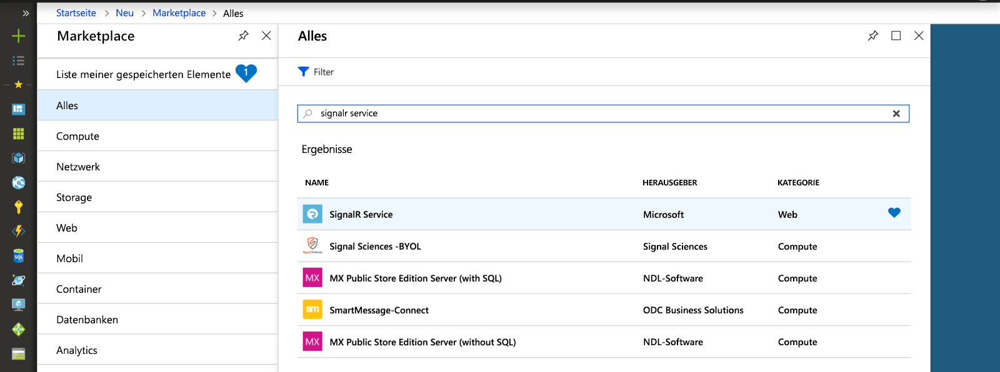
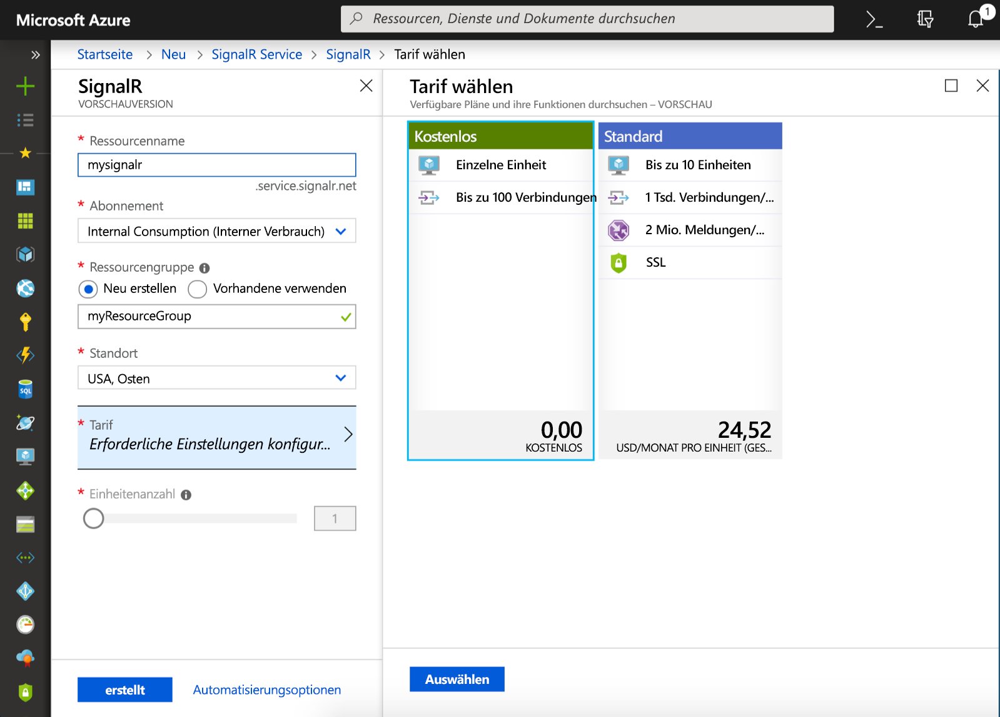

## Erstellen einer Instanz des Azure SignalR-Diensts

Ihre Anwendung stellt eine Verbindung mit einer Instanz des SignalR-Diensts in Azure her.

1. Klicken Sie in der linken oberen Ecke des Azure-Portals auf die Schaltfläche „Neu“. Geben Sie im Bildschirm „Neu“ die Angabe *SignalR-Dienst* in das Suchfeld ein, und drücken Sie die EINGABETASTE.

    

1. Wählen Sie **SignalR-Dienst** aus den Suchergebnissen aus, und wählen Sie dann **Erstellen** aus.

1. Geben Sie folgende Einstellungen ein.

    | Einstellung      | Empfohlener Wert  | BESCHREIBUNG                                        |
    | ------------ |  ------- | -------------------------------------------------- |
    | **Ressourcenname** | Global eindeutiger Name | Der Name, der die neue Instanz des SignalR -Diensts identifiziert. Gültige Zeichen sind `a-z`, `0-9` und `-`.  | 
    | **Abonnement** | Ihr Abonnement | Das Abonnement, unter dem diese neue Instanz des SignalR-Diensts erstellt wird. | 
    | **[Ressourcengruppe](../../azure-resource-manager/resource-group-overview.md)** |  myResourceGroup | Der Name für die neue Ressourcengruppe, in der Ihre Instanz des SignalR-Diensts erstellt werden soll. | 
    | **Location** | USA (Westen) | Wählen Sie eine [Region](https://azure.microsoft.com/regions/) in Ihrer Nähe aus. |
    | **Preisstufe** | Kostenlos | Testen Sie den Azure SignalR-Dienst kostenlos. |
    | **Einheitenanzahl** |  Nicht zutreffend | Die Einheitenanzahl gibt an, wie viele Verbindungen Ihre Instanz des SignalR-Diensts akzeptieren kann. Dies kann nur im Tarif „Standard“ konfiguriert werden. |

    

1. Wählen Sie **Erstellen** aus, um mit der Bereitstellung der Instanz des SignalR-Diensts zu beginnen.

1. Nachdem die Instanz bereitgestellt wurde, öffnen Sie sie im Portal, und navigieren Sie zur Seite „Einstellungen“. Ändern Sie die Einstellung des Dienstmodus nur dann in *Serverlos*, wenn Sie Azure SignalR Service über eine Azure Functions-Bindung oder REST-API verwenden. Behalten Sie andernfalls die Einstellung *Klassisch* oder *Standard* bei.