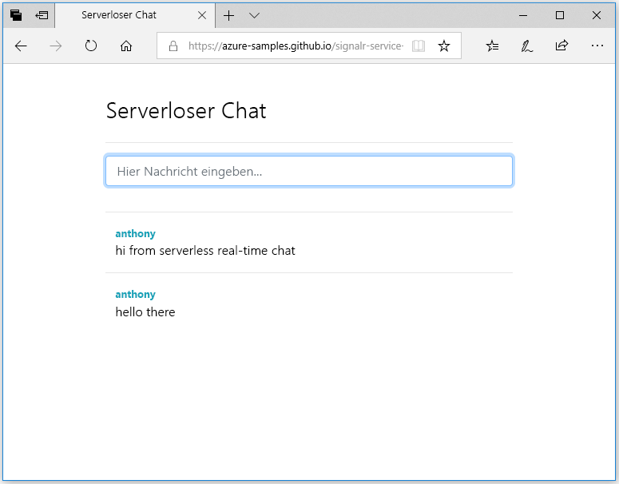

## Ausführen der Webanwendung

1. Es ist eine Single-Page-Beispielwebanwendung verfügbar, die in GitHub gehostet wird. Öffnen Sie Ihren Browser mit [https://azure-samples.github.io/signalr-service-quickstart-serverless-chat/demo/chat-v2/](https://azure-samples.github.io/signalr-service-quickstart-serverless-chat/demo/chat-v2/).

    > [!NOTE]
    > Die HTML-Quelldatei befindet sich unter [/docs/demo/chat-v2/index.html](https://github.com/Azure-Samples/signalr-service-quickstart-serverless-chat/blob/master/docs/demo/chat-v2/index.html).

1. Wenn Sie zur Eingabe der Basis-URL für die Funktions-App aufgefordert werden, geben Sie `http://localhost:7071` ein.

1. Geben Sie einen Benutzernamen ein, wenn Sie dazu aufgefordert werden.

1. Die Webanwendung ruft die Funktion *GetSignalRInfo* in der Funktions-App auf, um die Verbindungsinformationen zum Herstellen einer Verbindung mit dem Azure SignalR-Dienst abzurufen. Nachdem die Verbindung hergestellt wurde, wird das Eingabefeld für Chatnachrichten angezeigt.

1. Geben Sie eine Nachricht ein, und drücken Sie die EINGABETASTE. Die Anwendung sendet die Nachricht an die *SendMessage*-Funktion in der Azure Functions-App, die dann die SignalR-Ausgabebindung verwendet, um die Nachricht an alle verbundenen Clients zu senden. Wenn alles ordnungsgemäß funktioniert, sollte die Nachricht in der Anwendung angezeigt werden.

    

1. Öffnen Sie eine andere Instanz der Webanwendung in einem anderen Browserfenster. Sie können erkennen, dass alle gesendeten Nachrichten in allen Instanzen der Anwendung angezeigt werden.

> [!IMPORTANT]
> Da die HTML-Seite über HTTPS bereitgestellt wird, aber die lokale Azure Functions-Runtime standardmäßig HTTP verwendet, könnte Ihr Browser (z.B. Firefox) eine „Mixed-Content“-Richtlinie erzwingen, die die Anforderungen von der Webseite an Ihre Funktionen blockiert. Um dieses Problem zu lösen, verwenden Sie einen Browser, der diese Einschränkung nicht aufweist, oder starten Sie einen lokalen HTTP-Server wie etwa [http-server](https://www.npmjs.com/package/http-server) im */docs/demo/chat-v2*-Verzeichnis. Stellen Sie sicher, dass der Ursprung der `CORS`-Einstellung in *local.settings.json* hinzugefügt wird.