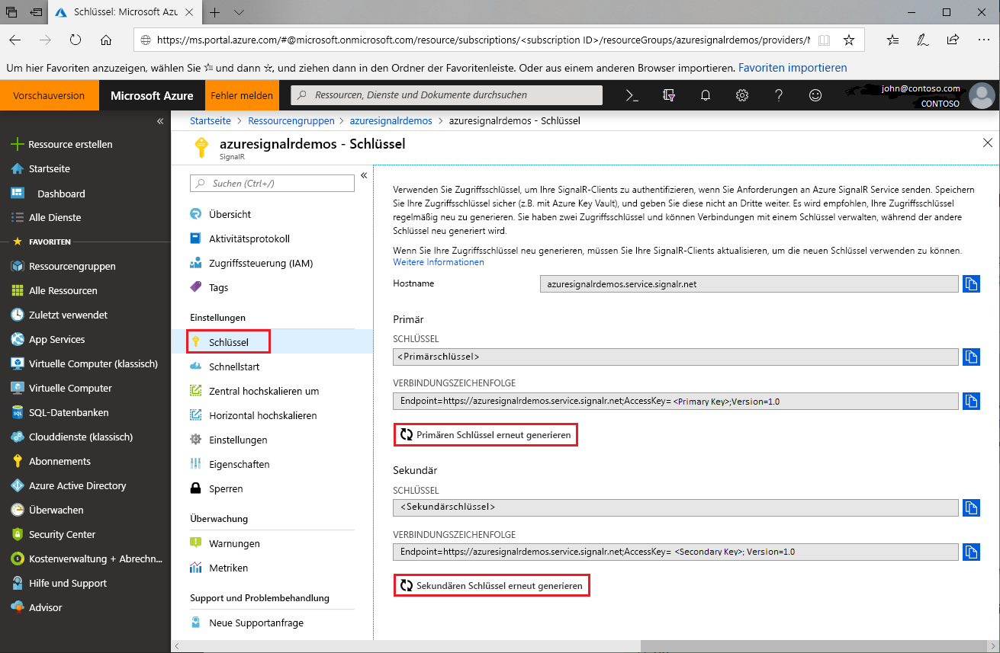

# Zugriffsschlüsselrotation für Azure SignalR Service

Jede Azure SignalR Service-Instanz verfügt über ein Zugriffsschlüsselpaar: einen Primär- und einen Sekundärschlüssel. Sie werden verwendet, um SignalR-Clients zu authentifizieren, wenn Anforderungen an den Dienst gesendet werden. Die Schlüssel werden der Endpunkt-URL der Instanz zugeordnet. Bewahren Sie Ihre Schlüssel sicher auf, und rotieren Sie sie regelmäßig. Es werden zwei Zugriffsschlüssel bereitgestellt, damit die Verbindungen mit einem Schlüssel aufrechterhalten können, während Sie den anderen erneut generieren.

## Warum müssen Zugriffsschlüssel rotiert werden?

Aus Sicherheits- und Konformitätsgründen wird Entwicklern empfohlen, die Zugriffsschlüssel routinemäßig zu rotieren.

## Wie werden Zugriffsschlüssel erneut generiert?

1. Wechseln Sie zum [Azure-Portal](https://portal.azure.com/), und melden Sie sich mit Ihren Anmeldeinformationen an.

1. Suchen Sie nach dem Abschnitt **Schlüssel** der Azure SignalR Service-Instanz, für die Sie die Schlüssel erneut generieren möchten.

1. Klicken Sie im Navigationsmenü auf **Schlüssel**.

1. Klicken Sie auf **Primären Schlüssel erneut generieren** bzw. **Sekundären Schlüssel erneut generieren**.

Ein neuer Schlüssel und die entsprechende Verbindungszeichenfolge werden erstellt und angezeigt.

 

Sie können Schlüssel auch erneut generieren, indem Sie die [Azure CLI](/cli/azure/ext/signalr/signalr/key?view=azure-cli-latest#ext-signalr-az-signalr-key-renew) verwenden.

## Aktualisieren von Konfigurationen mit neuen Verbindungszeichenfolgen

1. Kopieren Sie die neu generierte Verbindungszeichenfolge.

1. Aktualisieren Sie alle Konfigurationen, damit die neue Verbindungszeichenfolge verwendet wird.

1. Starten Sie die Anwendung neu, falls dies erforderlich ist.

## Erzwungene erneute Generierung des Zugriffsschlüssels

In bestimmten Situationen kann es vorkommen, dass von Azure SignalR Service eine obligatorische erneute Generierung des Zugriffsschlüssels erzwungen wird. Der Dienst benachrichtigt Kunden per E-Mail und Nachricht im Portal. Wenn Sie diese Benachrichtigungen erhalten oder für den Dienst ein Fehler aufgrund des Zugriffsschlüssels auftritt, sollten Sie die Schlüssel rotieren, indem Sie sich an diesen Leitfaden halten.

## Nächste Schritte

Als bewährte Methode empfehlen wir Ihnen, die Zugriffsschlüssel regelmäßig zu rotieren.

In diesem Leitfaden wurde beschrieben, wie Sie Zugriffsschlüssel erneut generieren. Fahren Sie mit den nächsten Tutorials zur Authentifizierung mit OAuth oder Azure Functions fort.

> [!div class="nextstepaction"]
> [Integrieren in ASP.NET Core-Identität](./signalr-authenticate-oauth.md)

> [!div class="nextstepaction"]
> [Erstellen einer serverlosen Echtzeit-App mit Authentifizierung](./signalr-authenticate-azure-functions.md)