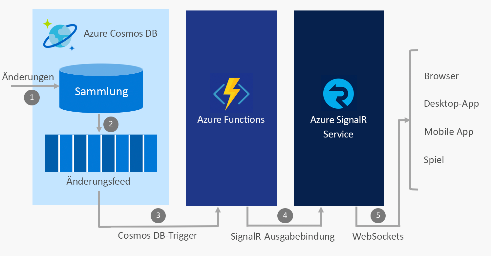

# Erstellen von Echtzeit-Apps mit Azure Functions und Azure SignalR

Da es sich beim Azure SignalR-Dienst und bei Azure Functions um vollständig verwaltete, hochskalierbare Dienste handelt, die es Ihnen ermöglichen, sich auf die Erstellung von Anwendungen zu konzentrieren, anstatt die Infrastruktur zu verwalten, ist es üblich, die beiden Dienste gemeinsam zu nutzen, um Echtzeitkommunikation in einer serverlosen Umgebung bereitzustellen.

## Integrieren von Echtzeitkommunikation in Azure-Dienste

Azure Functions ermöglichen es Ihnen, Code in [mehreren Sprachen](../azure-functions/supported-languages.md) zu schreiben (einschließlich JavaScript, C# und Java), der bei jedem Ereignis in der Cloud ausgelöst wird. Beispiele für diese Ereignisse sind:

* HTTP- und Webhookanforderungen
* Periodische Timer
* Ereignisse aus Azure-Diensten, beispielsweise aus:
    - Event Grid
    - Event Hubs
    - Service Bus
    - Cosmos DB-Änderungsfeed
    - Speicherblobs und Warteschlangen
    - Logic Apps-Connector wie Salesforce und SQL Server

Indem Sie Azure Functions verwenden, um diese Ereignisse in den Azure SignalR-Dienst zu integrieren, haben Sie die Möglichkeit, Tausende von Clients zu benachrichtigen, wenn Ereignisse auftreten.

Einige gängige Szenarien für serverloses Messaging in Echtzeit, die Sie mit Azure Functions und dem SignalR-Dienst implementieren können, sind unter anderem:

* Visualisieren von IoT-Gerätetelemetrie auf einem Dashboard oder einer Karte in Echtzeit
* Aktualisieren von Daten in einer Anwendung, wenn Dokumente in Cosmos DB aktualisiert werden
* Senden von In-App-Benachrichtigungen, wenn neue Bestellungen in Salesforce erstellt werden

## Bindungen des SignalR-Diensts für Azure Functions

Die Bindungen des SignalR-Diensts für Azure Functions ermöglichen es einer Azure Functions-App, Nachrichten für Clients zu veröffentlichen, die mit dem SignalR-Dienst verbunden sind. Clients können eine Verbindung mit dem Dienst über ein SignalR-Client-SDK herstellen, das in .NET, JavaScript und Java verfügbar ist. Weitere Sprachen folgen in Kürze.

### Beispielszenario

Ein Beispiel für die Verwendung der Bindungen des SignalR-Diensts ist die Verwendung von Azure Functions für die Integration in Azure Cosmos DB und den SignalR-Dienst, um Echtzeitnachrichten zu senden, wenn neue Ereignisse in einem Cosmos DB-Änderungsfeed auftreten.

1. Eine Änderung wird in einer Cosmos DB-Sammlung vorgenommen.
2. Das Änderungsereignis wird an den Cosmos DB-Änderungsfeed weitergegeben.
3. Eine Azure Functions-Reaktion wird durch das Änderungsereignis mit dem Cosmos DB-Trigger ausgelöst.
4. Die Ausgabebindung des SignalR-Diensts veröffentlicht eine Nachricht für den SignalR-Dienst.
5. Der SignalR-Dienst veröffentlicht die Nachricht für alle verbundenen Clients.

### Authentifizierung und Benutzer

Der SignalR-Dienst ermöglicht das Senden von Nachrichten an alle Clients oder nur an eine Teilmenge der Clients, z.B. an die Clients, die zu einem einzelnen Benutzer gehören. Die Bindungen des SignalR-Diensts für Azure Functions können mit App Service-Authentifizierung kombiniert werden, um Benutzer mit Anbietern wie Azure Active Directory, Facebook und Twitter zu authentifizieren. Sie können dann Nachrichten direkt an diese authentifizierten Benutzer senden.

## Nächste Schritte

In diesem Artikel haben Sie einen Überblick darüber erhalten, wie Sie Azure Functions mit dem SignalR-Dienst verwenden können, um eine breite Palette von serverlosen Messagingszenarien in Echtzeit zu ermöglichen. Führen Sie einen dieser Schnellstarts aus, um mehr zu erfahren.

* [Schnellstart: Serverlose Anwendungen mit dem Azure SignalR-Dienst – C#](signalr-quickstart-azure-functions-csharp.md)
* [Schnellstart: Serverlose Anwendungen mit dem Azure SignalR-Dienst – JavaScript](signalr-quickstart-azure-functions-javascript.md)

