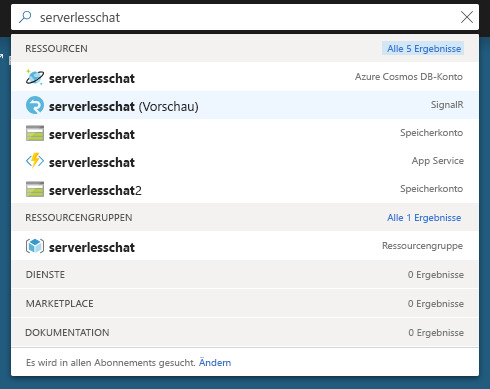
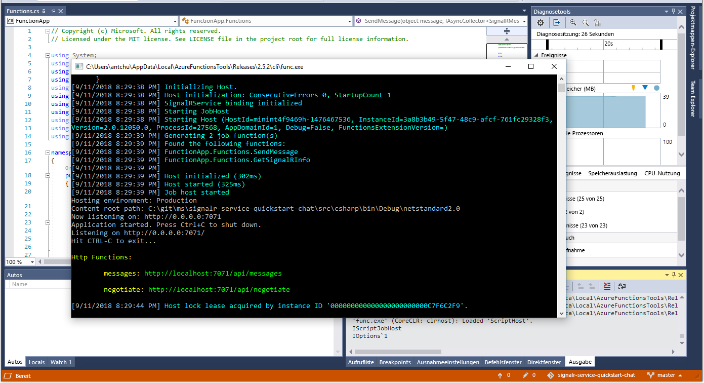

# <a name="quickstart-create-a-chat-room-with-azure-functions-and-signalr-service-using-c"></a>Schnellstart: Erstellen eines Chatraums mit Azure Functions und SignalR Service mithilfe von C\#

Mit dem Azure SignalR-Dienst können Sie Ihrer Anwendung ganz einfach Echtzeitfunktionen hinzufügen. Azure Functions ist eine serverlose Plattform, mit der Sie Ihren Code ohne Verwaltung von Infrastruktur ausführen können. Erfahren Sie in diesem Schnellstart, wie Sie den SignalR-Dienst und Azure Functions verwenden, um eine serverlose Chatanwendung in Echtzeit zu erstellen.

## <a name="prerequisites"></a>Voraussetzungen

Falls Sie Visual Studio 2019 noch nicht installiert haben, können Sie die **kostenlose** [Visual Studio 2019 Community-Edition](https://www.visualstudio.com/downloads/) herunterladen und verwenden. Aktivieren Sie beim Setup von Visual Studio die Option **Azure-Entwicklung**.

Sie können dieses Tutorial auch über die Befehlszeile (macOS, Windows oder Linux) ausführen und dabei [Azure Functions Core Tools (v2)](https://github.com/Azure/azure-functions-core-tools#installing) das [.NET Core SDK](https://dotnet.microsoft.com/download) und Ihren bevorzugten Code-Editor verwenden.

[!INCLUDE [quickstarts-free-trial-note](../../includes/quickstarts-free-trial-note.md)]

## <a name="log-in-to-azure"></a>Anmelden an Azure

Melden Sie sich unter <https://portal.azure.com/> mit Ihrem Azure-Konto beim Azure-Portal an.

[!INCLUDE [Create instance](includes/signalr-quickstart-create-instance.md)]

[!INCLUDE [Clone application](includes/signalr-quickstart-clone-application.md)]

## <a name="configure-and-run-the-azure-function-app"></a>Konfigurieren und Ausführen der Azure Functions-App

1. Starten Sie Visual Studio (oder einen anderen Code-Editor), und öffnen Sie die Projektmappe im Ordner *src/chat/csharp* des geklonten Repositorys.

1. Bestätigen Sie im Browser, in dem das Azure-Portal geöffnet ist, dass die von Ihnen zuvor bereitgestellte SignalR-Dienstinstanz erfolgreich erstellt wurde, indem Sie nach ihrem Namen im Suchfeld oben im Portal suchen. Wählen Sie die Instanz aus, um sie zu öffnen.

    

1. Wählen Sie **Schlüssel** aus, um die Verbindungszeichenfolgen für die SignalR-Dienstinstanz anzuzeigen.

1. Wählen Sie die primäre Verbindungszeichenfolge aus, und kopieren Sie diese.

1. Kehren Sie zu Visual Studio zurück, und benennen Sie im Projektmappen-Explorer *local.settings.sample.json* in *local.settings.json* um.

1. Fügen Sie in **local.settings.json** die Verbindungszeichenfolge in den Wert der **AzureSignalRConnectionString**-Einstellung ein. Speichern Sie die Datei .

1. Öffnen Sie **Functions.cs**. Es gibt zwei durch HTTP ausgelöste Funktionen in dieser Funktions-App:

    - **GetSignalRInfo**: Verwendet die *SignalRConnectionInfo*-Eingabebindung, um gültige Verbindungsinformationen zu generieren und zurückzugeben.
    - **SendMessages**: Empfängt eine Chatnachricht im Anforderungstext und verwendet die *SignalR*-Ausgabebindung, um die Nachricht an alle verbundenen Clientanwendungen zu senden.

1. Verwenden Sie eine der folgenden Optionen, um die Azure-Funktions-App lokal zu starten.

    - **Visual Studio:** Wählen Sie im Menü *Debuggen* die Option *Debuggen starten* aus, um die Anwendung auszuführen.

        

    - **Befehlszeile:** Führen Sie den folgenden Befehl aus, um den Funktionshost zu starten.

        ```bash
        func start
        ```

[!INCLUDE [Run web application](includes/signalr-quickstart-run-web-application.md)]

[!INCLUDE [Cleanup](includes/signalr-quickstart-cleanup.md)]

## <a name="next-steps"></a>Nächste Schritte

In dieser Schnellstartanleitung haben Sie eine serverlose Echtzeitanwendung in Visual Studio erstellt und ausgeführt. Erfahren Sie im nächsten Schritt mehr darüber, wie Sie Azure Functions mit Visual Studio entwickeln und bereitstellen können.

> [!div class="nextstepaction"]
> [Entwickeln von Azure Functions mithilfe von Visual Studio](../azure-functions/functions-develop-vs.md)