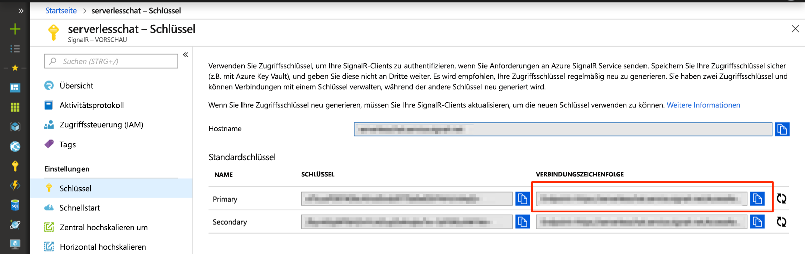

# <a name="quickstart-create-a-chat-room-with-azure-functions-and-signalr-service-using-java"></a>Schnellstart: Erstellen eines Chatraums mit Azure Functions und SignalR Service mithilfe von Java

Mit dem Azure SignalR-Dienst können Sie Ihrer Anwendung ganz einfach Echtzeitfunktionen hinzufügen. Azure Functions ist eine serverlose Plattform, mit der Sie Ihren Code ohne Verwaltung von Infrastruktur ausführen können. Erfahren Sie in diesem Schnellstart, wie Sie den SignalR-Dienst und Azure Functions verwenden, um eine serverlose Chatanwendung in Echtzeit zu erstellen.

## <a name="prerequisites"></a>Voraussetzungen

Dieser Schnellstart kann unter MacOS, Windows oder Linux ausgeführt werden.

Stellen Sie sicher, dass Sie einen Code-Editor wie [Visual Studio Code](https://code.visualstudio.com/) installiert haben.

Installieren Sie die [Azure Functions Core Tools (v2)](https://github.com/Azure/azure-functions-core-tools#installing), um Azure Functions-Apps lokal auszuführen.

> [!NOTE]
> Stellen Sie sicher, dass Sie Version 2.4.419 oder höher von Azure Functions Core Tools (Hostversion 2.0.12332) verwenden, um die SignalR Service-Bindungen in Java nutzen zu können.

Um Erweiterungen zu installieren, erfordern die Azure Functions Core Tools zurzeit die Installation des [.NET Core SDK](https://www.microsoft.com/net/download). Allerdings sind keine Kenntnisse von .NET erforderlich, um JavaScript Azure Functions-Apps zu erstellen.

Um die Funktionen-App mit Java zu entwickeln, muss Folgendes installiert sein:

* [Java Developer Kit](https://www.azul.com/downloads/zulu/), Version 8.
* [Apache Maven](https://maven.apache.org), Version 3.0 oder höher

[!INCLUDE [quickstarts-free-trial-note](../../includes/quickstarts-free-trial-note.md)]

## <a name="log-in-to-azure"></a>Anmelden an Azure

Melden Sie sich unter <https://portal.azure.com/> mit Ihrem Azure-Konto beim Azure-Portal an.

[!INCLUDE [Create instance](includes/signalr-quickstart-create-instance.md)]

[!INCLUDE [Clone application](includes/signalr-quickstart-clone-application.md)]

## <a name="configure-and-run-the-azure-function-app"></a>Konfigurieren und Ausführen der Azure Functions-App

1. Bestätigen Sie im Browser, in dem das Azure-Portal geöffnet ist, dass die von Ihnen zuvor bereitgestellte SignalR-Dienstinstanz erfolgreich erstellt wurde, indem Sie nach ihrem Namen im Suchfeld oben im Portal suchen. Wählen Sie die Instanz aus, um sie zu öffnen.

    

1. Wählen Sie **Schlüssel** aus, um die Verbindungszeichenfolgen für die SignalR-Dienstinstanz anzuzeigen.

1. Wählen Sie die primäre Verbindungszeichenfolge aus, und kopieren Sie diese.

    

1. Öffnen Sie in Ihrem Code-Editor den Ordner *src/chat/java* im geklonten Repository.

1. Benennen Sie *local.settings.sample.json* in *local.settings.json* um.

1. Fügen Sie in **local.settings.json** die Verbindungszeichenfolge in den Wert der **AzureSignalRConnectionString**-Einstellung ein. Speichern Sie die Datei .

1. Die Hauptdatei, die die Funktionen enthält, befindet sich unter *src/chat/java/src/main/java/com/function/Functions.java*:

    - **negotiate**: Verwendet die *SignalRConnectionInfo*-Eingabebindung, um gültige Verbindungsinformationen zu generieren und zurückzugeben.
    - **sendMessages**: Empfängt eine Chatnachricht im Anforderungstext und verwendet die *SignalR*-Ausgabebindung, um die Nachricht an alle verbundenen Clientanwendungen zu senden.

1. Stellen Sie im Terminal sicher, dass Sie sich im Ordner *src/chat/java* befinden. Erstellen Sie die Funktions-App.

    ```bash
    mvn clean package
    ```

1. Führen Sie die Funktions-App lokal aus.

    ```bash
    mvn azure-functions:run
    ```

[!INCLUDE [Run web application](includes/signalr-quickstart-run-web-application.md)]

[!INCLUDE [Cleanup](includes/signalr-quickstart-cleanup.md)]

## <a name="next-steps"></a>Nächste Schritte

In diesem Schnellstart haben Sie eine serverlose Echtzeitanwendung mithilfe von Maven erstellt und ausgeführt. Als Nächstes erfahren Sie, wie Sie Java Azure Functions von Grund auf erstellen.

> [!div class="nextstepaction"]
> [Erstellen Ihrer ersten Funktion mit Java und Maven](../azure-functions/functions-create-first-java-maven.md)