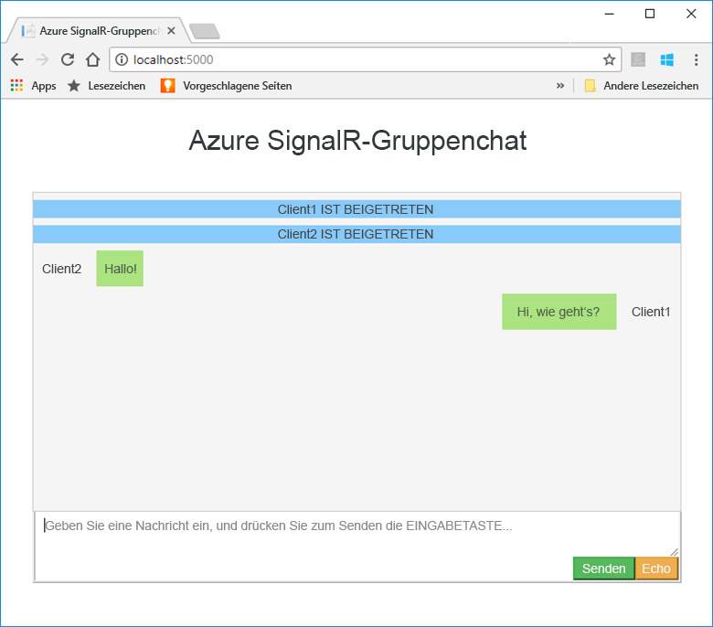
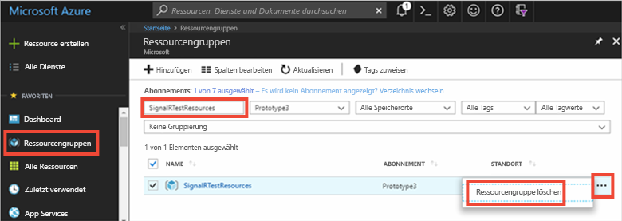

# <a name="quickstart-create-a-chat-room-by-using-signalr-service"></a>Schnellstart: Erstellen eines Chatraums mit SignalR Service


Azure SignalR Service ist ein Azure-Dienst, der Entwicklern die einfache Erstellung von Webanwendungen mit Echtzeitfunktionen ermöglicht. Dieser Dienst basiert auf [SignalR für ASP.NET Core 2.0](https://docs.microsoft.com/aspnet/core/signalr/introduction).

In diesem Artikel wird der Einstieg in den Azure SignalR Service beschrieben. In dieser Schnellstartanleitung erstellen Sie eine Chatanwendung, indem Sie eine Web-App vom Typ „ASP.NET Core MVC“ verwenden. Mit dieser App wird eine Verbindung mit Ihrer Azure SignalR Service-Ressource hergestellt, um Echtzeitupdates des Inhalts zu ermöglichen. Sie hosten die Webanwendung lokal und stellen Verbindungen mit mehreren Browserclients her. Von jedem Client aus können Inhaltsupdates per Pushvorgang an alle anderen Clients gesendet werden. 

Sie können einen beliebigen Code-Editor nutzen, um die Schritte dieser Schnellstartanleitung auszuführen. Eine Option ist [Visual Studio Code](https://code.visualstudio.com/), das auf Windows-, macOS- und Linux-Plattformen verfügbar ist.

Der Code für dieses Tutorial kann aus dem [GitHub-Repository „AzureSignalR-samples“](https://github.com/aspnet/AzureSignalR-samples/tree/master/samples/ChatRoom) heruntergeladen werden. Außerdem können Sie die in dieser Schnellstartanleitung verwendeten Azure-Ressourcen erstellen, indem Sie [Erstellen eines SignalR-Service-Skripts](scripts/signalr-cli-create-service.md) folgen.

[!INCLUDE [quickstarts-free-trial-note](../../includes/quickstarts-free-trial-note.md)]


## <a name="prerequisites"></a>Voraussetzungen

* Installieren Sie das [.NET Core SDK](https://www.microsoft.com/net/download/windows).
* Laden Sie das GitHub-Repository [AzureSignalR-sample](https://github.com/aspnet/AzureSignalR-samples) herunter, oder klonen Sie es. 

## <a name="create-an-azure-signalr-resource"></a>Erstellen einer Azure SignalR-Ressource

[!INCLUDE [azure-signalr-create](../../includes/signalr-create.md)]

## <a name="create-an-aspnet-core-web-app"></a>Erstellen einer ASP.NET Core-Web-App

In diesem Abschnitt verwenden Sie die [.NET Core-Befehlszeilenschnittstelle (CLI)](https://docs.microsoft.com/dotnet/core/tools/), um ein ASP.NET Core MVC-Web-App-Projekt zu erstellen. Der Vorteil bei Verwendung der .NET Core-CLI gegenüber Visual Studio ist, dass sie für alle Windows-, macOS- und Linux-Plattformen verfügbar ist. 

1. Erstellen Sie einen Ordner für Ihr Projekt. In dieser Schnellstartanleitung wird der Ordner *E:\Testing\chattest* verwendet.

2. Führen Sie im neuen Ordner den folgenden Befehl aus, um das Projekt zu erstellen:

        dotnet new mvc


## <a name="add-secret-manager-to-the-project"></a>Hinzufügen des Geheimnis-Managers

In diesem Abschnitt fügen Sie Ihrem Projekt das [Geheimnis-Manager-Tool](https://docs.microsoft.com/aspnet/core/security/app-secrets) hinzu. Im Geheimnis-Manager-Tool werden sensible Daten für die Entwicklungsarbeit außerhalb Ihrer Projektstruktur gespeichert. Mit diesem Ansatz können Sie verhindern, dass App-Geheimnisse versehentlich im Quellcode angegeben werden.

1. Öffnen Sie die Datei mit der Endung *.csproj*. Fügen Sie das `DotNetCliToolReference`-Element hinzu, um *Microsoft.Extensions.SecretManager.Tools* einzubinden. Fügen Sie auch ein `UserSecretsId`-Element hinzu, wie im folgenden Code für *chattest.csproj* gezeigt, und speichern Sie die Datei.

    ```xml
    <Project Sdk="Microsoft.NET.Sdk.Web">
    <PropertyGroup>
        <TargetFramework>netcoreapp2.0</TargetFramework>
        <UserSecretsId>SignalRChatRoomEx</UserSecretsId>
    </PropertyGroup>
    <ItemGroup>
        <PackageReference Include="Microsoft.AspNetCore.All" Version="2.0.0" />
    </ItemGroup>
    <ItemGroup>
        <DotNetCliToolReference Include="Microsoft.VisualStudio.Web.CodeGeneration.Tools" Version="2.0.0" />
        <DotNetCliToolReference Include="Microsoft.Extensions.SecretManager.Tools" Version="2.0.0" />
    </ItemGroup>
    </Project>    
    ```

## <a name="add-azure-signalr-to-the-web-app"></a>Hinzufügen von Azure SignalR zur Web-App

1. Fügen Sie einen Verweis auf das NuGet-Paket `Microsoft.Azure.SignalR` hinzu, indem Sie den folgenden Befehl ausführen:

        dotnet add package Microsoft.Azure.SignalR

2. Führen Sie den folgenden Befehl aus, um Pakete für Ihr Projekt wiederherzustellen:

        dotnet restore

3. Fügen Sie dem Geheimnis-Manager ein Geheimnis mit dem Namen *Azure:SignalR:ConnectionString* hinzu. 

    Dieses Geheimnis enthält die Verbindungszeichenfolge für den Zugriff auf Ihre SignalR Service-Ressource. *Azure:SignalR:ConnectionString* ist der Standardkonfigurationsschlüssel, nach dem SignalR sucht, um eine Verbindung herzustellen. Ersetzen Sie den Wert im folgenden Befehl durch die Verbindungszeichenfolge für Ihre SignalR Service-Ressource.

    Sie müssen diesen Befehl in demselben Verzeichnis wie die *.csproj*-Datei ausführen.

    ```
    dotnet user-secrets set Azure:SignalR:ConnectionString "<Your connection string>"    
    ```

    Der Geheimnis-Manager wird nur verwendet, um die Web-App zu testen, während sie lokal gehostet wird. In einem späteren Tutorial stellen Sie die Chat-Web-App dann in Azure bereit. Nachdem Sie die Web-App in Azure bereitgestellt haben, verwenden Sie eine Anwendungseinstellung, anstatt die Verbindungszeichenfolge im Geheimnis-Manager zu speichern.

    Auf dieses Geheimnis wird mit der Konfigurations-API zugegriffen. Ein Doppelpunkt (:) kann im Konfigurationsnamen mit der Konfigurations-API auf allen unterstützten Plattformen verwendet werden. Siehe [Konfiguration nach Umgebung](https://docs.microsoft.com/aspnet/core/fundamentals/configuration/index?tabs=basicconfiguration&view=aspnetcore-2.0). 


4. Öffnen Sie *Startup.cs*, und aktualisieren Sie die `ConfigureServices`-Methode auf die Nutzung des Azure SignalR Service, indem Sie die `services.AddSignalR().AddAzureSignalR()`-Methode aufrufen:

    ```csharp
    public void ConfigureServices(IServiceCollection services)
    {
        services.AddMvc();
        services.AddSignalR().AddAzureSignalR();
    }
    ```

    Indem kein Parameter an `AddAzureSignalR()` übergeben wird, wird in diesem Code der Standardkonfigurationsschlüssel für die Verbindungszeichenfolge der SignalR Service-Ressource verwendet. Der Standardkonfigurationsschlüssel lautet *Azure:SignalR:ConnectionString*.

5. Aktualisieren Sie ebenfalls in *Startup.cs* die `Configure`-Methode, indem Sie den Aufruf von `app.UseStaticFiles()` durch den folgenden Code ersetzen und die Datei speichern.

    ```csharp
    app.UseFileServer();
    app.UseAzureSignalR(routes =>
    {
        routes.MapHub<Chat>("/chat");
    });
    ```            

### <a name="add-a-hub-class"></a>Hinzufügen einer Hubklasse

In SignalR ist ein Hub eine Kernkomponente, über die eine Reihe von Methoden verfügbar gemacht wird, die vom Client aus aufgerufen werden können. In diesem Abschnitt definieren Sie eine Hubklasse mit zwei Methoden: 

* `Broadcast`: Mit dieser Methode wird eine Nachricht an alle Clients übertragen.
* `Echo`: Mit dieser Methode wird eine Nachricht zurück an den Aufrufer gesendet.

Für beide Methoden wird die Schnittstelle `Clients` genutzt, die über das ASP.NET Core SignalR SDK bereitgestellt wird. Mit dieser Schnittstelle haben Sie Zugriff auf alle verbundenen Clients und können Inhalt per Pushvorgang auf die Clients übertragen.

1. Fügen Sie in Ihrem Projektverzeichnis einen neuen Ordner mit dem Namen *Hub* hinzu. Fügen Sie dem neuen Ordner eine neue Hubcodedatei mit dem Namen *Chat.cs* hinzu.

2. Fügen Sie *Chat.cs* den folgenden Code hinzu, um Ihre Hubklasse zu definieren und die Datei zu speichern. 

    Aktualisieren Sie den Namespace für diese Klasse, falls Sie einen anderen Projektnamen als *chattest* verwendet haben.

    ```csharp
    using Microsoft.AspNetCore.SignalR;

    namespace chattest
    {

        public class Chat : Hub
        {
            public void BroadcastMessage(string name, string message)
            {
                Clients.All.SendAsync("broadcastMessage", name, message);
            }

            public void Echo(string name, string message)
            {
                Clients.Client(Context.ConnectionId).SendAsync("echo", name, message + " (echo from server)");
            }
        }
    }
    ```

### <a name="add-the-client-interface-for-the-web-app"></a>Hinzufügen der Clientschnittstelle für die Web-App

Die Clientbenutzeroberfläche für diese Chatraum-App besteht aus HTML- und JavaScript-Code in einer Datei mit dem Namen *index.html*, die im Verzeichnis *wwwroot* enthalten ist.

Kopieren Sie die Datei *index.html* und die Ordner *css* und *scripts* aus dem Ordner *wwwroot* des [Repositorys mit Beispielen](https://github.com/aspnet/AzureSignalR-samples/tree/master/samples/ChatRoom/wwwroot). Fügen Sie sie in den Ordner *wwwwroot* Ihres Projekts ein.

Hier ist der Hauptcode von *index.html*: 

```javascript
var connection = new signalR.HubConnectionBuilder()
                            .withUrl('/chat')
                            .build();
bindConnectionMessage(connection);
connection.start()
    .then(function () {
        onConnected(connection);
    })
    .catch(function (error) {
        console.error(error.message);
    });
```    

Im Code in *index.html* wird `HubConnectionBuilder.build()` aufgerufen, um eine HTTP-Verbindung mit der Azure SignalR-Ressource herzustellen.

Wenn die Verbindungsherstellung erfolgreich ist, wird diese Verbindung an `bindConnectionMessage` übergeben, wo Ereignishandler für eingehende Pushvorgänge für Inhalte an den Client hinzugefügt werden. 

`HubConnection.start()` startet die Kommunikation mit dem Hub. Dann fügt `onConnected()` die Schaltfläche für Ereignishandler hinzu. Diese Handler nutzen die Verbindung, um für diesen Client das Übertragen von Inhaltsupdates per Pushvorgang an alle verbundenen Clients zu ermöglichen.

## <a name="add-a-development-runtime-profile"></a>Hinzufügen eines Entwicklungslaufzeit-Profils

In diesem Abschnitt fügen Sie eine Entwicklungslaufzeitumgebung für ASP.NET Core hinzu. Weitere Informationen finden Sie unter [Arbeiten mit mehreren Umgebungen in ASP.NET Core](https://docs.microsoft.com/aspnet/core/fundamentals/environments).

1. Erstellen Sie in Ihrem Projekt einen Ordner mit dem Namen *Eigenschaften*.

2. Fügen Sie dem Ordner eine neue Datei namens *launchSettings.json* mit folgendem Inhalt hinzu, und speichern Sie die Datei.

    ```json
    {
        "profiles" : 
        {
            "ChatRoom": 
            {
                "commandName": "Project",
                "launchBrowser": true,
                "environmentVariables": 
                {
                    "ASPNETCORE_ENVIRONMENT": "Development"
                },
                "applicationUrl": "http://localhost:5000/"
            }
        }
    }
    ```


## <a name="build-and-run-the-app-locally"></a>Lokales Erstellen und Ausführen der App

1. Führen Sie den folgenden Befehl in der Befehlsshell aus, um die App mithilfe der .NET Core-CLI zu erstellen:

        dotnet build

2. Führen Sie nach erfolgreicher Erstellung den folgenden Befehl aus, um die Web-App lokal auszuführen:

        dotnet run

    Die App wird lokal über Port 5000 gehostet, wie in Ihrem Entwicklungslaufzeit-Profil konfiguriert:

        E:\Testing\chattest>dotnet run
        Hosting environment: Development
        Content root path: E:\Testing\chattest
        Now listening on: http://localhost:5000
        Application started. Press Ctrl+C to shut down.    

3. Öffnen Sie zwei Browserfenster. Wechseln Sie in jedem Browser zu `http://localhost:5000`. Sie werden aufgefordert, Ihren Namen einzugeben. Geben Sie einen Clientnamen für beide Clients ein, und testen Sie das Übertragen von Nachrichteninhalten zwischen den Clients per Pushvorgang über die Schaltfläche **Send** (Senden).

    


## <a name="clean-up-resources"></a>Bereinigen von Ressourcen

Falls Sie mit dem nächsten Tutorial fortfahren, können Sie die in dieser Schnellstartanleitung erstellten Ressourcen beibehalten und wiederverwenden.

Wenn Sie die Schnellstart-Beispielanwendung nicht mehr benötigen, können Sie die in dieser Schnellstartanleitung erstellten Azure-Ressourcen löschen, um das Anfallen von Kosten zu vermeiden. 

> [!IMPORTANT]
> Das Löschen einer Ressourcengruppe kann nicht rückgängig gemacht werden und umfasst alle Ressourcen dieser Gruppe. Achten Sie daher darauf, dass Sie nicht versehentlich die falsche Ressourcengruppe oder die falschen Ressourcen löschen. Falls Sie die Ressourcen zum Hosten dieses Beispiels in einer vorhandenen Ressourcengruppe erstellt haben, die beizubehaltende Ressourcen enthält, können Sie die Ressourcen einzeln über ihr Blatt löschen, statt die Ressourcengruppe zu löschen.
> 
> 

Melden Sie sich beim [Azure-Portal](https://portal.azure.com) an, und klicken Sie auf **Ressourcengruppen**.

Geben Sie im Textfeld **Nach Name filtern** den Namen Ihrer Ressourcengruppe ein. In dieser Schnellstartanleitung wurde eine Ressourcengruppe mit dem Namen *SignalRTestResources* verwendet. Wählen Sie in Ihrer Ressourcengruppe in der Ergebnisliste die Auslassungspunkte ( **...** ) > **Ressourcengruppe löschen** aus.

   



Sie werden aufgefordert, das Löschen der Ressourcengruppe zu bestätigen. Geben Sie zur Bestätigung den Namen Ihrer Ressourcengruppe ein, und klicken Sie auf **Löschen**.
   
Daraufhin werden die Ressourcengruppe und alle darin enthaltenen Ressourcen gelöscht.


## <a name="next-steps"></a>Nächste Schritte

In diesem Schnellstart haben Sie eine neue Azure SignalR Service-Ressource erstellt. Sie haben sie dann mit einer ASP.NET Core-Web-App verwendet, um Inhaltsaktualisierungen in Echtzeit auf mehrere verbundene Clients per Pushvorgang zu übertragen. Weitere Informationen zur Verwendung des Azure SignalR Service finden Sie im Tutorial, in dem es um die Authentifizierung geht.

> [!div class="nextstepaction"]
> [Azure SignalR Service-Authentifizierung](./signalr-concept-authenticate-oauth.md)


