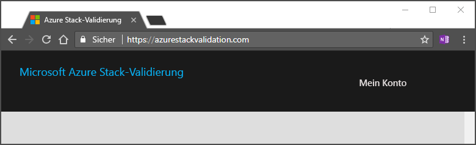
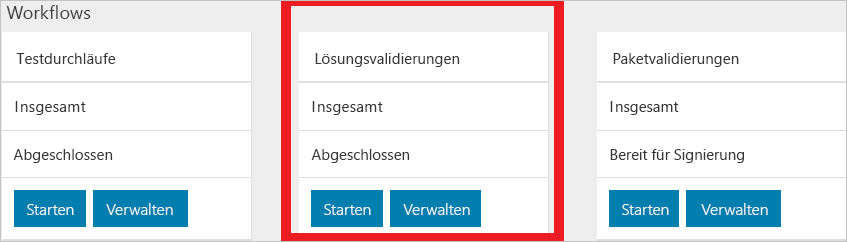

# Schnellstart: Planen des ersten Tests mithilfe des Validation-as-a-Service-Portals

[!INCLUDE [Azure_Stack_Partner](./includes/azure-stack-partner-appliesto.md)]

Hier erfahren Sie, wie Sie mit dem Validation-as-a-Service-Portal (VaaS) Ihren ersten Test planen, um die Hardware zu überprüfen. Der lokale Agent muss vor dem Ausführen von Validierungstests in der zu überprüfenden Azure Stack-Lösung bereitgestellt werden.

In dieser Schnellstartanleitung fügen Sie Ihre Lösung hinzu und führen Tests aus.

## Voraussetzungen

Damit Sie diese Schnellstartanleitung ausführen können, benötigen Sie Folgendes:
 - Ein Validation-as-a-Service-Konto Anweisungen finden Sie unter [Set up your validation as a service account](azure-stack-vaas-set-up-account.md) (Einrichten eines Validation-as-a-Service-Kontos).  
- Der lokale Agent muss auf Ihrem System installiert sein. Anweisungen finden Sie unter [Bereitstellen des lokalen Agents und Testen virtueller Computer](azure-stack-vaas-test-vm.md).

## Hinzufügen einer neuen Lösung

1. Melden Sie sich beim [Validierungsportal](https://azurestackvalidation.com) an.

      

2. Klicken Sie auf **Neue Lösung**.
3. Geben Sie einen Namen für die Lösung ein, und wählen Sie **Speichern**.

## Erstellen eines Lösungsvalidierungsworkflows

1. Wählen Sie den Namen der Lösung aus.
2. Klicken Sie auf der Kachel **Solution Validations** (Lösungsvalidierungen) auf **Verwalten**.

    

## Erstellen eines Lösungsworkflows

1. Klicken Sie auf **New solution validation** (Neue Lösungsvalidierung).
2. Geben Sie den Namen für die Validierung ein.
3. Wählen Sie **Minimum** oder **Maximum** aus.  
    - **Mindestanforderungen**  
    Die Lösung wird mit der unterstützten Mindestanzahl von Knoten konfiguriert.  
    - **Maximum**  
    Die Lösung wird mit der unterstützten maximalen Anzahl von Knoten konfiguriert.
4. Fügen Sie Ihre Umgebungsparameter hinzu. Weitere Informationen finden Sie unter [Hinzufügen von Umgebungsparametern](#add-environmental-parameters).
5. Fügen Sie Ihre allgemeinen Testparameter hinzu. Weitere Informationen finden Sie unter [Hinzufügen allgemeiner Testparameter](#add-common-test-parameters).

    Je nach Testdefinition müssen Sie für den Test unter Umständen unabhängig von den allgemeinen Parametern einen Wert eingeben. Ggf. ist es auch möglich, den Wert des allgemeinen Parameters zu überschreiben.
6. Klicken Sie auf **Übermitteln**, um den Test zu planen.

## Hinzufügen von Umgebungsparametern

Fügen Sie die folgenden Umgebungsparameter hinzu:

| Informationen zum Testdurchlauf | Erforderlich | BESCHREIBUNG |
| --- | --- | --- | --- |
| Azure Stack-Build | Erforderlich | Azure Stack-Buildnummer (z.B. 20170501.1). Der Wert muss eine gültige Azure Stack-Buildnummer oder -Version sein, etwa 1.0.170330.9. |
| Mandanten-ID | Erforderlich | Active Directory-Mandanten-ID. Hier muss eine GUID (z.B. ECA23256-6BA0-4F27-8E4D-AFB02F088363) angegeben werden. |
| Region | Erforderlich | Azure Stack-Bereitstellungsregion |
| Resource Manager-Endpunkt des Mandanten | Erforderlich | Endpunkt für Azure Resource Manager-Vorgänge des Mandanten (z.B. https://management.loc-ext.domain.com) |
| Resource Manager-Endpunkt des Administrators | Nicht erforderlich | Endpunkt für Azure Resource Manager-Vorgänge des Mandanten (z.B. https://management.loc-ext.domain.com) |
| Externer FQDN | Nicht erforderlich | Externer vollqualifizierter Domänenname, der als Suffix für Endpunkte verwendet wird (Beispiel: local.azurestack.external oder redmond.contoso.com) |
| Anzahl von Knoten | Erforderlich | Die Anzahl von Knoten in Ihrer Lösung |

## Hinzufügen allgemeiner Testparameter

Fügen Sie die folgenden allgemeinen Testparameter hinzu:

| Informationen zum Testdurchlauf | Erforderlich | BESCHREIBUNG |
| --- | --- | --- |
| Mandantenbenutzername | Erforderlich | Mandantenbenutzername (z.B. tenant@contoso.onmicrosoft.com) |
| Mandantenkennwort | Erforderlich | Das Kennwort für den Mandanten |
| Benutzername des Dienstadministrators | Nicht erforderlich | Mandantenbenutzername (z.B. tenant@contoso.onmicrosoft.com) |
| Kennwort des Dienstadministrators | Nicht erforderlich | Benutzername des Dienstadministrators (z.B. serviceadmin@contoso.onmicrosoft.com) |
| Benutzername des Cloudadministrators | Nicht erforderlich | Konto des Azure Stack-Domänenadministrators (z.B. „contoso\cloudadmin“) |
| Kennwort des Cloudadministrators | Nicht erforderlich | |
|  Diagnoseverbindungszeichenfolge | Nicht erforderlich | SAS-URI zu einem Azure Storage-Konto, in das während der Testausführung Diagnoseprotokolle kopiert werden. Siehe [Set up your validation as a service account](azure-stack-vaas-set-up-account.md#create-an-azure-storage-blob-to-store-logs) (Einrichten eines Validation-as-a-Service-Kontos)   Der Wert des allgemeinen Parameters **Diagnoseverbindungszeichenfolge** wird vom Dienst gespeichert und zum geplanten Zeitpunkt für alle Tests im Workflow bereitgestellt, die diesen Parameter nutzen. Wenn die SAS-URL innerhalb der nächsten 30 Tage abläuft, werden Sie auf der Seite für allgemeine Parameter zur Eingabe einer neuen SAS-URL aufgefordert. |
| Tag – Name | Nicht erforderlich |  Zum Bezeichnen des Workflows können beschreibende Tags eingegeben werden. Dies ist der Name des Tags. |
| Tag – Wert | Nicht erforderlich | Zum Bezeichnen des Workflows können beschreibende Tags eingegeben werden. Dies ist der Wert des Tags. |

## Nächste Schritte

- [Überprüfen einer neuen Azure Stack-Lösung](azure-stack-vaas-validate-solution-new.md)  
- Erfahren Sie mehr zu [Validation-as-a-Service in Azure Stack](https://docs.microsoft.com/azure/azure-stack/partner).
