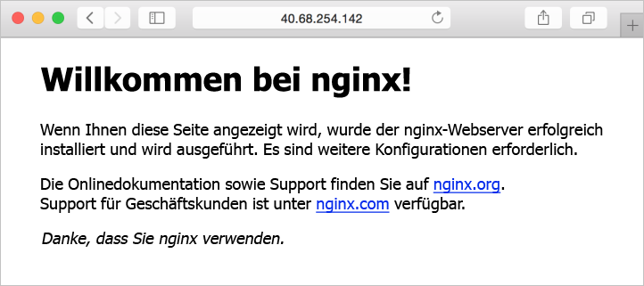

# <a name="create-a-linux-virtual-machine-by-using-azure-cli-in-azure-stack"></a>Erstellen eines virtuellen Linux-Computers mithilfe der Azure CLI in Azure Stack

*Gilt für: Integrierte Azure Stack-Systeme*

Die Azure CLI dient zum Erstellen und Verwalten von Azure Stack-Ressourcen über die Befehlszeile. In diesem Schnellstart wird die Verwendung der Azure CLI zum Erstellen eines virtuellen Linux-Computers in Azure Stack ausführlich erklärt.  Nachdem der virtuelle Computer erstellt wurde, wird ein Webserver installiert und Port 80 geöffnet, um Webdatenverkehr zuzulassen.

## <a name="prerequisites"></a>Voraussetzungen 

* Stellen Sie sicher, dass Ihr Azure Stack-Bediener das Image „Ubuntu Server 16.04 LTS“ dem Azure Stack-Marketplace hinzugefügt hat. 

* Azure Stack erfordert eine spezifische Version der Azure CLI, um die Ressourcen zu erstellen und zu verwalten. Falls die Azure CLI nicht für Azure Stack konfiguriert ist, melden Sie sich beim [Development Kit](azure-stack-connect-azure-stack.md#connect-to-azure-stack-with-remote-desktop) (oder im Falle einer [VPN-Verbindung](azure-stack-connect-azure-stack.md#connect-to-azure-stack-with-vpn) bei einem Windows-basierten externen Client) an, und führen Sie die Schritte zum [Installieren und Konfigurieren der Azure CLI](azure-stack-connect-cli.md) aus.

* Ein öffentlicher SSH-Schlüssel mit dem Namen „id_rsa.pub“ muss im SSH-Verzeichnis Ihres Windows-Benutzerprofils erstellt werden. Ausführliche Informationen zum Erstellen von SSH-Schlüsseln finden Sie unter [Gewusst wie: Verwenden von SSH-Schlüsseln mit Windows in Azure](../../virtual-machines/linux/ssh-from-windows.md). 

## <a name="create-a-resource-group"></a>Erstellen einer Ressourcengruppe

Eine Ressourcengruppe ist ein logischer Container, in dem Azure Stack-Ressourcen bereitgestellt und verwaltet werden. Führen Sie im Development Kit oder im integrierten Azure Stack-System den Befehl [az group create](/cli/azure/group#az_group_create) aus, um eine Ressourcengruppe zu erstellen. Wir haben allen Variablen in diesem Dokument Werte zugewiesen. Sie können entweder diese Werte verwenden oder einen anderen Wert zuweisen. Im folgenden Beispiel wird eine Ressourcengruppe mit dem Namen myResourceGroup im lokalen Speicherort erstellt.

```cli
az group create --name myResourceGroup --location local
```

## <a name="create-a-virtual-machine"></a>Erstellen eines virtuellen Computers

Erstellen Sie mit dem Befehl [az vm create](/cli/azure/vm#az_vm_create) eine VM. Im folgenden Beispiel wird ein virtueller Computer namens „myVM“ erstellt. Dieses Beispiel verwendet „Demouser“ als Administratorbenutzernamen und Demouser@123 als Kennwort. Aktualisieren Sie diese Werte auf andere, für Ihre Umgebung geeignete Werte. Diese Werte werden benötigt, wenn eine Verbindung mit dem virtuellen Computer hergestellt wird.

```cli
az vm create \
  --resource-group "myResourceGroup" \
  --name "myVM" \
  --image "UbuntuLTS" \
  --admin-username "Demouser" \
  --admin-password "Demouser@123" \
  --use-unmanaged-disk \
  --location local
```

Sobald der Vorgang abgeschlossen ist, gibt der Befehl Parameter für den virtuellen Computer aus.  Notieren Sie sich die *PublicIPAddress*, da Sie sie benötigen, um eine Verbindung mit dem virtuellen Computer herzustellen und ihn zu verwalten.

## <a name="open-port-80-for-web-traffic"></a>Öffnen von Port 80 für Webdatenverkehr

Standardmäßig sind für in Azure bereitgestellte virtuelle Linux-Computer nur eingehende SSH-Verbindungen zulässig. Wenn dieser virtuelle Computer als Webserver fungieren soll, muss Port 80 für Datenverkehr aus dem Internet geöffnet werden. Verwenden Sie zum Öffnen des gewünschten Ports den Befehl [az vm open-port](/cli/azure/vm#open-port).

```cli
az vm open-port --port 80 --resource-group myResourceGroup --name myVM
```

## <a name="ssh-into-your-vm"></a>Herstellen einer SSH-Verbindung mit Ihrem virtuellen Computer

Verwenden Sie von einem System aus, auf dem SSH installiert ist, den folgenden Befehl, um die Verbindung mit dem virtuellen Computer herzustellen. Wenn Sie unter Windows arbeiten, können Sie [Putty](http://www.putty.org/) verwenden, um die Verbindung herzustellen. Ersetzen Sie dies durch die korrekte öffentliche IP-Adresse Ihres virtuellen Computers. Im Beispiel oben lautete die IP-Adresse „192.168.102.36“.

```bash
ssh <publicIpAddress>
```

## <a name="install-nginx"></a>Installieren von NGINX

Verwenden Sie das folgende Bash-Skript, um Paketquellen zu aktualisieren und das neueste NGINX-Paket zu installieren. 

```bash 
#!/bin/bash

# update package source
apt-get -y update

# install NGINX
apt-get -y install nginx
```

## <a name="view-the-nginx-welcome-page"></a>Anzeigen der NGINX-Willkommensseite

Nachdem Sie NGINX installiert und Port 80 auf Ihrem virtuellen Computer für den Zugriff über das Internet geöffnet haben, können Sie nun mit einem Webbrowser Ihrer Wahl die NGINX-Standardwillkommensseite anzeigen. Verwenden Sie dabei den weiter oben dokumentierten *publicIpAddress*-Wert, um die Standardseite zu besuchen. 

 

## <a name="clean-up-resources"></a>Bereinigen von Ressourcen

Wenn Ressourcengruppe, virtueller Computer und alle zugehörigen Ressourcen nicht mehr benötigt werden, können Sie sie mit dem Befehl [az group delete](/cli/azure/group#az_group_delete) entfernen.

```cli
az group delete --name myResourceGroup
```

## <a name="next-steps"></a>Nächste Schritte

In dieser Schnellstartanleitung haben Sie einen einfachen virtuellen Linux-Computer bereitgestellt. Um weitere Informationen zu virtuellen Computern unter Azure Stack zu erhalten, fahren Sie mit [Considerations for Virtual Machines in Azure Stack](azure-stack-vm-considerations.md) (Überlegungen zu virtuellen Computern in Azure Stack) fort.

