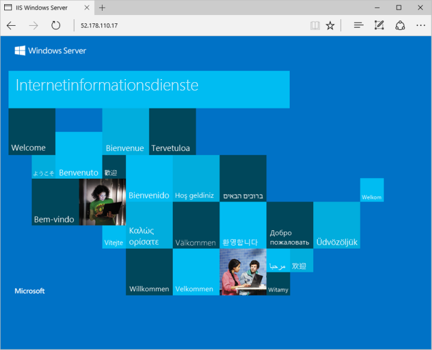

# <a name="create-a-windows-virtual-machine-on-azure-stack-using-azure-cli"></a>Erstellen eines virtuellen Windows-Computers in Azure Stack mithilfe der Azure CLI

Die Azure CLI dient zum Erstellen und Verwalten von Azure Stack-Ressourcen über die Befehlszeile. In dieser Anleitung wird das Erstellen einer Windows Server 2016-VM mithilfe der Azure CLI in Azure Stack beschrieben. Sobald die VM erstellt ist, stellen Sie eine Verbindung mit dem Remotedesktop her, installieren Sie IIS, und zeigen Sie die Standardwebsite an. 

## <a name="prerequisites"></a>Voraussetzungen 

* Stellen Sie sicher, dass Ihr Azure Stack-Bediener das Image „Windows Server 2016“ dem Azure Stack-Marketplace hinzugefügt hat.  

* Azure Stack erfordert eine spezifische Version der Azure CLI, um die Ressourcen zu erstellen und zu verwalten. Wenn Sie die Azure CLI nicht für Azure Stack konfiguriert haben, führen Sie die Schritte zum [Installieren und Konfigurieren der Azure CLI](azure-stack-connect-cli.md) aus.

## <a name="create-a-resource-group"></a>Erstellen einer Ressourcengruppe

Eine Ressourcengruppe ist ein logischer Container, in dem Azure Stack-Ressourcen bereitgestellt und verwaltet werden. Führen Sie im Development Kit oder im integrierten Azure Stack-System den Befehl [az group create](/cli/azure/group#create) aus, um eine Ressourcengruppe zu erstellen. Wir haben allen Variablen in diesem Dokument Werte zugewiesen. Sie können entweder diese Werte verwenden oder einen anderen Wert zuweisen. Im folgenden Beispiel wird eine Ressourcengruppe mit dem Namen myResourceGroup im lokalen Speicherort erstellt.

```cli
az group create --name myResourceGroup --location local
```

## <a name="create-a-virtual-machine"></a>Erstellen eines virtuellen Computers

Erstellen Sie mit dem Befehl [az vm create](/cli/azure/vm#create) eine VM. Im folgenden Beispiel wird ein virtueller Computer namens „myVM“ erstellt. Dieses Beispiel verwendet „Demouser“ als Administratorbenutzernamen und Demouser@123 als Kennwort. Aktualisieren Sie diese Werte auf andere, für Ihre Umgebung geeignete Werte. Diese Werte werden benötigt, wenn eine Verbindung mit dem virtuellen Computer hergestellt wird.

```cli
az vm create \
  --resource-group "myResourceGroup" \
  --name "myVM" \
  --image "Win2016Datacenter" \
  --admin-username "Demouser" \
  --admin-password "Demouser@123" \
  --use-unmanaged-disk \
  --location local
```

Wenn der virtuelle Computer erstellt wird, notieren Sie sich den ausgegebenen *PublicIPAddress*-Parameter, mit dem Sie auf den virtuellen Computer zugreifen.
 
## <a name="open-port-80-for-web-traffic"></a>Öffnen von Port 80 für Webdatenverkehr

Standardmäßig sind für in Azure Stack bereitgestellte virtuelle Windows-Computer nur RDP-Verbindungen zulässig. Wenn dieser virtuelle Computer als Webserver fungieren soll, muss Port 80 für Datenverkehr aus dem Internet geöffnet werden. Verwenden Sie zum Öffnen des gewünschten Ports den Befehl [az vm open-port](/cli/azure/vm#open-port).

```cli
az vm open-port --port 80 --resource-group myResourceGroup --name myVM
```

## <a name="connect-to-the-virtual-machine"></a>Herstellen einer Verbindung mit dem virtuellen Computer

Erstellen Sie mit dem folgenden Befehl eine Remotedesktopsitzung mit dem virtuellen Computer. Ersetzen Sie die IP-Adresse mit der öffentlichen IP-Adresse des virtuellen Computers. Geben Sie nach Aufforderung die beim Erstellen des virtuellen Computers verwendeten Anmeldeinformationen ein.

```
mstsc /v <Public IP Address>
```

## <a name="install-iis-using-powershell"></a>Installieren von IIS mithilfe von PowerShell

Nach der Anmeldung bei dem virtuellen Computer können Sie mit einer einzelnen PowerShell-Codezeile IIS installieren und die lokale Firewallregel aktivieren, um Webdatenverkehr zuzulassen. Öffnen Sie eine PowerShell-Eingabeaufforderung, und führen Sie den folgenden Befehl aus:

```powershell
Install-WindowsFeature -name Web-Server -IncludeManagementTools
```

## <a name="view-the-iis-welcome-page"></a>Anzeigen der IIS-Willkommensseite

Nachdem Sie IIS installiert und Port 80 auf Ihrem virtuellen Computer für den Zugriff über das Internet geöffnet haben, können Sie nun mit einem Webbrowser Ihrer Wahl die IIS-Standardwillkommensseite anzeigen. Verwenden Sie dabei die weiter oben dokumentierte öffentliche IP-Adresse, um die Standardseite zu besuchen. 

 

## <a name="clean-up-resources"></a>Bereinigen von Ressourcen

Wenn Ressourcengruppe, virtueller Computer und alle zugehörigen Ressourcen nicht mehr benötigt werden, können Sie sie mit dem Befehl [az group delete](/cli/azure/group#delete) entfernen.

```cli
az group delete --name myResourceGroup
```

## <a name="next-steps"></a>Nächste Schritte

In diesem Schnellstart haben Sie eine einfache Windows-VM bereitgestellt. Um weitere Informationen zu virtuellen Computern unter Azure Stack zu erhalten, fahren Sie mit [Considerations for Virtual Machines in Azure Stack](azure-stack-vm-considerations.md) (Überlegungen zu virtuellen Computern in Azure Stack) fort.
