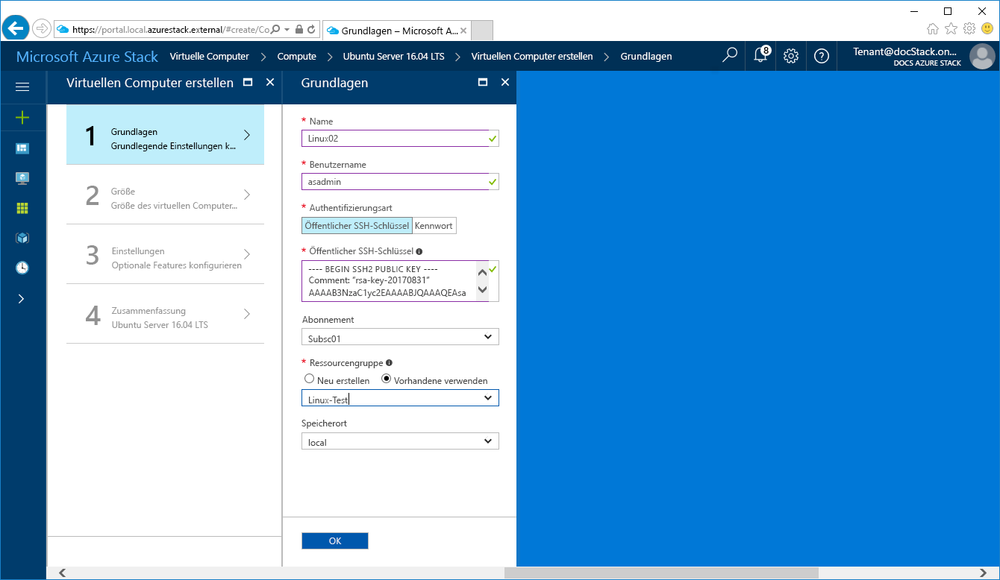
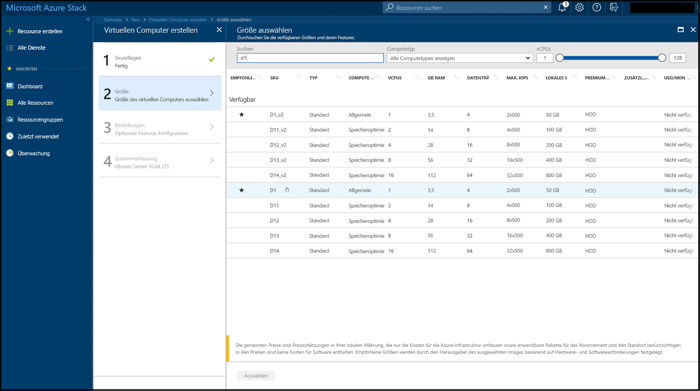
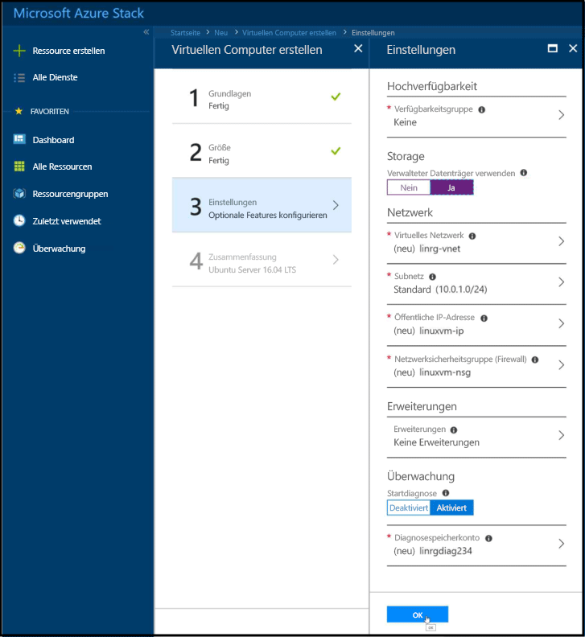

# <a name="create-a-linux-virtual-machine-with-the-azure-stack-portal"></a>Erstellen eines virtuellen Linux-Computers mit dem Azure Stack-Portal

*Gilt für: Integrierte Azure Stack-Systeme und Azure Stack Development Kit*

Virtuelle Azure Stack-Computer können über das Azure Stack-Portal erstellt werden. Bei dieser Methode können Sie die browserbasierte Benutzeroberfläche nutzen, um eine VM und alle dazugehörigen Ressourcen zu erstellen und zu konfigurieren. Dieser Schnellstart veranschaulicht das schnelle Erstellen eines virtuellen Linux-Computers und das Installieren eines Webservers darauf.

## <a name="prerequisites"></a>Voraussetzungen

* **Ein Linux-Image im Azure Stack-Marketplace**

   Ein Linux-Image ist standardmäßig nicht im Azure Stack-Marketplace enthalten. Bevor Sie einen virtuellen Linux-Computer erstellen können, stellen Sie also sicher, dass der Azure Stack-Operator das **Ubuntu Server 16.04 LT**-Image mithilfe der im Artikel [Herunterladen von Marketplace-Elementen von Azure in Azure Stack](../azure-stack-download-azure-marketplace-item.md) beschriebenen Schritte heruntergeladen hat.

* **Zugriff auf einen SSH-Client**

   Wenn Sie das Azure Stack Development Kit (ASDK) verwenden, haben Sie vielleicht keinen Zugriff auf einen SSH-Client in Ihrer Umgebung. Wenn dies der Fall ist, können Sie zwischen mehreren Paketen wählen, die einen SSH-Client enthalten. Beispielsweise können Sie PuTTY installieren, das einen SSH-Client- und SSH-Schlüsselgenerator („puttygen.exe“) enthält. Weitere Informationen zu möglichen Optionen finden Sie im folgenden verwandten Azure-Artikel: [Gewusst wie: Verwenden von SSH-Schlüsseln mit Windows in Azure](https://docs.microsoft.com/en-us/azure/virtual-machines/linux/ssh-from-windows#windows-packages-and-ssh-clients).

   Dieser Schnellstart verwendet PuTTY, um die SSH-Schlüssel zu generieren und eine Verbindung mit dem virtuellen Linux-Computer herzustellen. Zum Herunterladen und Installieren von PuTTY wechseln Sie zu [http://www.putty.org/](http://www.putty.org).

## <a name="create-an-ssh-key-pair"></a>Erstellen eines SSH-Schlüsselpaars

Für diesen Schnellstart benötigen Sie ein SSH-Schlüsselpaar. Sie können diesen Schritt überspringen, wenn Sie bereits über ein vorhandenes SSH-Schlüsselpaar verfügen.

1. Navigieren Sie zum PuTTY-Installationsordner (der Standardspeicherort ist ```C:\Program Files\PuTTY```), und führen Sie ```puttygen.exe``` aus.
2. Vergewissern Sie sich im Fenster „PuTTY Key Generator“, dass **Type of key to generate** auf **RSA** und die **Number of bits in a generated key** auf **2048** festgelegt ist. Wenn Sie fertig sind, klicken Sie auf **Generate**.

   

3. Um die Generierung von Schlüsseln abzuschließen, verschieben Sie den Mauszeiger im Fenster „PuTTY Key Generator“.
4. Wenn die Schlüsselgenerierung abgeschlossen ist, klicken Sie auf **Save public key** und **Save private key**, um Ihren öffentlichen und privaten Schlüssel in Dateien zu speichern.

   


## <a name="sign-in-to-the-azure-stack-portal"></a>Anmelden beim Azure Stack-Portal

Melden Sie sich beim Azure Stack-Portal an. Die Adresse des Azure Stack-Portals hängt davon ab, mit welchem Azure Stack-Produkt Sie eine Verbindung herstellen:

* Für Azure Stack Development Kit (ASDK) gehen Sie zu: „https://portal.local.azurestack.external“.
* Rufen Sie bei einem integrierten Azure Stack-System die vom Azure Stack-Operator bereitgestellte URL auf.

## <a name="create-the-virtual-machine"></a>Erstellen des virtuellen Computers

1. Klicken Sie in der linken oberen Ecke des Azure Stack-Portals auf die Schaltfläche **Neu**.

2. Wählen Sie **Compute** und dann **Ubuntu Server 16.04 LTS**.
3. Klicken Sie auf **Erstellen**.

4. Geben Sie die Informationen zum virtuellen Computer ein. Wählen Sie unter **Authentifizierungstyp** die Option **Öffentlicher SSH-Schlüssel**. Achten Sie beim Einfügen in Ihren öffentlichen SSH-Schlüssel (den Sie zuvor in einer Datei gespeichert haben) darauf, führende oder nachstehende Leerzeichen zu entfernen. Klicken Sie zum Abschluss auf **OK**.

   

5. Wählen Sie **D1_V2** für den virtuellen Computer aus.

   

6. Behalten Sie auf der Seite **Einstellungen** die Standardwerte bei, und klicken Sie auf **OK**.

7. Klicken Sie auf der Seite **Zusammenfassung** auf **OK**, um die Bereitstellung des virtuellen Computers zu starten.


## <a name="connect-to-the-virtual-machine"></a>Herstellen einer Verbindung mit dem virtuellen Computer

1. Klicken Sie auf der Seite des virtuellen Computers auf **Verbinden**. Damit wird eine SSH-Verbindungszeichenfolge angezeigt, mit der Sie eine Verbindung mit dem virtuellen Computer herstellen können.

   

2. Öffnen Sie PuTTY.
3. Erweitern Sie auf dem Bildschirm **PuTTY Configuration** unter **Category** die Option **SSH**, und klicken Sie dann auf **Auth**. Klicken Sie auf **Browse**, und wählen Sie die Privatschlüsseldatei, die Sie zuvor gespeichert haben.

   
4. Scrollen Sie unter **Category** nach oben, und klicken Sie auf **Session**.
5. Fügen Sie im Feld **Host Name (or IP address)** die Verbindungszeichenfolge aus dem Azure Stack-Portal ein, die Sie zuvor gesehen haben. In diesem Beispiel ist dies ```asadmin@192.168.102.34```.
 
   
6. Klicken Sie auf **Open**, um eine Sitzung mit dem virtuellen Computer zu öffnen.

   

## <a name="install-nginx"></a>Installieren von NGINX

Verwenden Sie das folgende Bash-Skript, um Paketquellen zu aktualisieren und das neueste NGINX-Paket auf der VM zu installieren. 

```bash 
#!/bin/bash

# update package source
sudo apt-get -y update

# install NGINX
sudo apt-get -y install nginx
```

Wenn Sie fertig sind, beenden Sie die SSH-Sitzung, und kehren Sie zur Seite „Übersicht“ der VM im Azure Stack-Portal zurück.


## <a name="open-port-80-for-web-traffic"></a>Öffnen von Port 80 für Webdatenverkehr 

Mit einer Netzwerksicherheitsgruppe (NSG) wird eingehender und ausgehender Datenverkehr geschützt. Wenn im Azure Stack-Portal eine VM erstellt wird, wird für SSH-Verbindungen an Port 22 eine Regel für eingehenden Datenverkehr erstellt. Da diese VM einen Webserver hostet, muss für Port 80 eine NSG-Regel erstellt werden.

1. Klicken Sie auf der Seite **Übersicht** des virtuellen Computers auf den Namen der **Ressourcengruppe**.
2. Wählen Sie die **Netzwerksicherheitsgruppe** für den virtuellen Computer aus. Die NSG können Sie anhand der Spalte **Typ** identifizieren. 
3. Klicken Sie im Menü auf der linken Seite unter **Einstellungen** auf **Eingangssicherheitsregeln**.
4. Klicken Sie auf **Hinzufügen**.
5. Geben Sie unter **Name** den Text **http** ein. Stellen Sie sicher, dass **Portbereich** auf 80 und **Aktion** auf **Zulassen** festgelegt ist. 
6. Klicken Sie auf **OK**.


## <a name="view-the-nginx-welcome-page"></a>Anzeigen der NGINX-Willkommensseite

Wenn NGINX installiert und Port 80 auf dem virtuellen Computer geöffnet ist, ist jetzt über die öffentliche IP-Adresse der VM der Zugriff auf den Webserver möglich. Die öffentliche IP-Adresse finden Sie auf der Seite „Übersicht“ der VM im Azure Stack-Portal.

Öffnen Sie einen Webbrowser, und gehen Sie zu ```http://<public IP address>```.


## <a name="clean-up-resources"></a>Bereinigen von Ressourcen

Wenn Ressourcengruppe, VM und alle zugehörigen Ressourcen nicht mehr benötigt werden, löschen Sie sie. Wählen Sie hierzu die Ressourcengruppe auf der Seite des virtuellen Computers aus, und klicken Sie auf **Löschen**.

## <a name="next-steps"></a>Nächste Schritte

In diesem Schnellstart haben Sie einen einfachen virtuellen Linux-Computer und eine Netzwerksicherheitsgruppen-Regel bereitgestellt sowie einen Webserver installiert. Um weitere Informationen zu virtuellen Computern unter Azure Stack zu erhalten, fahren Sie mit [Considerations for Virtual Machines in Azure Stack](azure-stack-vm-considerations.md) (Überlegungen zu virtuellen Computern in Azure Stack) fort.

