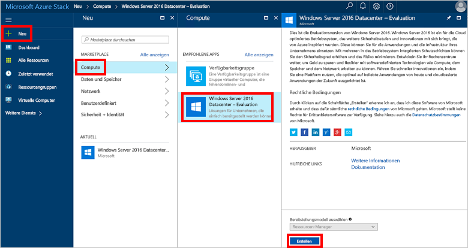
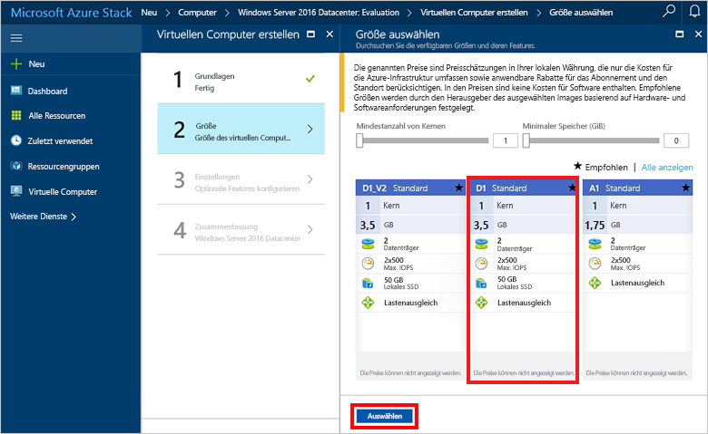
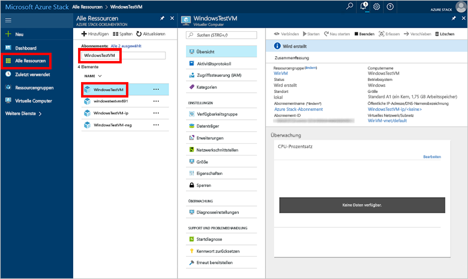

# Erstellen eines virtuellen Windows-Computers mit dem Azure Stack-Portal

Sie können einen virtuellen Windows-Computer mit dem Azure Stack-Portal erstellen. Das Portal ist eine browserbasierte Benutzeroberfläche, in der Sie Ressourcen erstellen, konfigurieren und verwalten können.

## Anmelden beim Azure Stack-Portal

Melden Sie sich beim Azure Stack-Portal an. Die Adresse des Azure Stack-Portals hängt davon ab, mit welchem Azure Stack-Produkt Sie eine Verbindung herstellen:

* Für Azure Stack Development Kit (ASDK) gehen Sie zu: „https://portal.local.azurestack.external“.
* Rufen Sie bei einem integrierten Azure Stack-System die vom Azure Stack-Operator bereitgestellte URL auf.

## Erstellen eines virtuellen Computers

1. Klicken Sie im Portal auf **Neu** > **Compute** > **Windows Server 2016 Datacenter Eval** > **Erstellen**. Wenn Sie den Eintrag **Windows Server 2016 Datacenter Eval** nicht sehen, wenden Sie sich an Ihren Azure Stack-Operator. Bitten Sie ihn, diesen dem Marketplace hinzuzufügen, wie im Artikel [Hinzufügen des VM-Images für Windows Server 2016 zum Azure Stack-Marketplace](../azure-stack-add-default-image.md) beschrieben. 
    
2. Geben Sie unter **Grundlagen** Werte für **Name**, **Benutzername** und **Kennwort** ein. Wählen Sie ein **Abonnement**aus. Erstellen Sie eine **Ressourcengruppe**, oder wählen Sie eine vorhandene aus, wählen Sie einen **Speicherort** aus, und klicken Sie anschließend auf **OK**.

    
3. Klicken Sie unter **Größe auswählen** auf **D1 Standard** > **Auswählen**.
    
4. Übernehmen Sie unter **Einstellungen** die Standardwerte, und klicken Sie auf **OK**.
    
5. Klicken Sie unter **Zusammenfassung** auf **OK**, um den virtuellen Computer zu erstellen. 
    
6. Klicken Sie zum Anzeigen Ihres neuen virtuellen Computers auf **Alle Ressourcen**, und suchen Sie dann nach dem virtuellen Computer. Klicken Sie auf seinen Namen.
    

## Bereinigen von Ressourcen

Wenn Sie Ressourcengruppe, VM und alle zugehörigen Ressourcen nicht mehr benötigen, löschen Sie sie. Wählen Sie hierzu die Ressourcengruppe auf der Seite des virtuellen Computers aus, und klicken Sie auf **Löschen**.

## Nächste Schritte
In diesem Schnellstart haben Sie eine einfache Windows-VM bereitgestellt. Um weitere Informationen zu virtuellen Computern unter Azure Stack zu erhalten, fahren Sie mit [Considerations for Virtual Machines in Azure Stack](azure-stack-vm-considerations.md) (Überlegungen zu virtuellen Computern in Azure Stack) fort.
