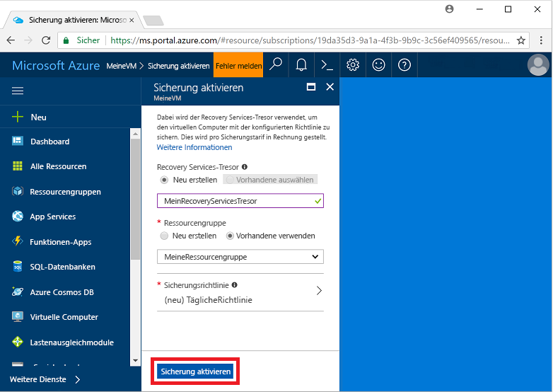

# Sichern eines virtuellen Computers in Azure
Azure-Sicherungen können über das Azure-Portal erstellt werden. Bei dieser Methode können Sie die browserbasierte Benutzeroberfläche nutzen, um Azure-Sicherungen und alle dazugehörigen Ressourcen zu erstellen und zu konfigurieren. Sie können Ihre Daten schützen, indem Sie in regelmäßigen Abständen Sicherungen erstellen. Azure Backup erstellt Wiederherstellungspunkte, die in georedundanten Recovery-Tresoren gespeichert werden können. In diesem Artikel wird ausführlich beschrieben, wie Sie einen virtuellen Computer (VM) mit dem Azure-Portal sichern. 

Dieser Schnellstart ermöglicht die Sicherung auf einer vorhandenen Azure-VM. Wenn Sie eine VM erstellen müssen, können Sie die [Erstellung mit dem Azure-Portal durchführen](../virtual-machines/windows/quick-create-portal.md).

## Anmelden an Azure

Melden Sie sich unter „http://portal.azure.com“ beim Azure-Portal an.

## Auswählen einer zu sichernden VM
Erstellen Sie eine einfache geplante tägliche Sicherung in einem Recovery Services-Tresor. 

1. Wählen Sie im Menü auf der linken Seite **Virtuelle Computer** aus. 
2. Wählen Sie in der Liste eine VM aus, die gesichert werden soll. Wenn Sie die Befehle aus dem VM-Beispiel des Schnellstarts verwendet haben, hat die VM in der Ressourcengruppe *myResourceGroup* den Namen *myVM*.
3. Wählen Sie im Abschnitt **Einstellungen** die Option **Backup** (Sichern). Das Fenster **Sicherung aktivieren** wird geöffnet.

## Aktivieren der Sicherung auf einer VM
Ein Recovery Services-Tresor ist ein logischer Container, in dem die Sicherungsdaten für jede geschützte Ressource, z.B. Azure-VMs, gespeichert werden. Wenn der Sicherungsauftrag für eine geschützte Ressource ausgeführt wird, wird im Recovery Services-Tresor ein Wiederherstellungspunkt erstellt. Sie können einen dieser Wiederherstellungspunkte dann verwenden, um Daten für einen bestimmten Zeitpunkt wiederherzustellen.

1. Wählen Sie **Neu erstellen**, und geben Sie einen Namen für den neuen Tresor an, z.B.**myRecoveryServicesVault**.
2. Wählen Sie **Use existing** (Vorhandene verwenden), falls noch nicht geschehen, und wählen Sie anschließend im Dropdownmenü die Ressourcengruppe Ihrer VM aus.

    

    Für den Tresor ist standardmäßig die georedundante Speicherung festgelegt. Als weiterer Schutz für Ihre Daten wird auf dieser Speicherredundanzebene sichergestellt, dass Ihre Sicherungsdaten in einer sekundären Azure-Region repliziert werden, die Hunderte Kilometer von der primären Region entfernt ist.

    Sie erstellen und verwenden Richtlinien, um zu definieren, wann ein Sicherungsauftrag ausgeführt wird und wie lange die Wiederherstellungspunkte gespeichert werden. Bei der Standardschutzrichtlinie wird jeden Tag ein Sicherungsauftrag ausgeführt, und Wiederherstellungspunkte werden 30 Tage lang beibehalten. Sie können diese Standardrichtlinienwerte verwenden, um Ihre VM schnell zu schützen. 

3. Wählen Sie zum Übernehmen der Standardwerte der Sicherungsrichtlinie die Option **Sicherung aktivieren**.

## Starten eines Sicherungsauftrags
Sie können jetzt eine Sicherung starten, anstatt zu warten, bis die Standardrichtlinie den Auftrag zum geplanten Zeitpunkt ausführt. Bei diesem ersten Sicherungsauftrag wird ein vollständiger Wiederherstellungspunkt erstellt. Bei jedem Sicherungsauftrag nach diesem ersten Sicherungsvorgang werden dann inkrementelle Wiederherstellungspunkte erstellt. Inkrementelle Wiederherstellungspunkte sind in Bezug auf die Speicherung und die Dauer effizient, da nur Änderungen übertragen werden, die seit der letzten Sicherung vorgenommen wurden.

1. Wählen Sie im Fenster **Backup** (Sichern) für Ihre VM die Option **Jetzt sichern**.

    

2. Behalten Sie das Standarddatum unter **Sicherung beibehalten bis** bei, um den Wert von 30 Tagen aus der Richtlinie für die Sicherungsaufbewahrung zu übernehmen. Wählen Sie **Backup** (Sichern), um den Auftrag zu starten.

## Überwachen des Sicherungsauftrags
Im Fenster **Backup** (Sichern) Ihrer VM werden der Status der Sicherung und die Anzahl von abgeschlossenen Wiederherstellungspunkten angezeigt. Nach Abschluss des VM-Sicherungsauftrags werden im Fenster **Übersicht** auf der rechten Seite Informationen zu **Uhrzeit der letzten Sicherung**, **Neuester Wiederherstellungspunkt** und **Ältester Wiederherstellungspunkt** angezeigt.

## Bereinigen der Bereitstellung
Wenn die Komponenten nicht mehr benötigt werden, können Sie den Schutz auf der VM deaktivieren, die Wiederherstellungspunkte und den Recovery Services-Tresor entfernen und anschließend die Ressourcengruppe und die dazugehörigen VM-Ressourcen löschen.

Wenn Sie mit einem Backup-Tutorial fortfahren möchten, in dem die Wiederherstellung von Daten für Ihre VM beschrieben wird, können Sie die Schritte in diesem Abschnitt überspringen und mit [Nächste Schritte](#next-steps) fortfahren.

1. Wählen Sie die Option **Backup** (Sichern) für Ihre VM.

2. Wählen Sie **...Mehr**, um weitere Optionen anzuzeigen, und dann die Option **Sicherung beenden**.

    

3. Wählen Sie im Dropdownmenü die Option **Sicherungsdaten löschen**.

4. Geben Sie im Dialogfeld **Type the name of the Backup item** (Namen des Backup-Elements eingeben) Ihren VM-Namen ein, z.B. *myVM*. Wählen Sie **Sicherung beenden**.

    Nachdem die VM-Sicherung beendet wurde und die Wiederherstellungspunkte entfernt wurden, können Sie die Ressourcengruppe löschen. Wenn Sie eine vorhandene VM verwendet haben, kann es auch sein, dass Sie die Ressourcengruppe und die VM beibehalten möchten.

5. Wählen Sie im Menü auf der linken Seite die Option **Ressourcengruppen**. 
6. Wählen Sie in der Liste Ihre Ressourcengruppe aus. Wenn Sie die Befehle aus dem VM-Beispiel des Schnellstarts verwendet haben, hat die Ressourcengruppe den Namen *myResourceGroup*.
7. Wählen Sie die Option **Ressourcengruppe löschen**. Geben Sie als Bestätigung den Namen der Ressourcengruppe ein, und wählen Sie anschließend **Löschen**.

    

## Nächste Schritte
In diesem Schnellstart haben Sie einen Recovery Services-Tresor erstellt, den Schutz auf einer VM aktiviert und den ersten Wiederherstellungspunkt erstellt. Weitere Informationen zu Azure Backup und Recovery Services sind in den Tutorials enthalten.

> [!div class="nextstepaction"]
> [Sichern von mehreren Azure-VMs](./tutorial-backup-vm-at-scale.md)
