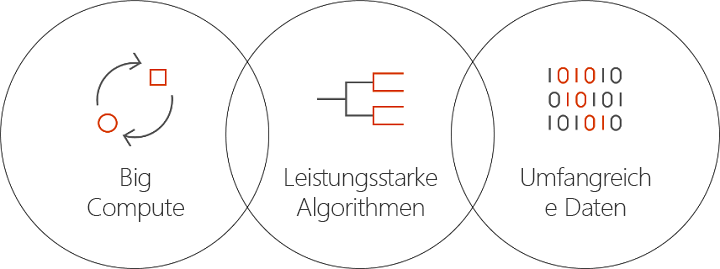

# Was ist Batch AI in Azure?
Batch AI ist ein verwalteter Dienst, mit dem Data Scientists und KI-Forscher KI-Modelle und andere Machine Learning-Modelle in Clustern mit virtuellen Azure-Computern, z.B. VMs mit GPU-Unterstützung, trainieren können. Sie beschreiben die Anforderungen Ihres Auftrags und geben an, wo sich die Eingabedaten befinden und die Ausgabedaten gespeichert werden sollen, und Batch AI kümmert sich um den Rest.  
 
## Gründe für Batch AI 
Die Entwicklung von leistungsfähigen KI-Algorithmen ist ein rechenintensiver und iterativer Prozess. Data Scientists und KI-Forscher arbeiten mit immer größeren Datasets. Sie entwickeln Modelle mit einer größeren Zahl von Schichten und betreiben in Bezug auf Experimente mit dem Netzwerkentwurf und der Optimierung von Hyperparametern immer mehr Aufwand. Wenn dies effizient erfolgen soll, sind mehrere CPUs oder GPUs pro Modell erforderlich, Experimente müssen parallel durchgeführt werden, und es muss ein gemeinsamer Speicher zum Trainieren von Daten, Protokollen und Modellausgaben vorhanden sein.   
 

Data Scientists und KI-Forscher sind Experten auf ihrem jeweiligen Gebiet, aber die bedarfsabhängige Verwaltung der Infrastruktur kann eine Herausforderung darstellen. Für die KI-Entwicklung in größerem Umfang sind viele Infrastrukturaufgaben erforderlich: Bereitstellen von Clustern mit VMs, Installieren von Software und Containern, Einreihen von Arbeit in die Warteschlange, Priorisieren und Planen von Aufträgen, Behandeln von Fehlern, Verteilen von Daten, Austauschen von Ergebnissen, Skalieren von Ressourcen für die Kostenverwaltung und Durchführen der Integration in Tools und Workflows. Diese Aufgaben werden von Batch AI übernommen. 
 
## Was ist Batch AI? 

Batch AI ermöglicht die Ressourcenverwaltung und Auftragsplanung speziell für das KI-Training und -Testing. Wichtige Funktionen sind: 

* Ausführen von Batchaufträgen mit langer Ausführungsdauer, iterativen Experimenten und interaktivem Training 
* Automatisches oder manuelles Skalieren von VM-Clustern mit GPUs oder CPUs 
* Konfigurieren der SSH-Kommunikation zwischen VMs und für den Remotezugriff 
* Unterstützung von Deep Learning- oder Machine Learning-Frameworks mit optimierter Konfiguration für beliebte Toolkits, z.B. [Microsoft Cognitive Toolkit](https://github.com/Microsoft/CNTK) (CNTK), [TensorFlow](https://www.tensorflow.org/) und [Chainer](https://chainer.org/) 
* Prioritätsbasierte Auftragswarteschlange zum gemeinsamen Nutzen von Clustern und Verwenden von virtuellen Computern mit niedriger Priorität und reservierten Instanzen  
* Flexible Speicheroptionen, z.B. Azure Files und ein verwalteter NFS-Server 
* Bereitstellen von Remotedateifreigaben auf der VM und im optionalen Container 
* Bereitstellen des Auftragsstatus und Durchführen eines Neustarts bei VM-Ausfällen 
* Zugreifen auf Ausgabeprotokolle, stdout, stderr und Modelle, z.B. das Streamen aus Azure Storage 
* Azure-[Befehlszeilenschnittstelle](/cli/azure) (CLI), SDKs für [Python](https://github.com/Azure/azure-sdk-for-python), [C#](https://www.nuget.org/packages/Microsoft.Azure.Management.BatchAI/1.0.0-preview) und Java, Überwachung im Azure-Portal und Integration in Microsoft-KI-Tools 

Das Batch AI SDK unterstützt das Schreiben von Skripts oder Anwendungen zum Verwalten von Trainingspipelines und für die Integration in Tools. Über das SDK werden derzeit Python-, C#-, Java- und REST-APIs bereitgestellt.  
 

Batch AI nutzt Azure Resource Manager für Vorgänge auf Steuerungsebene (Erstellen, Auflisten, Abrufen, Löschen). Azure Active Directory wird für die Authentifizierung und rollenbasierte Zugriffssteuerung verwendet.  
 
## Verwenden von Batch AI 

Für die Verwendung von Batch AI definieren und verwalten Sie *Cluster* und *Aufträge*. 

 
Mit **Clustern** werden Ihre Computeanforderungen beschrieben: 
* Azure-Region, in der die Ausführung erfolgen soll 
* Familie und Größe der zu verwendenden VM, z.B. eine NC24-VM mit vier GPUs vom Typ NVIDIA K80 
* Anzahl von VMs oder minimale und maximale Anzahl für die automatische Skalierung 
* VM-Image, z.B. Ubuntu 16.04 LTS oder [Microsoft Deep Learning Virtual Machine](https://azuremarketplace.microsoft.com/marketplace/apps/microsoft-ads.dsvm-deep-learning)
* Bereitzustellende Remotedateifreigabe-Volumes, z.B. für Azure Files oder einen per Batch AI verwalteten NFS-Server 
* Benutzername und SSH-Schlüssel oder -Kennwort für die Konfiguration auf den VMs, um die interaktive Anmeldung für das Debuggen zu ermöglichen  
 

Mit **Aufträgen** wird Folgendes beschrieben: 
* Cluster und zu verwendende Region 
* Anzahl von VMs für den Auftrag 
* Eingabe- und Ausgabeverzeichnisse für die Übergabe an den Auftrag beim Starten (Hierfür wird normalerweise das freigegebene Dateisystem verwendet, das während der Clustereinrichtung bereitgestellt wurde.) 
* Optionaler Container für die Ausführung Ihrer Software oder des Installationsskripts 
* Spezifische Konfiguration für das KI-Framework oder die Befehlszeile und Parameter zum Starten des Auftrags 
 

Beginnen Sie mit der Verwendung von Batch AI, indem Sie die [Azure CLI](/cli/azure) und Konfigurationsdateien für Cluster und Aufträge nutzen. Mit diesem Ansatz können Sie Ihren Cluster bei Bedarf schnell erstellen und Aufträge ausführen, um mit dem Netzwerkentwurf oder Hyperparametern zu experimentieren.  
 

Mit Batch AI ist es einfach, parallel mit mehreren GPUs zu arbeiten. Wenn Aufträge für mehrere GPUs skaliert werden müssen, richtet Batch AI eine sichere Netzwerkverbindung zwischen den VMs ein. Bei Verwendung von InfiniBand konfiguriert Batch AI die Treiber und startet MPI für alle Knoten eines Auftrags.  

## Datenverwaltung
Batch AI verfügt über flexible Optionen für Ihre Trainingsskripts, -daten und -ausgaben:
  
* Verwenden Sie den **lokalen Datenträger** für die ersten Experimente und kleinere Datasets. Bei diesem Szenario kann es ratsam sein, per SSH eine Verbindung mit dem virtuellen Computer herzustellen, um Skripts zu bearbeiten und Protokolle zu lesen. 

* Verwenden Sie **Azure Files**, um Trainingsdaten für mehrere Aufträge zu nutzen und Ausgabeprotokolle und Modelle zentral an einem Speicherort zu speichern. 

* Richten Sie einen **NFS-Server** ein, um Daten und VMs in größerem Umfang für das Training zu unterstützen. Batch AI kann für Sie einen NFS-Server als speziellen Clustertyp mit Datenträgern einrichten, die in Azure Storage gesichert werden. 
 
* Ein **paralleles Dateisystem** ermöglicht die weitere Datenskalierbarkeit und paralleles Training. Batch AI verwaltet zwar keine parallelen Dateisysteme, aber Bereitstellungsvorlagen sind für Lustre, Gluster und BeeGFS verfügbar.  

## Nächste Schritte

* Beginnen Sie mit der Erstellung Ihres ersten Batch AI-Trainingsauftrags, indem Sie die [Azure CLI](quickstart-cli.md) oder [Python](quickstart-python.md) verwenden.
* Sehen Sie sich die Beispiele für [Trainingsrezepte](https://github.com/Azure/BatchAI) für verschiedene Frameworks an.

