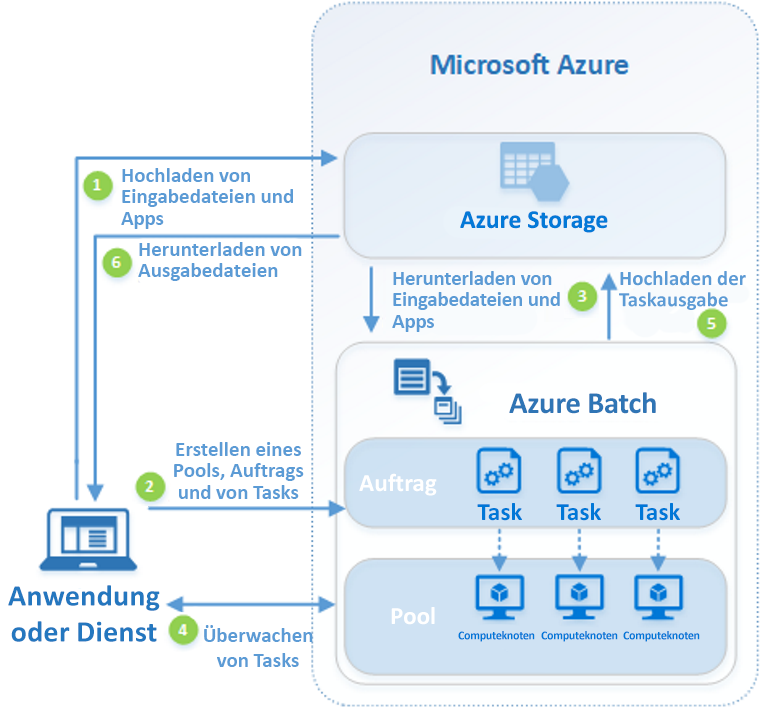

# Was ist Azure Batch?

Mithilfe von Azure Batch können Sie umfangreiche auf Parallelverarbeitung ausgelegte HPC-Batchaufträge (High Performance Computing) effizient in Azure ausführen. Azure Batch erstellt und verwaltet einen Pool mit Computeknoten (virtuelle Computer), installiert die Anwendungen, die Sie ausführen möchten, und plant Aufträge für die Ausführung auf den Knoten. Es muss keine Cluster- oder Auftragsplanersoftware installiert, verwaltet oder skaliert werden. Stattdessen nutzen Sie [Batch-APIs und -Tools](batch-apis-tools.md), Befehlszeilenskripts oder das Azure-Portal, um Ihre Aufträge zu konfigurieren, zu verwalten und zu überwachen. 

Entwickler können Batch als Plattformdienst verwenden, um SaaS-Anwendungen oder Client-Apps zu erstellen, für die große Mengen von Ausführungen erforderlich sind. Erstellen Sie mit Batch beispielsweise einen Dienst zum Ausführen einer Monte Carlo-Risikosimulation für ein Dienstleistungsunternehmen oder einen Dienst zum Verarbeiten einer großen Zahl von Bildern.

Es fallen keine zusätzlichen Gebühren für die Nutzung von Batch an. Sie zahlen nur für die genutzten zugrunde liegenden Ressourcen, z.B. virtuelle Computer, Speicher und Netzwerk.

Ein Vergleich zwischen Batch und anderen HPC-Lösungsoptionen in Azure finden Sie unter [HPC, Batch, and Big Compute solutions using Azure VMs](../virtual-machines/linux/high-performance-computing.md) (HPC-, Batch- und Big Compute-Lösungen mit Azure-VMs).

## Ausführen von parallelen Workloads
Batch funktioniert gut mit intrinsisch parallelen Workloads (auch als „hochgradig parallel“ bezeichnet). Bei intrinsisch parallelen Workloads können die Anwendungen unabhängig voneinander ausgeführt werden, und jede Instanz erledigt einen Teil der Arbeit. Wenn die Anwendungen ausgeführt werden, greifen sie ggf. auf einige gemeinsame Daten zu, aber sie kommunizieren nicht mit anderen Instanzen der Anwendung. Intrinsisch parallele Workloads können daher in großem Umfang ausgeführt werden. Dies richtet sich nach der Menge von Computeressourcen, die für die gleichzeitige Ausführung von Anwendungen verfügbar sind.

Hier sind einige Beispiele für intrinsisch parallele Workloads angegeben, die Sie in Batch einbinden können:

* Modellierung von Finanzrisiken mit Monte Carlo-Simulationen
* VFX- und 3D-Bildrendering
* Bildanalyse und -verarbeitung
* Medientranscodierung
* Analyse genetischer Sequenzen
* Optische Zeichenerkennung (OCR)
* Datenerfassung-/verarbeitung und ETL-Vorgänge
* Softwaretestausführung

Sie können Batch auch verwenden, um [eng gekoppelte Workloads auszuführen](batch-mpi.md). Dies sind Workloads, bei denen die von Ihnen ausgeführten Anwendungen miteinander kommunizieren müssen und nicht unabhängig ausgeführt werden. Für eng gekoppelte Anwendungen wird normalerweise die MPI-API (Message Passing Interface) verwendet. Sie können Ihre eng gekoppelten Workloads mit Batch per [Microsoft-MPI](https://msdn.microsoft.com/library/bb524831(v=vs.85).aspx) oder Intel-MPI ausführen. Verbessern Sie die Anwendungsleistung mit speziellen [HPC](../virtual-machines/linux/sizes-hpc.md)-Maßnahmen und [GPU-optimierten](../virtual-machines/linux/sizes-gpu.md) VM-Größen.

Hier sind einige Beispiele für eng gekoppelte Workloads angegeben:
* FE-Analyse
* Strömungssimulation
* KI-Training mit mehreren Knoten

Viele eng gekoppelte Aufträge können mit Batch parallel ausgeführt werden. Führen Sie beispielsweise mehrere Simulationen für einen Fall durch, in dem eine Flüssigkeit durch ein Rohr mit wechselnden Durchmessern fließt.

## Zusätzliche Batch-Funktionen

Für Azure Batch sind auch allgemeinere workloadspezifische Funktionen verfügbar:
* Batch unterstützt größere Mengen von [Renderingworkloads](batch-rendering-service.md) mit Renderingtools wie beispielsweise Autodesk Maya, 3ds Max, Arnold und V-Ray. 
* R-Benutzer können das [R-Paket „doAzureParallel“](https://github.com/Azure/doAzureParallel) installieren, um für die Ausführung von R-Algorithmen in Batch-Pools auf einfache Weise das horizontale Hochskalieren durchzuführen.

Sie können Batch-Aufträge auch im Rahmen eines größeren Azure-Workflows zum Transformieren von Daten ausführen, der mit Tools wie [Azure Data Factory](../data-factory/v1/data-factory-data-processing-using-batch.md) verwaltet wird.

## So funktioniert's
Ein häufiges Szenario für Batch ist das horizontale Hochskalieren von intrinsisch parallelen Arbeitsschritten, z.B. das Rendern von Bildern für 3D-Szenen, in einem Pool mit Computeknoten. Dieser Pool mit Computeknoten kann als Ihre „Renderfarm“ dienen, mit der für den Renderauftrag Dutzende, Hunderte oder sogar Tausende von Kernen bereitgestellt werden.

Im folgenden Diagramm sind die Schritte eines gängigen Batch-Workflows dargestellt, bei dem eine Clientanwendung oder ein gehosteter Dienst Batch zum Ausführen einer parallelen Workload verwendet.

|Schritt  |Beschreibung  |
|---------|---------|
|1.  Laden Sie die **Eingabedateien** und die **Anwendungen**, mit der diese Dateien verarbeitet werden, in Ihr Azure Storage-Konto hoch.     |Bei den Eingabedateien kann es sich um alle Daten handeln, die von Ihrer Anwendung verarbeitet werden, z.B. Daten für Finanzmodelle oder zu transcodierende Videodateien. Die Anwendungsdateien können Skripts oder Anwendungen enthalten, mit denen die Daten verarbeitet werden, z.B. einen Medien-Transcoder.|
|2.  Erstellen Sie einen Batch-**Pool** mit Computeknoten in Ihrem Batch-Konto, einen **Auftrag** zum Ausführen der Workload im Pool und **Aufgaben** im Auftrag.     | Poolknoten sind die VMs, mit denen Ihre Aufgaben ausgeführt werden. Geben Sie Eigenschaften, z.B. Anzahl und Größe von Knoten, ein Windows- oder Linux-VM-Image und eine Anwendung an, die installiert werden soll, wenn die Knoten im Pool vorhanden sind. Verwalten Sie die Kosten und die Größe des Pools, indem Sie [VMs mit niedriger Priorität](batch-low-pri-vms.md) verwenden oder die [automatische Skalierung](batch-automatic-scaling.md) der Anzahl von Knoten durchführen, wenn sich die Workload ändert.   Wenn Sie einem Auftrag Aufgaben hinzufügen, plant der Batch-Dienst die Aufgaben automatisch für die Ausführung auf den Computeknoten im Pool ein. Jede Aufgabe verwendet die Anwendung, die Sie hochgeladen haben, zum Verarbeiten der Eingabedateien. |
|3.  Laden Sie **Eingabedateien** und die **Anwendungen** in Batch herunter.     |Vor dem Ausführen der einzelnen Aufgaben können die Eingabedaten, die verarbeitet werden sollen, auf den zugewiesenen Computeknoten heruntergeladen werden. Wenn die Anwendung nicht bereits auf den Poolknoten installiert ist, kann sie stattdessen hier heruntergeladen werden. Nachdem die Downloads aus Azure Storage abgeschlossen sind, wird die Aufgabe auf dem zugewiesenen Knoten ausgeführt.|
|4.  Überwachen Sie die **Aufgabenausführung**.     |Fragen Sie während der Ausführung der Aufgaben Batch ab, um den Fortschritt des Auftrags und seiner Aufgaben zu überwachen. Ihre Clientanwendung oder Ihr Dienst kommuniziert mit dem Batch-Dienst über HTTPS. Da Sie unter Umständen Tausende von Aufgaben auf Tausenden von Computeknoten überwachen müssen, empfiehlt es sich, [den Batch-Dienst möglichst effizient abzufragen](batch-efficient-list-queries.md).|
|5.  Laden Sie die **Aufgabenausgabe** hoch.     |Nach Abschluss der Aufgaben können die Ergebnisdaten in Azure Storage hochgeladen werden. Sie können Dateien auch direkt aus dem Dateisystem auf einem Computeknoten abrufen.|
|6.  Laden Sie die **Ausgabedateien** herunter.     |Wenn bei der Überwachung erkannt wird, dass die Aufgaben Ihres Auftrags abgeschlossen wurden, kann Ihre Clientanwendung bzw. der Dienst die Ausgabedaten zur weiteren Verarbeitung herunterladen.|

Bedenken Sie, dass dies nur eine Möglichkeit zur Verwendung von Batch ist und dass in diesem Szenario nur einige Features beschrieben werden. Beispielsweise können Sie auf jedem Computeknoten [mehrere Aufgaben parallel](batch-parallel-node-tasks.md) ausführen. Oder verwenden Sie [Aufgaben für die Vorbereitung und den Abschluss von Aufträgen](batch-job-prep-release.md), um die Knoten für Ihre Aufträge vorzubereiten, und führen Sie anschließend die Bereinigung durch. 

Unter [Übersicht über Batch-Features für Entwickler](batch-api-basics.md) finden Sie ausführliche Informationen zu Pools, Knoten, Aufträgen und Aufgaben sowie zu den zahlreichen API-Funktionen, die beim Erstellen der Batch-Anwendung verwendet werden können. 

## Nächste Schritte

Steigen Sie mit einer der folgenden Schnellstartanleitungen in Azure Batch ein:
* [Ausführen Ihres ersten Batch-Auftrags mit der Azure CLI](quick-create-cli.md)
* [Ausführen Ihres ersten Batch-Auftrags mit dem Azure-Portal](quick-create-portal.md)
* [Ausführen Ihres ersten Batch-Auftrags mit der .NET-API](quick-run-dotnet.md)
* [Ausführen Ihres ersten Batch-Auftrags mit der Python-API](quick-run-python.md)

