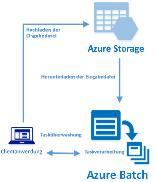

# <a name="quickstart-run-your-first-azure-batch-job-with-the-net-api"></a>Schnellstart: Ausführen Ihres ersten Azure Batch-Auftrags mit der .NET-API

In dieser Schnellstartanleitung wird ein Azure Batch-Auftrag über eine C#-Anwendung ausgeführt, die auf der Azure Batch .NET-API basiert. Die App lädt einige Eingabedatendateien in den Azure-Speicher und erstellt anschließend einen *Pool* mit Batch-Computeknoten (virtuelle Computer). Als Nächstes wird ein Beispiel für einen *Auftrag* erstellt, mit dem *Aufgaben* ausgeführt werden, um die einzelnen Eingabedateien im Pool mit einem einfachen Befehl zu verarbeiten. Nach Abschluss dieser Schnellstartanleitung sind Sie mit den wichtigsten Konzepten des Batch-Diensts vertraut und können Batch mit realistischeren Workloads und in größerem Umfang ausprobieren.



[!INCLUDE [quickstarts-free-trial-note.md](../../includes/quickstarts-free-trial-note.md)]

## <a name="prerequisites"></a>Voraussetzungen

* [Visual Studio 2017 oder höher](https://www.visualstudio.com/vs) bzw. [.NET Core 2.1](https://www.microsoft.com/net/download/dotnet-core/2.1) für Linux, macOS oder Windows. 

* Ein Batch-Konto und ein verknüpftes Azure Storage-Konto. Informationen zur Erstellung dieser Konten finden Sie in den Batch-Schnellstartanleitungen zum [Azure-Portal](quick-create-portal.md) und zur [Azure CLI](quick-create-cli.md). 

## <a name="sign-in-to-azure"></a>Anmelden bei Azure

Melden Sie sich unter [https://portal.azure.com](https://portal.azure.com) beim Azure-Portal an.

[!INCLUDE [batch-common-credentials](../../includes/batch-common-credentials.md)]

## <a name="download-the-sample"></a>Herunterladen des Beispiels

[Laden Sie die Beispiel-App von GitHub herunter, oder klonen Sie sie](https://github.com/Azure-Samples/batch-dotnet-quickstart). Verwenden Sie den folgenden Befehl, um das Beispiel-App-Repository mit einem Git-Client zu klonen:

```
git clone https://github.com/Azure-Samples/batch-dotnet-quickstart.git
```

Navigieren Sie zu dem Verzeichnis, in dem die Visual Studio-Projektmappendatei `BatchDotNetQuickstart.sln` enthalten ist.

Öffnen Sie die Projektmappendatei in Visual Studio, und aktualisieren Sie die Zeichenfolgen mit den Anmeldeinformationen in `Program.cs` mit den Werten für Ihre Konten. Beispiel: 

```csharp
// Batch account credentials
private const string BatchAccountName = "mybatchaccount";
private const string BatchAccountKey  = "xxxxxxxxxxxxxxxxE+yXrRvJAqT9BlXwwo1CwF+SwAYOxxxxxxxxxxxxxxxx43pXi/gdiATkvbpLRl3x14pcEQ==";
private const string BatchAccountUrl  = "https://mybatchaccount.mybatchregion.batch.azure.com";

// Storage account credentials
private const string StorageAccountName = "mystorageaccount";
private const string StorageAccountKey  = "xxxxxxxxxxxxxxxxy4/xxxxxxxxxxxxxxxxfwpbIC5aAWA8wDu+AFXZB827Mt9lybZB1nUcQbQiUrkPtilK5BQ==";
```

[!INCLUDE [batch-credentials-include](../../includes/batch-credentials-include.md)]

## <a name="build-and-run-the-app"></a>Erstellen und Ausführen der App

Um den Batch-Workflow in Aktion zu sehen, können Sie die Anwendung in Visual Studio oder über die Befehlszeile mit den Befehlen `dotnet build` und `dotnet run` erstellen und ausführen. Sehen Sie sich nach dem Ausführen der Anwendung den Code an, um zu erfahren, welche Aufgabe die einzelnen Teile der Anwendung jeweils haben. In Visual Studio:

* Klicken Sie mit der rechten Maustaste im Projektmappen-Explorer auf die Projektmappe, und klicken Sie dann auf **Projektmappe erstellen**. 

* Bestätigen Sie die Wiederherstellung von NuGet-Paketen, wenn Sie hierzu aufgefordert werden. Stellen Sie beim Herunterladen von fehlenden Paketen sicher, dass der [NuGet-Paket-Manager](https://docs.nuget.org/consume/installing-nuget) installiert ist.

Führen Sie ihn anschließend aus. Beim Ausführen der Beispielanwendung sieht die Konsolenausgabe in etwa wie folgt aus: Bei der Ausführung kommt es bei `Monitoring all tasks for 'Completed' state, timeout in 00:30:00...` zu einer Pause, während die Computeknoten des Pools gestartet werden. Die Aufgaben werden in die Warteschlange eingereiht und dann ausgeführt, sobald der erste Computeknoten aktiv ist. Navigieren Sie im [Azure-Portal](https://portal.azure.com) zu Ihrem Batch-Konto, um den Pool, die Computeknoten, den Auftrag und die Aufgaben zu überwachen.

```
Sample start: 11/16/2018 4:02:54 PM

Container [input] created.
Uploading file taskdata0.txt to container [input]...
Uploading file taskdata1.txt to container [input]...
Uploading file taskdata2.txt to container [input]...
Creating pool [DotNetQuickstartPool]...
Creating job [DotNetQuickstartJob]...
Adding 3 tasks to job [DotNetQuickstartJob]...
Monitoring all tasks for 'Completed' state, timeout in 00:30:00...
```

Nach Abschluss der einzelnen Aufgaben wird dazu jeweils die Ausgabe angezeigt, die in etwa wie folgt aussieht:

```
Printing task output.
Task: Task0
Node: tvm-2850684224_3-20171205t000401z
Standard out:
Batch processing began with mainframe computers and punch cards. Today it still plays a central role in business, engineering, science, and other pursuits that require running lots of automated tasks....
stderr:
...
```

Die normale Ausführungsdauer beträgt ca. fünf Minuten, wenn die Anwendung in der Standardkonfiguration ausgeführt wird. Am meisten Zeit nimmt die anfängliche Einrichtung des Pools ein. Löschen Sie den Auftrag aus der vorherigen Ausführung, aber löschen Sie nicht den Pool, um den Auftrag erneut auszuführen. In einem vorkonfigurierten Pool wird der Auftrag innerhalb einiger Sekunden abgeschlossen.


## <a name="review-the-code"></a>Überprüfen des Codes

Mit der .NET-App in dieser Schnellstartanleitung werden folgende Schritte ausgeführt:

* Es werden drei kleine Textdateien in einen Blobcontainer in Ihrem Azure-Speicherkonto hochgeladen. Diese Dateien dienen als Eingaben für die Verarbeitung mit Batch.
* Es wird ein Pool mit Computeknoten erstellt, auf denen Windows Server ausgeführt wird.
* Es werden ein Auftrag und drei Aufgaben für die Ausführung auf den Knoten erstellt. Jede Aufgabe verarbeitet eine der Eingabedateien über eine Windows-Befehlszeile. 
* Es werden die von den Aufgaben zurückgegebenen Dateien angezeigt.

Ausführliche Informationen finden Sie in der Datei `Program.cs` und in den folgenden Abschnitten. 

### <a name="preliminaries"></a>Vorbereitende Maßnahmen

Zum Interagieren mit einem Speicherkonto verwendet die App die Azure Storage-Clientbibliothek für .NET. Sie erstellt einen Verweis auf das Konto mit [CloudStorageAccount](/dotnet/api/microsoft.azure.cosmos.table.cloudstorageaccount) und auf dieser Grundlage ein [CloudBlobClient](/dotnet/api/microsoft.azure.storage.blob.cloudblobclient)-Element.

```csharp
CloudBlobClient blobClient = storageAccount.CreateCloudBlobClient();
```

Die App verwendet den `blobClient`-Verweis, um im Speicherkonto einen Container zu erstellen und Datendateien in den Container hochzuladen. Die Dateien im Speicher werden als Batch-[ResourceFile](/dotnet/api/microsoft.azure.batch.resourcefile)-Objekte definiert, die von Batch später auf Computeknoten heruntergeladen werden können.

```csharp
List<string> inputFilePaths = new List<string>
{
    "taskdata0.txt",
    "taskdata1.txt",
    "taskdata2.txt"
};

List<ResourceFile> inputFiles = new List<ResourceFile>();

foreach (string filePath in inputFilePaths)
{
    inputFiles.Add(UploadFileToContainer(blobClient, inputContainerName, filePath));
}
```

Die App erstellt ein [BatchClient](/dotnet/api/microsoft.azure.batch.batchclient)-Objekt zum Erstellen und Verwalten von Pools, Aufträgen und Aufgaben im Batch-Dienst. Für den Batch-Client im Beispiel wird die Authentifizierung mit gemeinsam verwendetem Schlüssel genutzt. (Batch unterstützt auch die Azure Active Directory-Authentifizierung.)

```csharp
BatchSharedKeyCredentials cred = new BatchSharedKeyCredentials(BatchAccountUrl, BatchAccountName, BatchAccountKey);

using (BatchClient batchClient = BatchClient.Open(cred))
...
```

### <a name="create-a-pool-of-compute-nodes"></a>Erstellen eines Pools mit Computeknoten

Zum Erstellen eines Batch-Pools verwendet die App die [BatchClient.PoolOperations.CreatePool](/dotnet/api/microsoft.azure.batch.pooloperations.createpool)-Methode, um die Anzahl von Knoten, die VM-Größe und eine Poolkonfiguration festzulegen. Hier gibt ein [VirtualMachineConfiguration](/dotnet/api/microsoft.azure.batch.virtualmachineconfiguration)-Objekt einen [ImageReference](/dotnet/api/microsoft.azure.batch.imagereference)-Verweis auf ein Windows Server-Image an, das im Azure Marketplace veröffentlicht wurde. Batch unterstützt viele verschiedene Linux- und Windows Server-Images im Azure Marketplace und außerdem benutzerdefinierte VM-Images.

Die Anzahl von Knoten (`PoolNodeCount`) und die VM-Größe (`PoolVMSize`) sind definierte Konstanten. Im Beispiel wird standardmäßig ein Pool mit zwei Knoten der Größe *Standard_A1_v2* erstellt. Die vorgeschlagene Größe bietet für dieses kurze Beispiel eine gute Balance zwischen Leistung und Kosten.

Mit der [Commit](/dotnet/api/microsoft.azure.batch.cloudpool.commit)-Methode wird der Pool an den Batch-Dienst übermittelt.

```csharp

private static VirtualMachineConfiguration CreateVirtualMachineConfiguration(ImageReference imageReference)
{
    return new VirtualMachineConfiguration(
        imageReference: imageReference,
        nodeAgentSkuId: "batch.node.windows amd64");
}

private static ImageReference CreateImageReference()
{
    return new ImageReference(
        publisher: "MicrosoftWindowsServer",
        offer: "WindowsServer",
        sku: "2016-datacenter-smalldisk",
        version: "latest");
}

private static void CreateBatchPool(BatchClient batchClient, VirtualMachineConfiguration vmConfiguration)
{
    try
    {
        CloudPool pool = batchClient.PoolOperations.CreatePool(
            poolId: PoolId,
            targetDedicatedComputeNodes: PoolNodeCount,
            virtualMachineSize: PoolVMSize,
            virtualMachineConfiguration: vmConfiguration);

        pool.Commit();
    }
...

```

### <a name="create-a-batch-job"></a>Erstellen eines Batch-Auftrags

Ein Batch-Auftrag ist eine logische Gruppierung für eine oder mehrere Aufgaben. Ein Auftrag enthält gemeinsame Einstellungen für Aufgaben, z.B. die Priorität und den Pool zum Ausführen von Aufgaben. Die App verwendet die [BatchClient.JobOperations.CreateJob](/dotnet/api/microsoft.azure.batch.joboperations.createjob)-Methode zum Erstellen eines Auftrags in Ihrem Pool.

Mit der [Commit](/dotnet/api/microsoft.azure.batch.cloudjob.commit)-Methode wird der Auftrag an den Batch-Dienst übermittelt. Der Auftrag enthält ursprünglich keine Aufgaben.

```csharp
try
{
    CloudJob job = batchClient.JobOperations.CreateJob();
    job.Id = JobId;
    job.PoolInformation = new PoolInformation { PoolId = PoolId };

    job.Commit();
}
...
```

### <a name="create-tasks"></a>Erstellen von Aufgaben

Die App erstellt eine Liste mit [CloudTask](/dotnet/api/microsoft.azure.batch.cloudtask)-Objekten. Jede Aufgabe verarbeitet ein `ResourceFile`-Eingabeobjekt mit einer [CommandLine](/dotnet/api/microsoft.azure.batch.cloudtask.commandline)-Eigenschaft. Im Beispiel führt die Befehlszeile den Windows-Befehl `type` aus, um die Eingabedatei anzuzeigen. Dieser Befehl ist ein einfaches Beispiel für Demonstrationszwecke. Bei Verwendung von Batch befindet sich die Befehlszeile dort, wo Sie Ihre App bzw. Ihr Skript angeben. In Batch gibt es mehrere Möglichkeiten, Apps und Skripts auf Computeknoten bereitzustellen.

Anschließend fügt die App dem Auftrag mit der [AddTask](/dotnet/api/microsoft.azure.batch.joboperations.addtask)-Methode Aufgaben hinzu, mit der diese für die Ausführung auf den Computeknoten in die Warteschlange eingereiht werden.

```csharp
for (int i = 0; i < inputFiles.Count; i++)
{
    string taskId = String.Format("Task{0}", i);
    string inputFilename = inputFiles[i].FilePath;
    string taskCommandLine = String.Format("cmd /c type {0}", inputFilename);

    CloudTask task = new CloudTask(taskId, taskCommandLine);
    task.ResourceFiles = new List<ResourceFile> { inputFiles[i] };
    tasks.Add(task);
}

batchClient.JobOperations.AddTask(JobId, tasks);
```

### <a name="view-task-output"></a>Anzeigen der Aufgabenausgabe

Die App erstellt ein [TaskStateMonitor](/dotnet/api/microsoft.azure.batch.taskstatemonitor)-Element, um die Aufgaben zu überwachen und sicherzustellen, dass sie abgeschlossen werden. Anschließend verwendet die App die [CloudTask.ComputeNodeInformation](/dotnet/api/microsoft.azure.batch.cloudtask.computenodeinformation)-Eigenschaft, um die Datei `stdout.txt` anzuzeigen, die von abgeschlossenen Aufgaben jeweils generiert wird. Wenn die Aufgabe erfolgreich ausgeführt wurde, wird die Ausgabe des Aufgabenbefehls in `stdout.txt` geschrieben:

```csharp
foreach (CloudTask task in completedtasks)
{
    string nodeId = String.Format(task.ComputeNodeInformation.ComputeNodeId);
    Console.WriteLine("Task: {0}", task.Id);
    Console.WriteLine("Node: {0}", nodeId);
    Console.WriteLine("Standard out:");
    Console.WriteLine(task.GetNodeFile(Constants.StandardOutFileName).ReadAsString());
}
```

## <a name="clean-up-resources"></a>Bereinigen von Ressourcen

Von der App wird der erstellte Speichercontainer automatisch gelöscht, und Sie erhalten die Möglichkeit, den Batch-Pool und -Auftrag zu löschen. Ihnen werden während der Ausführung der Knoten auch dann Gebühren für den Pool berechnet, wenn keine Aufträge geplant sind. Es ist ratsam, den Pool zu löschen, wenn Sie ihn nicht mehr benötigen. Beim Löschen des Pools werden alle Aufgabenausgaben auf den Knoten gelöscht.

Löschen Sie die Ressourcengruppe, das Batch-Konto und das Speicherkonto, wenn diese Elemente nicht mehr benötigt werden. Wählen Sie hierzu im Azure-Portal die Ressourcengruppe für das Batch-Konto aus, und klicken Sie auf **Ressourcengruppe löschen**.

## <a name="next-steps"></a>Nächste Schritte

In dieser Schnellstartanleitung haben Sie eine kleine App ausgeführt, indem Sie die Batch .NET-API verwendet haben, um einen Batch-Pool und einen Batch-Auftrag zu erstellen. Im Auftrag wurden Beispielaufgaben ausgeführt, und es wurde die auf den Knoten erstellte Ausgabe heruntergeladen. Da Sie sich jetzt mit den wichtigsten Konzepten des Batch-Diensts vertraut gemacht haben, können Sie Batch mit realistischeren Workloads und in größerem Umfang ausprobieren. Fahren Sie mit dem Batch .NET-Tutorial fort, um weitere Informationen zu Azure Batch und eine Schritt-für-Schritt-Anleitung zu einer parallelen Workload mit einer Anwendung aus der Praxis zu erhalten.


> [!div class="nextstepaction"]
> [Tutorial: Run a parallel workload with Azure Batch using the .NET API](tutorial-parallel-dotnet.md) (Tutorial: Ausführen einer parallelen Workload mit Azure Batch per .NET-API)
