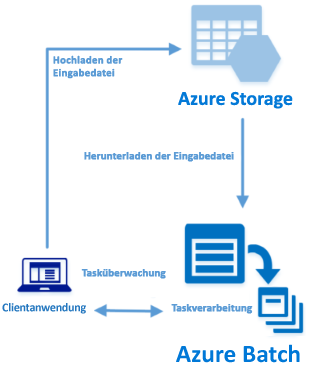

# <a name="quickstart-run-your-first-batch-job-with-the-python-api"></a>Schnellstart: Ausführen Ihres ersten Batch-Auftrags mit der Python-API

In dieser Schnellstartanleitung wird ein Azure Batch-Auftrag über eine Anwendung ausgeführt, die auf der Azure Batch Python-API basiert. Die App lädt einige Eingabedatendateien in den Azure-Speicher und erstellt anschließend einen *Pool* mit Batch-Computeknoten (virtuelle Computer). Als Nächstes wird ein Beispiel für einen *Auftrag* erstellt, mit dem *Aufgaben* ausgeführt werden, um die einzelnen Eingabedateien im Pool mit einem einfachen Befehl zu verarbeiten. Nach Abschluss dieser Schnellstartanleitung sind Sie mit den wichtigsten Konzepten des Batch-Diensts vertraut und können Batch mit realistischeren Workloads und in größerem Umfang ausprobieren.
 


[!INCLUDE [quickstarts-free-trial-note.md](../../includes/quickstarts-free-trial-note.md)]

## <a name="prerequisites"></a>Voraussetzungen

* [Python-Version 2.7 oder 3.3 oder höher](https://www.python.org/downloads/)

* [pip](https://pip.pypa.io/en/stable/installing/)-Paket-Manager

* Ein Azure Batch-Konto und ein verknüpftes Azure Storage-Konto. Informationen zur Erstellung dieser Konten finden Sie in den Batch-Schnellstartanleitungen zum [Azure-Portal](quick-create-portal.md) und zur [Azure CLI](quick-create-cli.md). 

## <a name="sign-in-to-azure"></a>Anmelden bei Azure

Melden Sie sich unter [https://portal.azure.com](https://portal.azure.com) beim Azure-Portal an.

[!INCLUDE [batch-common-credentials](../../includes/batch-common-credentials.md)]

## <a name="download-the-sample"></a>Herunterladen des Beispiels

[Laden Sie die Beispiel-App von GitHub herunter, oder klonen Sie sie](https://github.com/Azure-Samples/batch-python-quickstart). Verwenden Sie den folgenden Befehl, um das Beispiel-App-Repository mit einem Git-Client zu klonen:

```
git clone https://github.com/Azure-Samples/batch-python-quickstart.git
```

Navigieren Sie zum Verzeichnis, in dem das Python-Skript `python_quickstart_client.py` enthalten ist.

Installieren Sie in Ihrer Python-Entwicklungsumgebung die erforderlichen Pakete mit `pip`.

```bash
pip install -r requirements.txt
```

Öffnen Sie die Datei `python_quickstart_client.py`. Aktualisieren Sie die Zeichenfolgen mit den Anmeldeinformationen für das Batch- und Storage-Konto, die für Ihre Konten gelten. Beispiel: 


```Python
_BATCH_ACCOUNT_NAME = 'mybatchaccount'
_BATCH_ACCOUNT_KEY = 'xxxxxxxxxxxxxxxxE+yXrRvJAqT9BlXwwo1CwF+SwAYOxxxxxxxxxxxxxxxx43pXi/gdiATkvbpLRl3x14pcEQ=='
_BATCH_ACCOUNT_URL = 'https://mybatchaccount.mybatchregion.batch.azure.com'
_STORAGE_ACCOUNT_NAME = 'mystorageaccount'
_STORAGE_ACCOUNT_KEY = 'xxxxxxxxxxxxxxxxy4/xxxxxxxxxxxxxxxxfwpbIC5aAWA8wDu+AFXZB827Mt9lybZB1nUcQbQiUrkPtilK5BQ=='
```

## <a name="run-the-app"></a>Ausführen der App

Führen Sie das folgende Skript aus, um den Batch-Workflow in Aktion zu erleben:

```
python python_quickstart_client.py
```

Sehen Sie sich nach dem Ausführen des Skripts den Code an, um zu erfahren, welche Aufgabe die einzelnen Teile der Anwendung jeweils haben. 

Beim Ausführen der Beispielanwendung sieht die Konsolenausgabe in etwa wie folgt aus: Bei der Ausführung kommt es bei `Monitoring all tasks for 'Completed' state, timeout in 00:30:00...` zu einer Pause, während die Computeknoten des Pools gestartet werden. Die Aufgaben werden in die Warteschlange eingereiht und dann ausgeführt, sobald der erste Computeknoten aktiv ist. Navigieren Sie im [Azure-Portal](https://portal.azure.com) zu Ihrem Batch-Konto, um den Pool, die Computeknoten, den Auftrag und die Aufgaben in Ihrem Batch-Konto zu überwachen.

```
Sample start: 12/4/2017 4:02:54 PM

Container [input] created.
Uploading file taskdata0.txt to container [input]...
Uploading file taskdata1.txt to container [input]...
Uploading file taskdata2.txt to container [input]...
Creating pool [PythonQuickstartPool]...
Creating job [PythonQuickstartJob]...
Adding 3 tasks to job [PythonQuickstartJob]...
Monitoring all tasks for 'Completed' state, timeout in 00:30:00...
```

Nach Abschluss der einzelnen Aufgaben wird dazu jeweils die Ausgabe angezeigt, die in etwa wie folgt aussieht:

```
Printing task output...
Task: Task0
Node: tvm-2850684224_3-20171205t000401z
Standard out:
Batch processing began with mainframe computers and punch cards. Today it still plays a central role in business, engineering, science, and other pursuits that require running lots of automated tasks....
...
```

Die normale Ausführungsdauer beträgt ca. drei Minuten, wenn die Anwendung in der Standardkonfiguration ausgeführt wird. Am meisten Zeit nimmt die anfängliche Einrichtung des Pools ein.

## <a name="review-the-code"></a>Überprüfen des Codes

Mit der Python-App in dieser Schnellstartanleitung werden folgende Schritte ausgeführt:

* Es werden drei kleine Textdateien in einen Blobcontainer in Ihrem Azure-Speicherkonto hochgeladen. Diese Dateien dienen als Eingaben für die Verarbeitung mit Batch-Aufgaben.
* Es wird ein Pool mit zwei Computeknoten erstellt, auf denen Ubuntu 16.04 LTS ausgeführt wird.
* Es werden ein Auftrag und drei Aufgaben für die Ausführung auf den Knoten erstellt. Jede Aufgabe verarbeitet eine der Eingabedateien über eine Befehlszeile der Bash-Shell.
* Es werden die von den Aufgaben zurückgegebenen Dateien angezeigt.

Ausführliche Informationen finden Sie in der Datei `python_quickstart_client.py` und in den folgenden Abschnitten. 

### <a name="preliminaries"></a>Vorbereitende Maßnahmen

Für die Interaktion mit einem Speicherkonto verwendet die App das Paket [azure-storage-blob](https://pypi.python.org/pypi/azure-storage-blob) zum Erstellen eines [BlockBlobService](/python/api/azure.storage.blob.blockblobservice.blockblobservice)-Objekts.

```python
blob_client = azureblob.BlockBlobService(
    account_name=_STORAGE_ACCOUNT_NAME,
    account_key=_STORAGE_ACCOUNT_KEY)
```

Die App verwendet den `blob_client`-Verweis, um im Speicherkonto einen Container zu erstellen und Datendateien in den Container hochzuladen. Die Dateien im Speicher werden als Batch-[ResourceFile](/python/api/azure.batch.models.resourcefile)-Objekte definiert, die von Batch später auf Computeknoten heruntergeladen werden können.

```python
input_file_paths = [os.path.realpath('./data/taskdata0.txt'),
                    os.path.realpath('./data/taskdata1.txt'),
                    os.path.realpath('./data/taskdata2.txt')]
input_files = [
    upload_file_to_container(blob_client, input_container_name, file_path)
    for file_path in input_file_paths]
```

Die App erstellt ein [BatchServiceClient](/python/api/azure.batch.batchserviceclient)-Objekt zum Erstellen und Verwalten von Pools, Aufträgen und Aufgaben im Batch-Dienst. Für den Batch-Client im Beispiel wird die Authentifizierung mit gemeinsam verwendetem Schlüssel genutzt. Batch unterstützt auch die Azure Active Directory-Authentifizierung.

```python
credentials = batchauth.SharedKeyCredentials(_BATCH_ACCOUNT_NAME,
    BATCH_ACCOUNT_KEY)

batch_client = batch.BatchServiceClient(
    credentials,
    base_url=_BATCH_ACCOUNT_URL)
```


### <a name="create-a-pool-of-compute-nodes"></a>Erstellen eines Pools mit Computeknoten

Zum Erstellen eines Batch-Pools verwendet die App die [PoolAddParameter](/python/api/azure.batch.models.pooladdparameter)-Klasse, um die Anzahl von Knoten, die VM-Größe und eine Poolkonfiguration festzulegen. Hier gibt ein [VirtualMachineConfiguration](/python/api/azure.batch.models.virtualmachineconfiguration)-Objekt einen [ImageReference](/python/api/azure.batch.models.imagereference)-Verweis auf ein Ubuntu Server 16.04 LTS-Image an, das im Azure Marketplace veröffentlicht wurde. Batch unterstützt viele verschiedene Linux- und Windows Server-Images im Azure Marketplace und außerdem benutzerdefinierte VM-Images.

Die Anzahl von Knoten (`_POOL_NODE_COUNT`) und die VM-Größe (`_POOL_VM_SIZE`) sind definierte Konstanten. Im Beispiel wird standardmäßig ein Pool mit zwei Knoten der Größe *Standard_A1_v2* erstellt. Die vorgeschlagene Größe bietet für dieses kurze Beispiel eine gute Balance zwischen Leistung und Kosten.

Mit der [pool.add](/python/api/azure.batch.operations.pooloperations#azure_batch_operations_PoolOperations_add)-Methode wird der Pool an den Batch-Dienst übermittelt.

```python
new_pool = batch.models.PoolAddParameter(
    id=pool_id,
    virtual_machine_configuration=batchmodels.VirtualMachineConfiguration(
        image_reference=batchmodels.ImageReference(
            publisher="Canonical",
            offer="UbuntuServer",
            sku="16.04-LTS",
            version="latest"
            ),
        node_agent_sku_id="batch.node.ubuntu 16.04"),
    vm_size=_POOL_VM_SIZE,
    target_dedicated_nodes=_POOL_NODE_COUNT
)
batch_service_client.pool.add(new_pool)
```

### <a name="create-a-batch-job"></a>Erstellen eines Batch-Auftrags

Ein Batch-Auftrag ist eine logische Gruppierung für eine oder mehrere Aufgaben. Ein Auftrag enthält gemeinsame Einstellungen für Aufgaben, z.B. die Priorität und den Pool zum Ausführen von Aufgaben. Die App verwendet die [JobAddParameter](/python/api/azure.batch.models.jobaddparameter)-Klasse, um in Ihrem Pool einen Auftrag zu erstellen. Mit der [job.add](/python/api/azure.batch.operations.joboperations#azure_batch_operations_JobOperations_add)-Methode wird der Pool an den Batch-Dienst übermittelt. Der Auftrag enthält ursprünglich keine Aufgaben.

```python
job = batch.models.JobAddParameter(
    job_id,
    batch.models.PoolInformation(pool_id=pool_id))
batch_service_client.job.add(job)
```

### <a name="create-tasks"></a>Erstellen von Aufgaben

Die App erstellt eine Liste mit Aufgabenobjekten, indem die [TaskAddParameter](/python/api/azure.batch.models.taskaddparameter)-Klasse verwendet wird. Jede Aufgabe verarbeitet ein `resource_files`-Eingabeobjekt, indem ein `command_line`-Parameter verwendet wird. Im Beispiel führt die Befehlszeile den Bash-Shellbefehl `cat` aus, um die Textdatei anzuzeigen. Dieser Befehl ist ein einfaches Beispiel für Demonstrationszwecke. Bei Verwendung von Batch befindet sich die Befehlszeile dort, wo Sie Ihre App bzw. Ihr Skript angeben. In Batch gibt es mehrere Möglichkeiten, Apps und Skripts auf Computeknoten bereitzustellen.

Anschließend werden dem Auftrag von der App mit der [task.add_collection](/python/api/azure.batch.operations.taskoperations#azure_batch_operations_TaskOperations_add_collection)-Methode Aufgaben hinzugefügt und für die Ausführung auf den Computeknoten in die Warteschlange eingereiht. 

```python
tasks = list()

for idx, input_file in enumerate(input_files): 
    command = "/bin/bash -c \"cat {}\"".format(input_file.file_path)
    tasks.append(batch.models.TaskAddParameter(
        id='Task{}'.format(idx),
        command_line=command,
        resource_files=[input_file]
    )
)
batch_service_client.task.add_collection(job_id, tasks)
```

### <a name="view-task-output"></a>Anzeigen der Aufgabenausgabe

Die App überwacht den Aufgabenstatus, um sicherzustellen, dass die Aufgaben abgeschlossen werden. Anschließend zeigt die App die Datei `stdout.txt` an, die für jede abgeschlossene Aufgabe generiert wird. Wenn die Aufgabe erfolgreich ausgeführt wurde, wird die Ausgabe des Aufgabenbefehls in `stdout.txt` geschrieben:

```python
tasks = batch_service_client.task.list(job_id)

for task in tasks:
    
    node_id = batch_service_client.task.get(job_id, task.id).node_info.node_id
    print("Task: {}".format(task.id))
    print("Node: {}".format(node_id))

    stream = batch_service_client.file.get_from_task(job_id, task.id, _STANDARD_OUT_FILE_NAME)

    file_text = _read_stream_as_string(
        stream,
        encoding)
    print("Standard output:")
    print(file_text)
```

## <a name="clean-up-resources"></a>Bereinigen von Ressourcen

Von der App wird der erstellte Speichercontainer automatisch gelöscht, und Sie erhalten die Möglichkeit, den Batch-Pool und -Auftrag zu löschen. Ihnen werden während der Ausführung der Knoten auch dann Gebühren für den Pool berechnet, wenn keine Aufträge geplant sind. Es ist ratsam, den Pool zu löschen, wenn Sie ihn nicht mehr benötigen. Beim Löschen des Pools werden alle Aufgabenausgaben auf den Knoten gelöscht. 

Löschen Sie die Ressourcengruppe, das Batch-Konto und das Speicherkonto, wenn diese Elemente nicht mehr benötigt werden. Wählen Sie hierzu im Azure-Portal die Ressourcengruppe für das Batch-Konto aus, und klicken Sie auf **Ressourcengruppe löschen**.

## <a name="next-steps"></a>Nächste Schritte

In dieser Schnellstartanleitung haben Sie eine kleine App ausgeführt, indem Sie die Batch Python-API verwendet haben, um einen Batch-Pool und einen Batch-Auftrag zu erstellen. Im Auftrag wurden Beispielaufgaben ausgeführt, und es wurde die auf den Knoten erstellte Ausgabe heruntergeladen. Da Sie sich jetzt mit den wichtigsten Konzepten des Batch-Diensts vertraut gemacht haben, können Sie Batch mit realistischeren Workloads und in größerem Umfang ausprobieren. Fahren Sie mit dem Batch Python-Tutorial fort, um weitere Informationen zu Azure Batch und eine Schritt-für-Schritt-Anleitung zu einer parallelen Workload mit einer Anwendung aus der Praxis zu erhalten.

> [!div class="nextstepaction"]
> [Tutorial: Run a parallel workload with Azure Batch using the Python API](tutorial-parallel-python.md) (Tutorial: Ausführen einer parallelen Workload mit Azure Batch per Python-API)
