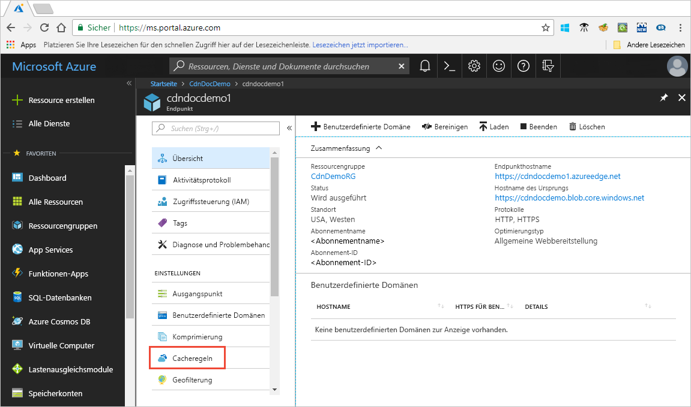

# Steuern des Azure CDN-Zwischenspeicherverhaltens mit Cacheregeln

> [!NOTE] 
> Cacheregeln sind nur für die Profile **Azure CDN Standard von Verizon** und **Azure CDN Standard von Akamai** verfügbar. Bei **Azure CDN Premium von Verizon** können Sie die [Azure CDN-Regel-Engine](cdn-rules-engine.md) im **Verwaltungsportal** verwenden, um eine ähnliche Funktionalität zu erzielen.
 
Azure Content Delivery Network (CDN) bietet zwei Möglichkeiten, um zu steuern, wie Ihre Dateien zwischengespeichert werden: 

- Cacheregeln: In diesem Artikel wird beschrieben, wie Sie anhand von CDN-Cacheregeln (Content Delivery Network) das Standardverhalten bei Cacheablauf sowohl global als auch mit benutzerdefinierten Bedingungen (z.B. URL-Pfad und Dateierweiterungen) festlegen oder ändern können. Azure CDN bietet zwei Arten von Cacheregeln:
   - Globale Cacheregeln: Sie können für jeden Endpunkt in Ihrem Profil eine globale Cacheregel festlegen, die sich auf alle Anforderungen an den Endpunkt auswirkt. Die globale Cacheregel überschreibt alle HTTP-Header mit Cacheanweisungen, sofern solche festgelegt wurden.
   - Benutzerdefinierte Cacheregeln: Sie können für jeden Endpunkt in Ihrem Profil eine oder mehrere benutzerdefinierte Cacheregeln festlegen. Benutzerdefinierte Cacheregeln, die mit bestimmten Pfaden und Dateierweiterungen übereinstimmen, werden nacheinander verarbeitet und überschreiben die globale Cacheregel, sofern eine solche festgelegt wurde. 

- Zwischenspeichern von Abfragezeichenfolgen: Sie können festlegen, wie das Azure CDN die Zwischenspeicherung von Anforderungen mit Abfragezeichenfolgen behandelt. Weitere Informationen finden Sie unter [Steuern des Azure Content Delivery Network-Zwischenspeicherverhaltens mit Abfragezeichenfolgen](cdn-query-string.md). Wenn die Datei nicht zwischengespeichert werden kann, hat die Einstellung für die Zwischenspeicherung von Abfragezeichenfolgen basierend auf Cacheregeln und CDN-Standardverhalten keine Auswirkungen.

Informationen zum Standardverhalten beim Zwischenspeichern und die Header mit Cacheanweisungen finden Sie unter [Funktionsweise der Zwischenspeicherung](cdn-how-caching-works.md).

## Tutorial

So legen Sie CDN-Cacheregeln fest

1. Öffnen Sie das Azure-Portal, und wählen Sie ein CDN-Profil sowie einen Endpunkt aus.
2. Wählen Sie im linken Bereich unter „Einstellungen“ die Option **Cacheregeln** aus.

   

3. Erstellen Sie wie folgt eine globale Cacheregel:
   1. Legen Sie unter **Globale Cacheregeln** die Option **Verhalten für das Zwischenspeichern von Abfragezeichenfolgen** auf **Abfragezeichenfolgen ignorieren** fest.
   2. Legen Sie **Verhalten beim Zwischenspeichern** auf **Bei Fehlen festlegen**.
       
   3. Geben Sie unter **Dauer bis Cacheablauf** in das Feld **Tage** die Zahl „10“ ein.

       Die globale Cacheregel wirkt sich auf alle Anforderungen an den Endpunkt aus. Diese Regel berücksichtigt die Ursprungsheader mit Cacheanweisungen, sofern diese vorhanden sind (`Cache-Control` oder `Expires`). Wenn diese nicht angegeben sind, wird der Cache auf 10 Tage festgelegt. 

     

4. Erstellen Sie wie folgt eine benutzerdefinierte Cacheregel:
    1. Legen Sie unter **Benutzerdefinierte Cacheregeln** die Option **Übereinstimmungsbedingung** auf **Pfad** und **Übereinstimmungswert** auf `/images/*.jpg` fest.
    2. Legen Sie **Verhalten beim Zwischenspeichern** auf **Überschreiben** fest, und geben Sie „30“ in das Feld **Tage** ein.
       
       Diese benutzerdefinierte Cacheregel legt für alle Bilddateien mit der Erweiterung `.jpg` im Ordner `/images` Ihres Endpunkts eine Cachedauer von 30 Tagen fest. Er überschreibt alle `Cache-Control`- oder `Expires`-HTTP-Header, die vom Ursprungsserver gesendet werden.

    

    
> [!NOTE] 
> Bei Dateien, die vor einer Regeländerung zwischengespeichert werden, wird die Cachedauereinstellung des Ursprungs beibehalten. Um die Cachedauer zurückzusetzen, müssen Sie [die Datei bereinigen](cdn-purge-endpoint.md). Bei Endpunkten vom **Azure CDN von Verizon** kann es bis zu 90 Minuten dauern, bis die Cacheregeln wirksam werden.

## Verweis

### Einstellungen für das Verhalten beim Zwischenspeichern
Für globale und benutzerdefinierte Cacheregeln können Sie die folgenden Einstellungen für **Verhalten beim Zwischenspeichern** festlegen:

- **Cache umgehen**: Die vom Ursprung angegebenen Header mit Cacheanweisungen werden nicht zwischengespeichert und ignoriert.
- **Überschreiben**: Die vom Ursprung angegebenen Header mit Cacheanweisungen werden ignoriert und stattdessen wird die angegebene Cachedauer verwendet.
- **Bei Fehlen festlegen**: Die vom Ursprung angegebenen Header mit Cacheanweisungen werden berücksichtigt, sofern diese vorhanden sind. Anderenfalls wird die angegebene Cachedauer verwendet.

### Dauer bis Cacheablauf
Bei globalen und benutzerdefinierten Cacheregeln können Sie die Dauer bis zum Cacheablauf in Tagen, Stunden, Minuten und Sekunden angeben:

- Für die Optionen **Überschreiben** und **Bei Fehlen festlegen** in den Einstellungen **Verhalten beim Zwischenspeichern** liegt der gültige Bereich der Cachedauer zwischen 0 Sekunden und 366 Tagen. Bei einem Wert von 0 Sekunden speichert das CDN den Inhalt im Cache, muss jedoch jede Anforderung mit dem Ursprungsserver erneut überprüfen.
- Bei der Einstellung **Cache umgehen** wird die Cachedauer automatisch auf 0 Sekunden gesetzt und kann nicht geändert werden.

### Benutzerdefinierte Cacheregeln basierend auf Bedingungen

Für benutzerdefinierte Cacheregeln sind zwei Übereinstimmungsbedingungen verfügbar:
 
- **Pfad**: Diese Bedingung entspricht dem Pfad der URL, ausgenommen des Domänennamens, und unterstützt das Platzhaltersymbol (\*). Beispiel: `/myfile.html`, `/my/folder/*` und `/my/images/*.jpg`. Die maximale Länge beträgt 260 Zeichen.

- **Erweiterung**: Diese Bedingung entspricht der Dateierweiterung der angeforderten Datei. Sie können eine Liste von durch Trennzeichen getrennten Dateierweiterungen angeben. Beispiel: `.jpg`, `.mp3` oder `.png`. Die maximale Anzahl der Erweiterungen beträgt 50 und die maximale Anzahl der Zeichen pro Erweiterung 16. 

### Reihenfolge der Verarbeitung von globalen und benutzerdefinierten Regeln
Globale und benutzerdefinierte Cacheregeln werden in der folgenden Reihenfolge verarbeitet:

- Globale Cacheregeln haben gegenüber dem Standardverhalten beim Zwischenspeichern im CDN Vorrang (Einstellungen für HTTP-Header mit Cacheanweisungen). 

- Benutzerdefinierte Cacheregeln haben gegenüber globalen Cacheregeln Vorrang, sofern diese anwendbar sind. Benutzerdefinierte Cacheregeln werden in der Reihenfolge von oben nach unten verarbeitet. Dies bedeutet, wenn eine Anforderung beide Bedingungen erfüllt, haben Regeln ganz unten in der Liste Vorrang gegenüber Regeln am Anfang der Liste. Aus diesem Grund sollten Sie spezifischere Regeln weiter unten in der Liste platzieren.

**Beispiel**:
- Globale Cacheregel: 
   - Verhalten beim Zwischenspeichern: **Überschreiben**
   - Dauer bis Cacheablauf: 1 Tag

- Benutzerdefinierte Cacheregel 1:
   - Übereinstimmungsbedingung: **Pfad**
   - Übereinstimmungswert: `/home/*`
   - Verhalten beim Zwischenspeichern: **Überschreiben**
   - Dauer bis Cacheablauf: 2 Tage

- Benutzerdefinierte Cacheregel 2:
   - Übereinstimmungsbedingung: **Erweiterung**
   - Übereinstimmungswert: `.html`
   - Verhalten beim Zwischenspeichern: **Bei Fehlen festlegen**
   - Dauer bis Cacheablauf: 3 Tage

Wenn diese Regeln festgelegt sind, löst eine Anforderung für `<endpoint>.azureedge.net/home/index.html` die benutzerdefinierte Cacheregel 2 aus, die auf **Bei Fehlen festlegen** und „3 Tage“ festgelegt ist. Enthält die Datei `index.html` daher die HTTP-Header `Cache-Control` oder `Expires`, werden sie berücksichtigt. Sind diese Header nicht festgelegt, wird die Datei 3 Tage lang zwischengespeichert.

