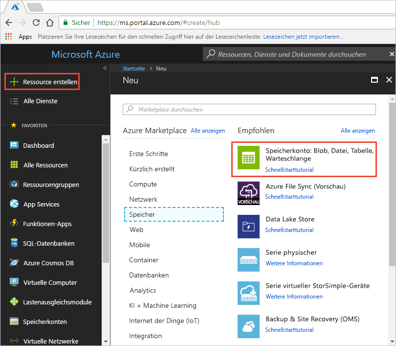
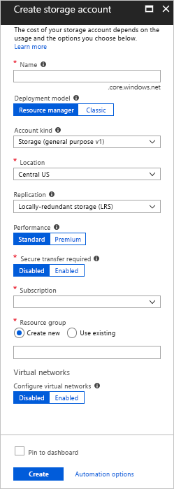
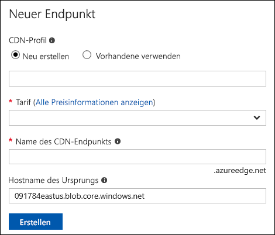
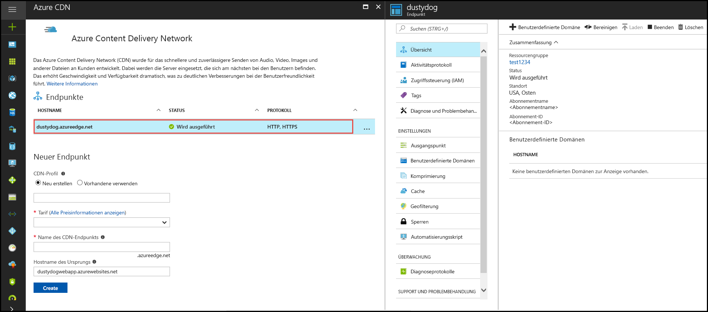

# Schnellstart: Integrieren eines Azure-Speicherkontos in Azure CDN
In dieser Schnellstartanleitung aktivieren Sie das [Azure Content Delivery Network (CDN)](cdn-overview.md) für die Zwischenspeicherung von Inhalten aus Azure Storage. Azure CDN bietet Entwicklern eine globale Lösung für die Übermittlung von Inhalten mit hoher Bandbreite. Sie können Blobs und statische Inhalte von Compute-Instanzen auf physischen Knoten in den USA, Europa, Asien, Australien und Südamerika zwischenspeichern.

[!INCLUDE [quickstarts-free-trial-note](../../includes/quickstarts-free-trial-note.md)]

## Anmelden beim Azure-Portal
Melden Sie sich mit Ihrem Azure-Konto beim [Azure-Portal](https://portal.azure.com) an.

## Speicherkonto erstellen
Gehen Sie folgendermaßen vor, um für ein Azure-Abonnement ein neues Speicherkonto zu erstellen. Ein Speicherkonto ermöglicht den Zugriff auf Azure Storage-Dienste. Das Speicherkonto stellt die höchste Ebene des Namespace für den Zugriff auf die verschiedenen Komponenten des Azure Storage-Diensts dar: Azure Blob Storage, Queue Storage und Table Storage. Weitere Informationen finden Sie unter [Einführung in Microsoft Azure Storage](../storage/common/storage-introduction.md).

Um ein Speicherkonto zu erstellen, müssen Sie entweder der Dienstadministrator oder ein Co-Administrator für das zugehörige Abonnement sein.

Es gibt mehrere Methoden zum Erstellen eines Speicherkontos, einschließlich Azure-Portal und PowerShell. In dieser Schnellstartanleitung wird das Azure-Portal verwendet.   

**So erstellen Sie ein Speicherkonto für ein Azure-Abonnement**

1. Klicken Sie links oben im Azure-Portal auf **Ressource erstellen**. 

    Der Bereich **Neu** wird angezeigt.

2. Wählen Sie die Option **Speicher** und anschließend **Speicherkonto – Blob, Datei, Tabelle, Warteschlange** aus.
    
    

    Der Bereich **Speicherkonto erstellen** wird angezeigt.   

    

3. Geben Sie im Feld **Name** einen Unterdomänennamen ein. Dieser Eintrag kann 3 bis 24 Kleinbuchstaben und Zahlen enthalten.
   
    Dieser Wert wird der Hostname im URI, der zum Adressieren von Blob-, Warteschlangen- oder Tabellenressourcen für das Abonnement verwendet wird. Um auf eine Containerressource in Blob Storage zu verweisen, verwenden Sie einen URI im folgenden Format:
   
    http://*&lt;Speicherkontobezeichnung&gt;*.blob.core.windows.net/*&lt;MeinContainer&gt;*

    Dabei ist *&lt;StorageAccountLabel&gt;* der Wert, die Sie im Feld **Name** eingegeben haben.
   
    > [!IMPORTANT]    
    > Die URL-Bezeichnung bildet die Unterdomäne des Speicherkonto-URI und muss unter allen gehosteten Diensten in Azure eindeutig sein.
   
    Dieser Wert wird auch als Name für das Speicherkonto im Portal oder beim programmgesteuerten Zugriff auf dieses Konto verwendet.
    
4. Verwenden Sie für die restlichen Einstellungen die Werte aus der folgenden Tabelle:

    | Einstellung  | Wert |
    | -------- | ----- |
    | **Bereitstellungsmodell** | Verwenden Sie den Standardwert. |
    | **Kontoart** | Verwenden Sie den Standardwert. |
    | **Location**    | Wählen Sie in der Dropdownliste die Option **USA, Mitte** aus. |
    | **Replikation** | Verwenden Sie den Standardwert. |
    | **Leistung** | Verwenden Sie den Standardwert. |
    | **Sichere Übertragung erforderlich** | Verwenden Sie den Standardwert. |
    | **Abonnement** | Wählen Sie in der Dropdownliste ein Azure-Abonnement aus. |
    | **Ressourcengruppe** | Klicken Sie auf **Neu erstellen**, und geben Sie *my-resource-group-123* als Ressourcengruppennamen ein. Dieser Name muss global eindeutig sein. Sollte er bereits verwendet werden, können Sie die Option **Vorhandenes Element verwenden** und anschließend **my-resource-group-123** in der Dropdownliste auswählen.  Informationen zu Ressourcengruppen finden Sie unter [Übersicht über den Azure Resource Manager](../azure-resource-manager/resource-group-overview.md#resource-groups).| 
    | **Konfigurieren virtueller Netzwerke** | Verwenden Sie den Standardwert. |  
    
5. Aktivieren Sie das Kontrollkästchen **An Dashboard anheften**, um das Speicherkonto in Ihrem Dashboard zu speichern.
    
6. Klicken Sie auf **Erstellen**. Die Erstellung des Speicherkontos kann einige Minuten dauern.

## Aktivieren von Azure CDN für das Speicherkonto

Sie können Azure CDN direkt über Ihr Speicherkonto für Ihr Speicherkonto aktivieren. Wenn Sie erweiterte Konfigurationseinstellungen (etwa den Optimierungstyp) für den CDN-Endpunkt angeben möchten, können Sie stattdessen die [Azure CDN-Erweiterung](cdn-create-new-endpoint.md) verwenden, um ein CDN-Profil oder einen CDN-Endpunkt zu erstellen.

1. Wählen Sie über das Dashboard ein Speicherkonto und dann im linken Bereich **Azure CDN** aus. Wenn die Schaltfläche **Azure CDN** nicht sofort angezeigt wird, können Sie im Feld **Suchen** im linken Bereich „CDN“ eingeben, um danach zu suchen.
    
    Die Seite **Azure CDN** wird angezeigt.

    
    
2. Erstellen Sie einen neuen Endpunkt, indem Sie die erforderlichen Informationen aus der folgenden Tabelle angeben:

    | Einstellung  | Wert |
    | -------- | ----- |
    | **CDN-Profil** | Klicken Sie auf **Neu erstellen**, und geben Sie *my-cdn-profile-123* als Profilname ein. Dieser Name muss global eindeutig sein. Sollte er bereits verwendet werden, können Sie einen anderen Namen eingeben.  |
    | **Preisstufe** | Wählen Sie in der Dropdownliste die Option **Verizon Standard** aus. |
    | **CDN-Endpunktname** | Geben Sie *my-endpoint-123* als Endpunkthostname ein. Dieser Name muss global eindeutig sein. Sollte er bereits verwendet werden, können Sie einen anderen Namen eingeben. Dieser Name wird für den Zugriff auf Ihre zwischengespeicherten Ressourcen in der Domäne _&lt;Endpunktname&gt;_.azureedge.net verwendet. Für einen neuen CDN-Endpunkt wird standardmäßig der Hostname Ihres Speicherkontos als Ursprungsserver verwendet.|

3. Klicken Sie auf **Erstellen**. Der erstellte Endpunkt wird in der Liste mit den Endpunkten angezeigt.

    

## Aktivieren weiterer CDN-Features
Wählen Sie in der Liste auf der Seite **Azure CDN** des Speicherkontos den CDN-Endpunkt aus, um die Seite mit der CDN-Endpunktkonfiguration zu öffnen. Auf dieser Seite können Sie weitere CDN-Features für Ihre Übertragung aktivieren (beispielsweise [Komprimierung](cdn-improve-performance.md), [Zwischenspeicherung von Abfragezeichenfolgen](cdn-query-string.md) und [Geofilterung](cdn-restrict-access-by-country.md)). 
    

## Zugreifen auf CDN-Inhalte
Verwenden Sie für den Zugriff auf die im CDN zwischengespeicherten Inhalte den im Portal bereitgestellten CDN-URL. Die Adresse eines zwischengespeicherten Blobs hat das folgende Format:

http://<*Endpunktname*\>.azureedge.net/<*meinÖffentlicherContainer*\>/<*Blobname*\>

> [!NOTE]
> Nachdem Sie den Azure CDN-Zugriff auf ein Speicherkonto aktiviert haben, kann die CDN-POP-Zwischenspeicherung für alle öffentlich verfügbaren Objekte verwendet werden. Wenn Sie ein Objekt ändern, das gerade im CDN zwischengespeichert ist, stehen die neuen Inhalte erst dann über Azure CDN zur Verfügung, wenn Azure CDN die Inhalte aktualisiert. Dies erfolgt nach Ablauf der Lebensdauer der zwischengespeicherten Inhalte.

## Entfernen von Inhalten aus Azure CDN
Wenn ein Objekt nicht mehr in Azure CDN zwischengespeichert werden soll, können Sie einen der folgenden Schritte ausführen:

* Legen Sie den öffentlichen Container als privat fest. Weitere Informationen finden Sie unter [Verwalten des anonymen Lesezugriffs auf Container und Blobs](../storage/blobs/storage-manage-access-to-resources.md).
* Deaktivieren oder löschen Sie den CDN-Endpunkt mit dem Azure-Portal.
* Ändern Sie den gehosteten Dienst so, dass er nicht mehr auf Anforderungen für das Objekt antwortet.

Ein bereits in Azure CDN zwischengespeichertes Objekt bleibt zwischengespeichert, bis die Lebensdauer des Objekts abgelaufen ist oder der Endpunkt [gelöscht](cdn-purge-endpoint.md) wird. Wenn die Lebensdauer abläuft, bestimmt Azure CDN, ob der CDN-Endpunkt weiterhin gültig ist und ob weiterhin anonym auf das Objekt zugegriffen werden kann. Ist dies nicht der Fall, wird das Objekt nicht mehr zwischengespeichert.

## Bereinigen von Ressourcen
In den vorherigen Schritten haben Sie ein CDN-Profil und einen Endpunkt in einer Ressourcengruppe erstellt. Speichern Sie diese Ressourcen, falls Sie die [nächsten Schritte](#next-steps) ausführen und erfahren möchten, wie Sie Ihrem Endpunkt eine benutzerdefinierte Domäne hinzufügen. Sollten Sie die Ressourcen dagegen nicht mehr benötigen, können Sie die Ressourcengruppe mit den Ressourcen löschen, um weitere Kosten zu vermeiden:

1. Klicken Sie im Azure-Portal im Menü auf der linken Seite auf **Ressourcengruppen** und anschließend auf **my-resource-group-123**.

2. Klicken Sie auf der Seite **Ressourcengruppe** auf **Ressourcengruppe löschen**, geben Sie *my-resource-group-123* in das Textfeld ein, und klicken Sie anschließend auf **Löschen**.

    Dadurch werden die Ressourcengruppe, das Profil und der Endpunkt gelöscht, die Sie im Rahmen dieser Schnellstartanleitung erstellt haben.

3. Wenn Sie Ihr Speicherkonto löschen möchten, wählen Sie es über das Dashboard aus, und klicken Sie anschließend im oberen Menü auf **Löschen**.

## Nächste Schritte
Im folgenden Tutorial erfahren Sie, wie Sie Ihrem CDN-Endpunkt eine benutzerdefinierte Domäne hinzufügen:

> [!div class="nextstepaction"]
> [Tutorial: Hinzufügen einer benutzerdefinierten Domäne zum Azure CDN-Endpunkt](cdn-map-content-to-custom-domain.md)

