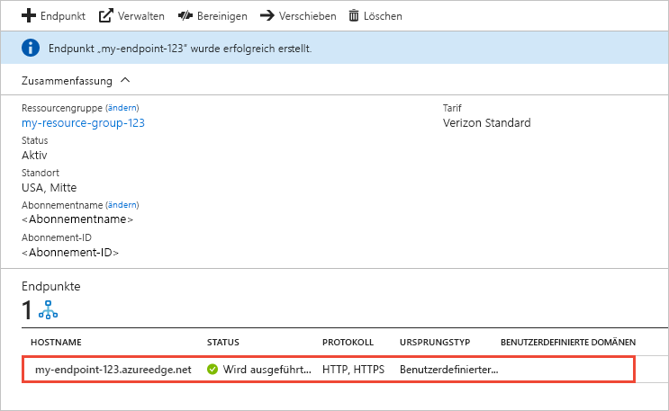

# Erstellen eines Azure CDN-Endpunkts
In diesem Artikel werden alle Einstellungen zum Erstellen eines [Azure Content Delivery Network (CDN)](cdn-overview.md)-Endpunkts in einem vorhandenen CDN-Profil beschrieben. Nach der Erstellung eines Profils und eines Endpunkts können Sie mit der Bereitstellung von Inhalten für Ihre Kunden beginnen. Eine Schnellstartanleitung zum Erstellen eines Profils und-Endpunkts finden Sie unter [Schnellstart: Erstellen eines Azure CDN-Profils und-Endpunkts](cdn-create-new-endpoint.md).

## Voraussetzungen
Bevor Sie einen CDN-Endpunkt erstellen können, müssen Sie mindestens ein CDN-Profil erstellt haben, das einen oder mehrere CDN-Endpunkte enthalten kann. Sie können mehrere Profile verwenden, um Ihre CDN-Endpunkte nach Internetdomäne, Webanwendung oder anderen Kriterien zu organisieren. Da die Preise für Azure CDN auf der CDN-Profilebene gelten, müssen Sie mehrere CDN-Profile erstellen, wenn Sie eine Kombination verschiedener Tarife verwenden möchten. Informationen zum Erstellen eines CDN-Profils finden Sie unter [Erstellen eines neuen CDN-Profils](cdn-create-new-endpoint.md#create-a-new-cdn-profile).

## Anmelden beim Azure-Portal
Melden Sie sich mit Ihrem Azure-Konto beim [Azure-Portal](https://portal.azure.com) an.

## Erstellen eines neuen CDN-Endpunkts

1. Navigieren Sie im [Azure-Portal](https://portal.azure.com) zu Ihrem CDN-Profil. Eventuell haben Sie es im vorherigen Schritt an das Dashboard angeheftet. Falls nicht, können Sie darauf zugreifen, indem Sie **Alle Dienste** und dann **CDN-Profile** wählen. Wählen Sie im Bereich **CDN-Profile** das Profil aus, dem Sie Ihren Endpunkt hinzufügen möchten. 
   
    Der Bereich „CDN-Profil“ wird angezeigt.

2. Wählen Sie **Endpunkt**.
   
    
   
    Die Seite **Endpunkt hinzufügen** wird angezeigt.
   
    

3. Geben Sie unter **Name** einen eindeutigen Namen für den neuen CDN-Endpunkt ein. Dieser Name wird für den Zugriff auf Ihre zwischengespeicherten Ressourcen in der Domäne _<endpointname>_.azureedge.net. verwendet.

4. Wählen Sie für **Ursprungstyp** einen der folgenden Ursprungstypen aus: 
   - **Speicher** für Azure Storage
   - **Clouddienst** für Azure Cloud Services
   - **Web-App** für Azure-Web-Apps
   - **Benutzerdefinierter Ursprung** für alle anderen öffentlich zugänglichen Ursprungswebserver (in Azure oder anderswo gehostet)

5. Wählen Sie unter **Hostname des Ursprungs** Ihre Ursprungsserverdomäne aus, oder geben Sie sie ein. In der Dropdownliste werden alle verfügbaren Ursprungsserver des Typs aufgelistet, die Sie in Schritt 4 angegeben haben. Geben Sie die Domäne Ihres benutzerdefinierten Ursprungsservers ein, wenn Sie **Benutzerdefinierter Ursprung** als Ursprungstyp ausgewählt haben.
    
6. Geben Sie für **Ursprungspfad** den Pfad zu den Ressourcen ein, die Sie zwischenspeichern möchten. Wenn Sie das Zwischenspeichern einer beliebigen Ressource in der in Schritt 5 angegebenen Domäne erlauben möchten, lassen Sie diese Einstellung leer.
    
7. Geben Sie unter **Header des Ursprungshosts** den Hostheader ein, den das Azure CDN bei jeder Anforderung senden soll, oder übernehmen Sie den Standardwert.
   
   > [!NOTE]
   > Bei einigen Ursprungstypen wie etwa Azure Storage und Web-Apps muss der Hostheader mit der Domäne des Ursprungs übereinstimmen. Verwenden Sie den Standardwert, es sei denn, Sie nutzen einen Ursprung, bei dem der Hostheader von der Domäne abweichen muss.
   > 
    
8. Geben Sie unter **Protokoll** und **Ursprungsport** die Protokolle und Ports an, über die auf die Ressourcen auf dem Ursprungsserver zugegriffen werden soll. Sie müssen mindestens ein Protokoll (HTTP oder HTTPS) auswählen. Verwenden Sie die vom CDN bereitgestellte Domäne (_<endpointname>_.azureedge.net), um auf HTTPS-Inhalte zuzugreifen. 
   
   > [!NOTE]
   > Mit dem Wert unter **Ursprungsport** wird nur der Port bestimmt, der vom Endpunkt zum Abrufen von Informationen vom Ursprungsserver verwendet wird. Der Endpunkt selbst ist nur für Endclients auf den HTTP- und HTTPS-Standardports (80 und 443) verfügbar, und zwar unabhängig vom Wert unter **Ursprungsport**.  
   > 
   > Für Endpunkte in Profilen vom Typ **Azure CDN von Akamai** wird nicht der vollständige TCP-Portbereich für Ursprungsports zugelassen. Eine Liste der nicht zulässigen Ursprungsports finden Sie unter [Azure CDN from Akamai Allowed Origin Ports](https://msdn.microsoft.com/library/mt757337.aspx)(Azure CDN von Akamai – Zulässige Ursprungsports).  
   > 
   > HTTPS-Support für benutzerdefinierte Azure CDN-Domänen wird bei **Azure CDN von Akamai**-Produkten nicht unterstützt. Weitere Informationen finden Sie unter [Aktivieren oder Deaktivieren von HTTPS in einer benutzerdefinierten Azure Content Delivery Network-Domäne](cdn-custom-ssl.md).
    
9. Wählen Sie bei **Optimiert für** einen Optimierungstyp aus, der am besten zu Ihrem Szenario und zur Art der Inhalte passt, die Sie über den Endpunkt übermitteln möchten. Weitere Informationen finden Sie unter [Optimieren von Azure CDN für den Typ der Inhaltsbereitstellung](cdn-optimization-overview.md).

    Die folgenden Optimierungstypeinstellungen werden entsprechend dem Profiltyp unterstützt:
    - Profile für **Azure CDN Standard von Microsoft**:
       - [**Allgemeine Webbereitstellung**](cdn-optimization-overview.md#general-web-delivery)

    - Profile für **Azure CDN Standard von Verizon** und **Azure CDN Premium von Verizon**:
       - [**Allgemeine Webbereitstellung**](cdn-optimization-overview.md#general-web-delivery)
       - [**Beschleunigung dynamischer Websites**](cdn-optimization-overview.md#dynamic-site-acceleration)

    - Profile für **Azure CDN Standard von Akamai**:
       - [**Allgemeine Webbereitstellung**](cdn-optimization-overview.md#general-web-delivery)
       - [**Allgemeines Medienstreaming**](cdn-optimization-overview.md#general-media-streaming)
       - [**Video on Demand-Medienstreaming**](cdn-optimization-overview.md#video-on-demand-media-streaming)
       - [**Download großer Dateien**](cdn-optimization-overview.md#large-file-download)
       - [**Beschleunigung dynamischer Websites**](cdn-optimization-overview.md#dynamic-site-acceleration)

10. Wählen Sie **Hinzufügen**, um den neuen Endpunkt zu erstellen.
   
    Der erstellte Endpunkt wird in der Liste mit den Endpunkten für das Profil angezeigt.
    
    
    
    Der Endpunkt kann nicht sofort verwendet werden, da die Verteilung der Registrierung über das CDN eine Weile dauern kann: 
    - Bei Profilen vom Typ **Azure CDN Standard von Microsoft** ist die Weitergabe in der Regel in zehn Minuten abgeschlossen. 
    - Bei **Azure CDN Standard von Akamai**-Profilen ist die Weitergabe in der Regel in einer Minute abgeschlossen. 
    - Bei Profilen vom Typ **Azure CDN Standard von Verizon** und **Azure CDN Premium von Verizon** ist die Weitergabe in der Regel in 90 Minuten abgeschlossen. 
   
    Wenn Sie versuchen, den CDN-Domänennamen zu verwenden, bevor die Endpunktkonfiguration an die Point of Presence-Server (POP-Server) verteilt wurde, wird unter Umständen der Antwortstatus „HTTP 404“ angezeigt. Falls Sie auch mehrere Stunden nach Erstellung des Endpunkts weiterhin den Antwortstatus 404 erhalten, lesen Sie [Problembehandlung bei Azure CDN-Endpunkten, die den Statuscode 404 zurückgeben](cdn-troubleshoot-endpoint.md).

## Bereinigen von Ressourcen
Wenn Sie einen nicht mehr benötigten Endpunkt löschen möchten, wählen Sie ihn aus. Wählen Sie dann **Löschen** aus. 

## Nächste Schritte
Wenn Sie etwas zu benutzerdefinierten Domänen erfahren möchten, informieren Sie sich im Tutorial, wie Sie eine benutzerdefinierte Domäne zu Ihrem CDN-Endpunkt hinzufügen.

> [!div class="nextstepaction"]
> [Hinzufügen einer benutzerdefinierten Domäne](cdn-map-content-to-custom-domain.md)

