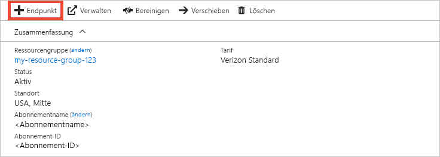
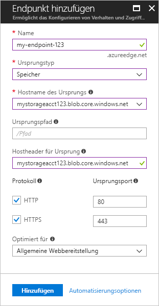

# Schnellstart: Erstellen eines Azure CDN-Profils und -Endpunkts
In dieser Schnellstartanleitung aktivieren Sie Azure Content Delivery Network (CDN), indem Sie ein neues CDN-Profil und einen CDN-Endpunkt erstellen. Nach der Erstellung eines Profils und eines Endpunkts können Sie mit der Bereitstellung von Inhalten für Ihre Kunden beginnen.

[!INCLUDE [quickstarts-free-trial-note](../../includes/quickstarts-free-trial-note.md)]

## Voraussetzungen
Für diese Schnellstartanleitung müssen Sie über ein Speicherkonto namens *mystorageacct123* verfügen. Dieses wird für den Hostnamen des Ursprungs verwendet. Weitere Informationen finden Sie unter [Integrieren eines Azure-Speicherkontos in CDN](cdn-create-a-storage-account-with-cdn.md).

## Anmelden beim Azure-Portal
Melden Sie sich mit Ihrem Azure-Konto beim [Azure-Portal](https://portal.azure.com) an.

[!INCLUDE [cdn-create-profile](../../includes/cdn-create-profile.md)]

## Erstellen eines neuen CDN-Endpunkts

Nachdem Sie ein CDN-Profil erstellt haben, können Sie damit einen Endpunkt erstellen.

1. Wählen Sie auf Ihrem Dashboard im Azure-Portal das erstellte CDN-Profil aus. Sollten Sie es nicht finden, klicken Sie auf **Alle Dienste** und anschließend auf **CDN-Profile**. Wählen Sie auf der Seite **CDN-Profile** das gewünschte Profil aus. 
   
    Die Seite „CDN-Profil“ wird angezeigt.

2. Wählen Sie **Endpunkt**.
   
    
   
    Die Seite **Endpunkt hinzufügen** wird angezeigt.

    Verwenden Sie die Einstellungen aus der Tabelle unter der folgenden Abbildung.
   
    

    | Einstellung | Wert |
    | ------- | ----- |
    | **Name** | Geben Sie *my-endpoint-123* als Endpunkthostname ein. Dieser Name muss global eindeutig sein. Sollte er bereits verwendet werden, können Sie einen anderen Namen eingeben. Dieser Name wird für den Zugriff auf Ihre zwischengespeicherten Ressourcen in der Domäne _&lt;Endpunktname&gt;_.azureedge.net verwendet.|
    | **Ursprungstyp** | Wählen Sie **Speicher**. | 
    | **Hostname des Ursprungs** | Geben Sie *mystorageacct123.blob.core.windows.net* als Hostname ein. Dieser Name muss global eindeutig sein. Sollte er bereits verwendet werden, können Sie einen anderen Namen eingeben. |
    | **Ursprungspfad** | Lassen Sie dieses Feld leer. |
    | **Header des Ursprungshosts** | Behalten Sie den generierten Standardwert bei. |  
    | **Protokoll** | Übernehmen Sie den ausgewählten Standardoptionen **HTTP** und **HTTPS**. |
    | **Ursprungsport** | Behalten Sie die Standardportwerte bei. | 
    | **Optimiert für** | Behalten Sie die Standardauswahl **Allgemeine Webbereitstellung** bei. |
    
3. Wählen Sie **Hinzufügen**, um den neuen Endpunkt zu erstellen.
   
   Der erstellte Endpunkt wird in der Liste mit den Endpunkten für das Profil angezeigt.
    
   
    
   Der Endpunkt kann nicht sofort verwendet werden, da die Verteilung der Registrierung über das CDN eine Weile dauern kann: 
   - Bei Profilen vom Typ **Azure CDN Standard von Microsoft** ist die Weitergabe in der Regel in zehn Minuten abgeschlossen. 
   - Bei **Azure CDN Standard von Akamai**-Profilen ist die Weitergabe in der Regel in einer Minute abgeschlossen. 
   - Bei Profilen vom Typ **Azure CDN Standard von Verizon** und **Azure CDN Premium von Verizon** ist die Weitergabe in der Regel in 90 Minuten abgeschlossen. 

## Bereinigen von Ressourcen
In den vorherigen Schritten haben Sie ein CDN-Profil und einen Endpunkt in einer Ressourcengruppe erstellt. Speichern Sie diese Ressourcen, falls Sie die [nächsten Schritte](#next-steps) ausführen und erfahren möchten, wie Sie Ihrem Endpunkt eine benutzerdefinierte Domäne hinzufügen. Sollten Sie die Ressourcen dagegen nicht mehr benötigen, können Sie die Ressourcengruppe mit den Ressourcen löschen, um weitere Kosten zu vermeiden:

1. Klicken Sie im Azure-Portal im Menü auf der linken Seite auf **Ressourcengruppen** und anschließend auf **my-resource-group-123**.

2. Klicken Sie auf der Seite **Ressourcengruppe** auf **Ressourcengruppe löschen**, geben Sie *my-resource-group-123* in das Textfeld ein, und klicken Sie anschließend auf **Löschen**.

    Dadurch werden die Ressourcengruppe, das Profil und der Endpunkt gelöscht, die Sie im Rahmen dieser Schnellstartanleitung erstellt haben.

## Nächste Schritte
Im folgenden Tutorial erfahren Sie, wie Sie Ihrem CDN-Endpunkt eine benutzerdefinierte Domäne hinzufügen:

> [!div class="nextstepaction"]
> [Tutorial: Hinzufügen einer benutzerdefinierten Domäne zum Azure CDN-Endpunkt](cdn-map-content-to-custom-domain.md)

