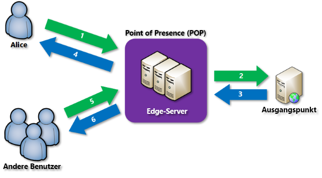

# Was ist ein Content Delivery Network in Azure?
Ein Content Delivery Network (CDN) ist ein verteiltes Netzwerk mit Servern, über die Webinhalte auf effiziente Weise für Benutzer bereitgestellt werden können. In CDNs werden zwischengespeicherte Inhalte auf Edgeservern an POP-Standorten (Point of Presence) gespeichert, die sich in der Nähe der Endbenutzer befinden, um die Wartezeit zu verringern. 

Azure Content Delivery Network (CDN) bietet Entwicklern eine globale Lösung zur schnellen Übermittlung von Inhalten mit hoher Bandbreite an Benutzer. Hierzu werden Inhalte auf physischen Knoten zwischengespeichert, die strategisch auf der ganzen Welt verteilt sind. Durch die Nutzung verschiedener Netzwerkoptimierungen unter Verwendung von CDN-POPs kann Azure CDN außerdem dynamische Inhalte beschleunigen, die nicht zwischengespeichert werden können. Ein Beispiel wäre etwa die Routenoptimierung zur BGP-Umgehung (Border Gateway Protocol).

Die Bereitstellung von Websiteressourcen über Azure CDN bietet folgende Vorteile:

* Bessere Leistung und höhere Benutzerfreundlichkeit für Endbenutzer – vor allem bei Verwendung von Anwendungen, für die zum Laden von Inhalten mehrere Roundtrips erforderlich sind
* Umfassende Skalierung, um hohe Lasten zu Beginn eines Ereignisses, z.B. bei einer Produkteinführung, besser verarbeiten zu können
* Verteilung von Benutzeranforderungen und Bereitstellung von Inhalten direkt von Edgeservern, damit weniger Datenverkehr an den Ursprungsserver gesendet wird

Eine Liste mit aktuellen CDN-Knotenstandorten finden Sie unter [Azure CDN-POP-Standorte nach Region](cdn-pop-locations.md).

## So funktioniert's

1. Ein Benutzer (Alice) fordert eine Datei (auch Ressource genannt) über eine URL mit einem speziellen Domänennamen an. Beispiel: _&lt;Endpunktname&gt;_.azureedge.net. Dieser Name kann ein Endpunkt-Hostname oder eine benutzerdefinierte Domäne sein. Das DNS leitet die Anforderung an den POP-Standort mit der besten Leistung weiter. Dabei handelt es sich in der Regel um den POP, der dem Benutzer geografisch am nächsten ist.
    
2. Falls sich die Datei nicht im Cache eines der Edgeserver am POP befindet, fordert der POP die Datei vom Ursprungsserver an. Der Ursprungsserver kann eine Azure-Web-App, eine Azure Cloud Service-Instanz, ein Azure Storage-Konto oder ein beliebiger öffentlich zugänglicher Webserver sein.
   
3. Der Ursprungsserver gibt die Datei an einen Edgeserver am POP zurück.
    
4. Ein Edgeserver am POP speichert die Datei zwischen und gibt sie an den ursprünglichen Anforderer (Alice) zurück. Die Datei bleibt bis zum Ablauf der in den entsprechenden HTTP-Headern angegebenen Gültigkeitsdauer (Time to Live, TTL) auf dem Edgeserver am POP zwischengespeichert. Falls der Ursprungsserver keinen TTL-Wert angegeben hat, wird der Standardwert (sieben Tage) verwendet.
    
5. Andere Benutzer können die gleiche Datei unter Verwendung der gleichen URL anfordern, die auch Alice verwendet hat, und an den gleichen POP weitergeleitet werden.
    
6. Sofern die Gültigkeitsdauer der Datei nicht abgelaufen ist, gibt der POP-Edgeserver die Datei direkt aus dem Cache zurück. Dieser Prozess führt zu schnellen Reaktionen und somit zu einer höheren Benutzerfreundlichkeit.

## Requirements (Anforderungen)
Für die Verwendung von Azure CDN müssen Sie mindestens über ein Azure-Abonnement verfügen. Darüber hinaus müssen Sie mindestens ein CDN-Profil erstellen. Hierbei handelt es sich um eine Sammlung von CDN-Endpunkten. Jeder CDN-Endpunkt stellt eine spezifische Konfiguration des Verhaltens bei der Inhaltsbereitstellung und des Zugriffs dar. Sie können mehrere Profile verwenden, um Ihre CDN-Endpunkte nach Internetdomäne, Webanwendung oder anderen Kriterien zu organisieren. Da die [Preise für Azure CDN](https://azure.microsoft.com/pricing/details/cdn/) auf der CDN-Profilebene gelten, müssen Sie mehrere CDN-Profile erstellen, wenn Sie eine Kombination verschiedener Tarife verwenden möchten. Informationen zur Abrechnungsstruktur von Azure CDN finden Sie unter [Grundlegendes zur Abrechnung für Azure CDN](cdn-billing.md).

### Einschränkungen
Bei jedem Azure-Abonnement gelten Standardgrenzwerte für folgende Ressourcen:
 - Anzahl erstellbarer CDN-Profile
 - Anzahl von Endpunkten, die in einem CDN-Profil erstellt werden können 
 - Anzahl von benutzerdefinierten Domänen, die einem Endpunkt zugeordnet werden können

Weitere Informationen zu Grenzwerten für CDN-Abonnements finden Sie unter [CDN-Grenzwerte](https://docs.microsoft.com/azure/azure-subscription-service-limits#cdn-limits).
    
## Azure CDN-Features
Azure CDN bietet folgende Schlüsselfeatures:

- [Beschleunigung dynamischer Websites](cdn-dynamic-site-acceleration.md)
- [CDN-Cacheregeln](cdn-caching-rules.md)
- [Unterstützung benutzerdefinierter HTTPS-Domänen](cdn-custom-ssl.md)
- [Azure-Diagnoseprotokolle](cdn-azure-diagnostic-logs.md)
- [Dateikomprimierung](cdn-improve-performance.md)
- [Geofilterung](cdn-restrict-access-by-country.md)

Eine vollständige Liste mit den Features, die von den einzelnen Azure CDN-Produkten unterstützt werden, finden Sie unter [Azure CDN-Produktfeatures](cdn-features.md).

## Nächste Schritte
- Informationen zu den ersten Schritten mit CDN finden Sie unter [Schnellstart: Erstellen eines Azure CDN-Profils und -Endpunkts](cdn-create-new-endpoint.md).
- Verwalten Sie Ihre CDN-Endpunkte über das [Microsoft Azure-Portal](https://portal.azure.com) oder mit [PowerShell](cdn-manage-powershell.md).
- Erfahren Sie, wie Sie Azure CDN mit [.NET](cdn-app-dev-net.md) oder [Node.js](cdn-app-dev-node.md) automatisieren.
- Sehen Sie sich die [Videos zu Azure CDN](https://azure.microsoft.com/resources/videos/index/?services=cdn&sort=newest) an, um Azure CDN in Aktion zu erleben.
- Informationen zu den neuesten Azure CDN-Features finden Sie im [Azure CDN-Blog](https://azure.microsoft.com/blog/tag/azure-cdn/).

