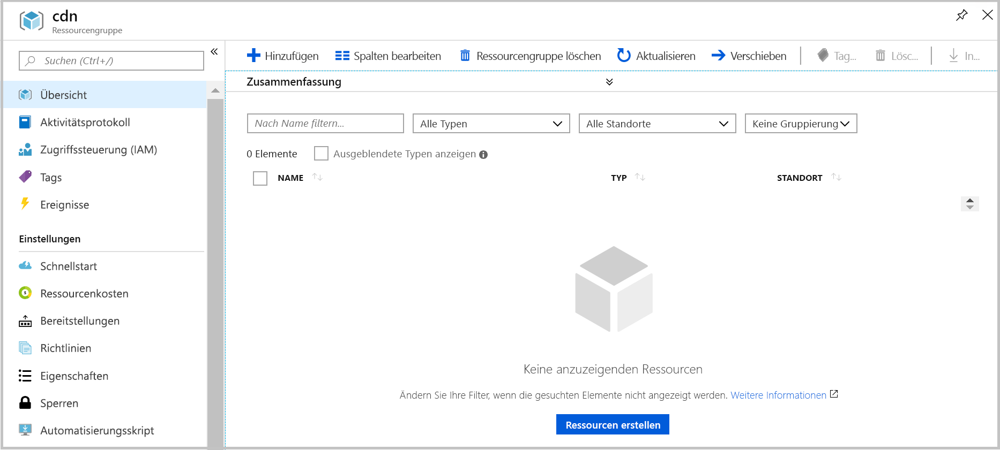

# <a name="quickstart-create-an-azure-cdn-profile-and-endpoint-using-resource-manager-template"></a>Schnellstart: Erstellen eines Azure CDN-Profils und -Endpunkts mithilfe von Resource Manager-Vorlagen

In diesem Schnellstart stellen Sie eine Azure Resource Manager-Vorlage über die Befehlszeilenschnittstelle bereit. Mit der erstellten Vorlage werden ein CDN-Profil und ein CDN-Endpunkt für Ihre Webanwendung bereitgestellt.
Die Ausführung dieser Schritte dauert ungefähr zehn Minuten.

[!INCLUDE [quickstarts-free-trial-note](../../includes/quickstarts-free-trial-note.md)]

## <a name="prequisites"></a>Voraussetzungen

Für diesen Schnellstart muss eine Webanwendung als Ursprung verwendet werden. Die in diesem Schnellstart als Beispiel verwendete Webanwendung wurde in https://cdndemo.azurewebsites.net bereitgestellt.

Weitere Informationen finden Sie unter [Erstellen einer statischen HTML-Web-App in Azure](https://docs.microsoft.com/azure/app-service/app-service-web-get-started-html).

## <a name="create-a-resource-group"></a>Erstellen einer Ressourcengruppe

Alle Ressourcen müssen in ein und derselben Ressourcengruppe bereitgestellt werden.

Erstellen Sie die Ressourcengruppe am ausgewählten Standort. In diesem Beispiel wird eine Ressourcengruppe mit dem Namen „cdn“ am Standort „USA, Osten“ erstellt.

```bash
az group create --name cdn --location eastus
```



## <a name="create-the-resource-manager-template"></a>Erstellen der Resource Manager-Vorlage

In diesem Schritt erstellen Sie eine Vorlagendatei, mit der die Ressourcen bereitgestellt werden.

In diesem Beispiel wird ein Szenario zur allgemeinen Beschleunigung der Website beschrieben, es können jedoch viele weitere Einstellungen konfiguriert werden. Diese Einstellungen stehen in der Referenz zu Azure Resource Manager-Vorlagen zur Verfügung. Entsprechende Informationen finden Sie in den Referenzen zum [CDN-Profil](https://docs.microsoft.com/azure/templates/microsoft.cdn/2017-10-12/profiles) und [CDN-Profilendpunkt](https://docs.microsoft.com/azure/templates/microsoft.cdn/2017-10-12/profiles/endpoints).

Beachten Sie, dass die Liste der Inhaltstypen in Microsoft CDN nicht geändert werden kann.

Speichern Sie die Vorlage als **resource-manager-cdn.json**.

```json
{
    "$schema": "https://schema.management.azure.com/schemas/2015-01-01/deploymentTemplate.json#",
    "contentVersion": "1.0.0.0",
    "parameters": {
        "cdnProfileSku": {
            "type": "string",
            "allowedValues": [
                "Standard_Microsoft",
                "Standard_Akamai",
                "Standard_Verizon",
                "Premium_Verizon"
            ]
        },
        "endpointOriginHostName": {
            "type": "string"
        }
    },
    "variables": {
        "profile": {
            "name": "[replace(toLower(parameters('cdnProfileSku')), '_', '-')]"
        },
        "endpoint": {
            "name": "[replace(toLower(parameters('endpointOriginHostName')), '.', '-')]",
            "originHostName": "[parameters('endpointOriginHostName')]"
        }
    },
    "resources": [
        {
            "type": "Microsoft.Cdn/profiles",
            "apiVersion": "2017-10-12",
            "location": "[resourceGroup().location]",
            "name": "[variables('profile').name]",
            "sku": {
                "name": "[parameters('cdnProfileSku')]"
            }
        },
        {
            "dependsOn": [
                "[resourceId('Microsoft.Cdn/profiles', variables('profile').name)]"
            ],
            "type": "Microsoft.Cdn/profiles/endpoints",
            "apiVersion": "2017-10-12",
            "location": "[resourceGroup().location]",
            "name": "[concat(variables('profile').name, '/', variables('endpoint').name)]",
            "properties": {
                "hostName": "[concat(variables('endpoint').name, '.azureedge.net')]",
                "originHostHeader": "[variables('endpoint').originHostName]",
                "isHttpAllowed": true,
                "isHttpsAllowed": true,
                "queryStringCachingBehavior": "IgnoreQueryString",
                "origins": [
                    {
                        "name": "[replace(variables('endpoint').originHostName, '.', '-')]",
                        "properties": {
                            "hostName": "[variables('endpoint').originHostName]",
                            "httpPort": 80,
                            "httpsPort": 443
                        }
                    }
                ],
                "contentTypesToCompress": [
                    "application/eot",
                    "application/font",
                    "application/font-sfnt",
                    "application/javascript",
                    "application/json",
                    "application/opentype",
                    "application/otf",
                    "application/pkcs7-mime",
                    "application/truetype",
                    "application/ttf",
                    "application/vnd.ms-fontobject",
                    "application/xhtml+xml",
                    "application/xml",
                    "application/xml+rss",
                    "application/x-font-opentype",
                    "application/x-font-truetype",
                    "application/x-font-ttf",
                    "application/x-httpd-cgi",
                    "application/x-javascript",
                    "application/x-mpegurl",
                    "application/x-opentype",
                    "application/x-otf",
                    "application/x-perl",
                    "application/x-ttf",
                    "font/eot",
                    "font/ttf",
                    "font/otf",
                    "font/opentype",
                    "image/svg+xml",
                    "text/css",
                    "text/csv",
                    "text/html",
                    "text/javascript",
                    "text/js",
                    "text/plain",
                    "text/richtext",
                    "text/tab-separated-values",
                    "text/xml",
                    "text/x-script",
                    "text/x-component",
                    "text/x-java-source"
                ],
                "isCompressionEnabled": true,
                "optimizationType": "GeneralWebDelivery"
            }
        }
    ],
    "outputs": {
        "cdnUrl": {
            "type": "string",
            "value": "[concat('https://', variables('endpoint').name, '.azureedge.net')]"
        }
    }
}
```

## <a name="create-the-resources"></a>Erstellen der Ressourcen

Stellen Sie die Vorlage über die Azure-Befehlszeilenschnittstelle bereit. Sie müssen zwei Eingaben vornehmen:

**cdnProfileSku:** der CDN-Anbieter, der verwendet werden soll. Die Optionen sind:

* Standard_Microsoft
* Standard_Akamai
* Standard_Verizon
* Premium_Verizon

**endpointOriginHostName:** der Endpunkt, der über CDN bereitgestellt wird, z. B. „cdndemo.azurewebsites.net“.

```bash
az group deployment create --resource-group cdn --template-file arm-cdn.json
```


## <a name="view-the-cdn-profile"></a>Anzeigen des CDN-Profils

```bash
az cdn profile list --resource-group cdn -o table
```


## <a name="view-the-cdn-endpoint-for-the-profile-standard-microsoft"></a>Anzeigen des CDN-Endpunkts für das Profil „standard-microsoft“

```bash
az cdn endpoint list --profile-name standard-microsoft --resource-group cdn -o table
```


Verwenden Sie den Hostnamen zum Anzeigen des Inhalts. Greifen Sie z. B. im Browser auf https://cdndemo-azurewebsites-net.azureedge.net zu.

## <a name="clean-up"></a>Bereinigen

Durch Löschen der Ressourcengruppe werden automatisch alle darin bereitgestellten Ressourcen entfernt.

```bash
az group delete --name cdn
```


## <a name="references"></a>Referenzen

* CDN-Profil: [Referenz zu Azure Resource Manager-Vorlagen](https://docs.microsoft.com/azure/templates/microsoft.cdn/2017-10-12/profiles)
* CDN-Endpunkt: [Referenzdokumentation zu Azure Resource Manager-Vorlagen](https://docs.microsoft.com/azure/templates/microsoft.cdn/2017-10-12/profiles/endpoints)

## <a name="next-steps"></a>Nächste Schritte

Im folgenden Tutorial erfahren Sie, wie Sie Ihrem CDN-Endpunkt eine benutzerdefinierte Domäne hinzufügen:

> [!div class="nextstepaction"]
> [Tutorial: Hinzufügen einer benutzerdefinierten Domäne zum Azure CDN-Endpunkt](cdn-map-content-to-custom-domain.md)
