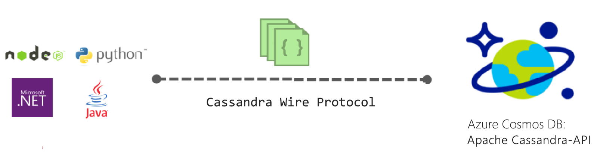

# Einführung in die Apache Cassandra-API für Azure Cosmos DB

Mit Azure Cosmos DB wird die Cassandra-API (Vorschauversion) für Anwendungen bereitgestellt, die für Apache Cassandra geschrieben wurden und beispielsweise folgende Premiumfunktionen benötigen:

* [Skalierbare Speichergröße und Durchsatz](partition-data.md)
* [Sofort einsatzbereite globale Verteilung](distribute-data-globally.md)
* Einstellige Latenzzeiten im Millisekundenbereich im 99. Perzentil
* [Fünf wohl definierte Konsistenzebenen](consistency-levels.md)
* [Automatische Indizierung von Daten](http://www.vldb.org/pvldb/vol8/p1668-shukla.pdf), sodass Sie sich nicht mit der Schema- und Indexverwaltung befassen müssen 
* Garantierte Hochverfügbarkeit, gesichert durch [branchenführende SLAs](https://azure.microsoft.com/support/legal/sla/cosmos-db/)

## Was ist die Apache Cassandra-API für Azure Cosmos DB?

Mithilfe der Apache Cassandra-API kann Azure Cosmos DB als Datenspeicher für Apps verwendet werden, die für [Apache Cassandra](https://cassandra.apache.org/) geschrieben wurden. Dies bedeutet, dass durch Verwendung [von Apache lizenzierter Treiber, die mit CQLv4 kompatibel sind](https://cassandra.apache.org/doc/latest/getting_started/drivers.html?highlight=driver), Ihre für Cassandra geschriebene Anwendung jetzt mit der Cassandra-API für Azure Cosmos DB kommunizieren kann. In vielen Fällen können Sie durch einfaches Ändern einer Verbindungszeichenfolge von Apache Cassandra zur Cassandra-API für Azure Cosmos DB wechseln. Mit dieser Funktion können Sie ganz einfach Datenbankanwendungen der Cassandra-API in der Azure-Cloud mit der globalen Verteilung von Azure Cosmos DB sowie mit [umfassenden branchenführenden SLAs](https://azure.microsoft.com/support/legal/sla/cosmos-db) erstellen und ausführen, während Sie die vorhandenen Kenntnisse und Tools für die Cassandra-API weiterhin verwenden.

Die Cassandra-API ermöglicht Ihnen die Interaktion mit Daten, die in Azure Cosmos DB gespeichert sind, mithilfe von CQL-basierten Tools (z. B. CQLSH) und bereits vertrauten Cassandra-Clienttreibern.

## Welche Vorteile bietet die Verwendung der Apache Cassandra-API für Azure Cosmos DB?

**Keine Vorgangsverwaltung**: Als vollständig verwalteter Dienst stellt Azure Cosmos DB sicher, dass sich Administratoren der Cassandra-API keine Gedanken über das Verwalten und Überwachen unzähliger Einstellungen für Betriebssystem, JVM und YAML-Dateien und deren Zusammenspiel machen müssen. Azure Cosmos DB bietet Überwachung von Durchsatz, Latenz, Speicher und Verfügbarkeit sowie konfigurierbare Warnungen. 

**Leistungsverwaltung**: Azure Cosmos DB bietet SLA-gesicherte Lese- und Schreibvorgänge mit geringer Latenz für das 99. Perzentil. Die Benutzer müssen sich keine Sorgen über eine großen Verwaltungsaufwand zur Bereitstellung gut zu lesender und geschriebener SLAs zu machen. Dazu gehören in der Regel Planungskomprimierung, Verwaltung von Tombstones, Bloomfiltereinstellung und Replikatverzögerungen. Mit Azure Cosmos DB müssen Sie sich keine Gedanken mehr über die Verwaltung dieser Aspekte machen und können sich auf die Anwendungsergebnisse konzentrieren.

**Automatische Indizierung**: Azure Cosmos DB nimmt eine automatische Indizierung aller Spalten einer Tabelle in der Datenbank der Cassandra-API vor. Azure Cosmos DB erfordert keine Erstellung sekundärer Indizes zur Beschleunigung von Abfragen. Es bietet Lese- und Schreibvorgänge mit geringer Latenz bei gleichzeitiger automatischer und konsistenter Indizierung. 

**Möglichkeit der Verwendung von vorhandenem Code und Tools**: Azure Cosmos DB bietet Kompatibilität auf Verbindungsprotokollebene mit vorhandenen SDKs und Tools. Durch diese Kompatibilität ist sichergestellt, dass Sie die vorhandene Codebasis mit der Cassandra-API von Azure Cosmos DB mit nur geringfügigen Änderungen verwenden können.

**Durchsatz- und Speicherflexibilität**: Die Azure Cosmos-Plattform bietet regionsübergreifend Flexibilität beim garantierten Durchsatz durch einfache Portal-, PowerShell- oder CLI-Vorgänge. Sie können Azure Cosmos DB-Tabellen mit vorhersagbarer Leistung flexibel skalieren, wenn Ihre Anwendung wächst. Azure Cosmos DB unterstützt Tabellen der Cassandra-API, die auf eine nahezu unbegrenzte Speichergröße skaliert werden können. 

**Globale Verteilung und Verfügbarkeit**: Azure Cosmos DB bietet die Möglichkeit, Daten in allen Azure-Regionen zu verteilen, um Benutzern Vorgänge mit geringer Latenz bei gleichzeitig sichergestellter Verfügbarkeit zu ermöglichen. Azure Cosmos DB bietet 99,99 % Verfügbarkeit innerhalb einer Region und 99,999 % Leseverfügbarkeit in allen Regionen ohne höheren Betriebsaufwand. Azure Cosmos DB ist in mehr als 30 [Azure-Regionen](https://azure.microsoft.com/regions/services/) verfügbar. Weitere Informationen finden Sie unter [Globale Verteilung von Daten](distribute-data-globally.md). 

**Auswahl der Konsistenzebene**: Azure Cosmos DB stellt fünf wohl definierte Konsistenzebenen zur Auswahl, um für ein ausgewogenes Verhältnis zwischen Konsistenz und Leistung zu sorgen. Diese Konsistenzebenen sind: „Strong“ (Sicher), „Bounded Staleness“ (Begrenzte Veraltung), „Session“ (Sitzung), „Consistent Prefix“ (Präfixkonsistenz) und „Eventual“ (Letztlich). Mit diesen granularen, gut abgegrenzten Konsistenzebenen können Entwickler fundierte Kompromisse zwischen Konsistenz, Verfügbarkeit und Latenz schließen. Weitere Informationen finden Sie unter [Verwenden von Konsistenzebenen zum Maximieren der Verfügbarkeit und Leistung](consistency-levels.md). 

**Unternehmensniveau**: Azure Cosmos DB bietet standardmäßig Sicherheit und Compliance und somit [Compliancezertifizierungen](https://www.microsoft.com/trustcenter), um sicherzustellen, dass Benutzer die Plattform verwenden können, ohne sich Gedanken über Complianceprobleme zu machen. Azure Cosmos DB bietet außerdem Verschlüsselung ruhender Daten sowie von Daten während der Übertragung, eine IP-Firewall und Überwachungsprotokolle für Aktivitäten auf Steuerungsebene.  

## Erste Schritte
Folgen Sie den Schnellstartanleitungen für die Cassandra-API, um ein Cassandra-API-Konto für Azure Cosmos DB und eine Cassandra-App zu erstellen:

* [Schnellstartanleitung: Erstellen einer Cassandra-Web-App mit Node.js und Azure Cosmos DB](create-cassandra-nodejs.md)
* [Schnellstartanleitung: Erstellen einer Cassandra-Web-App mit Java und Azure Cosmos DB](create-cassandra-java.md)
* [Schnellstartanleitung: Erstellen einer Cassandra-Web-App mit .NET und Azure Cosmos DB](create-cassandra-dotnet.md)
* [Schnellstartanleitung: Erstellen einer Cassandra-Web-App mit Python und Azure Cosmos DB](create-cassandra-python.md)

## Jetzt anmelden 

Wenn Sie bereits über ein Azure-Abonnement verfügen, können Sie sich für die Cassandra-API (Vorschauversion) im [Azure-Portal](https://aka.ms/cosmosdb-cassandra-signup) registrieren. Wenn Sie Azure bisher noch nicht verwenden, registrieren Sie sich für eine [kostenlose Testversion](https://azure.microsoft.com/free), mit der Sie 12 Monate lang kostenlos auf Azure Cosmos DB zugreifen können.

## Nächste Schritte

Informationen zur Cassandra-API für Azure Cosmos DB sind in die Azure Cosmos DB-Dokumentation integriert. Im Folgenden finden Sie einige Verweise für den Einstieg:

* Folgen Sie den [Schnellstartanleitungen](create-cassandra-nodejs.md), um ein Konto und eine neue App mithilfe eines Git-Beispiels zu erstellen.
* Folgen Sie dem [Tutorial](tutorial-develop-cassandra-java.md), um eine neue App programmgesteuert zu erstellen.
* Folgen Sie dem [Tutorial zum Importieren von Cassandra-Daten](cassandra-import-data.md), um Ihre vorhandenen Daten in Azure Cosmos DB zu importieren.
* Lesen Sie die [häufig gestellten Fragen](faq.md#cassandra).
