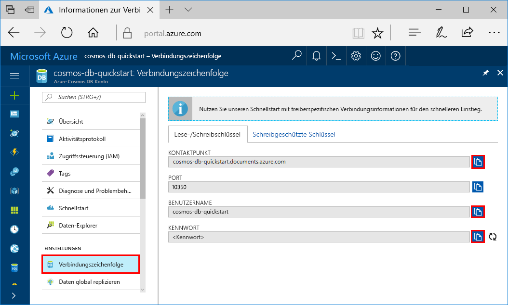
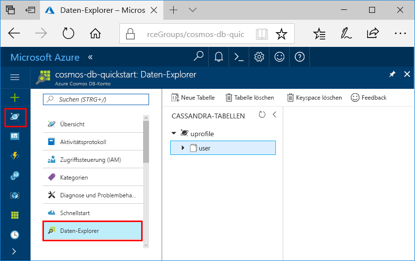

# <a name="quickstart-build-a-cassandra-app-with-java-and-azure-cosmos-db"></a>Schnellstartanleitung: Erstellen einer Cassandra-App mit Java und Azure Cosmos DB

In dieser Schnellstartanleitung erfahren Sie, wie Sie mithilfe von Java und der [Cassandra-API](cassandra-introduction.md) von Azure Cosmos DB eine Profil-App erstellen, indem Sie ein Beispiel von GitHub klonen. Außerdem wird in dieser Schnellstartanleitung die Erstellung eines Azure Cosmos DB-Kontos über das webbasierte Azure-Portal gezeigt.

Azure Cosmos DB ist ein global verteilter Datenbankdienst von Microsoft mit mehreren Modellen. Sie können schnell Dokument-, Tabellen-, Schlüssel-Wert- und Graph-Datenbanken erstellen und abfragen und dabei stets die Vorteile der globalen Verteilung und der horizontalen Skalierung nutzen, die Azure Cosmos DB bietet. 

## <a name="prerequisites"></a>Voraussetzungen

Sie benötigen Zugriff auf das Vorschauprogramm für die Cassandra-API von Azure Cosmos DB. Falls Sie noch keinen Zugriff angefordert haben, können Sie sich [hier](https://aka.ms/cosmosdb-cassandra-signup) registrieren.

[!INCLUDE [quickstarts-free-trial-note](../../includes/quickstarts-free-trial-note.md)] Alternativ können Sie [Azure Cosmos DB ohne Azure-Abonnement testen](https://azure.microsoft.com/try/cosmosdb/) – kostenlos und ohne Verpflichtung.

Außerdem haben Sie folgende Möglichkeiten: 

* [Java Development Kit (JDK) 1.7+](http://www.oracle.com/technetwork/java/javase/downloads/jdk8-downloads-2133151.html)
    * Führen Sie unter Ubuntu `apt-get install default-jdk` aus, um das JDK zu installieren.
    * Achten Sie darauf, dass die Umgebungsvariable „JAVA_HOME“ auf den Ordner verweist, in dem das JDK installiert ist.
* Ein binäres [Maven](http://maven.apache.org/)-Archiv ([Download](http://maven.apache.org/download.cgi)/[Installationsanleitung](http://maven.apache.org/install.html))
    * Unter Ubuntu können Sie `apt-get install maven` ausführen, um Maven zu installieren.
* [Git](https://www.git-scm.com/)
    * Unter Ubuntu können Sie `sudo apt-get install git` ausführen, um Git zu installieren.

## <a name="create-a-database-account"></a>Erstellen eines Datenbankkontos

Vor dem Erstellen einer Dokumentdatenbank müssen Sie mit Azure Cosmos DB ein Cassandra-Konto erstellen.

[!INCLUDE [cosmos-db-create-dbaccount-cassandra](../../includes/cosmos-db-create-dbaccount-cassandra.md)]

## <a name="clone-the-sample-application"></a>Klonen der Beispielanwendung

Beginnen wir nun mit der Verwendung von Code. Wir klonen eine Cassandra-App aus GitHub, legen die Verbindungszeichenfolge fest und führen die App aus. Sie werden feststellen, wie einfach Sie programmgesteuert mit Daten arbeiten können. 

1. Öffnen Sie ein Terminalfenster von Git (z. B. Git Bash), und verwenden Sie den Befehl `cd`, um den Ordner zu ändern, in den die Beispiel-App gespeichert wird. 

    ```bash
    cd "C:\git-samples"
    ```

2. Führen Sie den folgenden Befehl aus, um das Beispielrepository zu klonen. Dieser Befehl erstellt eine Kopie der Beispiel-App auf Ihrem Computer.

    ```bash
    git clone https://github.com/Azure-Samples/azure-cosmos-db-cassandra-java-getting-started.git
    ```

## <a name="review-the-code"></a>Überprüfen des Codes

Dieser Schritt ist optional. Wenn Sie erfahren möchten, wie die Datenbankressourcen im Code erstellt werden, können Sie sich die folgenden Codeausschnitte ansehen. Andernfalls können Sie mit [Aktualisieren der Verbindungszeichenfolge](#update-your-connection-string) fortfahren. Alle Codeausschnitte stammen aus der Datei src/main/java/com/azure/cosmosdb/cassandra/util/CassandraUtils.java.  

* Cassandra-Host, -Port, -Benutzername, -Kennwort und SSL-Optionen wurden festgelegt. Die Informationen zur Verbindungszeichenfolge stammen von der Seite „Verbindungszeichenfolge“ im Azure-Portal.

   ```java
   cluster = Cluster.builder().addContactPoint(cassandraHost).withPort(cassandraPort).withCredentials(cassandraUsername, cassandraPassword).withSSL(sslOptions).build();
   ```

* `cluster` stellt eine Verbindung mit der Cassandra-API von Azure Cosmos DB her und gibt eine Sitzung für den Zugriff zurück.

    ```java
    return cluster.connect();
    ```

Die folgenden Codeausschnitte stammen aus der Datei src/main/java/com/azure/cosmosdb/cassandra/repository/UserRepository.java.

* Erstellen Sie einen neuen Keyspace.

    ```java
    public void createKeyspace() {
        final String query = "CREATE KEYSPACE IF NOT EXISTS uprofile WITH replication = {'class': 'SimpleStrategy', 'replication_factor': '3' } ";
        session.execute(query);
        LOGGER.info("Created keyspace 'uprofile'");
    }
    ```

* Erstellen Sie eine neue Tabelle.

   ```java
   public void createTable() {
        final String query = "CREATE TABLE IF NOT EXISTS uprofile.user (user_id int PRIMARY KEY, user_name text, user_bcity text)";
        session.execute(query);
        LOGGER.info("Created table 'user'");
   }
   ```

* Fügen Sie Benutzerentitäten mithilfe eines vorbereiteten Anweisungsobjekts ein.

    ```java
    public PreparedStatement prepareInsertStatement() {
        final String insertStatement = "INSERT INTO  uprofile.user (user_id, user_name , user_bcity) VALUES (?,?,?)";
        return session.prepare(insertStatement);
    }

    public void insertUser(PreparedStatement statement, int id, String name, String city) {
        BoundStatement boundStatement = new BoundStatement(statement);
        session.execute(boundStatement.bind(id, name, city));
    }
    ```

* Führen Sie eine Abfrage zum Abrufen der gesamten Benutzerinformationen aus.

    ```java
   public void selectAllUsers() {
        final String query = "SELECT * FROM uprofile.user";
        List<Row> rows = session.execute(query).all();

        for (Row row : rows) {
            LOGGER.info("Obtained row: {} | {} | {} ", row.getInt("user_id"), row.getString("user_name"), row.getString("user_bcity"));
        }
    }
    ```

* Führen Sie eine Abfrage zum Abrufen der Informationen eines einzelnen Benutzers aus.

    ```java
    public void selectUser(int id) {
        final String query = "SELECT * FROM uprofile.user where user_id = 3";
        Row row = session.execute(query).one();

        LOGGER.info("Obtained row: {} | {} | {} ", row.getInt("user_id"), row.getString("user_name"), row.getString("user_bcity"));
    }
    ```

## <a name="update-your-connection-string"></a>Aktualisieren der Verbindungszeichenfolge

Wechseln Sie nun zurück zum Azure-Portal, um die Informationen der Verbindungszeichenfolge abzurufen und in die App zu kopieren. Dadurch kann Ihre App mit Ihrer gehosteten Datenbank kommunizieren.

1. Klicken Sie im [Azure-Portal](http://portal.azure.com/) auf **Verbindungszeichenfolge**. 

    

2. Verwenden Sie die Schaltfläche  auf der rechten Seite des Bildschirms, um den Kontaktpunktwert zu kopieren.

3. Öffnen Sie die Datei `config.properties` im Ordner „C:\git-samples\azure-cosmosdb-cassandra-java-getting-started\java-examples\src\main\resources“. 

3. Ersetzen Sie `<Cassandra endpoint host>` in Zeile 2 durch den Kontaktpunktwert aus dem Portal.

    Zeile 2 von „config.properties“ sollte etwa wie folgt aussehen: 

    `cassandra_host=cosmos-db-quickstarts.documents.azure.com`

3. Kehren Sie zum Portal zurück, und kopieren Sie den Wert für den Benutzernamen. Ersetzen Sie `<cassandra endpoint username>` in Zeile 4 durch den Benutzernamen aus dem Portal.

    Zeile 4 von „config.properties“ sollte etwa wie folgt aussehen: 

    `cassandra_username=cosmos-db-quickstart`

4. Kehren Sie zum Portal zurück, und kopieren Sie den Wert für das Kennwort. Ersetzen Sie `<cassandra endpoint password>` in Zeile 5 durch das Kennwort aus dem Portal.

    Zeile 5 von „config.properties“ sollte etwa wie folgt aussehen: 

    `cassandra_password=2Ggkr662ifxz2Mg...==`

5. Wenn Sie ein bestimmtes SSL-Zertifikat verwenden möchten, ersetzen Sie `<SSL key store file location>` in Zeile 6 durch den Speicherort des SSL-Zertifikats. Wenn kein Wert angegeben ist, wird das unter „<JAVA_HOME>/jre/lib/security/cacerts“ installierte JDK-Zertifikat verwendet. 

6. Wenn Sie Zeile 6 so geändert haben, dass ein bestimmtes SSL-Zertifikat verwendet wird, aktualisieren Sie Zeile 7 so, dass das Kennwort für das betreffende Zertifikat verwendet wird. 

7. Speichern Sie die Datei „config.properties“.

## <a name="run-the-app"></a>Ausführen der App

1. Wechseln Sie im Terminalfenster von Git mithilfe von `cd` zum Ordner „azure-cosmosdb-cassandra-java-getting-started\java-examples“.

    ```git
    cd "C:\git-samples\azure-cosmosdb-cassandra-java-getting-started\java-examples"
    ```

2. Generieren Sie im Git-Terminalfenster mit dem folgenden Befehl die Datei „cosmosdb-cassandra-examples.jar“.

    ```git
    mvn clean install
    ```

3. Führen Sie im Terminalfenster von Git den folgenden Befehl aus, um die Java-Anwendung zu starten.

    ```git
    java -cp target/cosmosdb-cassandra-examples.jar com.azure.cosmosdb.cassandra.examples.UserProfile
    ```

    Im Terminalfenster werden Benachrichtigungen angezeigt, dass der Keyspace und die Tabelle erstellt wurden. Anschließend werden alle Benutzer in der Tabelle ausgewählt und zurückgegeben, und die Ausgabe wird angezeigt. Dann wird eine Zeile anhand der ID ausgewählt und der Wert angezeigt.  

    Drücken Sie STRG+C, um die Programmausführung zu beenden und das Konsolenfenster zu schließen. 
    
    Nun können Sie im Azure-Portal den Daten-Explorer öffnen, um die neuen Daten anzuzeigen, abzufragen, anzupassen und zu verwenden. 

    

## <a name="review-slas-in-the-azure-portal"></a>Überprüfen von SLAs im Azure-Portal

[!INCLUDE [cosmosdb-tutorial-review-slas](../../includes/cosmos-db-tutorial-review-slas.md)]

## <a name="clean-up-resources"></a>Bereinigen von Ressourcen

[!INCLUDE [cosmosdb-delete-resource-group](../../includes/cosmos-db-delete-resource-group.md)]

## <a name="next-steps"></a>Nächste Schritte

In dieser Schnellstartanleitung haben Sie gelernt, wie Sie mit dem Daten-Explorer ein Azure Cosmos DB-Konto, eine Cassandra-Datenbank und eine Sammlung erstellen und wie Sie das gleiche Ergebnis programmgesteuert mithilfe einer App erzielen. Sie können jetzt zusätzliche Daten in Ihre Azure Cosmos DB-Sammlung importieren. 

> [!div class="nextstepaction"]
> [Azure Cosmos DB: Import Cassandra data](cassandra-import-data.md) (Azure Cosmos DB: Importieren von Cassandra-Daten)
