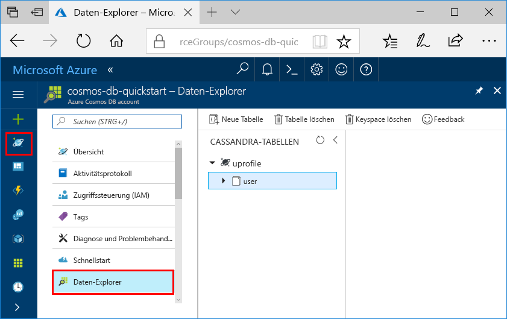

# <a name="quickstart-build-a-cassandra-app-with-nodejs-and-azure-cosmos-db"></a>Schnellstartanleitung: Erstellen einer Cassandra-App mit Node.js und Azure Cosmos DB

In dieser Schnellstartanleitung erfahren Sie, wie Sie mithilfe von Node.js und der [Cassandra-API](cassandra-introduction.md) von Azure Cosmos DB eine Profil-App erstellen, indem Sie ein Beispiel von GitHub klonen. Außerdem wird in dieser Schnellstartanleitung die Erstellung eines Azure Cosmos DB-Kontos über das webbasierte Azure-Portal gezeigt.

Azure Cosmos DB ist ein global verteilter Datenbankdienst von Microsoft mit mehreren Modellen. Sie können schnell Dokument-, Tabellen-, Schlüssel-Wert- und Graph-Datenbanken erstellen und abfragen und dabei stets die Vorteile der globalen Verteilung und der horizontalen Skalierung nutzen, die Azure Cosmos DB bietet. 

## <a name="prerequisites"></a>Voraussetzungen

[!INCLUDE [quickstarts-free-trial-note](../../includes/quickstarts-free-trial-note.md)] Alternativ können Sie [Azure Cosmos DB ohne Azure-Abonnement testen](https://azure.microsoft.com/try/cosmosdb/) – kostenlos und ohne Verpflichtung.

Sie benötigen Zugriff auf das Vorschauprogramm für die Cassandra-API von Azure Cosmos DB. Falls Sie noch keinen Zugriff angefordert haben, können Sie sich [hier](cassandra-introduction.md#sign-up-now) registrieren.

Außerdem haben Sie folgende Möglichkeiten:
* [Node.js](https://nodejs.org/en/) Version v0.10.29 oder höher
* [Git](http://git-scm.com/)

## <a name="create-a-database-account"></a>Erstellen eines Datenbankkontos

Vor dem Erstellen einer Dokumentdatenbank müssen Sie mit Azure Cosmos DB ein Cassandra-Konto erstellen.

[!INCLUDE [cosmos-db-create-dbaccount-cassandra](../../includes/cosmos-db-create-dbaccount-cassandra.md)]

## <a name="clone-the-sample-application"></a>Klonen der Beispielanwendung

In diesem Schritt klonen wir eine Cassandra-API-App aus GitHub, legen die Verbindungszeichenfolge fest und führen die App aus. Sie werden feststellen, wie einfach Sie programmgesteuert mit Daten arbeiten können. 

1. Öffnen Sie ein Terminalfenster von Git (z. B. Git Bash), und verwenden Sie den Befehl `cd`, um den Ordner zu ändern, in den die Beispiel-App gespeichert wird. 

    ```bash
    cd "C:\git-samples"
    ```

2. Führen Sie den folgenden Befehl aus, um das Beispielrepository zu klonen. Dieser Befehl erstellt eine Kopie der Beispiel-App auf Ihrem Computer.

    ```bash
    git clone https://github.com/Azure-Samples/azure-cosmos-db-cassandra-nodejs-getting-started.git
    ```

## <a name="review-the-code"></a>Überprüfen des Codes

Dieser Schritt ist optional. Wenn Sie erfahren möchten, wie die Datenbankressourcen im Code erstellt werden, können Sie sich die folgenden Codeausschnitte ansehen. Die Codeausschnitte stammen alle aus der Datei `uprofile.js` im Ordner „C:\git-samples\azure-cosmos-db-cassandra-nodejs-getting-started“. Andernfalls können Sie mit [Aktualisieren der Verbindungszeichenfolge](#update-your-connection-string) fortfahren. 

* Benutzername und Kennwort werden auf der Seite „Verbindungszeichenfolge“ des Azure-Portals festgelegt. „path\to\cert“ gibt den Pfad für das X.509-Zertifikat an. 

   ```nodejs
   var ssl_option = {
        cert : fs.readFileSync("path\to\cert"),
        rejectUnauthorized : true,
        secureProtocol: 'TLSv1_2_method'
        };
   const authProviderLocalCassandra = new cassandra.auth.PlainTextAuthProvider(config.username, config.password);
   ```

* `client` wird mit contactPoint-Informationen initialisiert. Der Kontaktpunkt (contactPoint) wird aus dem Azure-Portal abgerufen.

    ```nodejs
    const client = new cassandra.Client({contactPoints: [config.contactPoint], authProvider: authProviderLocalCassandra, sslOptions:ssl_option});
    ```

* `client` stellt eine Verbindung mit der Cassandra-API von Azure Cosmos DB her.

    ```nodejs
    client.connect(next);
    ```

* Ein neuer Keyspace wird erstellt.

    ```nodejs
    function createKeyspace(next) {
        var query = "CREATE KEYSPACE IF NOT EXISTS uprofile WITH replication = {\'class\': \'NetworkTopologyStrategy\', \'datacenter1\' : \'1\' }";
        client.execute(query, next);
        console.log("created keyspace");    
  }
    ```

* Eine neue Tabelle wird erstellt.

   ```nodejs
   function createTable(next) {
    var query = "CREATE TABLE IF NOT EXISTS uprofile.user (user_id int PRIMARY KEY, user_name text, user_bcity text)";
        client.execute(query, next);
        console.log("created table");
   },
   ```

* Schlüssel-Wert-Entitäten werden eingefügt.

    ```nodejs
    ...
       {
          query: 'INSERT INTO  uprofile.user  (user_id, user_name , user_bcity) VALUES (?,?,?)',
          params: [5, 'IvanaV', 'Belgaum', '2017-10-3136']
        }
    ];
    client.batch(queries, { prepare: true}, next);
    ```

* Abfrage zum Abrufen aller Schlüsselwerte.

    ```nodejs
   var query = 'SELECT * FROM uprofile.user';
    client.execute(query, { prepare: true}, function (err, result) {
      if (err) return next(err);
      result.rows.forEach(function(row) {
        console.log('Obtained row: %d | %s | %s ',row.user_id, row.user_name, row.user_bcity);
      }, this);
      next();
    });
    ```  
    
* Abfrage zum Abrufen eines Schlüsselwerts.

    ```nodejs
    function selectById(next) {
        console.log("\Getting by id");
        var query = 'SELECT * FROM uprofile.user where user_id=1';
        client.execute(query, { prepare: true}, function (err, result) {
        if (err) return next(err);
            result.rows.forEach(function(row) {
            console.log('Obtained row: %d | %s | %s ',row.user_id, row.user_name, row.user_bcity);
        }, this);
        next();
        });
    }
    ```  

## <a name="update-your-connection-string"></a>Aktualisieren der Verbindungszeichenfolge

Wechseln Sie nun zurück zum Azure-Portal, um die Informationen der Verbindungszeichenfolge abzurufen und in die App zu kopieren. Dadurch kann Ihre App mit Ihrer gehosteten Datenbank kommunizieren.

1. Klicken Sie im [Azure-Portal](http://portal.azure.com/) auf **Verbindungszeichenfolge**. 

    Verwenden Sie die Schaltfläche  auf der rechten Seite des Bildschirms, um den obersten Wert (den Kontaktpunkt) zu kopieren.

    

2. Öffnen Sie die Datei `config.js` . 

3. Ersetzen Sie `<FillMEIN>` in Zeile 4 durch den Kontaktpunktwert aus dem Portal.

    Zeile 4 sollte nun in etwa wie folgt aussehen: 

    `config.contactPoint = "cosmos-db-quickstarts.documents.azure.com:10350"`

4. Kopieren Sie den Wert für den Benutzernamen aus dem Portal, und überschreiben Sie damit `<FillMEIN>` in Zeile 2.

    Zeile 2 sollte nun in etwa wie folgt aussehen: 

    `config.username = 'cosmos-db-quickstart';`
    
5. Kopieren Sie den Wert für das Kennwort aus dem Portal, und überschreiben Sie damit `<FillMEIN>` in Zeile 3.

    Zeile 3 sollte nun in etwa wie folgt aussehen:

    `config.password = '2Ggkr662ifxz2Mg==';`

6. Speichern Sie die Datei „config.js“.
    
## <a name="use-the-x509-certificate"></a>Verwenden des X.509-Zertifikats 

1. Falls Sie „Baltimore CyberTrust Root“ hinzufügen müssen, verwenden Sie die Seriennummer „02:00:00:b9“ und den SHA1-Fingerabdruck „d4🇩🇪20:d0:5e:66:fc:53:fe:1a:50:88:2c:78:db:28:52:ca:e4:74“. Das Zertifikat kann unter https://cacert.omniroot.com/bc2025.crt heruntergeladen und als lokale Datei mit der Erweiterung „.cer“ gespeichert werden. 

2. Öffnen Sie „uprofile.py“ und ändern Sie „path\to\cert“, um auf das neue Zertifikat zu verweisen. 

3. Speichern Sie „uprofile.js“. 

## <a name="run-the-app"></a>Ausführen der App

1. Führen Sie im Terminalfenster von Git `npm install` aus, um die erforderlichen npm-Module zu installieren.

2. Führen Sie `node uprofile.js` aus, um Ihre Node-Anwendung zu starten.

3. Überprüfen Sie die Ergebnisse über die Befehlszeile.

    

    Drücken Sie STRG+C, um die Programmausführung zu beenden und das Konsolenfenster zu schließen. 

    Nun können Sie im Azure-Portal den Daten-Explorer öffnen, um die neuen Daten anzuzeigen, abzufragen, anzupassen und zu verwenden. 

     

## <a name="review-slas-in-the-azure-portal"></a>Überprüfen von SLAs im Azure-Portal

[!INCLUDE [cosmosdb-tutorial-review-slas](../../includes/cosmos-db-tutorial-review-slas.md)]

## <a name="clean-up-resources"></a>Bereinigen von Ressourcen

[!INCLUDE [cosmosdb-delete-resource-group](../../includes/cosmos-db-delete-resource-group.md)]

## <a name="next-steps"></a>Nächste Schritte

In diesem Schnellstart haben Sie gelernt, wie Sie ein Azure Cosmos DB-Konto erstellen, eine Sammlung mit dem Daten-Explorer erstellen und eine Web-App ausführen. Jetzt können Sie zusätzliche Daten in Ihr Cosmos DB-Konto importieren. 

> [!div class="nextstepaction"]
> [Azure Cosmos DB: Import Cassandra data](cassandra-import-data.md) (Azure Cosmos DB: Importieren von Cassandra-Daten)


