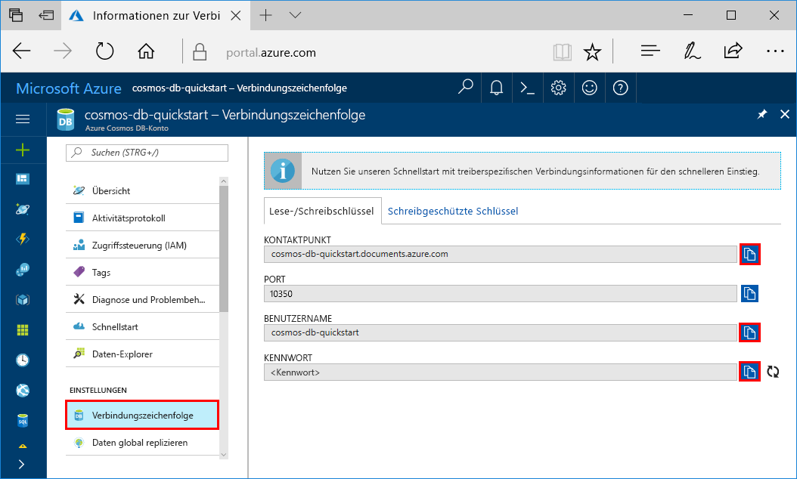

# <a name="quickstart-build-a-cassandra-app-with-python-and-azure-cosmos-db"></a>Schnellstartanleitung: Erstellen einer Cassandra-App mit Python und Azure Cosmos DB

In dieser Schnellstartanleitung erfahren Sie, wie Sie mithilfe von Python und der [Cassandra-API](cassandra-introduction.md) von Azure Cosmos DB eine Profil-App erstellen, indem Sie ein Beispiel von GitHub klonen. Außerdem wird in dieser Schnellstartanleitung die Erstellung eines Azure Cosmos DB-Kontos über das webbasierte Azure-Portal gezeigt.

Azure Cosmos DB ist ein global verteilter Datenbankdienst von Microsoft mit mehreren Modellen. Sie können schnell Dokument-, Tabellen-, Schlüssel-Wert- und Graph-Datenbanken erstellen und abfragen und dabei stets die Vorteile der globalen Verteilung und der horizontalen Skalierung nutzen, die Azure Cosmos DB zugrunde liegen.   

## <a name="prerequisites"></a>Voraussetzungen

* Bevor Sie dieses Beispiel ausführen können, müssen folgende Voraussetzungen erfüllt sein:
    * [Python](https://www.python.org/downloads/) (Version 2.7.14)
    * [Git](http://git-scm.com/)
    * [Python-Treiber für Apache Cassandra](https://github.com/datastax/python-driver)

[!INCLUDE [quickstarts-free-trial-note](../../includes/quickstarts-free-trial-note.md)] Alternativ können Sie [Azure Cosmos DB ohne Azure-Abonnement testen](https://azure.microsoft.com/try/cosmosdb/) – kostenlos und ohne Verpflichtung.


## <a name="create-a-database-account"></a>Erstellen eines Datenbankkontos

Vor dem Erstellen einer Dokumentdatenbank müssen Sie mit Azure Cosmos DB ein Cassandra-Konto erstellen.

[!INCLUDE [cosmos-db-create-dbaccount-cassandra](../../includes/cosmos-db-create-dbaccount-cassandra.md)]

## <a name="clone-the-sample-application"></a>Klonen der Beispielanwendung

In diesem Schritt klonen wir eine Cassandra-API-App aus GitHub, legen die Verbindungszeichenfolge fest und führen die App aus. Sie werden feststellen, wie einfach Sie programmgesteuert mit Daten arbeiten können. 

1. Öffnen Sie ein Terminalfenster von Git (z. B. Git Bash), und verwenden Sie den Befehl `cd`, um den Ordner zu ändern, in den die Beispiel-App gespeichert wird. 

    ```bash
    cd "C:\git-samples"
    ```

2. Führen Sie den folgenden Befehl aus, um das Beispielrepository zu klonen. Dieser Befehl erstellt eine Kopie der Beispiel-App auf Ihrem Computer. 

    ```bash
    git clone https://github.com/Azure-Samples/azure-cosmos-db-cassandra-python-getting-started.git
    ```

## <a name="review-the-code"></a>Überprüfen des Codes

Dieser Schritt ist optional. Wenn Sie erfahren möchten, wie die Datenbankressourcen im Code erstellt werden, können Sie sich die folgenden Codeausschnitte ansehen. Die Codeausschnitte stammen alle aus der Datei `pyquickstart.py`. Andernfalls können Sie mit [Aktualisieren der Verbindungszeichenfolge](#update-your-connection-string) fortfahren. 

* Benutzername und Kennwort werden auf der Seite „Verbindungszeichenfolge“ des Azure-Portals festgelegt. Ersetzen Sie „path\to\cert“ durch den Pfad zu Ihrem X.509-Zertifikat.

   ```python
    ssl_opts = {
            'ca_certs': 'path\to\cert',
            'ssl_version': ssl.PROTOCOL_TLSv1_2
            }
    auth_provider = PlainTextAuthProvider( username=cfg.config['username'], password=cfg.config['password'])
    cluster = Cluster([cfg.config['contactPoint']], port = cfg.config['port'], auth_provider=auth_provider, ssl_options=ssl_opts)
    session = cluster.connect()
   
   ```

* `cluster` wird mit contactPoint-Informationen initialisiert. Der Kontaktpunkt (contactPoint) wird aus dem Azure-Portal abgerufen.

    ```python
   cluster = Cluster([cfg.config['contactPoint']], port = cfg.config['port'], auth_provider=auth_provider)
    ```

* `cluster` stellt eine Verbindung mit der Cassandra-API von Azure Cosmos DB her.

    ```python
    session = cluster.connect()
    ```

* Ein neuer Keyspace wird erstellt.

    ```python
   session.execute('CREATE KEYSPACE IF NOT EXISTS uprofile WITH replication = {\'class\': \'NetworkTopologyStrategy\', \'datacenter1\' : \'1\' }')
    ```

* Eine neue Tabelle wird erstellt.

   ```
   session.execute('CREATE TABLE IF NOT EXISTS uprofile.user (user_id int PRIMARY KEY, user_name text, user_bcity text)');
   ```

* Schlüssel-Wert-Entitäten werden eingefügt.

    ```Python
    insert_data = session.prepare("INSERT INTO  uprofile.user  (user_id, user_name , user_bcity) VALUES (?,?,?)")
    batch = BatchStatement()
    batch.add(insert_data, (1, 'LyubovK', 'Dubai'))
    batch.add(insert_data, (2, 'JiriK', 'Toronto'))
    batch.add(insert_data, (3, 'IvanH', 'Mumbai'))
    batch.add(insert_data, (4, 'YuliaT', 'Seattle'))
    ....
    session.execute(batch)
    ```

* Abfrage zum Abrufen aller Schlüsselwerte.

    ```Python
    rows = session.execute('SELECT * FROM uprofile.user')
    ```  
    
* Abfrage zum Abrufen eines Schlüsselwerts.

    ```Python
    
    rows = session.execute('SELECT * FROM uprofile.user where user_id=1')
    ```  

## <a name="update-your-connection-string"></a>Aktualisieren der Verbindungszeichenfolge

Wechseln Sie nun zurück zum Azure-Portal, um die Informationen der Verbindungszeichenfolge abzurufen und in die App zu kopieren. Dadurch kann Ihre App mit Ihrer gehosteten Datenbank kommunizieren.

1. Klicken Sie im [Azure-Portal](http://portal.azure.com/) auf **Verbindungszeichenfolge**. 

    Verwenden Sie die Schaltfläche  auf der rechten Seite des Bildschirms, um den obersten Wert (den Kontaktpunkt) zu kopieren.

    

2. Öffnen Sie die Datei `config.py` . 

3. Ersetzen Sie `<FILLME>` in Zeile 10 durch den Kontaktpunktwert aus dem Portal.

    Zeile 10 sollte nun in etwa wie folgt aussehen: 

    `'contactPoint': 'cosmos-db-quickstarts.documents.azure.com:10350'`

4. Kopieren Sie den Wert für den Benutzernamen aus dem Portal, und überschreiben Sie damit `<FILLME>` in Zeile 6.

    Zeile 6 sollte nun in etwa wie folgt aussehen: 

    `'username': 'cosmos-db-quickstart',`
    
5. Kopieren Sie den Wert für das Kennwort aus dem Portal, und überschreiben Sie damit `<FILLME>` in Zeile 8.

    Zeile 8 sollte nun in etwa wie folgt aussehen:

    `'password' = '2Ggkr662ifxz2Mg==`';`

6. Speichern Sie die Datei „config.py“.
    
## <a name="use-the-x509-certificate"></a>Verwenden des X.509-Zertifikats

1. Falls Sie „Baltimore CyberTrust Root“ hinzufügen müssen, verwenden Sie die Seriennummer „02:00:00:b9“ und den SHA1-Fingerabdruck „d4🇩🇪20:d0:5e:66:fc:53:fe:1a:50:88:2c:78:db:28:52:ca:e4:74“. Das Zertifikat kann unter https://cacert.omniroot.com/bc2025.crt heruntergeladen und als lokale Datei mit der Erweiterung „.cer“ gespeichert werden.

2. Öffnen Sie „pyquickstart.py“ und ändern Sie „path\to\cert“, um auf das neue Zertifikat zu verweisen.

3. Speichern Sie „pyquickstart.py“.

## <a name="run-the-app"></a>Ausführen der App

1. Wechseln Sie im Terminal von Git mithilfe des cd-Befehls zum Ordner „azure-cosmos-db-cassandra-python-getting-started“. 

2. Führen Sie die folgenden Befehle aus, um die erforderlichen Module zu installieren:

    ```python
    python -m pip install cassandra-driver
    python -m pip install prettytable
    python -m pip install requests
    python -m pip install pyopenssl
    ```

2. Führen Sie den folgenden Befehl aus, um Ihre Node-Anwendung zu starten:

    ```
    python pyquickstart.py
    ```

3. Überprüfen Sie die Ergebnisse über die Befehlszeile.

    Drücken Sie STRG+C, um die Programmausführung zu beenden und das Konsolenfenster zu schließen. 
    
    Nun können Sie im Azure-Portal den Daten-Explorer öffnen, um die neuen Daten anzuzeigen, abzufragen, anzupassen und zu verwenden. 

    

## <a name="review-slas-in-the-azure-portal"></a>Überprüfen von SLAs im Azure-Portal

[!INCLUDE [cosmosdb-tutorial-review-slas](../../includes/cosmos-db-tutorial-review-slas.md)]

## <a name="clean-up-resources"></a>Bereinigen von Ressourcen

[!INCLUDE [cosmosdb-delete-resource-group](../../includes/cosmos-db-delete-resource-group.md)]

## <a name="next-steps"></a>Nächste Schritte

In diesem Schnellstart haben Sie gelernt, wie Sie ein Azure Cosmos DB-Konto erstellen, eine Sammlung mit dem Daten-Explorer erstellen und eine Web-App ausführen. Jetzt können Sie zusätzliche Daten in Ihr Cosmos DB-Konto importieren. 

> [!div class="nextstepaction"]
> [Azure Cosmos DB: Import Cassandra data](cassandra-import-data.md) (Azure Cosmos DB: Importieren von Cassandra-Daten)

