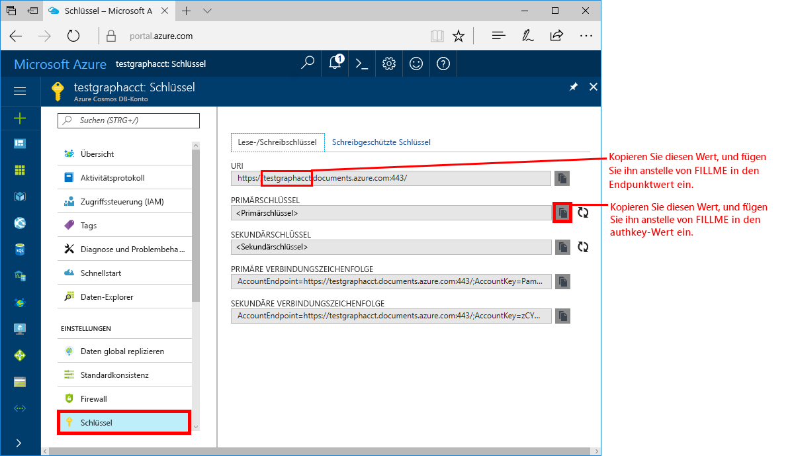
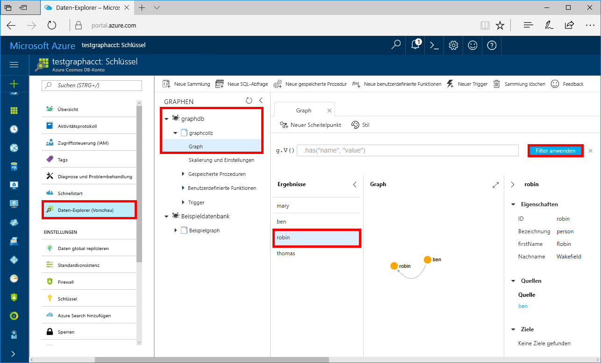

# <a name="azure-cosmos-db-build-a-net-framework-or-core-application-using-the-graph-api"></a>Azure Cosmos DB: Erstellen einer .NET Framework oder Core-Anwendung mit der Graph-API

Azure Cosmos DB ist der global verteilte Microsoft-Datenbankdienst mit mehreren Modellen. Sie können schnell Dokument-, Schlüssel/Wert- und Graph-Datenbanken erstellen und abfragen und dabei stets die Vorteile der globalen Verteilung und der horizontalen Skalierung nutzen, die Azure Cosmos DB zugrunde liegen. 

In diesem Schnellstart wird veranschaulicht, wie Sie mithilfe des Azure-Portals ein [Graph-API](graph-introduction.md)-Konto, eine Datenbank und einen Graph (Container) für Azure Cosmos DB-Konto erstellen. Anschließend erstellen Sie eine Konsolenanwendung mithilfe des Open-Source-Treibers [Gremlin.Net](http://tinkerpop.apache.org/docs/3.2.7/reference/#gremlin-DotNet) und führen diese aus.  

## <a name="prerequisites"></a>Voraussetzungen

Falls Sie Visual Studio 2017 noch nicht installiert haben, können Sie die **kostenlose** [Visual Studio 2017 Community-Edition](https://www.visualstudio.com/downloads/) herunterladen und verwenden. Aktivieren Sie beim Setup von Visual Studio die Option **Azure-Entwicklung**.

Falls Sie Visual Studio 2017 bereits installiert haben, stellen Sie sicher, dass alle Updates bis [Visual Studio 2017 Update 3](https://www.visualstudio.com/en-us/news/releasenotes/vs2017-relnotes) installiert sind.

[!INCLUDE [quickstarts-free-trial-note](../../includes/quickstarts-free-trial-note.md)]

## <a name="create-a-database-account"></a>Erstellen eines Datenbankkontos

[!INCLUDE [cosmos-db-create-dbaccount-graph](../../includes/cosmos-db-create-dbaccount-graph.md)]

## <a name="add-a-graph"></a>Hinzufügen eines Graphs

[!INCLUDE [cosmos-db-create-graph](../../includes/cosmos-db-create-graph.md)]

## <a name="clone-the-sample-application"></a>Klonen der Beispielanwendung

Klonen Sie jetzt eine Graph-API-App aus GitHub, legen Sie die Verbindungszeichenfolge fest, und führen Sie diese aus. Sie werden feststellen, wie einfach Sie programmgesteuert mit Daten arbeiten können. 

1. Öffnen Sie ein Git-Terminalfenster (beispielsweise Git Bash), und wechseln Sie mittels `cd` in Ihr Arbeitsverzeichnis.  

2. Führen Sie den folgenden Befehl aus, um das Beispielrepository zu klonen. 

    ```bash
    git clone https://github.com/Azure-Samples/azure-cosmos-db-graph-gremlindotnet-getting-started.git
    ```

3. Öffnen Sie anschließend Visual Studio und die Projektmappendatei.

4. Stellen Sie die NuGet-Pakete im Projekt wieder her. Diese sollten den Treiber „Gremlin.Net“ und das Paket „Newtonsoft.Json“ umfassen.

5. Sie können die Version 3.2.7 des Treibers „Gremlin.Net“ aber auch manuell mithilfe des NuGet-Paket-Managers oder des [NuGet-Befehlszeilentools](https://docs.microsoft.com/en-us/nuget/install-nuget-client-tools) installieren: 

    ```bash
    nuget install Gremlin.Net -Version 3.2.7
    ```

## <a name="review-the-code"></a>Überprüfen des Codes

Es folgt ein kurzer Überblick zu dem, was in der App geschieht. Öffnen Sie die Datei „Program.cs“. Sie stellen fest, dass mit diesen Codezeilen die Azure Cosmos DB-Ressourcen erstellt werden. 

* Legen Sie Ihre Verbindungsparameter auf der Grundlage des weiter oben erstellten Kontos fest (Zeile 19): 

    ```csharp
    private static string hostname = "your-endpoint.gremlin.cosmosdb.azure.com";
    private static int port = 443;
    private static string authKey = "your-authentication-key";
    private static string database = "your-database";
    private static string collection = "your-collection-or-graph";
    ```

* Die auszuführenden Gremlin-Befehle sind in einem Wörterbuch aufgeführt (Zeile 26):

    ```csharp
    private static Dictionary<string, string> gremlinQueries = new Dictionary<string, string>
    {
        { "Cleanup",        "g.V().drop()" },
        { "AddVertex 1",    "g.addV('person').property('id', 'thomas').property('firstName', 'Thomas').property('age', 44)" },
        { "AddVertex 2",    "g.addV('person').property('id', 'mary').property('firstName', 'Mary').property('lastName', 'Andersen').property('age', 39)" },
        { "AddVertex 3",    "g.addV('person').property('id', 'ben').property('firstName', 'Ben').property('lastName', 'Miller')" },
        { "AddVertex 4",    "g.addV('person').property('id', 'robin').property('firstName', 'Robin').property('lastName', 'Wakefield')" },
        { "AddEdge 1",      "g.V('thomas').addE('knows').to(g.V('mary'))" },
        { "AddEdge 2",      "g.V('thomas').addE('knows').to(g.V('ben'))" },
        { "AddEdge 3",      "g.V('ben').addE('knows').to(g.V('robin'))" },
        { "UpdateVertex",   "g.V('thomas').property('age', 44)" },
        { "CountVertices",  "g.V().count()" },
        { "Filter Range",   "g.V().hasLabel('person').has('age', gt(40))" },
        { "Project",        "g.V().hasLabel('person').values('firstName')" },
        { "Sort",           "g.V().hasLabel('person').order().by('firstName', decr)" },
        { "Traverse",       "g.V('thomas').out('knows').hasLabel('person')" },
        { "Traverse 2x",    "g.V('thomas').out('knows').hasLabel('person').out('knows').hasLabel('person')" },
        { "Loop",           "g.V('thomas').repeat(out()).until(has('id', 'robin')).path()" },
        { "DropEdge",       "g.V('thomas').outE('knows').where(inV().has('id', 'mary')).drop()" },
        { "CountEdges",     "g.E().count()" },
        { "DropVertex",     "g.V('thomas').drop()" },
    };
    ```


* Erstellen Sie ein `GremlinServer`-Verbindungsobjekt mit den weiter oben angegebenen Parametern (Zeile 52):

    ```csharp
    var gremlinServer = new GremlinServer(hostname, port, enableSsl: true, 
                                                    username: "/dbs/" + database + "/colls/" + collection, 
                                                    password: authKey);
    ```

* Erstellen Sie ein neues `GremlinClient`-Objekt (Zeile 56):

    ```csharp
    var gremlinClient = new GremlinClient(gremlinServer);
    ```

* Führen Sie die einzelnen Gremlin-Abfragen mit dem `GremlinClient`-Objekt mit einer asynchronen Aufgabe aus (Zeile 63). Dadurch werden die Gremlin-Abfragen aus dem weiter oben definierten Wörterbuch gelesen (Zeile 26):

    ```csharp
    var task = gremlinClient.SubmitAsync<dynamic>(query.Value);
    task.Wait();
    ```

* Rufen Sie die Ergebnisse ab, und lesen Sie die als Wörterbuch formatierten Werte unter Verwendung der Klasse `JsonSerializer` aus „Newtonsoft.Json“:

    ```csharp
    foreach (var result in task.Result)
    {
        // The vertex results are formed as dictionaries with a nested dictionary for their properties
        string output = JsonConvert.SerializeObject(result);
        Console.WriteLine(String.Format("\tResult:\n\t{0}", output));
    }
    ```

## <a name="update-your-connection-string"></a>Aktualisieren der Verbindungszeichenfolge

Wechseln Sie nun zurück zum Azure-Portal, um die Informationen der Verbindungszeichenfolge abzurufen und in die App zu kopieren.

1. Klicken Sie im [Azure-Portal](http://portal.azure.com/) auf **Schlüssel**. 

    Kopieren Sie den ersten Teil des URI-Werts.

    

2. Fügen Sie den Wert in Zeile 19 von „Program.cs“ ein, sodass er `your-endpoint` in der Variablen `hostname` ersetzt. 

    `"private static string hostname = "your-endpoint.gremlin.cosmosdb.azure.com";`

    Der Endpunktwert sollte nun wie folgt aussehen:

    `"private static string hostname = "testgraphacct.gremlin.cosmosdb.azure.com";`

3. Kopieren Sie den Wert für **PRIMÄRSCHLÜSSEL** aus dem Portal, und fügen Sie ihn in die Variable `authkey` ein, sodass er den Platzhalter `"your-authentication-key"` in Zeile 21 ersetzt. 

    `private static string authKey = "your-authentication-key";`

4. Fügen Sie den Datenbanknamen aus den Informationen der weiter oben erstellten Datenbank in die Variable `database` ein (Zeile 22). 

    `private static string database = "your-database";`

5. Fügen Sie den Namen der Sammlung (der gleichzeitig der Graphname ist) aus den Informationen der weiter oben erstellten Sammlung in die Variable `collection` ein (Zeile 23). 

    `private static string collection = "your-collection-or-graph";`

6. Speichern Sie die Datei "Program.cs". 

Sie haben die App nun mit allen erforderlichen Informationen für die Kommunikation mit Azure Cosmos DB aktualisiert. 

## <a name="run-the-console-app"></a>Ausführen der Konsolenanwendung

Drücken Sie STRG+F5, um die Anwendung auszuführen. Die Anwendung gibt sowohl die Gremlin-Abfragebefehle als auch die Ergebnisse in der Konsole aus.

   Im Konsolenfenster werden die Scheitelpunkte und Ränder angezeigt, die dem Graph hinzugefügt werden. Drücken Sie nach Abschluss des Skripts die EINGABETASTE, um das Konsolenfenster zu schließen.

## <a name="browse-using-the-data-explorer"></a>Durchsuchen mit dem Daten-Explorer

Sie können nun zum Daten-Explorer im Azure-Portal zurückkehren und die neuen Graph-Daten durchsuchen und abfragen.

1. Im Daten-Explorer wird die neue Datenbank im Diagrammbereich angezeigt. Erweitern Sie den Datenbank- und den Sammlungsknoten, und klicken Sie anschließend auf **Graph**.

2. Klicken Sie auf die Schaltfläche **Filter anwenden**, um die Standardabfrage zum Anzeigen aller Scheitelpunkte im Diagramm zu verwenden. Die von der Beispiel-App generierten Daten werden im Graphen-Bereich angezeigt.

    Sie können die Diagrammansicht vergrößern und verkleinern, den Anzeigebereich des Diagramms erweitern, zusätzliche Scheitelpunkte hinzufügen und Scheitelpunkte auf der Anzeigeoberfläche verschieben.

    

## <a name="review-slas-in-the-azure-portal"></a>Überprüfen von SLAs im Azure-Portal

[!INCLUDE [cosmosdb-tutorial-review-slas](../../includes/cosmos-db-tutorial-review-slas.md)]

## <a name="clean-up-resources"></a>Bereinigen von Ressourcen

Wenn Sie diese App nicht weiter verwenden möchten, löschen Sie alle von diesem Schnellstart erstellten Ressourcen im Azure-Portal. Führen Sie dazu folgende Schritte durch: 

1. Klicken Sie im Azure-Portal im Menü auf der linken Seite auf **Ressourcengruppen**, und klicken Sie auf den Namen der erstellten Ressource. 
2. Klicken Sie auf der Seite mit Ihrer Ressourcengruppe auf **Löschen**, geben Sie im Textfeld den Namen der zu löschenden Ressource ein, und klicken Sie dann auf **Löschen**.

## <a name="next-steps"></a>Nächste Schritte

In diesem Schnellstart haben Sie gelernt, wie Sie ein Azure Cosmos DB-Konto erstellen, einen Graph mit dem Daten-Explorer erstellen und eine App ausführen. Nun können Sie komplexere Abfragen erstellen und leistungsfähige Logik zum Traversieren von Graphen mit Gremlin implementieren. 

> [!div class="nextstepaction"]
> [Query using Gremlin (Abfragen mithilfe von Gremlin)](tutorial-query-graph.md)

