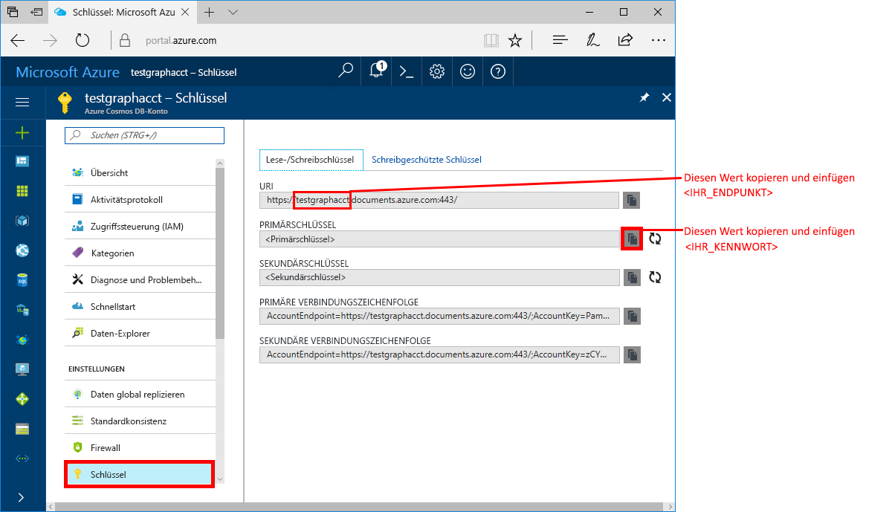
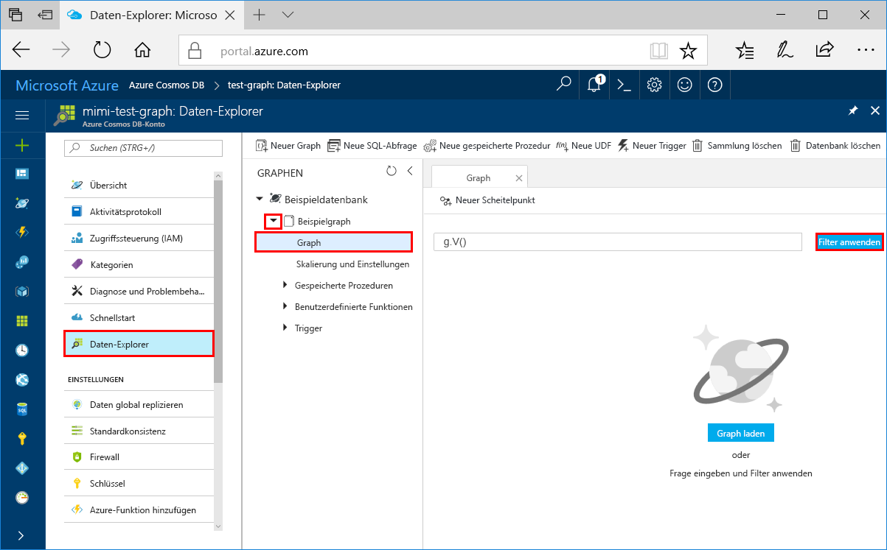
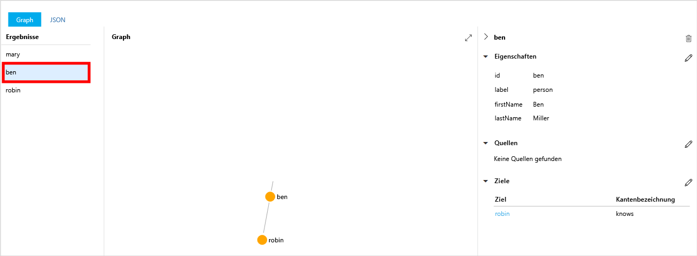
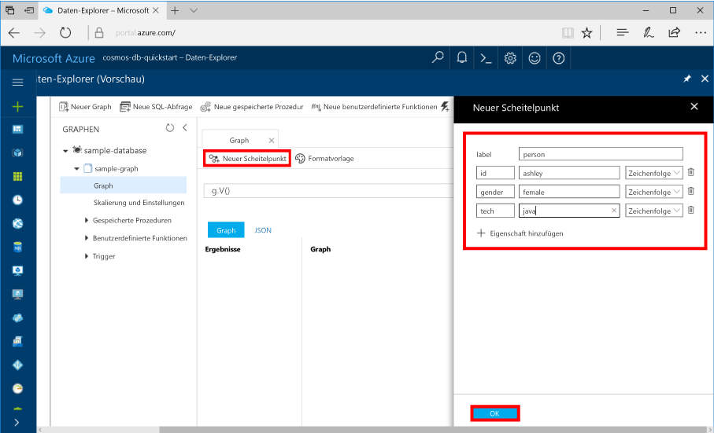

# <a name="azure-cosmos-db-create-a-graph-database-using-python-and-the-azure-portal"></a>Azure Cosmos DB: Erstellen einer Graphdatenbank mit Python und dem Azure-Portal

> [!div class="op_single_selector"]
> * [Gremlin-Konsole](create-graph-gremlin-console.md)
> * [.NET](create-graph-dotnet.md)
> * [Java](create-graph-java.md)
> * [Node.js](create-graph-nodejs.md)
> * [Python](create-graph-python.md)
> * [PHP](create-graph-php.md)
>  

In dieser Schnellstartanleitung erfahren Sie, wie Sie mithilfe von Python und der [Gremlin-API](graph-introduction.md) von Azure Cosmos DB eine Konsolen-App erstellen, indem Sie ein Beispiel von GitHub klonen. Außerdem wird in dieser Schnellstartanleitung die Erstellung eines Azure Cosmos DB-Kontos über das webbasierte Azure-Portal gezeigt.   

Azure Cosmos DB ist ein global verteilter Datenbankdienst von Microsoft mit mehreren Modellen. Sie können schnell Dokument-, Tabellen-, Schlüssel-Wert- und Graph-Datenbanken erstellen und abfragen und dabei stets die Vorteile der globalen Verteilung und der horizontalen Skalierung nutzen, die Azure Cosmos DB bietet.  

> [!NOTE]
> Für die in dieser Schnellstartanleitung beschriebenen Schritte benötigen Sie ein Graphdatenbankkonto, das nach dem 20. Dezember 2017 erstellt wurde. Bestehende Konten unterstützen Python, nachdem diese zur Version für die allgemeine Verfügbarkeit migriert wurden.

## <a name="prerequisites"></a>Voraussetzungen

[!INCLUDE [quickstarts-free-trial-note](../../includes/quickstarts-free-trial-note.md)] Alternativ können Sie [Azure Cosmos DB ohne Azure-Abonnement testen](https://azure.microsoft.com/try/cosmosdb/) – kostenlos und ohne Verpflichtung.

Außerdem haben Sie folgende Möglichkeiten:
* [Python](https://www.python.org/downloads/) Version 3.5 oder höher
* [pip-Paket-Manager](https://pip.pypa.io/en/stable/installing/)
* [Git-Client](http://git-scm.com/)
* [Python-Treiber für Gremlin](https://github.com/apache/tinkerpop/tree/master/gremlin-python)

## <a name="create-a-database-account"></a>Erstellen eines Datenbankkontos

Vor dem Erstellen einer Graphdatenbank müssen Sie ein Gremlin (Graph)-Datenbankkonto mit Azure Cosmos DB erstellen.

[!INCLUDE [cosmos-db-create-dbaccount-graph](../../includes/cosmos-db-create-dbaccount-graph.md)]

## <a name="add-a-graph"></a>Hinzufügen eines Graphs

[!INCLUDE [cosmos-db-create-graph](../../includes/cosmos-db-create-graph.md)]

## <a name="clone-the-sample-application"></a>Klonen der Beispielanwendung

Beginnen wir nun mit der Verwendung von Code. Klonen Sie eine Gremlin-API-App aus GitHub, legen Sie die Verbindungszeichenfolge fest, und führen Sie sie aus. Sie werden feststellen, wie einfach Sie programmgesteuert mit Daten arbeiten können.  

1. Öffnen Sie eine Eingabeaufforderung, erstellen Sie einen neuen Ordner namens „git-samples“, und schließen Sie die Eingabeaufforderung.

    ```bash
    md "C:\git-samples"
    ```

2. Öffnen Sie ein Terminalfenster von Git (z. B. Git Bash), und verwenden Sie den Befehl `cd`, um den Ordner zu ändern, in den die Beispiel-App gespeichert wird.  

    ```bash
    cd "C:\git-samples"
    ```

3. Führen Sie den folgenden Befehl aus, um das Beispielrepository zu klonen. Dieser Befehl erstellt eine Kopie der Beispiel-App auf Ihrem Computer. 

    ```bash
    git clone https://github.com/Azure-Samples/azure-cosmos-db-graph-python-getting-started.git
    ```

## <a name="review-the-code"></a>Überprüfen des Codes

Dieser Schritt ist optional. Wenn Sie erfahren möchten, wie die Datenbankressourcen im Code erstellt werden, können Sie sich die folgenden Codeausschnitte ansehen. Die Codeausschnitte stammen alle aus der Datei „connect.py“ im Ordner „C:\git-samples\azure-cosmos-db-graph-python-getting-started\“. Andernfalls können Sie mit [Aktualisieren der Verbindungszeichenfolge](#update-your-connection-information) fortfahren. 

* Der Gremlin-Client `client` wird in Zeile 104 `connect.py` initialisiert:

    ```python
    ...
    client = client.Client('wss://<YOUR_ENDPOINT>.gremlin.cosmosdb.azure.com:443/','g', 
        username="/dbs/<YOUR_DATABASE>/colls/<YOUR_COLLECTION_OR_GRAPH>", 
        password="<YOUR_PASSWORD>")
    ...
    ```

* Eine Reihe von Schritten für Gremlin wird am Anfang der Datei `connect.py` deklariert. Diese werden dann mit der Methode `client.submitAsync()` ausgeführt:

    ```python
    client.submitAsync(_gremlin_cleanup_graph)
    ```

## <a name="update-your-connection-information"></a>Aktualisieren der Verbindungsinformationen

Wechseln Sie nun zurück zum Azure-Portal, um die Verbindungsinformationen abzurufen und in die App zu kopieren. Durch diese Einstellungen kann Ihre App mit Ihrer gehosteten Datenbank kommunizieren.

1. Klicken Sie im [Azure-Portal](http://portal.azure.com/) auf **Schlüssel**. 

    Kopieren Sie den ersten Teil des URI-Werts.

    

2. Öffnen Sie die Datei „connect.py“, und fügen Sie in Zeile 104 den URI-Wert über `<YOUR_ENDPOINT>` hier ein:

    ```python
    client = client.Client('wss://<YOUR_ENDPOINT>.gremlin.cosmosdb.azure.com:443/','g', 
        username="/dbs/<YOUR_DATABASE>/colls/<YOUR_COLLECTION_OR_GRAPH>", 
        password="<YOUR_PASSWORD>")
    ```

    Der URI-Teil des Clientobjekts sollte nun ungefähr wie im folgenden Code aussehen:

    ```python
    client = client.Client('wss://test.gremlin.cosmosdb.azure.com:443/','g', 
        username="/dbs/<YOUR_DATABASE>/colls/<YOUR_COLLECTION_OR_GRAPH>", 
        password="<YOUR_PASSWORD>")
    ```

3. Ändern Sie den zweiten Parameter des `client`-Objekts, um die Zeichenfolgen `<YOUR_DATABASE>` und `<YOUR_COLLECTION_OR_GRAPH>` zu ersetzen. Wenn Sie die vorgeschlagenen Werte verwendet haben, sollte der Parameter wie im folgenden Code aussehen:

    `username="/dbs/sample-database/colls/sample-graph"`

    Das gesamte `client`-Objekt sollte nun wie im folgenden Code aussehen:

    ```python
    client = client.Client('wss://test.gremlin.cosmosdb.azure.com:443/','g', 
        username="/dbs/sample-database/colls/sample-graph", 
        password="<YOUR_PASSWORD>")
    ```

4. Verwenden Sie die Schaltfläche zum Kopieren im Azure-Portal, um den PRIMÄRSCHLÜSSEL zu kopieren und ihn über `<YOUR_PASSWORD>` in den Parameter `password=<YOUR_PASSWORD>` einzufügen.

    Das gesamte `client`-Objektdefinition sollte nun wie im folgenden Code aussehen:
    ```python
    client = client.Client('wss://test.gremlin.cosmosdb.azure.com:443/','g', 
        username="/dbs/sample-database/colls/sample-graph", 
        password="asdb13Fadsf14FASc22Ggkr662ifxz2Mg==")
    ```

6. Speichern Sie die Datei `connect.py`.

## <a name="run-the-console-app"></a>Ausführen der Konsolenanwendung

1. Wechseln Sie im Terminalfenster von Git mithilfe von `cd` zum Ordner „azure-cosmos-db-graph-python-getting-started“.

    ```git
    cd "C:\git-samples\azure-cosmos-db-graph-python-getting-started"
    ```

2. Verwenden Sie im Git-Terminalfenster den folgenden Befehl, um die erforderlichen Python-Pakete zu installieren.

   ```
   pip install -r requirements.txt
   ```

3. Verwenden Sie im Git-Terminalfenster den folgenden Befehl, um die Python-Anwendung zu starten.
    
    ```
    python connect.py
    ```

    Im Terminalfenster werden die Scheitelpunkte und Kanten angezeigt, die dem Graph hinzugefügt werden. 
    
    Wenn Timeoutfehler auftreten, überprüfen Sie, ob Sie die Verbindungsinformationen unter [Aktualisieren der Verbindungsinformationen](#update-your-connection-information) richtig aktualisiert haben, und versuchen Sie auch, den letzten Befehl erneut auszuführen. 
    
    Drücken Sie nach Abschluss des Programms die EINGABETASTE, und wechseln Sie dann in Ihrem Internetbrowser wieder zum Azure-Portal.

<a id="add-sample-data"></a>
## <a name="review-and-add-sample-data"></a>Überprüfen und Hinzufügen von Beispieldaten

Nun können Sie wieder zum Daten-Explorer zurückkehren, um sich die dem Graph hinzugefügten Scheitelpunkte anzusehen und weitere Datenpunkte hinzuzufügen.

1. Erweitern Sie im **Daten-Explorer** **sample-graph**, klicken Sie auf **Graph**, und klicken Sie anschließend auf **Filter anwenden**. 

   

2. Beachten Sie in der Liste **Ergebnisse** die Benutzer, die dem Graph neu hinzugefügt wurden. Wählen Sie **ben** aus, und beachten Sie, dass er mit „robin“ verbunden ist. Sie können die Scheitelpunkte bewegen, indem Sie sie ziehen und loslassen, zoomen, indem Sie das Mausrad verwenden, und die Größe des Graphen verändern, indem Sie auf den Doppelpfeil klicken. 

   

3. Fügen Sie nun einige neue Benutzer hinzu. Klicken Sie auf die Schaltfläche **New Vertex** (Neuer Scheitelpunkt), um dem Graph Daten hinzuzufügen.

   

4. Geben Sie als Bezeichnung *Person* ein.

5. Klicken Sie auf **Eigenschaft hinzufügen**, um die folgenden Eigenschaften hinzuzufügen: Beachten Sie, dass Sie für jede Person in Ihrem Graph eindeutige Eigenschaften erstellen können. Nur der id-Schlüssel ist erforderlich.

    key|value|Notizen
    ----|----|----
    id|ashley|Der eindeutige Bezeichner für den Scheitelpunkt. Wenn Sie keine ID angeben, wird automatisch eine ID generiert.
    gender|female| 
    tech | java | 

    > [!NOTE]
    > In dieser Schnellstartanleitung wird eine nicht partitionierte Sammlung erstellt. Wenn Sie hingegen eine partitionierte Sammlung erstellen, indem Sie bei der Sammlungserstellung einen Partitionsschlüssel angeben, muss der Partitionsschlüssel jedem neuen Scheitelpunkt als Schlüssel hinzugefügt werden. 

6. Klicken Sie auf **OK**. Der Bildschirm muss möglicherweise erweitert werden, damit **OK** am unteren Bildschirmrand zu sehen ist.

7. Klicken Sie erneut auf **New Vertex** (Neuer Scheitelpunkt), und fügen Sie einen weiteren neuen Benutzer hinzu. 

8. Geben Sie als Bezeichnung *Person* ein.

9. Klicken Sie auf **Eigenschaft hinzufügen**, um die folgenden Eigenschaften hinzuzufügen:

    key|value|Notizen
    ----|----|----
    id|rakesh|Der eindeutige Bezeichner für den Scheitelpunkt. Wenn Sie keine ID angeben, wird automatisch eine ID generiert.
    gender|male| 
    school|MIT| 

10. Klicken Sie auf **OK**. 

11. Klicken Sie auf die Schaltfläche **Filter anwenden** mit dem Standardfilter `g.V()`, um alle Werte des Graphen anzuzeigen. Daraufhin werden alle Benutzer in der Liste **Ergebnisse** angezeigt. 

    Wenn Sie weitere Daten hinzufügen, können Sie Ihre Ergebnisse mithilfe von Filtern eingrenzen. Daten-Explorer verwendet standardmäßig `g.V()`, um alle Scheitelpunkte eines Graphen abzurufen. Sie können ihn in eine andere [Graphabfrage](tutorial-query-graph.md) wie z.B. `g.V().count()` ändern, um die Anzahl aller Scheitelpunkte eines Graphen im JSON-Format zurückzugeben. Wenn Sie den Filter geändert haben, ändern Sie den Filter zurück in `g.V()`, und klicken Sie auf **Filter anwenden**, um wieder alle Ergebnisse anzuzeigen.

12. Als Nächstes verbinden wir „rakesh“ und „ashley“. Vergewissern Sie sich, dass **ashley** in der Liste **Ergebnisse** ausgewählt ist, und klicken Sie anschließend rechts unten neben **Ziele** auf die Bearbeitungsschaltfläche. Möglicherweise müssen Sie Ihr Fenster verbreitern, damit der Bereich **Eigenschaften** zu sehen ist.

   

13. Geben Sie im Feld **Ziel** die Zeichenfolge *rakesh* und im Feld **Edge label** (Edgebezeichner) die Zeichenfolge *knows* ein, und klicken Sie anschließend auf das Häkchen.

   

14. Wählen Sie nun in der Ergebnisliste den Eintrag **rakesh** aus. Wie Sie sehen, sind „ashley“ und „rakesh“ miteinander verbunden. 

   

   Damit haben Sie den Teil des Tutorials, in dem die Ressourcen erstellt werden, abgeschlossen. Sie können weiter Scheitelpunkte zu Ihrem Graphen hinzufügen, die vorhandenen Scheitelpunkte anpassen oder die Abfragen ändern. Sehen Sie sich nun die von Azure Cosmos DB bereitgestellten Metriken an, und bereinigen Sie anschließend die Ressourcen. 

## <a name="review-slas-in-the-azure-portal"></a>Überprüfen von SLAs im Azure-Portal

[!INCLUDE [cosmosdb-tutorial-review-slas](../../includes/cosmos-db-tutorial-review-slas.md)]

## <a name="clean-up-resources"></a>Bereinigen von Ressourcen

[!INCLUDE [cosmosdb-delete-resource-group](../../includes/cosmos-db-delete-resource-group.md)]

## <a name="next-steps"></a>Nächste Schritte

In diesem Schnellstart haben Sie gelernt, wie Sie ein Azure Cosmos DB-Konto erstellen, einen Graph mit dem Daten-Explorer erstellen und eine App ausführen. Nun können Sie komplexere Abfragen erstellen und leistungsfähige Logik zum Traversieren von Graphen mit Gremlin implementieren. 

> [!div class="nextstepaction"]
> [Query using Gremlin (Abfragen mithilfe von Gremlin)](tutorial-query-graph.md)

