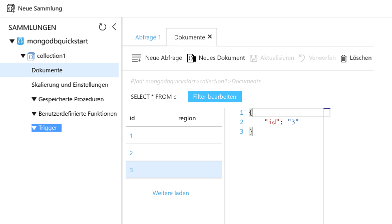

# <a name="quickstart-migrate-an-existing-mongodb-nodejs-web-app-to-azure-cosmos-db"></a>Schnellstart: Migrieren einer vorhandenen MongoDB-Node.js-Web-App zu Azure Cosmos DB 

> [!div class="op_single_selector"]
> * [.NET](create-mongodb-dotnet.md)
> * [Java](create-mongodb-java.md)
> * [Node.js](create-mongodb-nodejs.md)
> * [Python](create-mongodb-flask.md)
> * [Xamarin](create-mongodb-xamarin.md)
> * [Golang](create-mongodb-golang.md)
>  

Azure Cosmos DB ist der global verteilte Microsoft-Datenbankdienst mit mehreren Modellen. Sie können schnell Dokument-, Schlüssel/Wert- und Graph-Datenbanken erstellen und abfragen und dabei stets die Vorteile der globalen Verteilung und der horizontalen Skalierung nutzen, die Cosmos DB zugrunde liegen. 

Dieser Schnellstart veranschaulicht, wie Sie eine vorhandene, in Node.js geschriebene MongoDB-App verwenden und sie mit Ihrer Cosmos-Datenbank verbinden, die den MongoDB-Client unterstützt. Anders ausgedrückt: Für die Anwendung ist es ersichtlich, dass die Daten in einer Cosmos-Datenbank gespeichert sind.

Wenn Sie fertig sind, wird eine MEAN-Anwendung (MongoDB, Express, Angular und Node.js) in [Cosmos DB](https://azure.microsoft.com/services/cosmos-db/) ausgeführt. 


[!INCLUDE [cloud-shell-try-it](../../includes/cloud-shell-try-it.md)]

Wenn Sie die Befehlszeilenschnittstelle lokal installieren und verwenden möchten, müssen Sie für dieses Thema die Azure CLI in Version 2.0 oder höher ausführen. Führen Sie `az --version` aus, um die Version zu finden. Informationen zum Durchführen einer Installation oder eines Upgrades finden Sei bei Bedarf unter [Installieren der Azure CLI]( /cli/azure/install-azure-cli). 

## <a name="prerequisites"></a>Voraussetzungen 
Wenn Sie kein Azure-Abonnement besitzen, können Sie ein [kostenloses Konto](https://azure.microsoft.com/free/?WT.mc_id=A261C142F) erstellen, bevor Sie beginnen. 
[!INCLUDE [cosmos-db-emulator-mongodb](../../includes/cosmos-db-emulator-mongodb.md)]

Zusätzlich zur Azure CLI müssen Sie [Node.js](https://nodejs.org/) und [Git](https://www.git-scm.com/downloads) lokal installieren, um `npm`- und `git`-Befehle auszuführen.

Sie sollten über ausreichende Kenntnisse zu Node.js verfügen. Dieser Schnellstart ist nicht dafür vorgesehen, Ihnen bei der Entwicklung von Node.js-Anwendungen im Allgemeinen zu helfen.

## <a name="clone-the-sample-application"></a>Klonen der Beispielanwendung

Führen Sie die folgenden Befehle aus, um das Beispielrepository zu klonen. Dieses Beispielrepository enthält eine [MEAN.js](https://meanjs.org/)-Standardanwendung.

1. Öffnen Sie eine Eingabeaufforderung, erstellen Sie einen neuen Ordner namens „git-samples“, und schließen Sie die Eingabeaufforderung.

    ```bash
    md "C:\git-samples"
    ```

2. Öffnen Sie ein Git-Terminalfenster (z.B. git bash), und verwenden Sie den Befehl `cd`, um in den neuen Ordner zu gelangen und dort die Beispiel-App zu installieren.

    ```bash
    cd "C:\git-samples"
    ```

3. Führen Sie den folgenden Befehl aus, um das Beispielrepository zu klonen. Dieser Befehl erstellt eine Kopie der Beispiel-App auf Ihrem Computer. 

    ```bash
    git clone https://github.com/prashanthmadi/mean
    ```

## <a name="run-the-application"></a>Ausführen der Anwendung

Installieren Sie die erforderlichen Pakete, und starten Sie die Anwendung.

```bash
cd mean
npm install
npm start
```
Die Anwendung versucht, eine Verbindung mit einer MongoDB-Quelle herzustellen. Dabei tritt ein Fehler auf. Beenden Sie die Anwendung, wenn die Ausgabe „[MongoError: connect ECONNREFUSED 127.0.0.1:27017]“ zurückgibt.

## <a name="log-in-to-azure"></a>Anmelden an Azure

Wenn Sie eine installierte Azure CLI verwenden, melden Sie sich mit dem Befehl [az login](/cli/azure/reference-index#az-login) bei Ihrem Azure-Abonnement an, und befolgen Sie die Anweisungen auf dem Bildschirm. Sie können diesen Schritt überspringen, wenn Sie Azure Cloud Shell verwenden.

```azurecli
az login 
``` 
   
## <a name="add-the-azure-cosmos-db-module"></a>Hinzufügen des Azure Cosmos DB-Moduls

Wenn Sie eine installierte Azure CLI verwenden, überprüfen Sie, ob die `cosmosdb`-Komponente bereits installiert ist, indem Sie den `az`-Befehl ausführen. Wenn `cosmosdb` in der Liste der Basisbefehle enthalten ist, fahren Sie mit dem nächsten Befehl fort. Sie können diesen Schritt überspringen, wenn Sie Azure Cloud Shell verwenden.

Wenn `cosmosdb` nicht in der Liste der Basisbefehle enthalten ist, installieren Sie die [Azure-Befehlszeilenschnittstelle]( /cli/azure/install-azure-cli) erneut.

## <a name="create-a-resource-group"></a>Erstellen einer Ressourcengruppe

Erstellen Sie mit dem Befehl [az group create](/cli/azure/group#az-group-create) eine [Ressourcengruppe](../azure-resource-manager/resource-group-overview.md). Eine Azure-Ressourcengruppe ist ein logischer Container, in dem Azure-Ressourcen wie Web-Apps, Datenbanken und Speicherkonten bereitgestellt und verwaltet werden. 

Im folgenden Beispiel wird eine Ressourcengruppe in der Region „Europa, Westen“ erstellt. Wählen Sie einen eindeutigen Namen für die Ressourcengruppe aus.

Wenn Sie Azure Cloud Shell verwenden, klicken Sie auf **Ausprobieren**, befolgen Sie die Anweisungen auf dem Bildschirm für die Anmeldung, und kopieren Sie dann den Befehl in die Befehlszeile.

```azurecli-interactive
az group create --name myResourceGroup --location "West Europe"
```

## <a name="create-an-azure-cosmos-db-account"></a>Erstellen eines Azure Cosmos DB-Kontos

Erstellen Sie mit dem Befehl [az cosmosdb create](/cli/azure/cosmosdb#az-cosmosdb-create) ein Cosmos-Konto.

Ersetzen Sie im folgenden Befehl den Platzhalter `<cosmosdb-name>` durch Ihren eigenen eindeutigen Cosmos-Kontonamen. Da dieser eindeutige Name als Teil des Cosmos DB-Endpunkts (`https://<cosmosdb-name>.documents.azure.com/`) verwendet wird, muss er für alle Cosmos-Konten in Azure eindeutig sein. 

```azurecli-interactive
az cosmosdb create --name <cosmosdb-name> --resource-group myResourceGroup --kind MongoDB
```

Der `--kind MongoDB`-Parameter ermöglicht MongoDB-Clientverbindungen.

Nach dem Erstellen des Azure Cosmos DB-Kontos zeigt die Azure-CLI ähnliche Informationen wie im folgenden Beispiel an. 

> [!NOTE]
> In diesem Beispiel wird JSON als Azure CLI-Ausgabeformat (Standardeinstellung) verwendet. Informationen zur Verwendung anderer Ausgabeformate finden Sie unter [Ausgabeformate für Azure CLI-Befehle](https://docs.microsoft.com/cli/azure/format-output-azure-cli).

```json
{
  "databaseAccountOfferType": "Standard",
  "documentEndpoint": "https://<cosmosdb-name>.documents.azure.com:443/",
  "id": "/subscriptions/00000000-0000-0000-0000-000000000000/resourceGroups/myResourceGroup/providers/Microsoft.Document
DB/databaseAccounts/<cosmosdb-name>",
  "kind": "MongoDB",
  "location": "West Europe",
  "name": "<cosmosdb-name>",
  "readLocations": [
    {
      "documentEndpoint": "https://<cosmosdb-name>-westeurope.documents.azure.com:443/",
      "failoverPriority": 0,
      "id": "<cosmosdb-name>-westeurope",
      "locationName": "West Europe",
      "provisioningState": "Succeeded"
    }
  ],
  "resourceGroup": "myResourceGroup",
  "type": "Microsoft.DocumentDB/databaseAccounts",
  "writeLocations": [
    {
      "documentEndpoint": "https://<cosmosdb-name>-westeurope.documents.azure.com:443/",
      "failoverPriority": 0,
      "id": "<cosmosdb-name>-westeurope",
      "locationName": "West Europe",
      "provisioningState": "Succeeded"
    }
  ]
} 
```

## <a name="connect-your-nodejs-application-to-the-database"></a>Verbinden der Node.js-Anwendung mit der Datenbank

In diesem Schritt verbinden Sie die MEAN.js-Beispielanwendung mit der soeben erstellten Cosmos-Datenbank. 

<a name="devconfig"></a>
## <a name="configure-the-connection-string-in-your-nodejs-application"></a>Konfigurieren der Verbindungszeichenfolge in der Node.js-Anwendung

Öffnen Sie in Ihrem MEAN.js.Repository `config/env/local-development.js`.

Ersetzen Sie den Inhalt dieser Datei durch den folgenden Code. Achten Sie auch darauf, dass Sie die beiden `<cosmosdb-name>`-Platzhalter durch den Namen Ihres Cosmos-Kontos ersetzen.

```javascript
'use strict';

module.exports = {
  db: {
    uri: 'mongodb://<cosmosdb-name>:<primary_master_key>@<cosmosdb-name>.documents.azure.com:10255/mean-dev?ssl=true&sslverifycertificate=false'
  }
};
```

## <a name="retrieve-the-key"></a>Abrufen des Schlüssels

Um eine Verbindung mit der Cosmos-Datenbank herstellen zu können, benötigen Sie den Datenbankschlüssel. Rufen Sie den Primärschlüssel mit dem Befehl [az cosmosdb list-keys](/cli/azure/cosmosdb#az-cosmosdb-list-keys) ab.

```azurecli-interactive
az cosmosdb list-keys --name <cosmosdb-name> --resource-group myResourceGroup --query "primaryMasterKey"
```

Die Azure-CLI gibt Informationen ähnlich wie im folgenden Beispiel aus. 

```json
"RUayjYjixJDWG5xTqIiXjC..."
```

Kopieren Sie den Wert von `primaryMasterKey`. Fügen Sie ihn anstelle von `<primary_master_key>` in `local-development.js` ein.

Speichern Sie die Änderungen.

### <a name="run-the-application-again"></a>Erneutes Ausführen der Anwendung

Führen Sie `npm start` erneut aus. 

```bash
npm start
```

Eine Konsolenmeldung sollte Sie darüber informieren, dass die Entwicklungsumgebung ausgeführt wird. 

Navigieren Sie in einem Browser zu `http://localhost:3000`. Klicken Sie oben im Menü auf **Sign Up** (Registrieren), und versuchen Sie, zwei Dummy-Benutzer zu erstellen. 

Die MEAN.js-Beispielanwendung speichert Benutzerdaten in der Datenbank. Wenn der Vorgang erfolgreich ist und Sie von MEAN.js automatisch mit dem erstellten Benutzer angemeldet werden, funktioniert Ihre Azure Cosmos DB-Verbindung. 


## <a name="view-data-in-data-explorer"></a>Anzeigen von Daten im Daten-Explorer

In einer Cosmos-Datenbank gespeicherte Daten können im Azure-Portal angezeigt und abgefragt werden.

Melden Sie sich im [Azure-Portal](https://portal.azure.com) in Ihrem Webbrowser an, um die im vorherigen Schritt erstellten Benutzerdaten anzuzeigen, abzufragen und mit ihnen zu arbeiten.

Geben Sie im Suchfeld oben Azure Cosmos DB ein. Wenn sich das Blatt Ihres Cosmos-Kontos öffnet, wählen Sie Ihr Cosmos-Konto aus. Klicken Sie im linken Navigationsbereich auf Daten-Explorer. Erweitern Sie Ihre Sammlung im Bereich „Sammlungen“. Anschließend können Sie die Dokumente in der Sammlung anzeigen, die Daten abfragen und sogar gespeicherte Prozeduren, Trigger und UDFs erstellen und ausführen. 




## <a name="deploy-the-nodejs-application-to-azure"></a>Bereitstellen der Node.js-Anwendung in Azure

In diesem Schritt stellen Sie die Node.js-Anwendung in Cosmos DB bereit.

Sie haben vielleicht festgestellt, dass die Konfigurationsdatei, die Sie zuvor geändert haben, für die Entwicklungsumgebung ist (`/config/env/local-development.js`). Wenn Sie die Anwendung in App Service bereitstellen, wird sie standardmäßig in der Produktionsumgebung ausgeführt. Nun müssen Sie die gleiche Änderung an der jeweiligen Konfigurationsdatei vornehmen.

Öffnen Sie in Ihrem MEAN.js.Repository `config/env/production.js`.

Ersetzen Sie im `db`-Objekt den Wert von `uri` wie im folgenden Beispiel gezeigt. Achten Sie darauf, die Platzhalter wie zuvor zu ersetzen.

```javascript
'mongodb://<cosmosdb-name>:<primary_master_key>@<cosmosdb-name>.documents.azure.com:10255/mean?ssl=true&sslverifycertificate=false',
```

> [!NOTE] 
> Die Option `ssl=true` ist wichtig, da [SSL für Cosmos DB erforderlich ist](connect-mongodb-account.md#connection-string-requirements). 
>
>

Committen Sie im Terminal alle Änderungen in Git. Sie können beide Befehle kopieren, um sie gemeinsam auszuführen.

```bash
git add .
git commit -m "configured MongoDB connection string"
```
## <a name="clean-up-resources"></a>Bereinigen von Ressourcen

[!INCLUDE [cosmosdb-delete-resource-group](../../includes/cosmos-db-delete-resource-group.md)]

## <a name="next-steps"></a>Nächste Schritte

In dieser Schnellstartanleitung haben Sie gelernt, wie Sie ein Cosmos-Konto erstellen, eine Sammlung erstellen und eine Konsolen-App ausführen. Jetzt können Sie zusätzliche Daten in Ihre Cosmos-Datenbank importieren. 

> [!div class="nextstepaction"]
> [Import MongoDB data into Azure Cosmos DB (Importieren von Daten aus MongoDB in Azure Cosmos DB)](mongodb-migrate.md)
