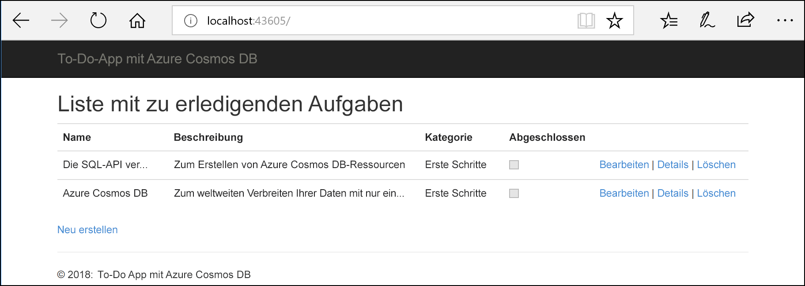
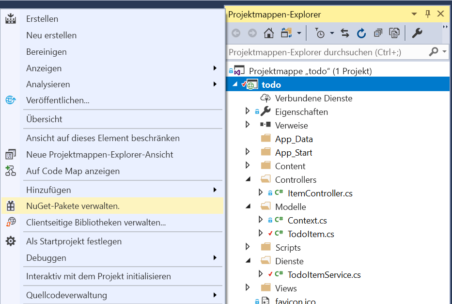

# <a name="quickstart-build-an-aspnet-web-app-with-azure-cosmos-db-using-the-sql-api-and-the-azure-portal"></a>Schnellstart: Erstellen einer ASP.NET-Web-App mit Azure Cosmos DB unter Verwendung der SQL-API und des Azure-Portals

> [!div class="op_single_selector"]
> * [.NET (Vorschauversion)](create-sql-api-dotnet-preview.md)
> * [.NET](create-sql-api-dotnet.md)
> * [Java](create-sql-api-java.md)
> * [Node.js](create-sql-api-nodejs.md)
> * [Python](create-sql-api-python.md)
> * [Xamarin](create-sql-api-xamarin-dotnet.md)
>  
> 

Azure Cosmos DB ist der global verteilte und hoch verfügbare Microsoft-Datenbankdienst mit mehreren Modellen. Sie können schnell Dokument-, Schlüssel/Wert- und Graph-Datenbanken erstellen und abfragen und dabei stets die Vorteile der globalen Verteilung und der horizontalen Skalierung nutzen, die Azure Cosmos DB zugrunde liegen. 

In dieser Schnellstartanleitung wird veranschaulicht, wie Sie mithilfe des Azure-Portals ein [SQL-API](sql-api-introduction.md)-Konto, eine Datenbank und einen Container für Azure Cosmos DB erstellen. Anschließend erstellen Sie auf der Grundlage der [SQL-.NET-API](sql-api-sdk-dotnet.md) eine ASP.NET-Web-App für To-Do-Listen und stellen diese dann bereit. Dies ist im folgenden Screenshot dargestellt. 

In dieser Schnellstartanleitung wird Version 3.0+ des Azure Cosmos DB .NET SDK verwendet. 



## <a name="prerequisites"></a>Voraussetzungen

Falls Sie Visual Studio 2017 noch nicht installiert haben, können Sie die **kostenlose** [Visual Studio 2017 Community-Edition](https://www.visualstudio.com/downloads/) herunterladen und verwenden. Aktivieren Sie beim Setup von Visual Studio die Workload **Azure-Entwicklung**.

[!INCLUDE [quickstarts-free-trial-note](../../includes/quickstarts-free-trial-note.md)] 
[!INCLUDE [cosmos-db-emulator-docdb-api](../../includes/cosmos-db-emulator-docdb-api.md)]  

<a id="create-account"></a>
## <a name="create-a-database-account"></a>Erstellen eines Datenbankkontos

[!INCLUDE [cosmos-db-create-dbaccount-preview](../../includes/cosmos-db-create-dbaccount-preview.md)]

<a id="create-collection"></a>
## <a name="add-a-collection"></a>Hinzufügen einer Sammlung

[!INCLUDE [cosmos-db-create-collection-preview](../../includes/cosmos-db-create-collection-preview.md)]

<a id="add-sample-data"></a>
## <a name="add-sample-data"></a>Hinzufügen von Beispieldaten

[!INCLUDE [cosmos-db-create-sql-api-add-sample-data](../../includes/cosmos-db-create-sql-api-add-sample-data.md)]

## <a name="query-your-data"></a>Abfragen Ihrer Daten

[!INCLUDE [cosmos-db-create-sql-api-query-data](../../includes/cosmos-db-create-sql-api-query-data.md)]

## <a name="clone-the-sample-application"></a>Klonen der Beispielanwendung

Beginnen wir nun mit der Verwendung von Code. Klonen Sie zunächst eine [SQL-API-App von GitHub](https://github.com/Azure-Samples/cosmos-dotnet-todo-app), legen Sie die Verbindungszeichenfolge fest, und führen Sie sie aus. 

1. Öffnen Sie eine Eingabeaufforderung, erstellen Sie einen neuen Ordner namens „git-samples“, und schließen Sie die Eingabeaufforderung.

    ```bash
    md "C:\git-samples"
    ```

2. Öffnen Sie ein Git-Terminalfenster (z.B. git bash), und verwenden Sie den Befehl `cd`, um in den neuen Ordner zu gelangen und dort die Beispiel-App zu installieren.

    ```bash
    cd "C:\git-samples"
    ```

3. Führen Sie den folgenden Befehl aus, um das Beispielrepository zu klonen. Dieser Befehl erstellt eine Kopie der Beispiel-App auf Ihrem Computer.

    ```bash
    git clone https://github.com/Azure-Samples/cosmos-dotnet-todo-app.git
    ```

4. Öffnen Sie die Projektmappendatei **todo.sln** in Visual Studio. 

## <a name="review-the-code"></a>Überprüfen des Codes

Dieser Schritt ist optional. Wenn Sie erfahren möchten, wie die Datenbankressourcen im Code erstellt werden, können Sie sich die folgenden Codeausschnitte ansehen. Andernfalls können Sie mit [Aktualisieren der Verbindungszeichenfolge](#update-your-connection-string) fortfahren. 

Hinweis: Wenn Sie mit der vorherigen Version des .NET SDK vertraut sind, kennen Sie unter Umständen bereits die Begriffe „Sammlung“ und „Dokument“. Azure Cosmos DB unterstützt mehrere API-Modelle. Daher werden in Version 3.0 und höheren Versionen des .NET SDK die generischen Begriffe „Container“ und „Element“ verwendet. Ein Container kann eine Sammlung, ein Graph oder eine Tabelle sein. Ein Element kann ein Dokument, ein Edge/Vertex oder eine Zeile sein und stellt den Inhalt eines Containers dar. [Weitere Informationen zu Datenbanken, Containern und Elementen](databases-containers-items.md)

Die folgenden Codeausschnitte stammen alle aus der Datei „ToDoItemService.cs“.

* Der CosmosClient wird in den Zeilen 68 und 69 initialisiert.

    ```csharp
    CosmosConfiguration config = new CosmosConfiguration(Endpoint, PrimaryKey);
    client = new CosmosClient(config);
    ```

* In Zeile 71 wird eine neue Datenbank erstellt.

    ```csharp
    CosmosDatabase database = await client.Databases.CreateDatabaseIfNotExistsAsync(DatabaseId);
    ```

* In Zeile 72 wird mit dem Partitionsschlüssel „/category“ ein neuer Container erstellt.

    ```csharp
    CosmosContainer container = await database.Containers.CreateContainerIfNotExistsAsync(ContainerId, "/category");
    ```

## <a name="update-your-connection-string"></a>Aktualisieren der Verbindungszeichenfolge

Wechseln Sie nun zurück zum Azure-Portal, um die Informationen der Verbindungszeichenfolge abzurufen und in die App zu kopieren.

1. Wählen Sie im [Azure-Portal](https://portal.azure.com/) in Ihrem Azure Cosmos DB-Konto im linken Navigationsbereich die Option **Schlüssel** und anschließend **Lese-/Schreibschlüssel** aus. Mithilfe der Schaltflächen zum Kopieren auf der rechten Seite des Bildschirms kopieren Sie im nächsten Schritt die URI und den Primärschlüssel in die Datei „web.config“.

    

2. Öffnen Sie in Visual Studio 2017 die Datei **web.config**. 

3. Kopieren Sie den URI-Wert aus dem Portal (mithilfe der Schaltfläche zum Kopieren), und legen Sie ihn in „web.config“ als Wert des ``endpoint``-Schlüssels fest. 

    `<add key="endpoint" value="FILLME" />`

4. Kopieren Sie anschließend den Wert für Ihren Primärschlüssel (PRIMARY KEY) aus dem Portal, und legen Sie ihn in „web.config“ als Wert von ``primarykey`` fest. 

    `<add key="primaryKey" value="FILLME" />`
    
5. Aktualisieren Sie dann den Datenbank- und Containerwert, damit diese Werte mit den Namen der zuvor erstellten Datenbank und des Containers übereinstimmen. Sie haben die App nun mit allen erforderlichen Informationen für die Kommunikation mit Azure Cosmos DB aktualisiert. 

    `<add key="database" value="Tasks" />`

    `<add key="container" value="Items" />`
    
## <a name="run-the-web-app"></a>Ausführen der Web-App

1. Klicken Sie im **Projektmappen-Explorer** mit der rechten Maustaste auf das neue Projekt für die Konsolenanwendung, die sich unter Ihrer Visual Studio-Projektmappe befindet, und klicken Sie anschließend auf **NuGet-Pakete verwalten...**.
    
    
1. Klicken Sie auf der Registerkarte **NuGet** auf **Durchsuchen**, und geben Sie in das Suchfeld **Microsoft.Azure.Cosmos** ein.
1. Suchen Sie in den Ergebnissen nach **Microsoft.Azure.Cosmos**, und klicken Sie auf **Installieren**.
   Die Paket-ID für die SQL-API-Clientbibliothek von Azure Cosmos DB lautet [Microsoft Azure Cosmos DB Client Library](https://www.nuget.org/packages/Microsoft.Azure.Cosmos/).

   

    Wenn Sie eine Meldung im Zusammenhang mit der Überprüfung von Änderungen an der Projektmappe erhalten, klicken Sie auf **OK**. Wenn Sie eine Meldung im Zusammenhang mit der Akzeptierung der Lizenz erhalten, klicken Sie auf **Ich stimme zu**.

1. Drücken Sie STRG+F5, um die Anwendung auszuführen. Ihre App wird im Browser angezeigt. 

1. Wählen Sie im Browser **Neu erstellen**, und erstellen Sie einige neue Aufgaben in Ihrer To-Do-App. Außerdem sollten die Aufgaben angezeigt werden, die Sie unter [Hinzufügen von Beispieldaten](#add-sample-data) erstellt haben.

   

Jetzt können Sie zum Daten-Explorer zurückkehren, um diese neuen Daten anzuzeigen, abzufragen, anzupassen und mit ihnen zu arbeiten. 

## <a name="review-slas-in-the-azure-portal"></a>Überprüfen von SLAs im Azure-Portal

[!INCLUDE [cosmosdb-tutorial-review-slas](../../includes/cosmos-db-tutorial-review-slas.md)]

## <a name="clean-up-resources"></a>Bereinigen von Ressourcen

[!INCLUDE [cosmosdb-delete-resource-group](../../includes/cosmos-db-delete-resource-group.md)]

## <a name="next-steps"></a>Nächste Schritte

In dieser Schnellstartanleitung haben Sie gelernt, wie Sie ein Azure Cosmos DB-Konto erstellen, mit dem Daten-Explorer einen Container erstellen und Elemente hinzufügen und eine Web-App ausführen. Jetzt können Sie zusätzliche Daten in Ihr Cosmos DB-Konto importieren. 

> [!div class="nextstepaction"]
> [Import data into Azure Cosmos DB (Importieren von Daten in Azure Cosmos DB)](import-data.md)


