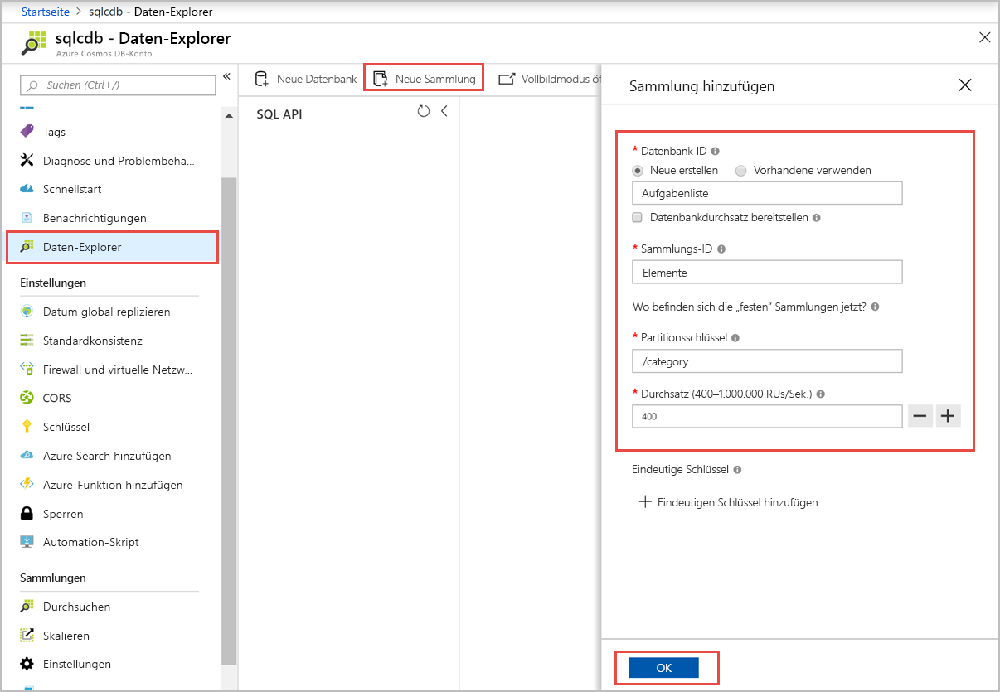
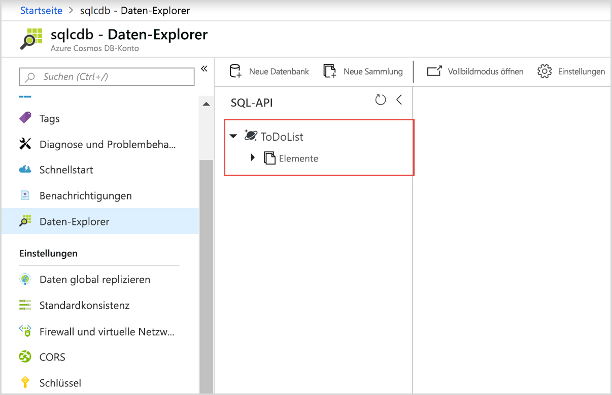
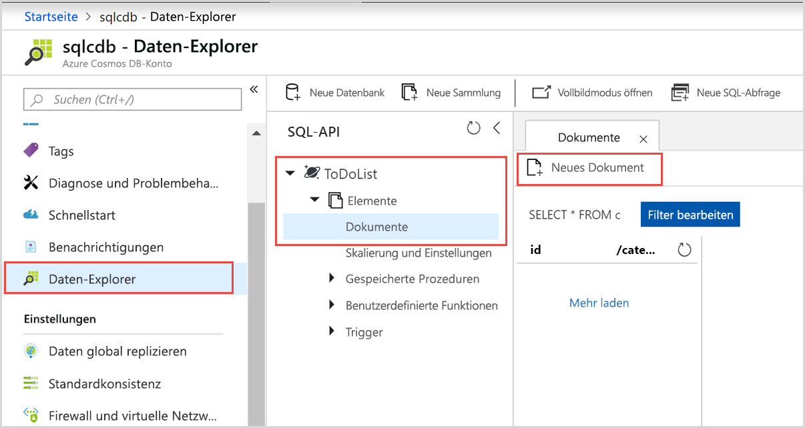
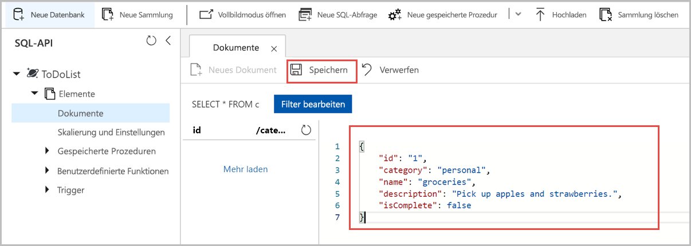
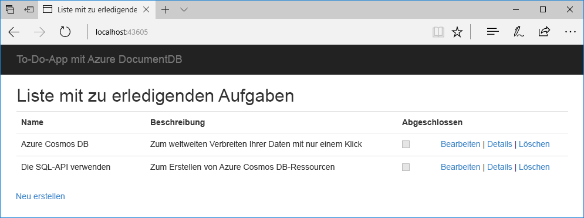

# <a name="quickstart-build-a-net-web-app-using-sql-api-account-in-azure-cosmos-db"></a>Schnellstart: Erstellen einer .NET-Web-App mit einem SQL-API-Konto in Azure Cosmos DB

> [!div class="op_single_selector"]
> * [.NET](create-sql-api-dotnet.md)
> * [.NET (Vorschauversion)](create-sql-api-dotnet-preview.md)
> * [Java](create-sql-api-java.md)
> * [Node.js](create-sql-api-nodejs.md)
> * [Python](create-sql-api-python.md)
> * [Xamarin](create-sql-api-xamarin-dotnet.md)
>  
> 

Azure Cosmos DB ist der global verteilte Microsoft-Datenbankdienst mit mehreren Modellen. Sie können Azure Cosmos DB verwenden, um schnell Schlüssel/Wert-, Dokument- und Graph-Datenbanken zu erstellen und abzufragen, und dabei stets die Vorteile der globalen Verteilung und der horizontalen Skalierung nutzen, die Azure Cosmos DB zugrunde liegen. 

In dieser Schnellstartanleitung wird veranschaulicht, wie Sie mithilfe des Azure-Portals ein [SQL-API](sql-api-introduction.md)-Konto, eine Dokumentdatenbank und eine Sammlung für Azure Cosmos DB erstellen und der Sammlung Daten hinzufügen. Anschließend verwenden Sie eine [SQL .NET SDK](sql-api-sdk-dotnet.md)-Web-App, um der Sammlung weitere Daten hinzuzufügen. 

In dieser Schnellstartanleitung verwenden Sie den Daten-Explorer im Azure-Portal, um die Datenbank und die Sammlung zu erstellen. Sie können die Datenbank und die Sammlung auch mit dem .NET-Beispielcode erstellen. Weitere Informationen finden Sie unter [Erkunden des .NET-Codes](#review-the-net-code). 

## <a name="prerequisites"></a>Voraussetzungen

Installation von Visual Studio 2019 mit dem Workflow für die Azure-Entwicklung
- Sie können die **kostenlose** [Visual Studio 2019 Community Edition](https://www.visualstudio.com/downloads/) herunterladen und verwenden. Aktivieren Sie beim Setup von Visual Studio die Option **Azure-Entwicklung**. 

Azure-Abonnement oder kostenloses Azure Cosmos DB-Testkonto
- [!INCLUDE [quickstarts-free-trial-note](../../includes/quickstarts-free-trial-note.md)] 
- [!INCLUDE [cosmos-db-emulator-docdb-api](../../includes/cosmos-db-emulator-docdb-api.md)]  

<a id="create-account"></a>
## <a name="create-an-azure-cosmos-db-account"></a>Erstellen eines Azure Cosmos DB-Kontos

[!INCLUDE [cosmos-db-create-dbaccount](../../includes/cosmos-db-create-dbaccount.md)]

<a id="create-collection-database"></a>
## <a name="add-a-database-and-a-collection"></a>Hinzufügen einer Datenbank und einer Sammlung 

Sie können mit dem Daten-Explorer im Azure-Portal eine Datenbank und eine Sammlung erstellen. 

1.  Wählen Sie auf der Azure Cosmos DB-Kontoseite im linken Navigationsbereich die Option **Daten-Explorer** und dann **Neue Sammlung**. 
    
    Unter Umständen müssen Sie nach rechts scrollen, um den Bereich **Sammlung hinzufügen** anzuzeigen.
    
    
    
1.  Geben Sie auf der Seite **Sammlung hinzufügen** die Einstellungen für die neue Sammlung ein.
    
    |Einstellung|Empfohlener Wert|BESCHREIBUNG
    |---|---|---|
    |**Datenbank-ID**|ToDoList|Geben Sie *ToDoList* als Namen für die neue Datenbank ein. Datenbanknamen müssen zwischen 1 und 255 Zeichen lang sein und dürfen weder `/, \\, #, ?` noch nachgestellte Leerzeichen enthalten.|
    |**Sammlungs-ID**|Items|Geben Sie *Items* als Namen für die neue Sammlung ein. Für Sammlungs-IDs gelten dieselben Zeichenanforderungen wie für Datenbanknamen.|
    |**Partitionsschlüssel**| /category| Das in diesem Artikel beschriebene Beispiel verwendet */category* als Partitionsschlüssel.|
    |**Durchsatz**|400|Belassen Sie den Durchsatz bei 400 Anforderungseinheiten pro Sekunde (RU/s). Sie können den Durchsatz später zentral hochskalieren, wenn Sie Wartezeiten reduzieren möchten.| 
    
    Fügen Sie für dieses Beispiel keine Schlüssel über die Option **Eindeutige Schlüssel** hinzu. Mit eindeutigen Schlüsseln können Sie die Datenbank mit einer Datenintegritätsebene versehen, indem Sie die Eindeutigkeit von Werten per Partitionsschlüssel sicherstellen. Weitere Informationen finden Sie unter [Eindeutige Schlüssel in Azure Cosmos DB](unique-keys.md).
    
1.  Klicken Sie auf **OK**. 
    Im Daten-Explorer werden die neue Datenbank und die neue Sammlung angezeigt.
    
    

## <a name="add-data-to-your-database"></a>Hinzufügen von Daten zu Ihrer Datenbank

Verwenden Sie den Daten-Explorer, um Ihrer neuen Datenbank Daten hinzuzufügen.

1. Im **Daten-Explorer** wird die neue Datenbank im Bereich **Sammlungen** angezeigt. Erweitern Sie die Datenbank **ToDoList** und anschließend die Sammlung **Items**, und wählen Sie dann **Dokumente** und **Neues Dokument**. 
   
   
   
1. Fügen Sie dem Dokument rechts im Bereich **Dokumente** die folgende Struktur hinzu:

     ```json
     {
         "id": "1",
         "category": "personal",
         "name": "groceries",
         "description": "Pick up apples and strawberries.",
         "isComplete": false
     }
     ```

1. Wählen Sie **Speichern** aus.
   
   
   
1. Wählen Sie erneut **Neues Dokument**, und erstellen und speichern Sie ein weiteres Dokument mit einer eindeutigen `id` und weiteren gewünschten Eigenschaften und Werten. Ihre Dokumente können eine beliebige Struktur aufweisen, da Azure Cosmos DB kein Schema für Ihre Daten vorgibt.

## <a name="query-your-data"></a>Abfragen Ihrer Daten

[!INCLUDE [cosmos-db-create-sql-api-query-data](../../includes/cosmos-db-create-sql-api-query-data.md)]

## <a name="use-the-net-web-app-to-manage-data"></a>Verwenden der .NET-Web-App zum Verwalten von Daten

Sie können erleben, wie einfach das programmgesteuerte Arbeiten mit Ihren Azure Cosmos DB-Daten ist, indem Sie wie folgt vorgehen: Klonen Sie das Beispiel für die SQL-API-.NET-Web-App per GitHub, aktualisieren Sie die Verbindungszeichenfolge, und führen Sie die App aus, um Ihre Daten zu aktualisieren. 

Sie können die Datenbank und die Sammlung auch mit dem .NET-Beispielcode erstellen. Weitere Informationen finden Sie unter [Erkunden des .NET-Codes](#review-the-net-code).

### <a name="clone-the-sample-app"></a>Klonen der Beispiel-App

Klonen Sie zuerst eine C#-[SQL-API-App](https://github.com/Azure-Samples/documentdb-dotnet-todo-app) per GitHub. 

1. Öffnen Sie ein Git-Terminalfenster, z. B. Git Bash, erstellen Sie ein neues Verzeichnis mit dem Namen *git-samples*, und wechseln Sie in dieses Verzeichnis: 
   
   ```bash
   mkdir /c/git-samples/
   cd /c/git-samples/
   ```
   
1. Führen Sie den folgenden Befehl zum Klonen des Beispielrepositorys aus, und erstellen Sie eine Kopie der Beispiel-App auf Ihrem Computer:
   
   ```bash
   git clone https://github.com/Azure-Samples/documentdb-dotnet-todo-app.git
   ```

### <a name="update-the-connection-string"></a>Aktualisieren der Verbindungszeichenfolge 

1. Navigieren Sie in Visual Studio zur Datei *todo.sln* Ihrer geklonten App, und öffnen Sie sie. 

1. Öffnen Sie im **Projektmappen-Explorer** von Visual Studio die Datei *web.config*. 

1. Wechseln Sie zurück zum Azure-Portal, um Ihre Verbindungszeichenfolgen-Informationen für das Einfügen in die Datei *web.config* zu kopieren.
   
   1. Wählen Sie im linken Navigationsbereich Ihres Azure Cosmos DB-Kontos die Option **Schlüssel**.
      
      
      
   1. Kopieren Sie unter **Lese-/Schreibschlüssel** den Wert von **URI**, indem Sie rechts die Schaltfläche „Kopieren“ verwenden, und fügen Sie ihn in der Datei *web.config* in den `endpoint`-Schlüssel ein. Beispiel:  
      
      `<add key="endpoint" value="https://mysqlapicosmosdb.documents.azure.com:443/" />`
      
   1. Kopieren Sie den Wert von **PRIMÄRSCHLÜSSEL**, und fügen Sie ihn in der Datei *web.config* in den `authKey`-Schlüssel ein. Beispiel: 
      
      `<add key="authKey" value="19ZDNJAiYL26tmnRvoez6hmtIfBGwjun50PWRjNYMC2ig8Ob9hYk7Fq1RYSv8FcIYnh1TdBISvCh7s6yyb0000==" />`

       
1. Stellen Sie sicher, dass die Datenbank- und Sammlungswerte in der Datei *web.config* mit den zuvor erstellten Namen übereinstimmen. 

   ```csharp
   <add key="database" value="ToDoList"/>
   <add key="collection" value="Items"/>
   ```
 
1. Speichern Sie die Datei *web.config*. Sie haben die App nun mit allen erforderlichen Informationen für die Kommunikation mit Azure Cosmos DB aktualisiert.

### <a name="run-the-web-app"></a>Ausführen der Web-App

1. Klicken Sie in Visual Studio im **Projektmappen-Explorer** mit der rechten Maustaste auf das Projekt **todo**, und wählen Sie anschließend die Option **NuGet-Pakete verwalten**. 

1. Geben Sie im NuGet-Feld **Durchsuchen** den Suchbegriff *DocumentDB* ein.

1. Installieren Sie die in den Ergebnissen enthaltene Bibliothek **Microsoft.Azure.DocumentDB**, falls sie nicht bereits installiert ist. Hierdurch wird das Paket [Microsoft.Azure.DocumentDB](https://www.nuget.org/packages/Microsoft.Azure.DocumentDB/) mit allen Abhängigkeiten installiert.
   
   Wenn im NuGet-Paket-Manager eine Meldung angezeigt wird, dass in der Projektmappe einige Pakete fehlen, sollten Sie **Wiederherstellen** wählen, um diese über interne Quellen zu installieren. 

1. Wählen Sie **STRG**+**F5**, um die App in Ihrem Browser auszuführen. 

1. Wählen Sie in der To-Do-App die Option **Neu erstellen**, und erstellen Sie einige neue Aufgaben.

   

Nun können Sie im Azure-Portal zurück zum Daten-Explorer wechseln, um Ihre neuen Daten anzuzeigen, abzufragen, anzupassen und zu verwenden. 

## <a name="review-the-net-code"></a>Erkunden des .NET-Codes

Dieser Schritt ist optional. In dieser Schnellstartanleitung erstellen Sie eine Datenbank und eine Sammlung im Azure-Portal und fügen unter Verwendung des .NET-Beispiels Beispieldaten hinzu. Sie können die Datenbank und die Sammlung aber auch mithilfe des .NET-Beispiels erstellen. Sehen Sie sich die folgenden Codeausschnitte an, wenn Sie erfahren möchten, wie Datenbankressourcen im Code erstellt werden. Die folgenden Codeausschnitte stammen alle aus der Datei *DocumentDBRepository.cs* im Projekt **todo**.

* Mit diesem Code wird `DocumentClient` initialisiert: 

    ```csharp
    client = new DocumentClient(new Uri(ConfigurationManager.AppSettings["endpoint"]), ConfigurationManager.AppSettings["authKey"]);
    ```

* Mit diesem Code wird die neue Datenbank über die `CreateDatabaseAsync`-Methode erstellt:

    ```csharp
    await client.CreateDatabaseAsync(new Database { Id = DatabaseId });
    ```

* Mit dem folgenden Code wird die neue Sammlung über die `CreateDocumentCollectionAsync`-Methode erstellt:

    ```csharp
    private static async Task CreateCollectionIfNotExistsAsync(string partitionkey)
    {
       try
       {       
        await client.ReadDocumentCollectionAsync(UriFactory.CreateDocumentCollectionUri(DatabaseId, CollectionId), new RequestOptions { PartitionKey = new PartitionKey(partitionkey) });
       }
        catch (DocumentClientException e)
        {
           if (e.StatusCode == System.Net.HttpStatusCode.NotFound)
            {
                await client.CreateDocumentCollectionAsync(
                  UriFactory.CreateDatabaseUri(DatabaseId),
                   new DocumentCollection
                    {
                      Id = CollectionId,
                      PartitionKey = new PartitionKeyDefinition
                       {
                           Paths = new System.Collections.ObjectModel.Collection<string>(new List<string>() { partitionkey })
                        }
                    },
                      new RequestOptions { OfferThroughput = 400 });
            }
            else
            {
                throw;
            }
        }
    }
    ```

## <a name="clean-up-resources"></a>Bereinigen von Ressourcen

[!INCLUDE [cosmosdb-delete-resource-group](../../includes/cosmos-db-delete-resource-group.md)]

## <a name="next-steps"></a>Nächste Schritte

In dieser Schnellstartanleitung haben Sie gelernt, wie Sie ein Azure Cosmos DB-Konto erstellen, eine Datenbank und eine Sammlung mit dem Daten-Explorer erstellen und eine .NET-Web-App ausführen, um Ihre Daten zu aktualisieren. Jetzt können Sie zusätzliche Daten in Ihr Azure Cosmos DB-Konto importieren. 

> [!div class="nextstepaction"]
> [Import data into Azure Cosmos DB (Importieren von Daten in Azure Cosmos DB)](import-data.md)

