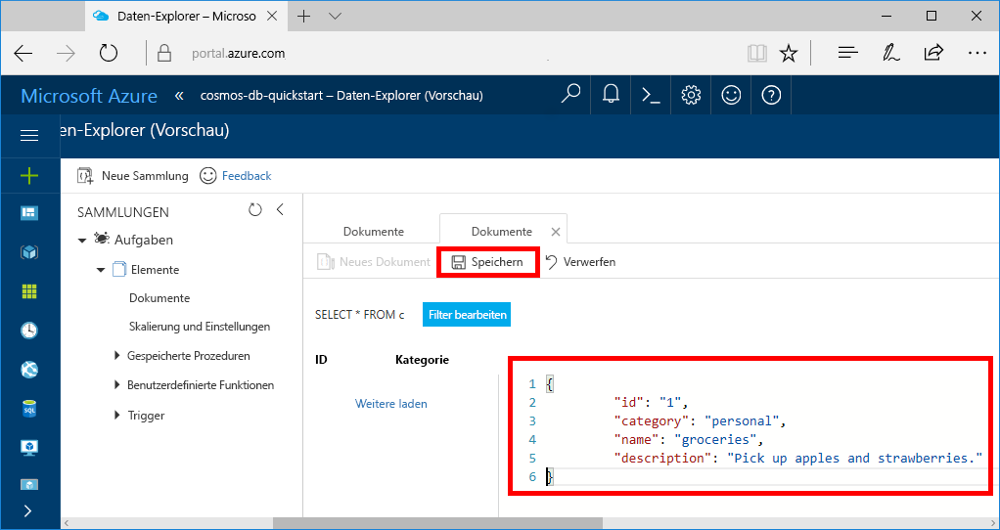

# <a name="quickstart-build-a-net-web-app-with-azure-cosmos-db-using-the-sql-api-and-the-azure-portal"></a>Schnellstartanleitung: Erstellen einer .NET-Web-App mit Azure Cosmos DB unter Verwendung der SQL-API und des Azure-Portals

Azure Cosmos DB ist der global verteilte Microsoft-Datenbankdienst mit mehreren Modellen. Sie können schnell Dokument-, Schlüssel/Wert- und Graph-Datenbanken erstellen und abfragen und dabei stets die Vorteile der globalen Verteilung und der horizontalen Skalierung nutzen, die Azure Cosmos DB zugrunde liegen. 

In diesem Schnellstart wird veranschaulicht, wie Sie ein Azure Cosmos DB-Konto, eine Dokumentendatenbank und eine Sammlung mithilfe des Azure-Portals erstellen. Anschließend erstellen Sie auf der Grundlage der [SQL-.NET-API](sql-api-sdk-dotnet.md) eine Web-App für To-Do-Listen und stellen diese dann bereit, wie im folgenden Screenshot zu sehen. 


## <a name="prerequisites"></a>Voraussetzungen

Falls Sie Visual Studio 2017 noch nicht installiert haben, können Sie die **kostenlose** [Visual Studio 2017 Community-Edition](https://www.visualstudio.com/downloads/) herunterladen und verwenden. Aktivieren Sie beim Setup von Visual Studio die Option **Azure-Entwicklung**.

[!INCLUDE [quickstarts-free-trial-note](../../includes/quickstarts-free-trial-note.md)] 
[!INCLUDE [cosmos-db-emulator-docdb-api](../../includes/cosmos-db-emulator-docdb-api.md)]  

<a id="create-account"></a>
## <a name="create-a-database-account"></a>Erstellen eines Datenbankkontos

[!INCLUDE [cosmos-db-create-dbaccount](../../includes/cosmos-db-create-dbaccount.md)]

<a id="create-collection"></a>
## <a name="add-a-collection"></a>Hinzufügen einer Sammlung

[!INCLUDE [cosmos-db-create-collection](../../includes/cosmos-db-create-collection.md)]

<a id="add-sample-data"></a>
## <a name="add-sample-data"></a>Hinzufügen von Beispieldaten

Sie können nun mithilfe des Daten-Explorers Daten zu einer neuen Sammlung hinzufügen.

1. Im Daten-Explorer wird die neue Datenbank im Bereich „Sammlungen“ angezeigt. Erweitern Sie die Datenbank **Aufgaben** und die Sammlung **Elemente**, und klicken Sie auf **Dokumente** und anschließend auf **Neue Dokumente**. 

   
  
2. Fügen Sie nun der Sammlung ein Dokument mit folgender Struktur hinzu.

     ```json
     {
         "id": "1",
         "category": "personal",
         "name": "groceries",
         "description": "Pick up apples and strawberries.",
         "isComplete": false
     }
     ```

3. Nachdem Sie den JSON-Code auf der Registerkarte **Dokumente** hinzugefügt haben, klicken Sie auf **Speichern**.

    

4.  Erstellen und speichern Sie ein weiteres Dokument, in das Sie einen eindeutigen Wert für die Eigenschaft `id` einfügen, und ändern Sie die anderen Eigenschaften nach Bedarf. Ihre neuen Dokumente können jede gewünschte Struktur aufweisen, da Azure Cosmos DB kein Schema für Ihre Daten vorgibt.

     Sie können jetzt zum Abrufen Ihrer Daten Abfragen im Daten-Explorer verwenden. Standardmäßig verwendet der Daten-Explorer `SELECT * FROM c` zum Abrufen aller Dokumente in der Sammlung, aber Sie können das in eine andere [SQL-Abfrage](sql-api-sql-query.md) (etwa `SELECT * FROM c ORDER BY c._ts DESC`) ändern, um alle Dokumente in absteigender Reihenfolge basierend auf dem Zeitstempel zurückzugeben.
 
     Der Daten-Explorer kann auch zum Erstellen von gespeicherten Prozeduren, UDFs und Triggern verwendet werden, um sowohl serverseitige Geschäftslogik als auch einen Skalierungsdurchsatz auszuführen. Der Daten-Explorer stellt den gesamten integrierten programmgesteuerten Datenzugriff in den APIs zur Verfügung, bietet jedoch einfachen Zugriff auf Ihre Daten im Azure-Portal.

## <a name="clone-the-sample-application"></a>Klonen der Beispielanwendung

Beginnen wir nun mit der Verwendung von Code. Klonen Sie zunächst eine SQL-API-App aus GitHub, legen Sie die Verbindungszeichenfolge fest, und führen Sie sie aus. Sie werden feststellen, wie einfach Sie programmgesteuert mit Daten arbeiten können. 

1. Öffnen Sie ein Git-Terminalfenster, z.B. ein Git Bash, und `CD` in einem Arbeitsverzeichnis.  

2. Führen Sie den folgenden Befehl aus, um das Beispielrepository zu klonen. 

    ```bash
    git clone https://github.com/Azure-Samples/documentdb-dotnet-todo-app.git
    ```

3. Öffnen Sie anschließend die Projektmappendatei für die Aufgabenliste in Visual Studio. 

## <a name="review-the-code"></a>Überprüfen des Codes

Es folgt ein kurzer Überblick zu dem, was in der App geschieht. Öffnen Sie die Datei „DocumentDBRepository.cs“. Sie stellen fest, dass mit diesen Codezeilen die Azure Cosmos DB-Ressourcen erstellt werden. 

* In Zeile 76 wird der Dokumentclient (DocumentClient) initialisiert.

    ```csharp
    client = new DocumentClient(new Uri(ConfigurationManager.AppSettings["endpoint"]), ConfigurationManager.AppSettings["authKey"]);
    ```

* In Zeile 91 wird eine neue Datenbank erstellt.

    ```csharp
    await client.CreateDatabaseAsync(new Database { Id = DatabaseId });
    ```

* In Zeile 110 wird eine neue Sammlung erstellt.

    ```csharp
    await client.CreateDocumentCollectionAsync(
        UriFactory.CreateDatabaseUri(DatabaseId),
        new DocumentCollection { Id = CollectionId },
        new DocumentCollection
            {
               Id = CollectionId
            },
        new RequestOptions { OfferThroughput = 400 });
    ```

## <a name="update-your-connection-string"></a>Aktualisieren der Verbindungszeichenfolge

Wechseln Sie nun zurück zum Azure-Portal, um die Informationen der Verbindungszeichenfolge abzurufen und in die App zu kopieren.

1. Klicken Sie im [Azure-Portal](http://portal.azure.com/) in Ihrem Azure Cosmos DB-Konto im linken Navigationsbereich auf **Schlüssel**, und klicken Sie anschließend auf **Lese-/Schreibschlüssel**. Mithilfe der Schaltflächen zum Kopieren auf der rechten Seite des Bildschirms kopieren Sie im nächsten Schritt die URI und den Primärschlüssel in die Datei „web.config“.

    

2. Öffnen Sie in Visual Studio 2017 die Datei „web.config“. 

3. Kopieren Sie den URI-Wert aus dem Portal (mithilfe der Schaltfläche zum Kopieren), und legen Sie ihn in „web.config“ als Wert des Endpunktschlüssels fest. 

    `<add key="endpoint" value="FILLME" />`

4. Kopieren Sie anschließend den Wert für PRIMARY KEY aus dem Portal, und legen Sie ihn in „web.config“ als Wert des authKey fest. Sie haben die App nun mit allen erforderlichen Informationen für die Kommunikation mit Azure Cosmos DB aktualisiert. 

    `<add key="authKey" value="FILLME" />`
    
## <a name="run-the-web-app"></a>Ausführen der Web-App
1. Klicken Sie in Visual Studio mit der rechten Maustaste auf das Projekt im **Projektmappen-Explorer**, und klicken Sie anschließend auf **NuGet-Pakete verwalten**. 

2. Geben Sie im NuGet-Feld **Durchsuchen** den Suchbegriff *DocumentDB* ein.

3. Installieren Sie die in den Ergebnissen enthaltene Bibliothek **Microsoft.Azure.DocumentDB**. Dadurch wird das Paket „Microsoft.Azure.DocumentDB“ mit all seinen Abhängigkeiten installiert.

4. Drücken Sie STRG+F5, um die Anwendung auszuführen. Ihre App wird im Browser angezeigt. 

5. Klicken Sie im Browser auf **Neu erstellen**, und erstellen Sie einige neue Aufgaben in Ihrer To-Do-App.

   

Jetzt können Sie zum Daten-Explorer zurückkehren, um diese neue Daten anzuzeigen, abzufragen, anzupassen und mit ihnen zu arbeiten. 

## <a name="review-slas-in-the-azure-portal"></a>Überprüfen von SLAs im Azure-Portal

[!INCLUDE [cosmosdb-tutorial-review-slas](../../includes/cosmos-db-tutorial-review-slas.md)]

## <a name="clean-up-resources"></a>Bereinigen von Ressourcen

Wenn Sie diese App nicht weiter verwenden möchten, löschen Sie alle von diesem Schnellstart erstellten Ressourcen im Azure-Portal. Führen Sie dazu folgende Schritte durch:

1. Klicken Sie im Azure-Portal im Menü auf der linken Seite auf **Ressourcengruppen**, und klicken Sie auf den Namen der erstellten Ressource. 
2. Klicken Sie auf der Seite mit Ihrer Ressourcengruppe auf **Löschen**, geben Sie im Textfeld den Namen der zu löschenden Ressource ein, und klicken Sie dann auf **Löschen**.

## <a name="next-steps"></a>Nächste Schritte

In diesem Schnellstart haben Sie gelernt, wie Sie ein Azure Cosmos DB-Konto erstellen, eine Sammlung mit dem Daten-Explorer erstellen und eine Web-App ausführen. Jetzt können Sie zusätzliche Daten in Ihr Cosmos DB-Konto importieren. 

> [!div class="nextstepaction"]
> [Import data into Azure Cosmos DB (Importieren von Daten in Azure Cosmos DB)](import-data.md)


