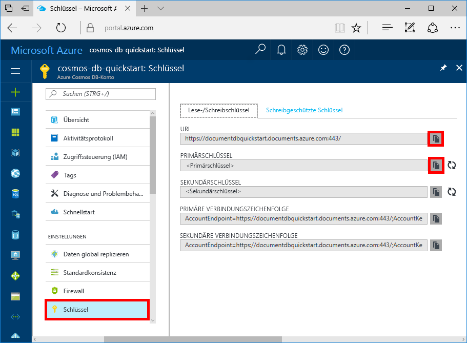

# <a name="quickstart-build-a-nodejs-app-using-azure-cosmos-db-sql-api-account"></a>Schnellstart: Erstellen einer Node.js-App mit einem Azure Cosmos DB-SQL-API-Konto

> [!div class="op_single_selector"]
> * [.NET](create-sql-api-dotnet.md)
> * [.NET (Vorschauversion)](create-sql-api-dotnet-preview.md)
> * [Java](create-sql-api-java.md)
> * [Node.js](create-sql-api-nodejs.md)
> * [Python](create-sql-api-python.md)
> * [Xamarin](create-sql-api-xamarin-dotnet.md)
>  

Azure Cosmos DB ist der global verteilte Microsoft-Datenbankdienst mit mehreren Modellen. Sie können schnell Dokument-, Schlüssel/Wert- und Graph-Datenbanken erstellen und abfragen und dabei stets die Vorteile der globalen Verteilung und der horizontalen Skalierung nutzen, die Azure Cosmos DB zugrunde liegen. 

In dieser Schnellstartanleitung wird veranschaulicht, wie Sie mithilfe des Azure-Portals ein [SQL-API-Konto](sql-api-introduction.md), eine Dokumentdatenbank und einen Container für Azure Cosmos DB erstellen. Anschließend erstellen Sie eine auf dem [SQL JavaScript SDK](sql-api-sdk-node.md) basierende Konsolen-App und führen sie aus. In diesem Schnellstart wird Version 2.0 des [JavaScript SDK](https://www.npmjs.com/package/@azure/cosmos) verwendet.

## <a name="prerequisites"></a>Voraussetzungen

[!INCLUDE [quickstarts-free-trial-note](../../includes/quickstarts-free-trial-note.md)] 
[!INCLUDE [cosmos-db-emulator-docdb-api](../../includes/cosmos-db-emulator-docdb-api.md)]

* Außerdem haben Sie folgende Möglichkeiten:
    * [Node.js](https://nodejs.org/en/) Version v6.0.0 oder höher
    * [Git-Client](https://git-scm.com/)

## <a name="create-a-database-account"></a>Erstellen eines Datenbankkontos

[!INCLUDE [cosmos-db-create-dbaccount](../../includes/cosmos-db-create-dbaccount.md)]

## <a name="add-a-collection"></a>Hinzufügen einer Sammlung

[!INCLUDE [cosmos-db-create-collection](../../includes/cosmos-db-create-collection.md)]

## <a name="add-sample-data"></a>Hinzufügen von Beispieldaten

[!INCLUDE [cosmos-db-create-sql-api-add-sample-data](../../includes/cosmos-db-create-sql-api-add-sample-data.md)]

## <a name="query-your-data"></a>Abfragen Ihrer Daten

[!INCLUDE [cosmos-db-create-sql-api-query-data](../../includes/cosmos-db-create-sql-api-query-data.md)]

## <a name="clone-the-sample-application"></a>Klonen der Beispielanwendung

Klonen Sie zunächst eine SQL-API-App aus GitHub, legen Sie die Verbindungszeichenfolge fest, und führen Sie sie aus.

1. Öffnen Sie eine Eingabeaufforderung, erstellen Sie einen neuen Ordner namens „git-samples“, und schließen Sie die Eingabeaufforderung.

    ```bash
    md "C:\git-samples"
    ```

2. Öffnen Sie ein Git-Terminalfenster (z.B. git bash), und verwenden Sie den Befehl `cd`, um in den neuen Ordner zu gelangen und dort die Beispiel-App zu installieren.

    ```bash
    cd "C:\git-samples"
    ```

3. Führen Sie den folgenden Befehl aus, um das Beispielrepository zu klonen. Dieser Befehl erstellt eine Kopie der Beispiel-App auf Ihrem Computer.

    ```bash
    git clone https://github.com/Azure-Samples/azure-cosmos-db-sql-api-nodejs-getting-started.git
    ```

## <a name="review-the-code"></a>Überprüfen des Codes

Dieser Schritt ist optional. Wenn Sie erfahren möchten, wie die Datenbankressourcen im Code erstellt werden, können Sie sich die folgenden Codeausschnitte ansehen. Andernfalls können Sie mit [Aktualisieren der Verbindungszeichenfolge](#update-your-connection-string) fortfahren. 

Hinweis: Wenn Sie mit der vorherigen Version des JavaScript SDK vertraut sind, kennen Sie unter Umständen bereits die Begriffe „Sammlung“ und „Dokument“. Azure Cosmos DB unterstützt [mehrere API-Modelle](https://docs.microsoft.com/azure/cosmos-db/introduction). Daher werden in Version 2.0 und höheren Versionen des JavaScript SDK die generischen Begriffe „Container“ (für eine Sammlung, einen Graph oder eine Tabelle) und „Element“ zum Beschreiben des Containerinhalts verwendet.

Die folgenden Codeausschnitte stammen alle aus der Datei **app.js**.

* `CosmosClient` wird initialisiert.

    ```javascript
    const client = new CosmosClient({ endpoint: endpoint, auth: { masterKey: masterKey } });
    ```

* Es wird eine neue Datenbank erstellt.

    ```javascript
    const { database } = await client.databases.createIfNotExists({ id: databaseId });
    ```

* Ein neuer Container (Sammlung) wird erstellt.

    ```javascript
    const { container } = await client.database(databaseId).containers.createIfNotExists({ id: containerId });
    ```

* Ein Element (Dokument) wird erstellt.

    ```javascript
    const { item } = await client.database(databaseId).container(containerId).items.create(itemBody);
    ```

* Eine SQL-Abfrage über JSON wird ausgeführt.

    ```javascript
    const querySpec = {
        query: "SELECT VALUE r.children FROM root r WHERE r.lastName = @lastName",
        parameters: [
            {
                name: "@lastName",
                value: "Andersen"
            }
        ]
    };

    const { result: results } = await client.database(databaseId).container(containerId).items.query(querySpec).toArray();
    for (var queryResult of results) {
        let resultString = JSON.stringify(queryResult);
        console.log(`\tQuery returned ${resultString}\n`);
    }
    ```    

## <a name="update-your-connection-string"></a>Aktualisieren der Verbindungszeichenfolge

Wechseln Sie nun zurück zum Azure-Portal, um die Informationen der Verbindungszeichenfolge abzurufen und in die App zu kopieren.

1. Klicken Sie im [Azure-Portal](https://portal.azure.com/) in Ihrem Azure Cosmos DB-Konto im linken Navigationsbereich auf **Schlüssel**, und klicken Sie anschließend auf **Lese-/Schreibschlüssel**. Mithilfe der Schaltflächen zum Kopieren auf der rechten Seite des Bildschirms kopieren Sie im nächsten Schritt den URI und den Primärschlüssel in die Datei `config.js`.

    

2. Öffnen Sie die Datei `config.js`. 

3. Kopieren Sie den URI-Wert aus dem Portal (mithilfe der Schaltfläche zum Kopieren), und legen Sie ihn in `config.js` als Wert des Endpunktschlüssels fest. 

    `config.endpoint = "https://FILLME.documents.azure.com"`

4. Kopieren Sie anschließend den Wert für PRIMARY KEY aus dem Portal, und legen Sie ihn als Wert von `config.primaryKey` in `config.js` fest. Sie haben die App nun mit allen erforderlichen Informationen für die Kommunikation mit Azure Cosmos DB aktualisiert. 

    `config.primaryKey = "FILLME"`
    
## <a name="run-the-app"></a>Ausführen der App
1. Führen Sie `npm install` in einem Terminal aus, um erforderliche NPM-Module zu installieren

2. Führen Sie `node app.js` in einem Terminal aus, um Ihre Node-Anwendung zu starten.

Jetzt können Sie zum Daten-Explorer zurückkehren, um diese neue Daten anzuzeigen, abzufragen, anzupassen und mit ihnen zu arbeiten. 

## <a name="review-slas-in-the-azure-portal"></a>Überprüfen von SLAs im Azure-Portal

[!INCLUDE [cosmosdb-tutorial-review-slas](../../includes/cosmos-db-tutorial-review-slas.md)]

## <a name="clean-up-resources"></a>Bereinigen von Ressourcen

[!INCLUDE [cosmosdb-delete-resource-group](../../includes/cosmos-db-delete-resource-group.md)]

## <a name="next-steps"></a>Nächste Schritte

In diesem Schnellstart haben Sie gelernt, wie Sie ein Azure Cosmos DB-Konto erstellen, eine Sammlung mit dem Daten-Explorer erstellen und eine Web-App ausführen. Jetzt können Sie zusätzliche Daten in Ihr Cosmos DB-Konto importieren. 

> [!div class="nextstepaction"]
> [Import data into Azure Cosmos DB (Importieren von Daten in Azure Cosmos DB)](import-data.md)


