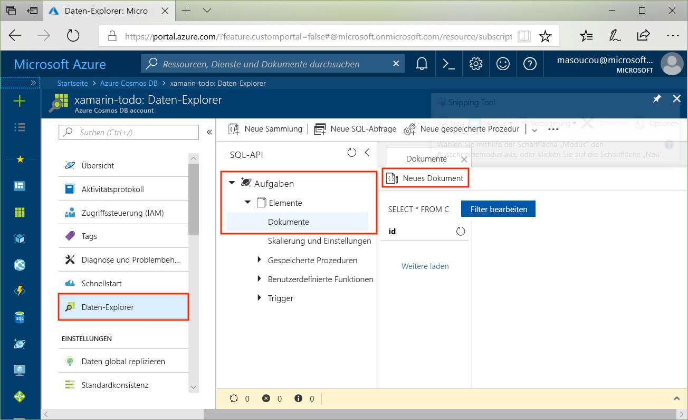
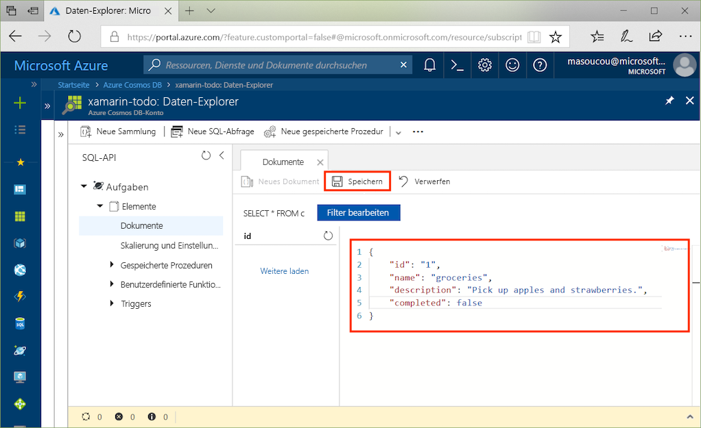

# <a name="azure-cosmos-db-build-a-todo-app-with-xamarin"></a>Azure Cosmos DB: Erstellen einer Todo-App mit Xamarin

Azure Cosmos DB ist der global verteilte Microsoft-Datenbankdienst mit mehreren Modellen. Sie können schnell Dokument-, Schlüssel/Wert- und Graph-Datenbanken erstellen und abfragen und dabei stets die Vorteile der globalen Verteilung und der horizontalen Skalierung nutzen, die Azure Cosmos DB zugrunde liegen.

> [!NOTE]
> Beispielcode für eine vollständige kanonische Xamarin-Beispiel-App, die mehrere Azure-Angebote (einschließlich CosmosDB) veranschaulicht, finden Sie auf [GitHub](https://github.com/xamarinhq/app-geocontacts). Diese App veranschaulicht das Anzeigen geografisch verteilter Kontakte und zeigt, wie diesen Kontakten das Aktualisieren ihres Standorts ermöglicht werden kann.

In diesem Schnellstart wird veranschaulicht, wie Sie mithilfe des Azure-Portals ein SQL-API-Konto, eine Dokumentdatenbank und eine Sammlung für Azure Cosmos DB erstellen. Anschließend führen Sie die Erstellung und Bereitstellung einer Todo-Listen-Web-App durch, die auf der [SQL-.NET-API](sql-api-sdk-dotnet.md) und [Xamarin](https://docs.microsoft.com/xamarin/#pivot=platforms&panel=Cross-Platform) basiert, indem Sie [Xamarin.Forms](https://docs.microsoft.com/xamarin/#pivot=platforms&panel=XamarinForms) und das [Architekturmuster MVVM](https://docs.microsoft.com/xamarin/xamarin-forms/xaml/xaml-basics/data-bindings-to-mvvm) verwenden.


## <a name="prerequisites"></a>Voraussetzungen

Falls Sie unter Windows entwickeln und Visual Studio 2017 noch nicht installiert haben, können Sie die **kostenlose** [Visual Studio 2017 Community Edition](https://www.visualstudio.com/downloads/) herunterladen und verwenden. Stellen Sie sicher, dass Sie während des Visual Studio-Setups die Workloads **Azure-Entwicklung** und **Mobile-Entwicklung mit .NET** aktivieren.

Bei Verwendung eines Macintosh können Sie die **kostenlose** Version von [Visual Studio für Mac](https://www.visualstudio.com/vs/mac/) herunterladen.

[!INCLUDE [quickstarts-free-trial-note](../../includes/quickstarts-free-trial-note.md)]
[!INCLUDE [cosmos-db-emulator-docdb-api](../../includes/cosmos-db-emulator-docdb-api.md)]

## <a name="create-a-database-account"></a>Erstellen eines Datenbankkontos

[!INCLUDE [cosmos-db-create-dbaccount](../../includes/cosmos-db-create-dbaccount.md)]

## <a name="add-a-collection"></a>Hinzufügen einer Sammlung

[!INCLUDE [cosmos-db-create-collection](../../includes/cosmos-db-create-collection.md)]

## <a name="add-sample-data"></a>Hinzufügen von Beispieldaten

Sie können nun mithilfe des Daten-Explorers Daten zu einer neuen Sammlung hinzufügen.

1. Erweitern Sie im Daten-Explorer die Datenbank **Aufgaben** und die Sammlung **Elemente**, und klicken Sie dann auf **Dokumente** und auf **Neue Dokumente**.

   

2. Fügen Sie nun der Sammlung ein Dokument mit folgender Struktur hinzu.

     ```json
     {
         "id": "1",
         "name": "groceries",
         "description": "Pick up apples and strawberries.",
         "completed": false
     }
     ```

3. Nachdem Sie den JSON-Code auf der Registerkarte **Dokumente** hinzugefügt haben, klicken Sie auf **Speichern**.

    

4. Erstellen und speichern Sie ein weiteres Dokument, in das Sie einen eindeutigen Wert für die Eigenschaft `id` einfügen, und ändern Sie die anderen Eigenschaften nach Bedarf. Ihre neuen Dokumente können jede gewünschte Struktur aufweisen, da Azure Cosmos DB kein Schema für Ihre Daten vorgibt.

     Sie können jetzt zum Abrufen Ihrer Daten Abfragen im Daten-Explorer verwenden. Standardmäßig verwendet der Daten-Explorer `SELECT * FROM c` zum Abrufen aller Dokumente in der Sammlung, aber Sie können das in eine andere [SQL-Abfrage](sql-api-sql-query.md) (etwa `SELECT * FROM c ORDER BY c._ts DESC`) ändern, um alle Dokumente in absteigender Reihenfolge basierend auf dem Zeitstempel zurückzugeben.

     Der Daten-Explorer kann auch zum Erstellen von gespeicherten Prozeduren, UDFs und Triggern verwendet werden, um sowohl serverseitige Geschäftslogik als auch einen Skalierungsdurchsatz auszuführen. Der Daten-Explorer stellt den gesamten integrierten programmgesteuerten Datenzugriff in den APIs zur Verfügung, bietet jedoch einfachen Zugriff auf Ihre Daten im Azure-Portal.

## <a name="clone-the-sample-application"></a>Klonen der Beispielanwendung

Wir klonen jetzt die Xamarin-SQL-API-App von GitHub, überprüfen den Code, beschaffen die API-Schlüssel und starten die Ausführung. Sie werden feststellen, wie einfach Sie programmgesteuert mit Daten arbeiten können.

1. Öffnen Sie ein Git-Terminalfenster, z.B. ein Git Bash, und `cd` in einem Arbeitsverzeichnis.

2. Führen Sie den folgenden Befehl aus, um das Beispielrepository zu klonen.

    ```bash
    git clone https://github.com/Azure/azure-documentdb-dotnet.git
    ```

3. Öffnen Sie anschließend in Visual Studio im Ordner „samples/xamarin/ToDoItems“ die Datei „ToDoItems.sln“.

## <a name="obtain-your-api-keys"></a>Beschaffen Ihrer API-Schlüssel

Wechseln Sie zurück zum Azure-Portal, um die Informationen zum API-Schlüssel zu beschaffen und in die App zu kopieren.

1. Klicken Sie im [Azure-Portal](http://portal.azure.com/) in Ihrem Azure Cosmos DB-SQL-API-Konto im linken Navigationsbereich auf **Schlüssel**, und klicken Sie anschließend auf **Lese-/Schreibschlüssel**. Kopieren Sie im nächsten Schritt mithilfe der Schaltflächen zum Kopieren auf der rechten Seite des Bildschirms den URI und den Primärschlüssel in die Datei „APIKeys.cs“.

    

2. Öffnen Sie in Visual Studio 2017 oder Visual Studio für Mac im Ordner „azure-documentdb-dotnet/samples/xamarin/ToDoItems/ToDoItems.Core/Helpers“ die Datei „APIKeys.cs“.

3. Kopieren Sie den URI-Wert aus dem Portal (mithilfe der Schaltfläche zum Kopieren), und legen Sie ihn in „APIKeys.cs“ als Wert für die Variable `CosmosEndpointUrl` fest.

    `public static readonly string CosmosEndpointUrl = "{Azure Cosmos DB account URL}";`

4. Kopieren Sie anschließend den Wert für Ihren Primärschlüssel (PRIMARY KEY) aus dem Portal, und legen Sie ihn in „APIKeys.cs“ als Wert von `Cosmos Auth Key` fest.

    `public static readonly string CosmosAuthKey = "{Azure Cosmos DB secret}";`

## <a name="review-the-code"></a>Überprüfen des Codes

Mit dieser Lösung wird veranschaulicht, wie Sie eine Todo-App erstellen, indem Sie die Azure Cosmos DB-SQL-API und Xamarin.Forms verwenden. Die App hat zwei Registerkarten. Die erste Registerkarte enthält eine Listenansicht mit den Todo-Elementen, die noch nicht abgearbeitet wurden. Auf der zweiten Registerkarte werden die Todo-Elemente angezeigt, die bereits abgeschlossen wurden. Zusätzlich zum Anzeigen der nicht abgeschlossenen Todo-Elemente auf der ersten Registerkarte können Sie auch neue Elemente hinzufügen, vorhandene Elemente bearbeiten und Elemente als abgeschlossen kennzeichnen.


Der Code in der Lösung ToDoItems enthält Folgendes:

* ToDoItems.Core: Dies ist ein .NET Standard-Projekt mit einem Xamarin.Forms-Projekt und freigegebenem Anwendungslogikcode, mit dem Todo-Elemente in Azure Cosmos DB verwaltet werden.
* ToDoItems.Android: Dieses Projekt enthält die Android-App.
* ToDoItems.iOS: Dieses Projekt enthält die iOS-App.

Wir sehen uns jetzt kurz an, wie die App mit Azure Cosmos DB kommuniziert.

* Das NuGet-Paket [Microsoft.Azure.DocumentDb.Core](https://www.nuget.org/packages/Microsoft.Azure.DocumentDB.Core/) muss allen Projekten hinzugefügt werden.
* Die `ToDoItem`-Klasse im Ordner „azure-documentdb-dotnet/samples/xamarin/ToDoItems/ToDoItems.Core/Models“ modelliert die Dokumente in der oben erstellten Sammlung **Items**. Beachten Sie, dass bei der Benennung von Eigenschaften die Groß-/Kleinschreibung berücksichtigt wird.
* In der `CosmosDBService`-Klasse im Ordner „azure-documentdb-dotnet/samples/xamarin/ToDoItems/ToDoItems.Core/Services“ ist die Kommunikation mit Azure Cosmos DB gekapselt.
* Die `CosmosDBService`-Klasse enthält die Typvariable `DocumentClient`. Die Variable `DocumentClient` wird verwendet, um Anforderungen für das Azure Cosmos DB-Konto zu konfigurieren und auszuführen, und sie wird in Zeile 31 instanziiert:

    ```csharp
    docClient = new DocumentClient(new Uri(APIKeys.CosmosEndpointUrl), APIKeys.CosmosAuthKey);
    ```

* Beim Abfragen einer Sammlung nach Dokumenten wird die `DocumentClient.CreateDocumentQuery<T>`-Methode verwendet, wie hier in der Funktion `CosmosDBService.GetToDoItems` zu sehen:

    ```csharp
    public async static Task<List<ToDoItem>> GetToDoItems()
    {
        var todos = new List<ToDoItem>();

        var todoQuery = docClient.CreateDocumentQuery<ToDoItem>(
                                UriFactory.CreateDocumentCollectionUri(databaseName, collectionName),
                                .Where(todo => todo.Completed == false)
                                .AsDocumentQuery();

        while (todoQuery.HasMoreResults)
        {
            var queryResults = await todoQuery.ExecuteNextAsync<ToDoItem>();

            todos.AddRange(queryResults);
        }

        return todos;
    }
    ```

    Für `CreateDocumentQuery<T>` wird ein URI verwendet, der auf die im vorherigen Abschnitt erstellte Sammlung verweist. Außerdem können Sie LINQ-Operatoren angeben, z.B. eine `Where`-Klausel. In diesem Fall werden nur Todo-Elemente zurückgegeben, die noch nicht abgeschlossen wurden.

    Die Funktion `CreateDocumentQuery<T>` wird synchron ausgeführt und gibt das `IQueryable<T>`-Element zurück. Mit der `AsDocumentQuery`-Methode wird `IQueryable<T>` aber in ein `IDocumentQuery<T>`-Objekt konvertiert, das asynchron ausgeführt werden kann. Auf diese Weise wird der UI-Thread für mobile Anwendungen nicht blockiert.

    Mit der Funktion `IDocumentQuery<T>.ExecuteNextAsync<T>` wird die Seite mit den Ergebnissen aus Azure Cosmos DB abgerufen, und mit `HasMoreResults` wird überprüft, ob noch weitere Ergebnisse zurückgegeben werden müssen.

> [!TIP]
> Für mehrere Funktionen, die für Azure Cosmos DB-Sammlungen und -Dokumente eingesetzt werden, wird ein URI als Parameter verwendet, um die Adresse der Sammlung bzw. des Dokuments anzugeben. Dieser URI wird mit der `URIFactory`-Klasse erstellt. Mit dieser Klasse können URIs für Datenbanken, Sammlungen und Dokumente erstellt werden.

* Die Funktion `ComsmosDBService.InsertToDoItem` in Zeile 107 veranschaulicht, wie Sie ein neues Dokument einfügen:

    ```csharp
    public async static Task InsertToDoItem(ToDoItem item)
    {
        ...
        await docClient.CreateDocumentAsync(UriFactory.CreateDocumentCollectionUri(databaseName, collectionName), item);
        ...
    }
    ```

    Der URI für die Dokumentsammlung und das einzufügende Element werden angegeben.

* Die Funktion `CosmosDBService.UpdateToDoItem` in Zeile 124 veranschaulicht, wie Sie ein vorhandenes Dokument durch ein neues ersetzen:

    ```csharp
    public async static Task UpdateToDoItem(ToDoItem item)
    {
        ...
        var docUri = UriFactory.CreateDocumentUri(databaseName, collectionName, item.Id);

        await docClient.ReplaceDocumentAsync(docUri, item);
    }
    ```

    Hier wird ein neuer URI benötigt, um das zu ersetzende Dokument eindeutig zu identifizieren. Er wird mit `UriFactory.CreateDocumentUri` abgerufen, und es werden der Datenbank- und der Sammlungsname sowie die ID des Dokuments an ihn übergeben.

    Mit `DocumentClient.ReplaceDocumentAsync` wird das Dokument, das anhand des URI identifiziert wurde, durch das als Parameter angegebene Dokument ersetzt.

* Das Löschen eines Elements wird mit der Funktion `CosmosDBService.DeleteToDoItem` in Zeile 115 veranschaulicht:

    ```csharp
    public async static Task DeleteToDoItem(ToDoItem item)
    {
        ...
        var docUri = UriFactory.CreateDocumentUri(databaseName, collectionName, item.Id);

        await docClient.DeleteDocumentAsync(docUri);
    }
    ```

    Beachten Sie, dass auch hier wieder ein eindeutiger Dokument-URI erstellt und an die Funktion `DocumentClient.DeleteDocumentAsync` übergeben wird.

## <a name="run-the-app"></a>Ausführen der App

Sie haben die App nun mit allen erforderlichen Informationen für die Kommunikation mit Azure Cosmos DB aktualisiert.

Die folgenden Schritte veranschaulichen, wie Sie die App mit dem Debugger von Visual Studio für Mac ausführen.

> [!NOTE]
> Die Nutzung der Android-Version der App ist nahezu identisch, und alle Unterschiede sind in den Schritten unten angegeben. Wenn Sie das Debuggen mit Visual Studio unter Windows durchführen möchten, finden Sie die Dokumentation für [iOS hier](https://docs.microsoft.com/xamarin/ios/deploy-test/debugging-in-xamarin-ios?tabs=vswin) und für [Android hier](https://docs.microsoft.com/xamarin/android/deploy-test/debugging/).

1. Wählen Sie zuerst die gewünschte Zielplattform aus, indem Sie auf die hervorgehobene Dropdownliste klicken und dann entweder „ToDoItems.iOS“ für iOS oder „ToDoItems.Android“ für Android wählen.

    

2. Drücken Sie zum Starten des Debugvorgangs für die App entweder BEFEHLSTASTE+EINGABETASTE, oder klicken Sie auf die Wiedergabeschaltfläche.

    

3. Nachdem der iOS-Simulator bzw. der Android-Emulator gestartet wurde, werden in der App zwei Registerkarten angezeigt: für iOS am unteren Rand und für Android am oberen Rand. Auf der ersten Registerkarte werden Todo-Elemente angezeigt, die nicht abgeschlossen wurden, und auf der zweiten sind die abgeschlossenen Todo-Elemente aufgeführt.

    

4. Für iOS können Sie ein Todo-Element abschließen, indem Sie es nach links ziehen und dann auf die Schaltfläche **Complete** (Abschließen) tippen. Unter Android können Sie ein Element abschließen, indem Sie länger auf das Element drücken und dann auf die Schaltfläche „Complete“ (Abschließen) tippen.

    

5. Tippen Sie auf ein Todo-Element, um es zu bearbeiten. Es wird ein neuer Bildschirm angezeigt, auf dem Sie die neuen Werte eingeben können. Wenn Sie auf die Schaltfläche „Speichern“ tippen, werden die Änderungen dauerhaft in Azure Cosmos DB gespeichert.

    

6. Tippen Sie zum Hinzufügen eines Todo-Elements oben rechts auf dem Startbildschirm auf die Schaltfläche **Hinzufügen**. Es wird eine neue, leere Bearbeitungsseite angezeigt.

    

## <a name="review-slas-in-the-azure-portal"></a>Überprüfen von SLAs im Azure-Portal

[!INCLUDE [cosmosdb-tutorial-review-slas](../../includes/cosmos-db-tutorial-review-slas.md)]

## <a name="clean-up-resources"></a>Bereinigen von Ressourcen

Wenn Sie diese App nicht weiter verwenden möchten, löschen Sie alle von diesem Schnellstart erstellten Ressourcen im Azure-Portal. Führen Sie dazu folgende Schritte durch:

1. Klicken Sie im Azure-Portal im Menü auf der linken Seite auf **Ressourcengruppen**, und klicken Sie auf den Namen der erstellten Ressource.
2. Klicken Sie auf der Seite mit Ihrer Ressourcengruppe auf **Löschen**, geben Sie im Textfeld den Namen der zu löschenden Ressource ein, und klicken Sie dann auf **Löschen**.

## <a name="next-steps"></a>Nächste Schritte

In diesem Schnellstart haben Sie gelernt, wie Sie ein Azure Cosmos DB-Konto sowie eine Sammlung mit dem Daten-Explorer erstellen und eine Xamarin-App erstellen und bereitstellen können. Jetzt können Sie zusätzliche Daten in Ihr Azure Cosmos DB-Konto importieren.

> [!div class="nextstepaction"]
> [Import data into Azure Cosmos DB (Importieren von Daten in Azure Cosmos DB)](import-data.md)
