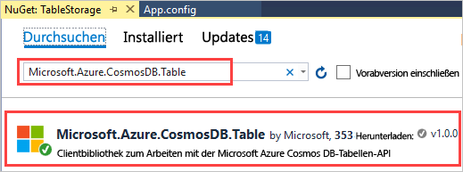
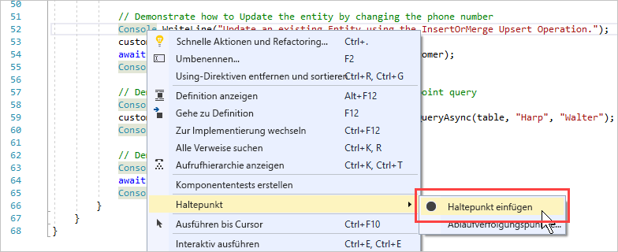
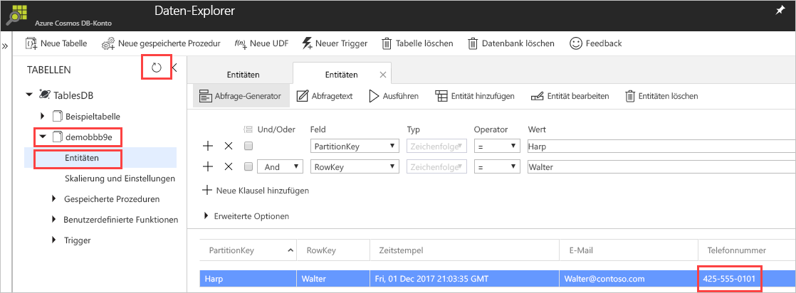

# <a name="quickstart-build-a-table-api-app-with-net-sdk-and-azure-cosmos-db"></a>Schnellstart: Erstellen einer Tabellen-API-App per .NET SDK und Azure Cosmos DB 

> [!div class="op_single_selector"]
> * [.NET](create-table-dotnet.md)
> * [Java](create-table-java.md)
> * [Node.js](create-table-nodejs.md)
> * [Python](create-table-python.md)
>  

In dieser Schnellstartanleitung erfahren Sie, wie Sie mithilfe von .NET und der [Tabellen-API](table-introduction.md) von Azure Cosmos DB eine App erstellen, indem Sie ein Beispiel von GitHub klonen. Außerdem wird in dieser Schnellstartanleitung gezeigt, wie Sie ein Azure Cosmos DB-Konto erstellen und mithilfe des Daten-Explorers Tabellen und Entitäten im webbasierten Azure-Portal erstellen.

## <a name="prerequisites"></a>Voraussetzungen

Falls Sie Visual Studio 2019 noch nicht installiert haben, können Sie die **kostenlose** [Visual Studio 2019 Community-Edition](https://www.visualstudio.com/downloads/) herunterladen und verwenden. Aktivieren Sie beim Setup von Visual Studio die Option **Azure-Entwicklung**.

[!INCLUDE [quickstarts-free-trial-note](../../includes/quickstarts-free-trial-note.md)]

## <a name="create-a-database-account"></a>Erstellen eines Datenbankkontos

[!INCLUDE [cosmos-db-create-dbaccount-table](../../includes/cosmos-db-create-dbaccount-table.md)]

## <a name="add-a-table"></a>Hinzufügen einer Tabelle

[!INCLUDE [cosmos-db-create-table](../../includes/cosmos-db-create-table.md)]

## <a name="add-sample-data"></a>Hinzufügen von Beispieldaten

[!INCLUDE [cosmos-db-create-table-add-sample-data](../../includes/cosmos-db-create-table-add-sample-data.md)]

## <a name="clone-the-sample-application"></a>Klonen der Beispielanwendung

Klonen Sie jetzt eine Tabellen-App aus GitHub, legen Sie die Verbindungszeichenfolge fest, und führen Sie die App aus. Sie werden feststellen, wie einfach Sie programmgesteuert mit Daten arbeiten können. 

1. Öffnen Sie eine Eingabeaufforderung, erstellen Sie einen neuen Ordner namens „git-samples“, und schließen Sie die Eingabeaufforderung.

   ```bash
   md "C:\git-samples"
   ```

2. Öffnen Sie ein Git-Terminalfenster (z.B. git bash), und verwenden Sie den Befehl `cd`, um in den neuen Ordner zu gelangen und dort die Beispiel-App zu installieren.

   ```bash
   cd "C:\git-samples"
   ```

3. Führen Sie den folgenden Befehl aus, um das Beispielrepository zu klonen. Dieser Befehl erstellt eine Kopie der Beispiel-App auf Ihrem Computer.

   ```bash
   git clone https://github.com/Azure-Samples/azure-cosmos-table-dotnet-core-getting-started.git
   ```

## <a name="open-the-sample-application-in-visual-studio"></a>Öffnen der Beispielanwendung in Visual Studio

1. Klicken Sie in Visual Studio im Menü **Datei** auf **Öffnen** > **Projekt/Projektmappe**. 

    

2. Navigieren Sie zu dem Ordner, in dem Sie die Beispielanwendung geklont haben, und öffnen Sie die Datei „TableStorage.sln“.

## <a name="update-your-connection-string"></a>Aktualisieren der Verbindungszeichenfolge

Wechseln Sie nun zurück zum Azure-Portal, um die Informationen der Verbindungszeichenfolge abzurufen und in die App zu kopieren. Dadurch kann Ihre App mit Ihrer gehosteten Datenbank kommunizieren. 

1. Klicken Sie im [Azure-Portal](https://portal.azure.com/) auf **Verbindungszeichenfolge**. Kopieren Sie mithilfe der Kopierschaltfläche im rechten Fensterbereich die **PRIMÄRE VERBINDUNGSZEICHENFOLGE**.

   

2. Öffnen Sie in Visual Studio die Datei **Settings.json**. 

3. Fügen Sie die **PRIMÄRE VERBINDUNGSZEICHENFOLGE** aus dem Portal in den StorageConnectionString-Wert ein. Fügen Sie die Zeichenfolge innerhalb der Anführungszeichen ein.

   ```csharp
   {
      "StorageConnectionString": "<Primary connection string from Azure portal>"
   }
   ```

4. Drücken Sie STRG+S, um die Datei **Settings.json** zu speichern.

Sie haben die App nun mit allen erforderlichen Informationen für die Kommunikation mit Azure Cosmos DB aktualisiert. 

## <a name="build-and-deploy-the-app"></a>Erstellen und Bereitstellen der App

1. Klicken Sie in Visual Studio im **Projektmappen-Explorer** mit der rechten Maustaste auf das Projekt **CosmosTableSamples**, und klicken Sie anschließend auf **NuGet-Pakete verwalten**. 

   

2. Geben Sie im NuGet-Feld **Durchsuchen** die Zeichenfolge „Microsoft.Azure.Cosmos.Table“ ein. Dadurch wird die Clientbibliothek „Cosmos DB-Tabellen-API“ gefunden. Beachten Sie, dass diese Bibliothek derzeit für .NET Framework und .NET Standard verfügbar ist. 
   
   

3. Klicken Sie auf **Installieren**, um die Bibliothek **Microsoft.Azure.Cosmos.Table** zu installieren. Dadurch werden das Paket der Azure Cosmos DB-Tabellen-API sowie sämtliche Abhängigkeiten installiert.

4. Wenn Sie die gesamte App ausführen, werden Beispieldaten in die Tabellenentität eingefügt und am Ende gelöscht. Sie sehen also nicht, dass Daten eingefügt werden, wenn Sie das gesamte Beispiel ausführen. Sie können aber Haltepunkte einfügen, um die Daten anzuzeigen. Öffnen Sie die Datei „BasicSamples.cs“, und klicken Sie mit der rechten Maustaste in Zeile 52. Wählen Sie **Haltepunkt** und dann **Haltepunkt einfügen**. Fügen Sie in Zeile 55 einen weiteren Haltepunkt ein.

    

5. Drücken Sie die Taste F5, um die Anwendung auszuführen. Im Konsolenfenster wird der Name der neuen Tabellendatenbank in Azure Cosmos DB angezeigt (in diesem Fall: demoa13b1). 
    
   

   Kehren Sie bei Erreichen des ersten Haltepunkts wieder zum Daten-Explorer im Azure-Portal zurück. Klicken Sie auf die Schaltfläche **Aktualisieren**, erweitern Sie die Demo-Tabelle, und klicken Sie auf **Entitäten**. Die Registerkarte **Entitäten** auf der rechten Seite zeigt die neue Entität, die für Walter Harp hinzugefügt wurde. Die Telefonnummer für die neue Entität lautet 425-555-0101.

   
    
   Wenn der Fehler mit dem Hinweis angezeigt wird, dass die Datei „Settings.json“ beim Ausführen des Projekts nicht gefunden werden kann, können Sie das Problem lösen, indem Sie den Projekteinstellungen den folgenden XML-Eintrag hinzufügen. Klicken Sie mit der rechten Maustaste auf „CosmosTableSamples“, wählen Sie „CosmosTableSamples.csproj bearbeiten“ aus, und fügen Sie die folgende „itemGroup“ hinzu: 

   ```csharp
     <ItemGroup>
       <None Update="Settings.json">
         <CopyToOutputDirectory>PreserveNewest</CopyToOutputDirectory>
       </None>
     </ItemGroup>
   ```

6. Schließen Sie im Daten-Explorer die Registerkarte **Entitäten**.
    
7. Drücken Sie F5, um die App bis zum nächsten Haltepunkt auszuführen. 

    Kehren Sie bei Erreichen des Haltepunkts wieder zum Azure-Portal zurück, und klicken Sie erneut auf **Entitäten**, um die Registerkarte **Entitäten** zu öffnen. Beachten Sie, dass die Telefonnummer aktualisiert wurde und nun 425-555-0105 lautet.

8. Drücken Sie F5, um die App auszuführen. 
 
   Die App fügt Entitäten für die Verwendung in einer erweiterten Beispiel-App hinzu, die von der Tabellen-API momentan nicht unterstützt wird. Anschließend löscht die App die von der Beispiel-App erstellten Tabellen.

9. Drücken Sie im Konsolenfenster die EINGABETASTE, um die Ausführung der App zu beenden. 
  

## <a name="review-slas-in-the-azure-portal"></a>Überprüfen von SLAs im Azure-Portal

[!INCLUDE [cosmosdb-tutorial-review-slas](../../includes/cosmos-db-tutorial-review-slas.md)]

## <a name="clean-up-resources"></a>Bereinigen von Ressourcen

[!INCLUDE [cosmosdb-delete-resource-group](../../includes/cosmos-db-delete-resource-group.md)]

## <a name="next-steps"></a>Nächste Schritte

In diesem Schnellstart haben Sie gelernt, wie Sie ein Azure Cosmos DB-Konto erstellen, eine Tabelle mit dem Daten-Explorer erstellen und eine App ausführen.  Jetzt können Sie Ihre Daten mit der Table-API abfragen.  

> [!div class="nextstepaction"]
> [Importieren von Daten in die Table-API](table-import.md)

