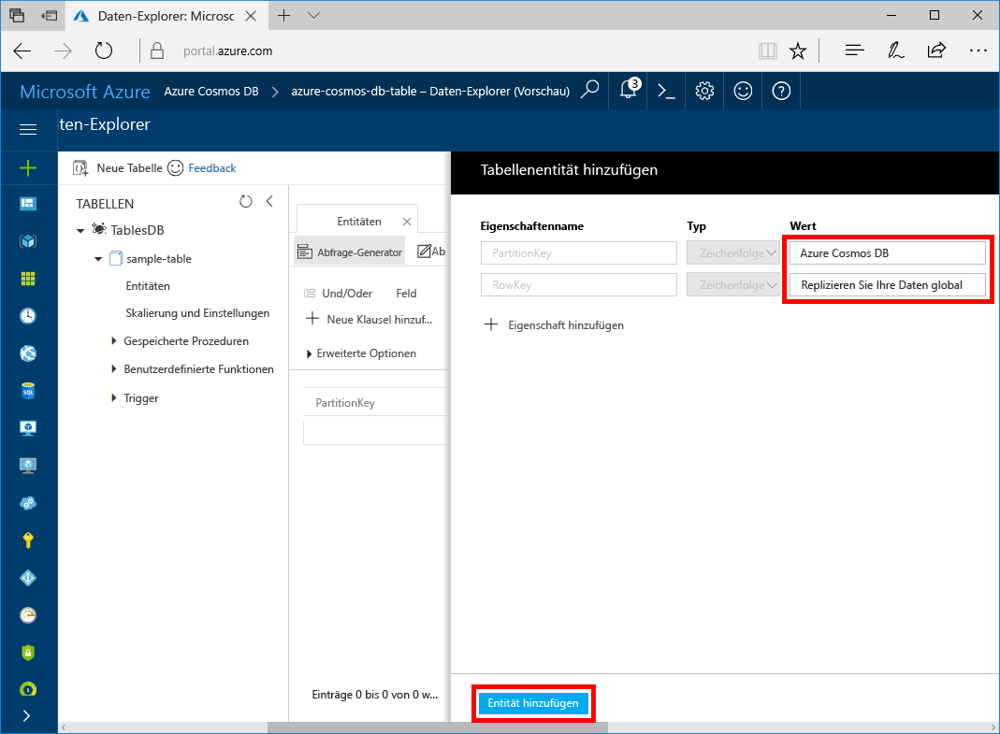
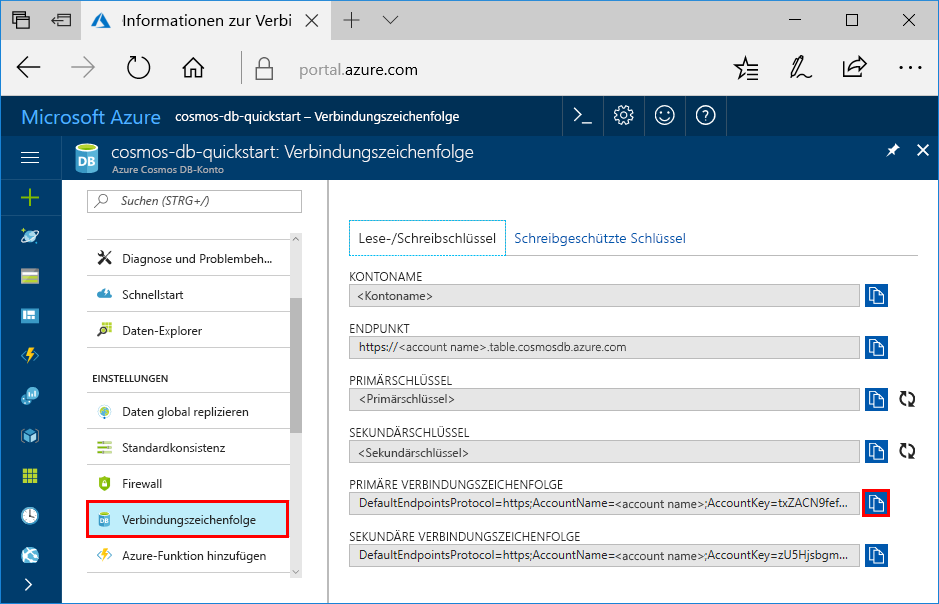

# <a name="quickstart-build-a-table-api-app-with-python-and-azure-cosmos-db"></a>Schnellstartanleitung: Erstellen einer Tabellen-API-App mit Python und Azure Cosmos DB

In dieser Schnellstartanleitung erfahren Sie, wie Sie mithilfe von Python und der [Tabellen-API](table-introduction.md) von Azure Cosmos DB eine App erstellen, indem Sie ein Beispiel von GitHub klonen. Außerdem wird in dieser Schnellstartanleitung gezeigt, wie Sie ein Azure Cosmos DB-Konto erstellen und mithilfe des Daten-Explorers Tabellen und Entitäten im webbasierten Azure-Portal erstellen.

Azure Cosmos DB ist der global verteilte Microsoft-Datenbankdienst mit mehreren Modellen. Sie können schnell Datenbanken mit Dokumenten, Schlüsseln/Werten, breiten Spalten und Graphen erstellen und abfragen und dabei stets die Vorteile der globalen Verteilung und der horizontalen Skalierung nutzen, die Azure Cosmos DB zugrunde liegen. 

## <a name="prerequisites"></a>Voraussetzungen

[!INCLUDE [quickstarts-free-trial-note](../../includes/quickstarts-free-trial-note.md)]
[!INCLUDE [cosmos-db-emulator-docdb-api](../../includes/cosmos-db-emulator-docdb-api.md)]

Außerdem haben Sie folgende Möglichkeiten:

* Falls Sie Visual Studio 2017 noch nicht installiert haben, können Sie die **kostenlose** [Visual Studio 2017 Community-Edition](https://www.visualstudio.com/downloads/) herunterladen und verwenden. Aktivieren Sie beim Setup von Visual Studio die Option **Azure-Entwicklung**.
* Python Tools für Visual Studio aus [GitHub](http://microsoft.github.io/PTVS/). In diesem Tutorial werden Python Tools für VS 2015 verwendet.
* Python 2.7 von [python.org](https://www.python.org/downloads/release/python-2712/)

## <a name="create-a-database-account"></a>Erstellen eines Datenbankkontos

[!INCLUDE [cosmos-db-create-dbaccount-table](../../includes/cosmos-db-create-dbaccount-table.md)]

## <a name="add-a-table"></a>Hinzufügen einer Tabelle

[!INCLUDE [cosmos-db-create-table](../../includes/cosmos-db-create-table.md)]

## <a name="add-sample-data"></a>Hinzufügen von Beispieldaten

Sie können nun mithilfe des Daten-Explorers Daten zu einer neuen Tabelle hinzufügen.

1. Erweitern Sie im Daten-Explorer **sample-database**, klicken Sie auf **Entitäten**, und klicken Sie anschließend auf **Entität hinzufügen**.

   
2. Geben Sie nun Daten in die Wertfelder „PartitionKey“ und „RowKey“ ein, und klicken Sie auf **Entität hinzufügen**.

   
  
    Jetzt können Sie weitere Entitäten in Ihre Tabelle hinzufügen, diese Entitäten bearbeiten und Ihre Daten im Daten-Explorer abfragen. Im Daten-Explorer können Sie zudem Ihren Durchsatz skalieren und der Tabelle gespeicherte Prozeduren, benutzerdefinierte Funktionen und Trigger hinzufügen.

## <a name="clone-the-sample-application"></a>Klonen der Beispielanwendung

Klonen Sie jetzt eine Tabellen-App aus GitHub, legen Sie die Verbindungszeichenfolge fest und führen Sie diese aus. Sie werden feststellen, wie einfach Sie programmgesteuert mit Daten arbeiten können. 

1. Öffnen Sie ein Terminalfenster von Git (z. B. Git Bash), und verwenden Sie den Befehl `cd`, um den Ordner zu ändern, in den die Beispiel-App gespeichert wird. 

    ```bash
    cd "C:\git-samples"
    ```

2. Führen Sie den folgenden Befehl aus, um das Beispielrepository zu klonen. Dieser Befehl erstellt eine Kopie der Beispiel-App auf Ihrem Computer. 

    ```bash
    git clone https://github.com/Azure-Samples/storage-python-getting-started.git
    ```

3. Öffnen Sie anschließend die Projektmappendatei in Visual Studio. 

## <a name="update-your-connection-string"></a>Aktualisieren der Verbindungszeichenfolge

Wechseln Sie nun zurück zum Azure-Portal, um die Informationen der Verbindungszeichenfolge abzurufen und in die App zu kopieren. Dadurch kann Ihre App mit Ihrer gehosteten Datenbank kommunizieren. 

1. Klicken Sie im [Azure-Portal](http://portal.azure.com/) auf **Verbindungszeichenfolge**. 

    

2. Öffnen Sie die Datei „config.py“, und kopieren Sie die erforderlichen Verbindungszeichenfolgen-Eigenschaften in die Konfigurationsdatei.

3. Speichern Sie die Datei „config.py“.

## <a name="run-the-app"></a>Ausführen der App

1. Klicken Sie in Visual Studio mit der rechten Maustaste auf das Projekt im **Projektmappen-Explorer**, wählen Sie die aktuelle Python-Umgebung aus, und klicken Sie anschließend mit der rechten Maustaste.

2. Wählen Sie „Python-Paket installieren“ aus, und geben Sie anschließend **azure-storage-table** ein.

3. Drücken Sie F5, um die Anwendung auszuführen. Ihre App wird im Browser angezeigt. 

Jetzt können Sie zum Daten-Explorer zurückkehren, um diese neue Daten anzuzeigen, abzufragen, anzupassen und mit ihnen zu arbeiten. 

## <a name="review-slas-in-the-azure-portal"></a>Überprüfen von SLAs im Azure-Portal

[!INCLUDE [cosmosdb-tutorial-review-slas](../../includes/cosmos-db-tutorial-review-slas.md)]

## <a name="clean-up-resources"></a>Bereinigen von Ressourcen

[!INCLUDE [cosmosdb-delete-resource-group](../../includes/cosmos-db-delete-resource-group.md)]

## <a name="next-steps"></a>Nächste Schritte

In diesem Schnellstart haben Sie gelernt, wie Sie ein Azure Cosmos DB-Konto erstellen, eine Tabelle mit dem Daten-Explorer erstellen und eine App ausführen.  Jetzt können Sie Ihre Daten mit der Table-API abfragen.  

> [!div class="nextstepaction"]
> [Importieren von Daten in die Table-API](table-import.md)
