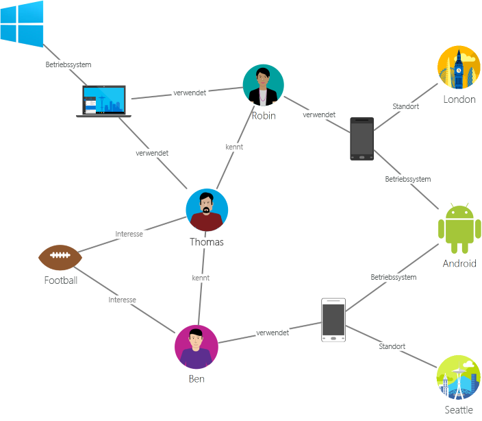
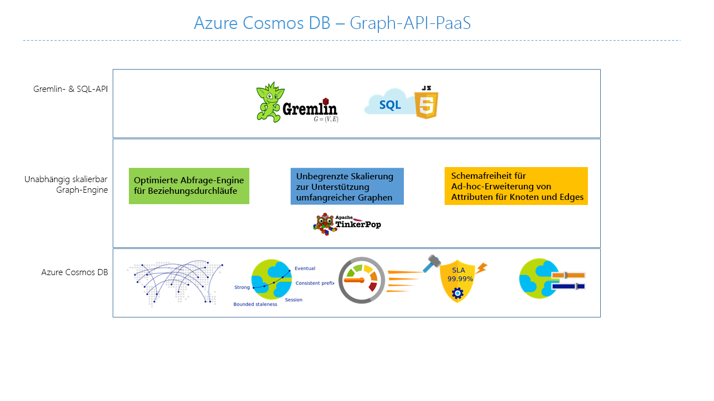

# Einführung in Azure Cosmos DB: Gremlin-API

[Azure Cosmos DB](introduction.md) ist der global verteilte Datenbankdienst von Microsoft mit mehreren Modellen für unternehmenskritische Anwendungen. Es handelt sich um eine Datenbank für mehrere Modelle, die Dokumente, Schlüsselwerte, Graphen und spaltenorientierte Datenmodelle unterstützt. Die Azure Cosmos DB Gremlin-API dient zum Speichern und Verarbeiten der Graphdaten. Die Gremlin-API unterstützt die Modellierung von Graphdaten und bieten APIs, um die Graphdaten zu durchlaufen.

Dieser Artikel enthält eine Übersicht über die Gremlin-API von Azure Cosmos DB und erläutert, wie Sie diese zum Speichern von umfangreichen Diagrammen mit Milliarden von Scheitelpunkten und Kanten verwenden können. Sie können die Diagramme mit einer Latenz im Millisekundenbereich abfragen und die Diagrammstruktur und das Schema entwickeln. Zum Abfragen von Azure Cosmos DB können Sie die Graphdurchlauf-Sprache [Apache TinkerPop](https://tinkerpop.apache.org) oder [Gremlin](https://tinkerpop.apache.org/docs/current/reference/#graph-traversal-steps) verwenden.

## Was ist eine Graphdatenbank?
Daten sind in der Praxis naturgemäß vernetzt. Bei der konventionellen Datenmodellierung liegt der Schwerpunkt auf Entitäten. Bei vielen Anwendungen besteht auch die Notwendigkeit, sowohl Entitäten als auch Beziehungen natürlich zu modellieren.

Ein [Diagramm](http://mathworld.wolfram.com/Graph.html) ist eine Struktur aus [Vertices](http://mathworld.wolfram.com/GraphVertex.html) und [Edges](http://mathworld.wolfram.com/GraphEdge.html). Sowohl Vertices als auch Edges können eine beliebige Anzahl von Eigenschaften aufweisen. 

* **Vertices** – Als Vertices werden diskrete Objekte wie etwa eine Person, ein Ort oder ein Ereignis bezeichnet. 

* **Edges** – Edges bezeichnen Beziehungen zwischen Vertices. Beispielsweise könnte eine Person eine andere Person kennen, an einem Ereignis beteiligt sein und sich vor Kurzem an einem Ort befunden haben. 

* **Eigenschaften** – Eigenschaften geben Informationen zu den Vertices und Edges an. Beispieleigenschaften enthalten einen Vertex mit Namen und Alter. Ein Edge weißt einen Zeitstempel und/oder eine Gewichtung auf. Dieses Modell wird offiziell als [Eigenschaftsdiagramm](https://tinkerpop.apache.org/docs/current/reference/#intro) bezeichnet. Azure Cosmos DB unterstützt das Eigenschaftsdiagrammmodell.

Das folgende Beispieldiagramm stellt beispielhaft die Beziehungen zwischen Personen, Mobilgeräten, Interessen und Betriebssystemen dar:

Mithilfe von Diagrammdatenbanken können Diagramme natürlich modelliert und gespeichert werden, sodass sie sich in zahlreichen Szenarien nützlich einsetzen lassen. Bei Diagrammdatenbanken handelt es sich in der Regel um NoSQL-Datenbanken, da diese Anwendungsfälle häufig auch Schemaflexibilität und schnelle Iterationen erfordern.

Sie können die von Diagrammdatenbanken bereitgestellte Funktion für schnelle Traversierungen mit Diagrammalgorithmen (z.B. Tiefensuche, Breitensuche, Dijkstra-Algorithmus) kombinieren, um Probleme in verschiedenen Domänen wie sozialen Netzwerken, Inhaltsverwaltung, Geodaten und Empfehlungen zu beheben.

## Features der Azure Cosmos DB-Graphdatenbank
 
Azure Cosmos DB ist eine vollständig verwaltete Diagrammdatenbank, die eine globale Verteilung, flexible Skalierung von Speicher und Durchsatz, automatische Indizierung und Abfrage sowie einstellbare Konsistenzebenen bietet und den TinkerPop-Standard unterstützt.

Azure Cosmos DB bietet im Vergleich zu anderen Diagrammdatenbanken auf dem Markt folgende einzigartige Features:

* Flexibel skalierbarer Durchsatz und Speicher

  Diagramme müssen in der Praxis über die Kapazität eines einzelnen Servers hinweg skaliert werden. Mit Azure Cosmos DB können Sie Ihre Diagramme nahtlos über mehrere Server hinweg skalieren. Zudem können Sie den Durchsatz Ihres Diagramms unabhängig basierend auf Ihren Zugriffsmustern skalieren. Azure Cosmos DB unterstützt Diagrammdatenbanken, die auf eine nahezu unbegrenzte Speichergröße und einen nahezu unbegrenzten bereitgestellten Durchsatz skaliert werden können.

* Replikation in mehreren Regionen

  Azure Cosmos DB repliziert Ihre Diagrammdaten transparent in allen Regionen, die Sie Ihrem Konto zugeordnet haben. Die Replikation ermöglicht es Ihnen, Anwendungen zu entwickeln, die globalen Zugriff auf Daten erfordern. In den Bereichen Konsistenz, Verfügbarkeit und Leistung und den entsprechenden Garantien gibt es dabei gewisse Nachteile. Azure Cosmos DB bietet ein transparentes regionales Failover mit Multi-Homing-APIs. Sie können Durchsatz und Speicher weltweit flexibel skalieren.

* Schnelle Abfragen und Traversierungen mit der vertrauten Gremlin-Syntax

  Speichern Sie heterogene Vertices und Edges, und führen Sie Abfragen dieser Dokumente über eine vertraute Gremlin-Syntax durch. Azure Cosmos DB nutzt eine sperrfreie, protokollstrukturierte Indizierungstechnologie für die gleichzeitige Ausführung zahlreicher Vorgänge, um sämtliche Inhalte automatisch zu indizieren. Diese Funktion ermöglicht umfassende Echtzeitabfragen und -traversierungen, ohne Schemahinweise, sekundäre Indizes oder Ansichten festlegen zu müssen. Mehr erfahren Sie unter [Abfragegraphen mithilfe von Gremlin](gremlin-support.md).

* Vollständige Verwaltung

  Sie müssen sich nicht mehr mit der Verwaltung von Datenbanken und Rechenressourcen befassen. Dank des vollständig verwalteten Microsoft Azure-Diensts müssen Sie sich nicht mit der Verwaltung virtueller Computer, der Bereitstellung und Konfiguration von Software, der Skalierung oder mit komplexen Datenebenenupgrades herumschlagen. Alle Diagramme werden automatisch gesichert und vor regionalen Ausfällen geschützt. Sie können einfach Azure Cosmos DB-Konten hinzufügen und nach Bedarf Kapazitäten bereitstellen. Dies ermöglicht es Ihnen, sich auf Ihre Anwendung zu konzentrieren, ohne sich mit dem Betrieb und der Verwaltung der Datenbank aufhalten zu müssen.

* Automatische Indizierung

  Alle Eigenschaften in Knoten und Edges im Graphen werden von Azure Cosmos DB automatisch indiziert, ohne dass ein Schema oder die Erstellung sekundärer Indizes erwartet oder gefordert wird.

* Kompatibilität mit Apache TinkerPop

  Azure Cosmos DB unterstützt systemintern den Open-Source-Standard Apache TinkerPop und kann in andere TinkerPop-fähige Diagrammsysteme integriert werden. So können Sie mühelos Migrationen von einer anderen Diagrammdatenbank wie Titan oder Neo4j durchführen oder Azure Cosmos DB mit Graphanalyse-Frameworks wie Apache Spark GraphX verwenden.

* Einstellbare Konsistenzebenen

  Die Konsistenz kann über fünf klar definierte Ebenen abgestimmt werden, um für ein ausgewogenes Verhältnis zwischen Konsistenz und Leistung zu sorgen. Für Abfragen und Lesevorgänge bietet Azure Cosmos DB fünf verschiedene Konsistenzebenen – „stark“, „begrenzte Veraltung“, „Sitzung“, „Präfixkonsistenz“ und „letztlich“. Mit diesen granularen, wohldefinierten Konsistenzebenen können fundierte Kompromisse zwischen Konsistenz, Verfügbarkeit und Latenz geschlossen werden. Weitere Informationen finden Sie unter [Einstellbare Datenkonsistenzebenen in Azure Cosmos DB](consistency-levels.md).

Azure Cosmos DB bietet zudem die Möglichkeit, mehrere Modelle wie Dokumente und Diagramme in denselben Containern bzw. Datenbanken zu verwenden. Sie können einen Dokumentcontainer verwenden, um Diagrammdaten zusammen mit Dokumenten zu speichern. Sowohl mit SQL-Abfragen über JSON als auch mit Gremlin Abfragen können Sie dieselben Daten wie ein Diagramm abfragen.

## Erste Schritte

Sie können die Azure-Befehlszeilenschnittstelle (CLI), Azure PowerShell oder das Azure-Portal verwenden, um Azure Cosmos DB-Gremlin-API-Konten zu erstellen und darauf zuzugreifen. Nach dem Erstellen eines Kontos können Sie auf die Graphdatenbanken in diesem Konto zugreifen, indem Sie einen Gremlin-API-Dienstendpunkt `https://<youraccount>.gremlin.cosmosdb.azure.com` verwenden, über den ein WebSocket-Front-End für Gremlin bereitgestellt wird. Um eine Verbindung mit diesem Endpunkt herzustellen und Anwendungen in Java, Node.js oder einem beliebigen Gremlin-Clienttreiber zu erstellen, können Sie Ihre TinkerPop-kompatiblen Tools wie die [Gremin-Konsole](https://tinkerpop.apache.org/docs/current/reference/#gremlin-console) konfigurieren.

In der folgenden Tabelle werden gängige Gremlin-Treiber aufgeführt, die Sie für Azure Cosmos DB verwenden können:

| Download | Dokumentation | Erste Schritte | Unterstützte Connector-Version |
| --- | --- | --- | --- |
| [.NET](https://tinkerpop.apache.org/docs/3.3.1/reference/#gremlin-DotNet) | [Gremlin.NET auf GitHub](https://github.com/apache/tinkerpop/tree/master/gremlin-dotnet) | [Erstellen von Graph mithilfe von .NET](create-graph-dotnet.md) | 3.4.0-RC2 |
| [Java](https://mvnrepository.com/artifact/com.tinkerpop.gremlin/gremlin-java) | [Gremlin JavaDoc](https://tinkerpop.apache.org/javadocs/current/full/) | [Erstellen von Graph mithilfe von Java](create-graph-java.md) | 3.2.0 und höher |
| [Node.js](https://www.npmjs.com/package/gremlin) | [Gremlin-JavaScript auf GitHub](https://github.com/jbmusso/gremlin-javascript) | [Erstellen von Graph mithilfe von Node.js](create-graph-nodejs.md) | 2.6.0|
| [Python](https://tinkerpop.apache.org/docs/3.3.1/reference/#gremlin-python) | [Gremlin-Python auf GitHub](https://github.com/apache/tinkerpop/tree/master/gremlin-python) | [Erstellen von Graph mithilfe von Python](create-graph-python.md) | 3.2.7 |
| [PHP](https://packagist.org/packages/brightzone/gremlin-php) | [Gremlin-PHP auf GitHub](https://github.com/PommeVerte/gremlin-php) | [Erstellen von Graph mithilfe von PHP](create-graph-php.md) | 3.1.0 |
| [Gremlin-Konsole](https://tinkerpop.apache.org/downloads.html) | [TinkerPop-Dokumente](https://tinkerpop.apache.org/docs/current/reference/#gremlin-console) |  [Erstellen von Graph mithilfe der Gremlin-Konsole](create-graph-gremlin-console.md) | 3.2.0 und höher |

## Entwurfsüberlegungen zu Graphdatenbanken

Beim Entwerfen eines Graphen kann sich die Entscheidung, eine Entität als eigenen Vertex zu modellieren – und nicht als Eigenschaft anderer Vertexentitäten –, auf die Leistung und die Kosten auswirken. Der Hauptgrund für diese Entscheidung basiert darauf, wie die Daten abgefragt werden, sowie auf der Skalierbarkeit des eigentlichen Modells.

Berücksichtigen Sie bei der Planung der Modellierung der Entität die folgenden Fragen:

* Welche Entitäten müssen für die meisten meiner Abfragen als Vertices abgerufen werden?

* Welche Informationen nehme ich in den Graphen auf, die für die Datenfilterung hinzugefügt werden?

* Welche Entitäten sind bloße Verbindungen zu anderen Entitäten, die dann für ihre Werte abgerufen werden?

* Welche Informationen muss meine Anfrage abrufen, und welche RU-Gebühren werden von ihnen generiert?

Nehmen wir beispielsweise die folgenden Graphgestaltung:

* Abhängig von den Abfragen ist es möglich, dass die Beziehung „District->Store“ ausschließlich für die Filterung der Store Vertices verwendet wird. Zum Beispiel ist es bei Abfragen im Format „obtain all the stores that belong to a specific district“ möglich, die District-Entität von einem eigenen Vertex zu einer Eigenschaft des Storevertex zusammenzufassen. 

* Dieser Ansatz hat den Vorteil, dass die Kosten für den Abruf jedes einzelnen Storevertex reduziert werden, indem jeweils drei Graphobjekte (District, District->Store, Store) auf einen einzigen Storevertex bezogen werden. Dadurch können die Leistung verbessert und die Kosten pro Abfrage gesenkt werden.

* Da der Storevertex mit zwei unterschiedlichen Entitäten verbunden ist – „Employee“ und „Produkt“, wird der Store zu einem erforderlichen Vertex, da er zusätzliche Möglichkeiten zum Durchlaufen bereitstellen kann.  

## Szenarios, in denen die Gremlin-API verwendet werden kann
Im Folgenden werden einige Szenarien vorgestellt, in denen die Diagrammunterstützung von Azure Cosmos DB verwendet werden kann:

* Soziale Netzwerke

  Durch die Kombination von Daten über Ihre Kunden und deren Interaktionen mit anderen Personen können Sie individuelle Erlebnisse schaffen, das Kundenverhalten vorhersagen oder Personen mit ähnlichen Interessen vernetzen. Azure Cosmos DB kann zum Verwalten sozialer Netzwerke sowie zum Nachverfolgen von Kundenpräferenzen und -daten verwendet werden.

* Empfehlungs-Engines

  Dieses Szenario kommt häufig im Einzelhandel vor. Durch die Kombination von Informationen zu Produkten, Benutzern und Benutzerinteraktionen (z.B. Einkäufe, Surfverhalten oder Bewertungen eines Artikels) können Sie benutzerdefinierte Empfehlungen erstellen. Die geringe Latenz, flexible Skalierung und native Diagrammunterstützung von Azure Cosmos DB sind für die Modellierung solcher Interaktionen ideal.

* Geodaten

  Zahlreiche Anwendungen in den Bereichen Telekommunikation, Logistik und Reiseplanung müssen einen bestimmten Ort in einer bestimmten Region oder die kürzeste bzw. optimale Route zwischen zwei Orten finden. Azure Cosmos DB ist die ideale Lösung für derartige Probleme.

* Internet der Dinge

  Durch die Modellierung von Netzwerken und Verbindungen zwischen IoT-Geräten als Graphen können Sie sich eine bessere Übersicht über den Status Ihrer Geräte und Ressourcen verschaffen. Sie können auch herausfinden, inwiefern sich Änderungen an einem Teil des Netzwerks möglicherweise auf andere Teile auswirken können.

## Nächste Schritte
Weitere Informationen zur Diagrammunterstützung in Azure Cosmos DB finden Sie durch folgende Ressourcen:

* Erste Schritte durch das [Tutorial zum Azure Cosmos DB-Diagramm](create-graph-dotnet.md)
* Erfahren Sie mehr über das [Abfragen von Graphen in Azure Cosmos DB mithilfe von Gremlin](gremlin-support.md).
