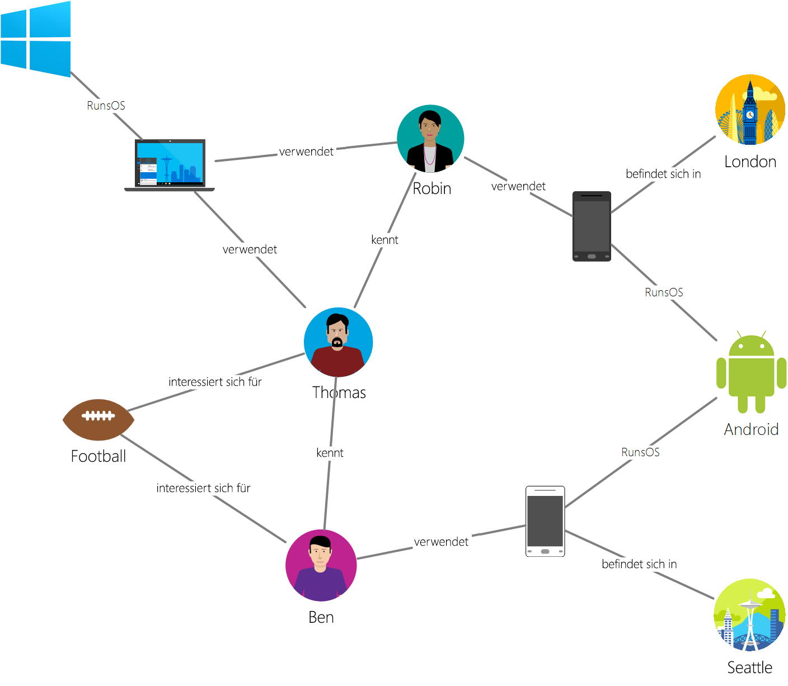

# <a name="azure-cosmos-db-gremlin-graph-support"></a>Unterstützung für Gremlin-Diagramme in Azure Cosmos DB
Azure Cosmos DB unterstützt die [Apache Tinkerpop](https://tinkerpop.apache.org)-Graphdurchlauf-Sprache, auch als [Gremlin](https://tinkerpop.apache.org/docs/3.3.2/reference/#graph-traversal-steps) bezeichnet. Mithilfe der Gremlin-Sprache können Sie Diagrammentitäten (Vertices und Edges) erstellen, Eigenschaften innerhalb dieser Entitäten ändern, Abfragen und Traversierungen ausführen und Entitäten löschen. 

Azure Cosmos DB liefert für Unternehmen konzipierte Funktionen für Diagrammdatenbanken. Zu diesen Funktionen zählen globale Verteilung, die unabhängige Skalierung von Speicher und Durchsatz, planbare Wartezeiten im einstelligen Millisekundenbereich, automatische Indizierung, SLAs und Leseverfügbarkeit von Datenbankkonten, die sich über mindestens zwei Azure-Regionen erstrecken. Da Azure Cosmos DB TinkerPop/Gremlin unterstützt, können Sie mit einer anderen kompatiblen Graphdatenbank geschriebene Anwendungen mühelos migrieren. Darüber hinaus wird Azure Cosmos DB aufgrund der Unterstützung für Gremlin nahtlos in TinkerPop-fähige Analyseframeworks wie [Apache Spark GraphX](https://spark.apache.org/graphx/) integriert. 

Dieser Artikel enthält eine kurze exemplarische Vorgehensweise zu Gremlin und listet die Funktionen von Gremlin auf, die von der Gremlin-API unterstützt werden.

## <a name="gremlin-by-example"></a>Gremlin anhand eines Beispiels
Anhand eines Beispieldiagramms wird erläutert, wie Abfragen in Gremlin ausgedrückt werden können. Die folgende Abbildung zeigt eine Geschäftsanwendung, die Daten zu Benutzern, Interessen und Geräten in Form eines Diagramms verwaltet.  

 

Dieses Diagramm weist folgende Vertex-Typen (in Gremlin als „Bezeichnung“ bezeichnet) auf:

- Personen: Das Diagramm enthält drei Personen: Robin, Thomas und Ben.
- Interessen: In diesem Beispiel interessieren sie sich für Football.
- Geräte: Die von den Personen verwendeten Geräte.
- Betriebssysteme: Die Betriebssysteme auf den Geräten.

Die Beziehungen zwischen diesen Entitäten werden anhand von folgenden Edgetypen/Bezeichnungen dargestellt:

- Kennt: Beispiel: „Thomas kennt Robin.“
- Interessiert an: Um die Interessen der Personen in unserem Diagramm darzustellen, verwenden wir beispielsweise „Ben ist an Football interessiert.“.
- Betriebssystem ausgeführt: Auf dem Laptop wird das Windows-Betriebssystem ausgeführt.
- Verwendet: Dies gibt an, welches Gerät eine Person verwendet. Beispiel: „Robin verwendet ein Motorola-Telefon mit der Seriennummer 77.“

Nun führen wir anhand dieses Diagramms einige Vorgänge mit der [Gremlin-Konsole](https://tinkerpop.apache.org/docs/3.3.2/reference/#gremlin-console) aus. Sie können diese Vorgänge auch mithilfe von Gremlin-Treibern auf der Plattform Ihrer Wahl (Java, Node.js, Python oder .NET) ausführen.  Bevor wir uns mit den unterstützten Funktionen von Azure Cosmos DB befassen, gehen wir einige Beispiele durch, um uns mit der Syntax vertraut zu machen.

Sehen wir uns zuerst CRUD an. Die folgende Gremlin-Anweisung fügt den Vertex „Thomas“ in das Diagramm ein:

```java
:> g.addV('person').property('id', 'thomas.1').property('firstName', 'Thomas').property('lastName', 'Andersen').property('age', 44)
```

Als Nächstes fügt die folgende Gremlin-Anweisung einen „kennt“-Edge zwischen Thomas und Robin ein.

```java
:> g.V('thomas.1').addE('knows').to(g.V('robin.1'))
```

Die folgende Abfrage gibt die Vertices „Person“ in absteigender Reihenfolge ihrer Vornamen zurück:
```java
:> g.V().hasLabel('person').order().by('firstName', decr)
```

Diagramme eignen sich am besten, wenn Sie Fragen wie „Welche Betriebssysteme verwenden Freunde von Thomas?“ beantworten müssen. Um diese Information anhand des Diagramms zu ermitteln, können Sie diese Gremlin-Traversierung ausführen:

```java
:> g.V('thomas.1').out('knows').out('uses').out('runsos').group().by('name').by(count())
```
Nun sehen wir uns, welche Funktionen Azure Cosmos DB für Gremlin-Entwickler bietet.

## <a name="gremlin-features"></a>Gremlin-Funktionen
TinkerPop ist ein Standard, der eine große Bandbreite an Diagrammtechnologien abdeckt. Daher weist diese Standardterminologie auf, die beschreiben, welche Funktionen von einem Diagrammanbieter bereitgestellt werden. Azure Cosmos DB stellt eine beständige und beschreibbare Diagrammdatenbank mit hoher Parallelität dar, die über mehrere Server oder Cluster hinweg partitioniert werden kann. 

Die folgende Tabelle enthält die TinkerPop-Funktionen, die von Azure Cosmos DB implementiert werden: 

| Category (Kategorie) | Implementierung von Azure Cosmos DB |  Notizen | 
| --- | --- | --- |
| Diagrammfunktionen | Stellen Persistenz und ConcurrentAccess bereit. Sind zur Unterstützung für Transaktionen ausgelegt. | Computermethoden können über den Spark-Connector implementiert werden. |
| Variablenfunktionen | Unterstützen Boolean-, Integer-, Byte-, Double-, Float-, Long- und String-Datentypen | Unterstützen primitive Typen; ist mit komplexen Typen über Datenmodelle kompatibel |
| Vertex-Funktionen | Unterstützen RemoveVertices MetaProperties, AddVertices MultiProperties, StringIds UserSuppliedIds, AddProperty, RemoveProperty  | Unterstützen die Erstellung, Änderung und Löschung von Vertices |
| Vertex-Eigenschafts-Funktionen | StringIds, UserSuppliedIds, AddProperty, RemoveProperty, BooleanValues, ByteValues, DoubleValues, FloatValues, IntegerValues, LongValues, StringValues | Unterstützen die Erstellung, Änderung und Löschung von Vertex-Eigenschaften |
| Edgefunktionen | AddEdges, RemoveEdges, StringIds, UserSuppliedIds, AddProperty, RemoveProperty | Unterstützen die Erstellung, Änderung und Löschung von Edges |
| Edge-Eigenschafts-Funktionen | Properties, BooleanValues, ByteValues, DoubleValues, FloatValues, IntegerValues, LongValues, StringValues | Unterstützen die Erstellung, Änderung und Löschung von Edge-Eigenschaften |

## <a name="gremlin-wire-format-graphson"></a>Gremlin-Sendeformat: GraphSON

Azure Cosmos DB verwendet bei der Rückgabe von Ergebnissen aus Gremlin-Vorgängen das [GraphSON-Format](https://tinkerpop.apache.org/docs/3.3.2/reference/#graphson-reader-writer). GraphSON ist das Standardformat von Gremlin zur Darstellung von Vertices, Edges und (ein- und mehrwertigen) Eigenschaften mittels JSON. 

Der folgende Ausschnitt zeigt z.B. eine GraphSON-Darstellung eines Vertex in Azure Cosmos DB, der *an den Client zurückgegeben wurde*. 

```json
  {
    "id": "a7111ba7-0ea1-43c9-b6b2-efc5e3aea4c0",
    "label": "person",
    "type": "vertex",
    "outE": {
      "knows": [
        {
          "id": "3ee53a60-c561-4c5e-9a9f-9c7924bc9aef",
          "inV": "04779300-1c8e-489d-9493-50fd1325a658"
        },
        {
          "id": "21984248-ee9e-43a8-a7f6-30642bc14609",
          "inV": "a8e3e741-2ef7-4c01-b7c8-199f8e43e3bc"
        }
      ]
    },
    "properties": {
      "firstName": [
        {
          "value": "Thomas"
        }
      ],
      "lastName": [
        {
          "value": "Andersen"
        }
      ],
      "age": [
        {
          "value": 45
        }
      ]
    }
  }
```

Die von GraphSON für Vertices verwendeten Eigenschaften sind nachfolgend beschrieben:

| Eigenschaft | BESCHREIBUNG | 
| --- | --- | --- |
| `id` | Die ID für den Vertex. Muss eindeutig sein (in Kombination mit dem Wert von `_partition`, falls zutreffend). Wird kein Wert angegeben, wird automatisch eine GUID bereitgestellt. | 
| `label` | Die Bezeichnung des Vertex. Diese dient zur Beschreibung des Entitätstyps. |
| `type` | Dient zur Unterscheidung von Vertices von anderen Dokumenten, die keine Diagramme sind. |
| `properties` | Sammlung von benutzerdefinierten Eigenschaften in Verbindung mit dem Vertex. Jede Eigenschaft kann mehrere Werte enthalten. |
| `_partition` | Der Partitionsschlüssel des Vertex. Wird für [Graphpartitionierung](graph-partitioning.md) verwendet. |
| `outE` | Diese Eigenschaft enthält eine Liste von externen Edges aus einem Vertex. Die Speicherung von Informationen zur Nähe zum Vertex ermöglicht die schnelle Ausführung von Traversierungen. Edges werden basierend auf deren Bezeichnungen gruppiert. |

Zudem enthalten Edges folgende Informationen, die die Navigation in anderen Teilen des Diagramms unterstützen können.

| Eigenschaft | BESCHREIBUNG |
| --- | --- |
| `id` | Die ID für den Edge. Muss eindeutig sein (in Kombination mit dem Wert von `_partition`, falls zutreffend). |
| `label` | Die Bezeichnung des Edge. Diese Eigenschaft ist optional, und dient zur Beschreibung des Beziehungstyps. |
| `inV` | Diese Eigenschaft enthält eine Liste von In-Vertices für einen Edge. Die Speicherung von Informationen über die Nähe zum Vertex mit dem Edge ermöglicht die schnelle Ausführung von Traversierungen. Vertices werden basierend auf ihren Bezeichnungen gruppiert. |
| `properties` | Sammlung von benutzerdefinierten Eigenschaften in Verbindung mit dem Edge. Jede Eigenschaft kann mehrere Werte enthalten. |

Jede Eigenschaft kann mehrere Werte in einem Array speichern. 

| Eigenschaft | BESCHREIBUNG |
| --- | --- |
| `value` | Der Wert der Eigenschaft.

## <a name="gremlin-steps"></a>Gremlin-Schritte
Sehen wir uns nun die Gremlin-Schritte an, die von Azure Cosmos DB unterstützt werden. Eine vollständige Referenz zu Gremlin finden Sie in der [TinkerPop-Referenz](https://tinkerpop.apache.org/docs/3.3.2/reference).

| Schritt | BESCHREIBUNG | Dokumentation zu TinkerPop 3.2 |
| --- | --- | --- |
| `addE` | Fügt einen Edge zwischen zwei Vertices hinzu | [addE-Schritt](https://tinkerpop.apache.org/docs/3.3.2/reference/#addedge-step) |
| `addV` | Fügt einen Vertex zum Diagramm hinzu | [addV-Schritt](https://tinkerpop.apache.org/docs/3.3.2/reference/#addvertex-step) |
| `and` | Stellt sicher, dass alle Traversierungen einen Wert zurückgeben | [and-Schritt](https://tinkerpop.apache.org/docs/3.3.2/reference/#and-step) |
| `as` | Ein Schrittmodulator für die Zuweisung einer Variable zur Ausgabe eines Schritts | [as-Schritt](https://tinkerpop.apache.org/docs/3.3.2/reference/#as-step) |
| `by` | Ein mit `group` und `order` verwendeter Schrittmodulator | [by-Schritt](https://tinkerpop.apache.org/docs/3.3.2/reference/#by-step) |
| `coalesce` | Gibt die erste Traversierung, die ein Ergebnis zurückgibt, zurück | [coalesce-Schritt](https://tinkerpop.apache.org/docs/3.3.2/reference/#coalesce-step) |
| `constant` | Gibt einen konstanten Wert zurück. Wird mit `coalesce` verwendet.| [constant-Schritt](https://tinkerpop.apache.org/docs/3.3.2/reference/#constant-step) |
| `count` | Gibt die Anzahl aus der Traversierung zurück | [count-Schritt](https://tinkerpop.apache.org/docs/3.3.2/reference/#count-step) |
| `dedup` | Gibt die Werte mit entfernten Duplikaten zurück | [dedup-Schritt](https://tinkerpop.apache.org/docs/3.3.2/reference/#dedup-step) |
| `drop` | Löscht die Werte (Vertex/Edge) | [drop-Schritt](https://tinkerpop.apache.org/docs/3.3.2/reference/#drop-step) |
| `executionProfile` | Erstellt eine Beschreibung aller Vorgänge, die im ausgeführten Gremlin-Schritt generiert werden. | [executionProfile-Schritt](graph-execution-profile.md) |
| `fold` | Fungiert als Grenze, die Ergebnisse berechnet und zusammenfasst| [fold-Schritt](https://tinkerpop.apache.org/docs/3.3.2/reference/#fold-step) |
| `group` | Gruppiert die Werte basierend auf den angegebenen Bezeichnungen| [group-Schritt](https://tinkerpop.apache.org/docs/3.3.2/reference/#group-step) |
| `has` | Wird zum Filtern von Eigenschaften, Vertices und Edges verwendet. Unterstützt die Varianten `hasLabel`, `hasId`, `hasNot` und `has`. | [has-Schritt](https://tinkerpop.apache.org/docs/3.3.2/reference/#has-step) |
| `inject` | Fügt Werte in einen Stream ein| [inject-Schritt](https://tinkerpop.apache.org/docs/3.3.2/reference/#inject-step) |
| `is` | Dient zur Ausführung eines Filters mithilfe eines booleschen Ausdrucks | [is-Schritt](https://tinkerpop.apache.org/docs/3.3.2/reference/#is-step) |
| `limit` | Dient zur Beschränkung der Anzahl der Elemente in der Traversierung| [limit-Schritt](https://tinkerpop.apache.org/docs/3.3.2/reference/#limit-step) |
| `local` | Umschließt lokal einen Abschnitt einer Traversierung, ähnlich wie bei einer Unterabfrage | [local-Schritt](https://tinkerpop.apache.org/docs/3.3.2/reference/#local-step) |
| `not` | Dient zur Negierung eines Filters | [not-Schritt](https://tinkerpop.apache.org/docs/3.3.2/reference/#not-step) |
| `optional` | Gibt das Ergebnis der angegebenen Traversierung zurück, wenn diese ein anderes Ergebnis als das vom aufrufenden Element zurückgegebene Ergebnis liefert | [optional-Schritt](https://tinkerpop.apache.org/docs/3.3.2/reference/#optional-step) |
| `or` | Stellt sicher, dass mindestens einer der Traversierungen einen Wert zurückgibt | [or-Schritt](https://tinkerpop.apache.org/docs/3.3.2/reference/#or-step) |
| `order` | Gibt die Ergebnisse in der angegebenen Sortierreihenfolge zurück | [order-Schritt](https://tinkerpop.apache.org/docs/3.3.2/reference/#order-step) |
| `path` | Gibt den vollständigen Pfad der Traversierung zurück | [path-Schritt](https://tinkerpop.apache.org/docs/3.3.2/reference/#path-step) |
| `project` | Projiziert die Eigenschaften als Karte | [project-Schritt](https://tinkerpop.apache.org/docs/3.3.2/reference/#project-step) |
| `properties` | Gibt die Eigenschaften für die angegebenen Bezeichnungen zurück | [properties-Schritt](https://tinkerpop.apache.org/docs/3.3.2/reference/#_properties_step) |
| `range` | Filtert auf den angegebenen Wertebereich| [range-Schritt](https://tinkerpop.apache.org/docs/3.3.2/reference/#range-step) |
| `repeat` | Wiederholt den Schritt für die angegebene Anzahl von Versuchen. Wird für die Ausführung als Schleife verwendet. | [repeat-Schritt](https://tinkerpop.apache.org/docs/3.3.2/reference/#repeat-step) |
| `sample` | Wird zum Testen von Ergebnissen aus der Traversierung verwendet | [sample-Schritt](https://tinkerpop.apache.org/docs/3.3.2/reference/#sample-step) |
| `select` | Wird zum Projizieren von Ergebnissen aus der Traversierung verwendet |  [select-Schritt](https://tinkerpop.apache.org/docs/3.3.2/reference/#select-step) |
| `store` | Wird für nicht blockierende Aggregate aus der Traversierung verwendet | [store-Schritt](https://tinkerpop.apache.org/docs/3.3.2/reference/#store-step) |
| `TextP.startingWith(string)` | Filterfunktion für Zeichenfolgen. Diese Funktion dient als ein Prädikat für den Schritt `has()`, um eine Eigenschaft mit dem Anfang einer bestimmten Zeichenfolge zu finden. | [TextP-Prädikate](http://tinkerpop.apache.org/docs/3.4.0/reference/#a-note-on-predicates) |
| `TextP.endingWith(string)` |  Filterfunktion für Zeichenfolgen. Diese Funktion dient als ein Prädikat für den Schritt `has()`, um eine Eigenschaft mit dem Ende einer bestimmten Zeichenfolge zu finden. | [TextP-Prädikate](http://tinkerpop.apache.org/docs/3.4.0/reference/#a-note-on-predicates) |
| `TextP.containing(string)` | Filterfunktion für Zeichenfolgen. Diese Funktion dient als ein Prädikat für den Schritt `has()`, um eine Eigenschaft mit dem Inhalt einer bestimmten Zeichenfolge zu finden. | [TextP-Prädikate](http://tinkerpop.apache.org/docs/3.4.0/reference/#a-note-on-predicates) |
| `TextP.notStartingWith(string)` | Filterfunktion für Zeichenfolgen. Diese Funktion dient als ein Prädikat für den Schritt `has()`, um eine Eigenschaft zu finden, die nicht mit einer bestimmten Zeichenfolge beginnt. | [TextP-Prädikate](http://tinkerpop.apache.org/docs/3.4.0/reference/#a-note-on-predicates) |
| `TextP.notEndingWith(string)` | Filterfunktion für Zeichenfolgen. Diese Funktion dient als ein Prädikat für den Schritt `has()`, um eine Eigenschaft zu finden, die nicht auf eine bestimmte Zeichenfolge endet. | [TextP-Prädikate](http://tinkerpop.apache.org/docs/3.4.0/reference/#a-note-on-predicates) |
| `TextP.notContaining(string)` | Filterfunktion für Zeichenfolgen. Diese Funktion dient als ein Prädikat für den Schritt `has()`, um eine Eigenschaft zu finden, die eine bestimmte Zeichenfolge nicht enthält. | [TextP-Prädikate](http://tinkerpop.apache.org/docs/3.4.0/reference/#a-note-on-predicates) |
| `tree` | Aggregiert Pfade aus einem Vertex in einer Struktur | [tree-Schritt](https://tinkerpop.apache.org/docs/3.3.2/reference/#tree-step) |
| `unfold` | Löst einen Iterator als Schritt auf| [unfold-Schritt](https://tinkerpop.apache.org/docs/3.3.2/reference/#unfold-step) |
| `union` | Führt Ergebnisse aus mehreren Traversierungen zusammen| [union-Schritt](https://tinkerpop.apache.org/docs/3.3.2/reference/#union-step) |
| `V` | Enthält die erforderlichen Schritte für Traversierungen zwischen Vertices und Edges: `V`, `E`, `out`, `in`, `both`, `outE`, `inE`, `bothE`, `outV`, `inV`, `bothV` und `otherV` für | [vertex-Schritte](https://tinkerpop.apache.org/docs/3.3.2/reference/#vertex-steps) |
| `where` | Wird zum Filtern von Ergebnissen aus der Traversierung verwendet. Unterstützt die Operatoren `eq`, `neq`, `lt`, `lte`, `gt`, `gte` und `between`.  | [where-Schritt](https://tinkerpop.apache.org/docs/3.3.2/reference/#where-step) |

Die von Azure Cosmos DB bereitgestellte, für Schreibvorgänge optimierte Engine unterstützt standardmäßig die automatische Indizierung aller Eigenschaften in Vertices und Edges. Daher werden Abfragen mit Filtern, Bereichsabfragen, Sortierungen oder Aggregate von Eigenschaften über den Index verarbeitet und effizient übermittelt. Weitere Informationen zur Indizierung in Azure Cosmos DB finden Sie in unserem Dokument unter [Schemagnostische Indizierung](https://www.vldb.org/pvldb/vol8/p1668-shukla.pdf).

## <a name="next-steps"></a>Nächste Schritte
* Erste Schritte zum Erstellen einer Diagrammanwendung [mithilfe unserer SDKs](create-graph-dotnet.md) 
* Informieren Sie sich ausführlicher über die [Diagrammunterstützung](graph-introduction.md) in Azure Cosmos DB.
