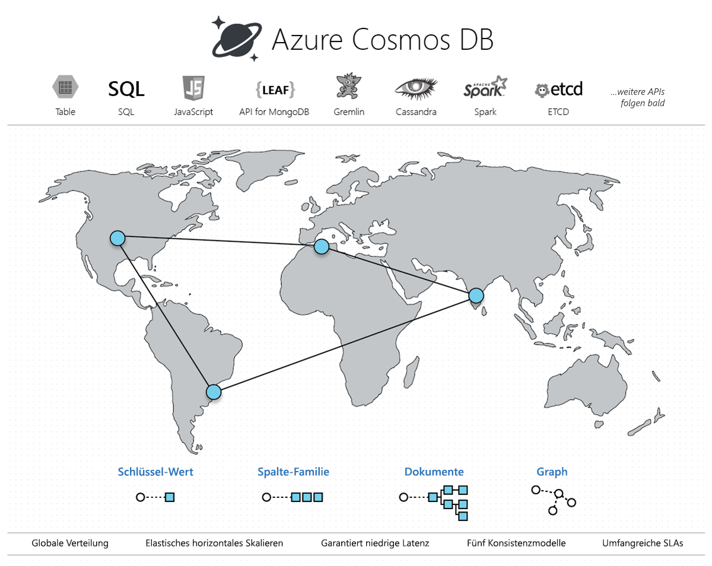

# Willkommen bei Azure Cosmos DB

Moderne Anwendungen erfordern eine hohe Reaktionsschnelligkeit und müssen immer online sein. Um eine geringe Latenz und Hochverfügbarkeit zu erreichen, müssen Instanzen dieser Anwendungen in Rechenzentren eingesetzt werden, die sich in der Nähe ihrer Benutzer befinden. Anwendungen müssen in Echtzeit auf große Nutzungsänderungen zu Spitzenzeiten reagieren, immer größere Datenmengen speichern und diese den Benutzern innerhalb von Millisekunden zur Verfügung stellen.

Azure Cosmos DB ist der global verteilte Datenbankdienst von Microsoft mit mehreren Modellen. Mit Cosmos DB können Sie Durchsatz und Speicher mit nur einem Klick elastisch und unabhängig voneinander über eine beliebige Anzahl von weltweiten Azure-Regionen hinweg skalieren. Sie können den Durchsatz und Speicherplatz elastisch skalieren und von einem schnellen Datenzugriff im einstelligen Millisekundenbereich über Ihre bevorzugte API mit SQL, MongoDB, Cassandra, Tables oder Gremlin profitieren. Cosmos DB bietet umfassende [Vereinbarungen zum Servicelevel](https://aka.ms/acdbsla) (Service Level Agreements, SLAs) mit Durchsatz-, Latenz-, Verfügbarkeits- und Konsistenzgarantien – dies kann kein anderer Datenbankdienst bereitstellen.

Sie können [Azure Cosmos DB ohne Azure-Abonnement kostenlos und unverbindlich testen](https://azure.microsoft.com/try/cosmosdb/).

> [!div class="nextstepaction"]
> [Azure Cosmos DB kostenlos testen](https://azure.microsoft.com/try/cosmosdb/)

## Hauptvorteile

### Globale, sofort einsatzbereite Verteilung

Cosmos DB ermöglicht es Ihnen, hochgradig reaktive und hochverfügbare Anwendungen weltweit zu erstellen. Cosmos DB repliziert Ihre Daten transparent, wo auch immer sich Ihre Benutzer befinden, sodass Ihre Benutzer mit dem Replikat der Daten interagieren können, das sich am nächsten befindet.

Cosmos DB ermöglicht es Ihnen, jederzeit mit einem Klick auf eine Schaltfläche Ihrem Cosmos-Konto eine der Azure-Regionen hinzuzufügen oder diese aus ihm zu entfernen. Cosmos DB repliziert Ihre Daten nahtlos in alle Regionen, die Ihrem Cosmos-Konto zugeordnet sind, während Ihre Anwendung dank der *Multihostingfunktionen* des Diensts weiterhin hochverfügbar ist. Weitere Informationen finden Sie im Artikel zur [globalen Verteilung](distribute-data-globally.md).

### Always On

Aufgrund der engen Integration in die Azure-Infrastruktur und der [transparenten Multimasterreplikation](global-dist-under-the-hood.md) bietet Cosmos DB [eine Hochverfügbarkeit von 99,999 %](high-availability.md) sowohl für Lese- als auch für Schreibvorgänge. Cosmos DB bietet Ihnen auch die Möglichkeit, programmgesteuert (oder über das Portal) ein regionales Failover Ihres Cosmos-Kontos aufzurufen. Diese Funktion sorgt dafür, dass bei einem regionalen Notfall ein Failover Ihrer Anwendung durchgeführt werden kann.

### Flexible Skalierbarkeit für Durchsatz und Speicher weltweit

Cosmos DB wurde mit transparenter horizontaler Partitionierung und Multimasterreplikation konzipiert und bietet eine nie dagewesene elastische Skalierbarkeit für alle Ihre Schreib- und Lesevorgänge rund um den Globus. Sie können mit einem einzigen API-Aufruf von Tausenden auf Hunderte von Millionen Anforderungen/Sek. rund um den Globus zentral hochskalieren, wobei Sie nur für den von Ihnen benötigten Durchsatz (und Speicher) zahlen. Diese Funktionalität hilft Ihnen, unerwartete Belastungsspitzen in Ihren Workloads zu bewältigen, ohne für Spitzen übermäßig Kapazität vorhalten zu müssen. Weitere Informationen finden Sie unter [Partitionierung in Cosmos DB](partitioning-overview.md), [Bereitstellen des Durchsatzes für Container und Datenbanken](set-throughput.md) und [Globales Skalieren von bereitgestelltem Durchsatz](scaling-throughput.md).

### Weltweit garantiert niedrige Latenz im 99. Quantil

Mit Cosmos DB können Sie global nutzbare Anwendungen mit hoher Reaktionsfähigkeit erstellen. Dank des neuen Protokolls für die Multimasterreplikation und der [schreiboptimierten Datenbank-Engine](index-policy.md) ohne Latches garantiert Cosmos DB Latenzen von unter 10 ms sowohl für (indizierte) Lesevorgänge als auch für Schreibvorgänge auf der ganzen Welt im 99. Quantil. Diese Funktion ermöglicht eine nachhaltige Erfassung von Daten und blitzschnelle Abfragen für hochgradig reaktive Anwendungen.

### Genau definiert, mehrere Konsistenzoptionen

Beim Erstellen von global verteilten Anwendungen in Cosmos DB müssen Sie keine extremen [Kompromisse zwischen Konsistenz, Verfügbarkeit, Latenz und Durchsatz](consistency-levels-tradeoffs.md) mehr eingehen. Das Cosmos DB-Protokoll für die Multimasterreplikation bietet [fünf klar definierte Konsistenzoptionen](consistency-levels.md) - (*starke Veraltung*, *begrenzte Veraltung*, *Sitzungskonsistenz*, *Präfixkonsistenz* und *letztliche Konsistenz*) für ein intuitives Programmiermodell mit geringen Latenzen und hoher Verfügbarkeit für Ihre global verteilte Anwendung.

### Keine Schema- oder Indexverwaltung

Die Synchronisierung von Datenbankschemas und -indizes mit dem Schema einer Anwendung ist bei global verteilten Anwendungen besonders problematisch. Dank Cosmos DB müssen Sie sich nicht länger mit der Schema- oder Indexverwaltung befassen. Die Datenbank-Engine ist vollkommen unabhängig vom Schema.  Da keine Schema- und Indexverwaltung erforderlich ist, müssen Sie sich auch bei der Migration von Schemas keine Gedanken um Anwendungsausfallzeiten machen. Cosmos DB [indiziert automatisch alle Daten](index-policy.md) und ermöglicht blitzschnelle Abfragen.

### Kampferprobter Datenbankdienst

Cosmos DB ist ein Basisdienst in Azure. Seit fast einem Jahrzehnt wird Cosmos DB von vielen Microsoft-Produkten für unternehmenskritische Anwendungen auf globaler Ebene eingesetzt, darunter Skype, Xbox, Office 365, Azure und viele weitere. Heute ist Cosmos DB einer der am schnellsten wachsenden Dienste in Azure und wird von vielen externen Kunden und unternehmenskritischen Anwendungen genutzt, die eine elastische Skalierung, eine schlüsselfertige globale Verteilung sowie Multimasterreplikation für geringe Latenzen und hohe Verfügbarkeit für Lese- und Schreibvorgänge erfordern.

### Ubiquitäre regionale Präsenz

Cosmos DB ist in allen Azure-Regionen weltweit verfügbar. Hierzu zählen mehr als 54 Regionen in der öffentlichen Cloud, [Azure China 21Vianet](https://www.azure.cn/en-us/), Azure Deutschland, Azure Government und Azure Government for Department of Defense (DoD). Weitere Informationen finden Sie unter [Regionale Präsenz von Cosmos DB](regional-presence.md).

### Standardmäßig sicher und einsatzbereit.

Cosmos DB ist für eine [Vielzahl von Konformitätsstandards](compliance.md) zertifiziert. Zusätzlich werden alle Daten in Cosmos DB im Ruhezustand und während der Übertragung verschlüsselt. Cosmos DB bietet Autorisierung auf Zeilenebene und erfüllt strenge Sicherheitsstandards.

### Erhebliche Einsparungen bei den Gesamtbetriebskosten

Da Cosmos DB ein vollständig verwalteter Dienst ist, müssen Sie keine komplexen Bereitstellungen in mehreren Rechenzentren und Upgrades Ihrer Datenbanksoftware mehr verwalten und betreiben. Außerdem müssen Sie nicht mehr für Support, Lizenzierung oder Betrieb bezahlen oder Ihre Datenbank für Workloadspitzen bereitstellen. Weitere Informationen finden Sie unter [Optimieren der Kosten mit Cosmos DB](total-cost-ownership.md).

### Branchenweit führende, umfassende SLAs

Cosmos DB ist der erste und einzige Dienst, der [branchenführende umfassende SLAs](https://azure.microsoft.com/support/legal/sla/cosmos-db/) bietet, die 99,999 % Hochverfügbarkeits-, Lese- und Schreiblatenzzeiten mit dem 99. Quantil, garantierten Durchsatz und Konsistenz umfassen.

### Global verteilte operative Analysen mit Spark

Sie können [Spark](spark-connector.md) direkt für in Cosmos DB gespeichert Daten ausführen. Diese Funktion ermöglicht es Ihnen, operative Analysen mit niedriger Latenz auf globaler Ebene durchzuführen, ohne die transaktionalen Workloads zu beeinträchtigen, die direkt mit Cosmos DB ausgeführt werden. Weitere Informationen finden Sie unter [Global verteilte operative Analysen](lambda-architecture.md).

### Entwickeln von Anwendungen in Cosmos DB mit gängigen NoSQL-APIs

Cosmos DB bietet verschiedene APIs zum Arbeiten mit den in Ihrer Cosmos-Datenbank gespeicherten Daten. Standardmäßig können Sie zum Abfragen Ihrer Cosmos-Datenbank [SQL verwenden](how-to-sql-query.md) (eine grundlegende API). Cosmos DB implementiert auch APIs für [Cassandra](cassandra-introduction.md), [MongoDB](mongodb-introduction.md), [Gremlin](graph-introduction.md) und [Azure Table Storage](table-introduction.md). Sie können Clienttreiber (und Tools) für die häufig verwendeten NoSQL-APIs (z.B. MongoDB, Cassandra, Gremlin) direkt auf Ihre Cosmos-Datenbank verweisen. Durch Unterstützung der Wire Protocols häufig verwendeter NoSQL-APIs ermöglicht Cosmos DB Folgendes:

* Einfaches Migrieren Ihrer Anwendung zu Cosmos DB unter Beibehaltung wesentlicher Teile Ihrer Anwendungslogik.
* Aufrechterhalten der Portierbarkeit und Unabhängigkeit von Cloudanbietern Ihrer Anwendung.
* Vollständig verwalteter Clouddienst mit branchenführenden, finanziell abgesicherten SLAs für die gängigen NoSQL-APIs. 
* Elastischen Skalieren des bereitgestellten Durchsatzes und Speichers für Ihre Datenbanken basierend auf Ihrem Bedarf und Bezahlung nur für den Durchsatz und den Speicher, den Sie benötigen. Dies führt zu erheblichen Kosteneinsparungen.

## Lösungen, die von Azure-Cosmos-DB profitieren

Von der [garantierten Hochverfügbarkeit](https://azure.microsoft.com/support/legal/sla/cosmos-db/), dem hohen Durchsatz, der geringen Latenz und der justierbaren Konsistenz von Cosmos DB profitieren alle [Web-, Mobil-, Gaming- und IoT-Anwendungen](use-cases.md), die [auf globaler Ebene](distribute-data-globally.md) große Datenmengen und zahlreiche Lese- und Schreibvorgänge mit Antwortzeiten nahezu in Echtzeit für verschiedenste Daten bewältigen müssen. Erfahren Sie mehr darüber, wie Azure Cosmos DB für die Erstellung von [IoT und Telematik](use-cases.md#iot-and-telematics), [Einzelhandel und Marketing](use-cases.md#retail-and-marketing), [Gaming](use-cases.md#gaming) sowie für [mobile Anwendungen und Webanwendungen](use-cases.md#web-and-mobile-applications) verwendet werden kann.

## Nächste Schritte

Erfahren Sie mehr über die grundlegenden Konzepte von Cosmos DB: [schlüsselfertige globale Verteilung](distribute-data-globally.md), [Partitionierung](partitioning-overview.md) und [bereitgestellter Durchsatz](request-units.md).

Erste Schritte mit Azure Cosmos DB mit einem unserer Schnellstarts:

* [Erste Schritte mit der SQL-API von Azure Cosmos DB](create-sql-api-dotnet.md)
* [Erste Schritte mit der Azure Cosmos DB-API für MongoDB](create-mongodb-nodejs.md)
* [Erste Schritte mit der Cassandra-API von Azure Cosmos DB](create-cassandra-dotnet.md)
* [Erste Schritte mit der Gremlin-API von Azure Cosmos DB](create-graph-dotnet.md)
* [Erste Schritte mit der Tabellen-API von Azure Cosmos DB](create-table-dotnet.md)

> [!div class="nextstepaction"]
> [Azure Cosmos DB kostenlos testen](https://azure.microsoft.com/try/cosmosdb/)
