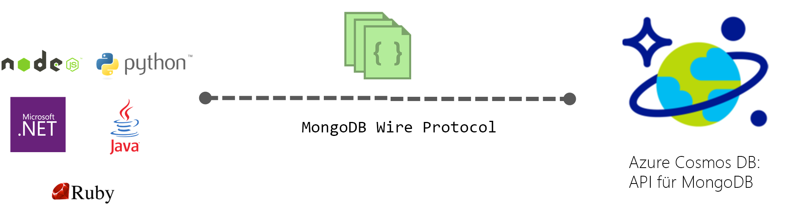

# Einführung in Azure Cosmos DB: API für MongoDB

[Azure Cosmos DB](../cosmos-db/introduction.md) ist ein global verteilter Datenbankdienst von Microsoft mit mehreren Modellen für unternehmenskritische Anwendungen. Azure Cosmos DB bietet [sofort einsetzbare globale Verteilung](distribute-data-globally.md), [flexible Skalierung von Durchsatz und Speicher](partition-data.md) weltweit, Latenzzeiten im einstelligen Millisekundenbereich beim 99. Perzentil, [fünf wohldefinierte Konsistenzebenen](consistency-levels.md) sowie garantierte hohe Verfügbarkeit, gestützt durch [branchenführende Vereinbarungen zum Servicelevel](https://azure.microsoft.com/support/legal/sla/cosmos-db/) (SLAs, Service Level Agreements). Azure Cosmos DB [indiziert automatisch Daten](http://www.vldb.org/pvldb/vol8/p1668-shukla.pdf), sodass Sie sich nicht mit der Schema- und Indexverwaltung befassen müssen. Es unterstützt mehrere Datenmodelle – Dokumente, Schlüsselwerte, Diagramme und spaltenorientierte Datenmodelle. 

 

Azure Cosmos DB-Datenbanken können als Datenspeicher für Apps verwendet werden, die für [MongoDB](https://docs.mongodb.com/manual/introduction/) geschrieben wurden. Das bedeutet, dass Ihre für MongoDB geschriebene Anwendung nun über vorhandene [Treiber](https://docs.mongodb.org/ecosystem/drivers/) mit Azure Cosmos DB kommunizieren und anstelle von MongoDB-Datenbanken Azure Cosmos DB-Datenbanken verwenden kann. In vielen Fällen müssen Sie für den Umstieg von MongoDB auf Azure Cosmos DB nur eine Verbindungszeichenfolge ändern. Mit dieser Funktion können Sie ganz einfach MongoDB-Datenbankanwendungen in der Azure-Cloud mit der globalen Verteilung von Azure Cosmos DB sowie mit [umfassenden branchenführenden SLAs](https://azure.microsoft.com/support/legal/sla/cosmos-db) erstellen und ausführen und trotzdem weiterhin auf bereits vorhandene Kenntnisse und vertraute Tools für MongoDB zurückgreifen.

**MongoDB-Kompatibilität:** Sie können Ihre vorhandenen MongoDB-Kenntnisse, -Anwendungscodes und -Tools verwenden, da Azure Cosmos DB das Verbindungsprotokoll von MongoDB 3.4 (Version 5) implementiert und die [MongoDB-Aggregationspipeline](mongodb-feature-support.md#aggregation-pipeline) unterstützt. Sie können Anwendungen mithilfe von MongoDB entwickeln und sie mithilfe des vollständig verwalteten und global verteilten Azure Cosmos DB-Diensts für die Produktion bereitstellen.

## Vorteil der Verwendung von Azure Cosmos DB für MongoDB-Anwendungen

**Flexibel skalierbarer Durchsatz und Speicher:** Die MongoDB-Datenbank lässt sich zur Erfüllung Ihrer Anwendungsanforderungen problemlos zentral hoch- und herunterskalieren. Ihre Daten werden zur Erzielung geringer, planbarer Wartezeiten auf SSDs gespeichert. Azure Cosmos DB unterstützt MongoDB-Sammlungen, die auf eine nahezu unbegrenzte Speichergröße und einen nahezu unbegrenzten bereitgestellten Durchsatz skaliert werden können. Sie können Azure Cosmos DB mit vorhersagbarer Leistung flexibel skalieren, wenn Ihre Anwendung wächst. 

**Replikation in mehreren Regionen:** Azure Cosmos DB repliziert Ihre Daten auf transparente Weise in allen Regionen, die Sie Ihrem MongoDB-Konto zugeordnet haben. Sie können Anwendungen entwickeln, die globalen Zugriff auf Daten benötigen, und dabei für ein ausgewogenes Maß an Konsistenz, Verfügbarkeit und Leistung sorgen – jeweils mit den entsprechenden Garantien. Azure Cosmos DB bietet transparentes regionales Failover mit Multihosting-APIs sowie die Möglichkeit, Durchsatz und Speicher für alle Konten weltweit flexibel zu skalieren. Weitere Informationen finden Sie unter [Globale Verteilung von Daten](distribute-data-globally.md).

**Keine Serververwaltung**: Sie müssen Ihre MongoDB-Datenbanken nicht verwalten und skalieren. Azure Cosmos DB ist ein vollständig verwalteter Dienst. Sie müssen also keine Infrastruktur oder virtuellen Computer selbst verwalten. Azure Cosmos DB ist in mehr als 30 [Azure-Regionen](https://azure.microsoft.com/regions/services/) verfügbar.

**Einstellbare Konsistenzebenen:** Die Konsistenz kann über fünf wohl definierte Ebenen abgestimmt werden, um für ein ausgewogenes Verhältnis zwischen Konsistenz und Leistung zu sorgen. Für Abfragen und Lesevorgänge bietet Azure Cosmos DB fünf verschiedene Konsistenzebenen – „stark“, „begrenzte Veraltung“, „Sitzung“, „Präfixkonsistenz“ und „letztlich“. Mit diesen granularen, gut abgegrenzten Konsistenzebenen können fundierte Kompromisse zwischen Konsistenz, Verfügbarkeit und Latenz geschlossen werden. Weitere Informationen finden Sie unter [Verwenden von Konsistenzebenen zum Maximieren der Verfügbarkeit und Leistung](consistency-levels.md).

**Automatische Indizierung:** Alle Eigenschaften in Dokumenten in Ihrer MongoDB-Datenbank werden von Azure Cosmos DB automatisch indiziert, ohne dass ein Schema oder die Erstellung sekundärer Indizes erwartet wird oder erforderlich ist. Die Funktion für den eindeutigen Index bietet darüber hinaus eine Eindeutigkeitseinschränkung für Dokumentfelder, die in Azure Cosmos DB bereits automatisch indiziert wurden.

**Unternehmensniveau:** Azure Cosmos DB unterstützt mehrere lokale Replikate, um eine Verfügbarkeit von 99,99 Prozent sowie Datenschutz bei lokalen und regionalen Ausfällen zu bieten. Azure Cosmos DB verfügt über [Kompatibilitätszertifizierungen](https://www.microsoft.com/trustcenter) und Sicherheitsfunktionen auf Unternehmensniveau. 

In diesem Azure Friday-Video mit Scott Hanselman und Kirill Gavrylyuk (Azure Cosmos DB Principal Engineering Manager) erhalten Sie weitere Informationen.

> [!VIDEO https://channel9.msdn.com/Shows/Azure-Friday/Introducing-Azure-Cosmos-DB/player]
> 

## Erste Schritte

Absolvieren Sie die MongoDB-Schnellstartanleitungen, um ein Azure Cosmos DB-Konto zu erstellen und Ihre vorhandene MongoDB-Anwendung für die Verwendung von Azure Cosmos DB zu migrieren, oder erstellen Sie eine neue:

* [Migrieren einer vorhandenen MongoDB-Web-App in Node.js](create-mongodb-nodejs.md)
* [Erstellen einer MongoDB-API-Web-App mit .NET und dem Azure-Portal](create-mongodb-dotnet.md)
* [Erstellen einer MongoDB-API-Konsolen-App mit Java und dem Azure-Portal](create-mongodb-java.md)

## Nächste Schritte

Informationen zur MongoDB-API für Azure Cosmos DB sind in die Azure Cosmos DB-Dokumentation integriert. Im Folgenden finden Sie einige Verweise für den Einstieg:

* Im Tutorial [Verbinden mit einem MongoDB-Konto](connect-mongodb-account.md) erfahren Sie, wie Sie die Information zur Verbindungszeichenfolge für Ihr Konto abrufen.
* Im Tutorial [Verwenden von MongoChef mit Azure Cosmos DB](mongodb-mongochef.md) erfahren Sie, wie Sie eine Verbindung zwischen Ihrer Azure Cosmos DB-Datenbank und einer MongoDB-App in MongoChef erstellen.
* Arbeiten Sie das Tutorial [Migrieren von Daten zu Azure Cosmos DB mit Protokollunterstützung für MongoDB](mongodb-migrate.md) durch, um Ihre Daten in eine API für MongoDB-Datenbank zu importieren.
* Stellen Sie mithilfe von [Robomongo](mongodb-robomongo.md) eine Verbindung mit einem API für MongoDB-Konto her.
* Finden Sie mit dem [GetLastRequestStatistics-Befehl und den Metriken im Azure-Portal](request-units.md#GetLastRequestStatistics) heraus, wie viele RUs von Ihren Vorgängen verwendet werden.
* Erfahren Sie, wie Sie [Lesevoreinstellungen für global verteilte Apps konfigurieren](../cosmos-db/tutorial-global-distribution-mongodb.md).
