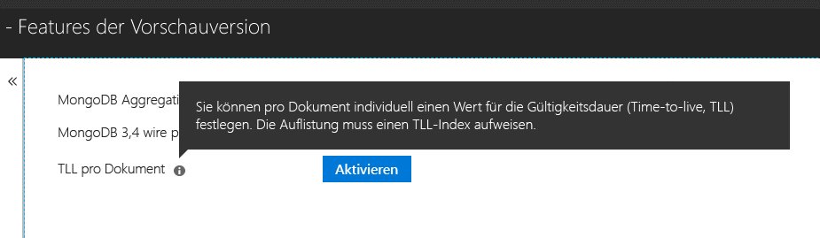

# <a name="expire-data-in-azure-cosmos-db-mongodb-api"></a>Konfigurieren einer Gültigkeitsdauer in der Azure Cosmos DB-MongoDB-API

Mithilfe de TTL-Funktion (Time To Live, Gültigkeitsdauer) kann die Gültigkeit von Daten in der Datenbank automatisch ablaufen. Die MongoDB-API nutzt die TTL-Funktionen von Azure Cosmos DB. Unterstützt werden zwei Modi: Festlegen eines TTL-Standardwerts für die gesamte Sammlung und Festlegen individueller TTL-Werte für die einzelnen Dokumente. Die Logik, die TTL-Indizes und dokumentspezifischen TTL-Werten in der MongoDB-API zugrunde liegt, ist die [gleiche wie in Azure Cosmos DB](../cosmos-db/mongodb-indexing.md).

## <a name="ttl-indexes"></a>TTL-Indizes
Wenn Sie eine universelle Gültigkeitsdauer für eine Sammlung verwenden möchten, muss ein [„TTL-Index“ (Index für die Gültigkeitsdauer)](../cosmos-db/mongodb-indexing.md) erstellt werden. Der TTL-Index ist ein Index im Feld „_ts“ mit einem expireAfterSeconds-Wert.

Beispiel:
```JavaScript
globaldb:PRIMARY> db.coll.createIndex({"_ts":1}, {expireAfterSeconds: 10})
{
        "_t" : "CreateIndexesResponse",
        "ok" : 1,
        "createdCollectionAutomatically" : true,
        "numIndexesBefore" : 1,
        "numIndexesAfter" : 4
}
```

Der Befehl im obigen Beispiel erstellt einen Index mit TTL-Funktion. Nach Erstellung des Index löscht die Datenbank automatisch alle Dokumente in dieser Sammlung, die in den letzten zehn Sekunden nicht geändert wurden. 

> [!NOTE]
> **_ts** ist ein Cosmos DB-spezifisches Feld, auf das über MongoDB-Clients nicht zugegriffen werden kann. Dies ist eine reservierte Eigenschaft (Systemeigenschaft), die den Zeitstempel der letzten Änderung eines Dokuments enthält.
>
    
Zusätzliches C#-Beispiel: 
```C# 
var options = new CreateIndexOptions {ExpireAfter = TimeSpan.FromSeconds(10)}; 
var field = new StringFieldDefinition<BsonDocument>("_ts"); 
var indexDefinition = new IndexKeysDefinitionBuilder<BsonDocument>().Ascending(field); 
await collection.Indexes.CreateOneAsync(indexDefinition, options); 
``` 

## <a name="set-time-to-live-value-for-a-document"></a>Festlegen eines TTL-Werts für ein Dokument 
Es werden auch dokumentspezifische TTL-Werte unterstützt. Die Dokumente müssen eine Stammebeneneigenschaft vom Typ „ttl“ (in Kleinbuchstaben) enthalten, und es muss wie weiter oben beschrieben ein TTL-Index für die Sammlung vorhanden sein. Für ein Dokument festgelegte TTL-Werte haben Vorrang vor dem TTL-Wert einer Sammlung.

Der TTL-Wert muss als int32-Wert angegeben werden. Alternativ kann auch ein int64-Wert verwendet werden, der in einen int32-Wert passt, oder ein double-Wert ohne Dezimalstellen, der in einen int32 passt. Von diesen Spezifikationen abweichende Werte für die TTL-Eigenschaft sind zwar zulässig, werden aber nicht als relevante dokumentspezifische TTL-Werte behandelt.

Der TTL-Wert für das Dokument ist optional. Dokumente können auch ohne TTL-Wert in die Sammlung eingefügt werden.  In diesem Fall gilt der TTL-Wert der Sammlung. 

Die folgenden Dokumente verfügen über gültige TTL-Werte. Die dokumentspezifischen TTL-Werte eingefügter Dokumente haben Vorrang vor den TTL-Werten der Sammlung. Die Dokumente werden daher nach 20 Sekunden entfernt.  

```JavaScript 
globaldb:PRIMARY> db.coll.insert({id:1, location: "Paris", ttl: 20.0}) 
globaldb:PRIMARY> db.coll.insert({id:1, location: "Paris", ttl: NumberInt(20)}) 
globaldb:PRIMARY> db.coll.insert({id:1, location: "Paris", ttl: NumberLong(20)}) 
```

Die TTL-Werte der folgenden Dokumente sind ungültig. Die Dokumente werden zwar eingefügt, der dokumentspezifische TTL-Wert wird jedoch nicht berücksichtigt. Dies führt dazu, dass die Dokumente gemäß dem TTL-Wert der Sammlung nach zehn Sekunden entfernt werden. 

```JavaScript 
globaldb:PRIMARY> db.coll.insert({id:1, location: "Paris", ttl: 20.5}) //TTL value contains non-zero decimal part. 
globaldb:PRIMARY> db.coll.insert({id:1, location: "Paris", ttl: NumberLong(2147483649)}) //TTL value is greater than Int32.MaxValue (2,147,483,648). 
``` 

## <a name="how-to-activate-the-per-document-ttl-feature"></a>Aktivieren des dokumentspezifischen TTL-Features
Das dokumentspezifische TTL-Feature kann im Azure-Portal auf der Registerkarte „Vorschaufeatures“ des Kontos für die MongoDB-API aktiviert werden.

 

## <a name="next-steps"></a>Nächste Schritte
* [Festlegen einer Gültigkeitsdauer für den automatischen Ablauf von Daten in Azure Cosmos DB-Sammlungen](../cosmos-db/time-to-live.md)
* [Durchführen der Indizierung in der Azure Cosmos DB-MongoDB-API](../cosmos-db/mongodb-indexing.md)
