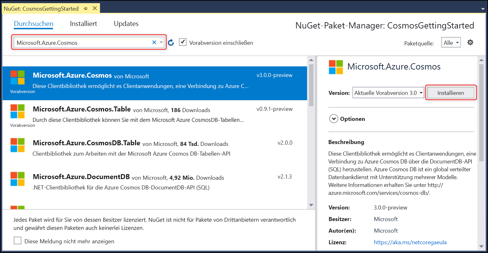

# <a name="build-a-net-console-app-to-manage-data-in-azure-cosmos-db-sql-api-account-sdk-version-3-preview"></a>Erstellen einer .NET-Konsolen-App zum Verwalten von Daten in einem Azure Cosmos DB-SQL-API-Konto (Vorschau von Version 3 des SDK)

> [!div class="op_single_selector"]
> * [.NET (Vorschauversion)](sql-api-dotnet-get-started-preview.md)
> * [.NET](sql-api-get-started.md)
> * [.NET Core](sql-api-dotnetcore-get-started.md)
> * [.NET Core (Vorschauversion)](sql-api-dotnet-core-get-started-preview.md)
> * [Java](sql-api-java-get-started.md)
> * [Async Java](sql-api-async-java-get-started.md)
> * [Node.js](sql-api-nodejs-get-started.md)
> 

Willkommen zum Tutorial zu den ersten Schritten mit der SQL-API von Azure Cosmos DB. Im Rahmen dieses Tutorials erstellen Sie eine Konsolenanwendung, mit der Azure Cosmos DB-Ressourcen erstellt und abgefragt werden können. In diesem Tutorial wird [mindestens Version 3.0](https://www.nuget.org/packages/Microsoft.Azure.Cosmos) des Azure Cosmos DB .NET SDK für [.NET Standard 2.0](https://docs.microsoft.com/dotnet/standard/net-standard) verwendet.

In diesem Lernprogramm wird Folgendes behandelt:

> [!div class="checklist"]
> * Erstellen eines Azure Cosmos-Kontos und Herstellen der Verbindung
> * Konfigurieren Ihres Projekts in Visual Studio
> * Erstellen einer Datenbank und eines Containers
> * Hinzufügen von Elementen zum Container
> * Abfragen des Containers
> * CRUD-Vorgänge für das Element
> * Löschen der Datenbank

Sie haben nicht genügend Zeit? Keine Sorge! Die vollständige Lösung ist auf [GitHub](https://github.com/Azure-Samples/cosmos-dotnet-getting-started)verfügbar. Im Abschnitt [Abrufen der vollständigen Projektmappe für das Tutorial](#GetSolution) finden Sie eine Kurzanleitung.

Lassen Sie uns anfangen.

## <a name="prerequisites"></a>Voraussetzungen

* Ein aktives Azure-Konto. Wenn Sie keines besitzen, können Sie sich für ein [kostenloses Konto](https://azure.microsoft.com/free/)registrieren. 

  [!INCLUDE [cosmos-db-emulator-docdb-api](../../includes/cosmos-db-emulator-docdb-api.md)]

* [!INCLUDE [cosmos-db-emulator-vs](../../includes/cosmos-db-emulator-vs.md)]

## <a name="step-1-create-an-azure-cosmos-db-account"></a>Schritt 1: Erstellen eines Azure Cosmos DB-Kontos
Wir erstellen nun ein Azure Cosmos DB-Konto. Wenn Sie bereits über ein Konto verfügen, das Sie verwenden möchten, können Sie diesen Schritt überspringen und mit [Einrichten der Visual Studio-Projektmappe](#SetupVS)fortfahren. Wenn Sie den Azure Cosmos DB-Emulator verwenden, führen Sie die Schritte unter [Azure Cosmos DB-Emulator](local-emulator.md) zum Einrichten des Emulators aus, und fahren Sie dann mit [Einrichten Ihres Visual Studio-Projekts](#SetupVS) fort.

[!INCLUDE [create-dbaccount-preview](../../includes/cosmos-db-create-dbaccount-preview.md)]

## <a id="SetupVS"></a>Schritt 2: Einrichten Ihres Visual Studio-Projekts
1. Öffnen Sie auf Ihrem Computer **Visual Studio 2017**.
1. Wählen Sie im Menü **Datei** die Option **Neu** und anschließend **Projekt** aus.
1. Wählen Sie im Dialogfeld **Neues Projekt** die Option **Visual C#** / **Konsolen-App (.NET Framework)** aus, geben Sie Ihrem Projekt einen Namen, und klicken Sie dann auf **OK**.
    
1. Klicken Sie im **Projektmappen-Explorer** mit der rechten Maustaste auf die neue Konsolenanwendung, die sich unter Ihrer Visual Studio-Projektmappe befindet, und klicken Sie anschließend auf **NuGet-Pakete verwalten...**.
    
    
1. Klicken Sie auf der Registerkarte **NuGet** auf **Durchsuchen**, und geben Sie in das Suchfeld **Microsoft.Azure.Cosmos** ein. Aktivieren Sie unbedingt *Vorabversion einbeziehen*, um die Vorschauversion zu finden.
1. Suchen Sie in den Ergebnissen nach **Microsoft.Azure.Cosmos**, und klicken Sie auf **Installieren**.
   Die Paket-ID für die SQL-API-Clientbibliothek von Azure Cosmos DB lautet [Microsoft Azure Cosmos DB Client Library](https://www.nuget.org/packages/Microsoft.Azure.Cosmos/).
   

    Wenn Sie eine Meldung im Zusammenhang mit der Überprüfung von Änderungen an der Projektmappe erhalten, klicken Sie auf **OK**. Wenn Sie eine Meldung im Zusammenhang mit der Akzeptierung der Lizenz erhalten, klicken Sie auf **Ich stimme zu**.

Prima. Damit ist die Einrichtung abgeschlossen und wir können mit dem Schreiben von Code beginnen. Ein vollständiges Codeprojekt dieses Tutorials finden Sie auf [GitHub](https://github.com/Azure-Samples/cosmos-dotnet-getting-started).

## <a id="Connect"></a>Schritt 3: Herstellen einer Verbindung mit einem Azure Cosmos DB-Konto
1. Ersetzen Sie zunächst in der Datei **Program.cs** die Verweise am Anfang der C#-Anwendung durch die folgenden Verweise:
    ```csharp
    using System;
    using System.Threading.Tasks;
    using System.Configuration;
    using Microsoft.Azure.Cosmos;
    using System.Collections.Generic;
    using System.Net;
    ```
1. Fügen Sie nun in der öffentlichen Klasse ``Program`` die folgenden Konstanten und Variablen hinzu:
    ```csharp
    public class Program
    {
        // ADD THIS PART TO YOUR CODE

        // The Azure Cosmos DB endpoint for running this sample.
        private static readonly string EndpointUri = "<your endpoint here>";
        // The primary key for the Azure Cosmos account.
        private static readonly string PrimaryKey = "<your primary key>";

        // The Cosmos client instance
        private CosmosClient cosmosClient;

        // The database we will create
        private CosmosDatabase database;

        // The container we will create.
        private CosmosContainer container;

        // The name of the database and container we will create
        private string databaseId = "FamilyDatabase";
        private string containerId = "FamilyContainer";
    }
    ```
    Hinweis: Wenn Sie mit der vorherigen Version des .NET SDK vertraut sind, kennen Sie unter Umständen bereits die Begriffe „Sammlung“ und „Dokument“. Azure Cosmos DB unterstützt mehrere API-Modelle. Daher werden in Version 3.0 und höheren Versionen des .NET SDK die generischen Begriffe „Container“ und „Element“ verwendet. Ein Container kann eine Sammlung, ein Graph oder eine Tabelle sein. Ein Element kann ein Dokument, ein Edge/Vertex oder eine Zeile sein und stellt den Inhalt eines Containers dar. [Weitere Informationen zu Datenbanken, Containern und Elementen](databases-containers-items.md)

1. Rufen Sie im [Azure-Portal](https://portal.azure.com) Ihre Endpunkt-URL und den Primärschlüssel ab.

    Navigieren Sie im Azure-Portal zu Ihrem Azure Cosmos DB-Konto, und klicken Sie auf **Schlüssel**.

    Kopieren Sie den URI im Portal, und fügen Sie ihn in `<your endpoint URL>` in der Datei ```Program.cs``` ein. Kopieren Sie den PRIMÄRSCHLÜSSEL aus dem Portal, und fügen Sie ihn in `<your primary key>` ein.

   

1. Als Nächstes erstellen wir eine neue Instanz von ```CosmosClient``` und richten das Gerüst für das Programm ein.

    Fügen Sie unterhalb der **Main**-Methode eine neue asynchrone Aufgabe mit der Bezeichnung **GetStartedDemoAsync** hinzu. Sie dient zum Instanziieren des neuen ```CosmosClient```-Elements. **GetStartedDemoAsync** wird als Einstiegspunkt verwendet, der Methoden für Azure Cosmos DB-Ressourcen aufruft.

    ```csharp
    public static async Task Main(string[] args)
    {
    }

    // ADD THIS PART TO YOUR CODE
    /*
        Entry point to call methods that operate on Azure Cosmos DB resources in this sample
    */   
    public async Task GetStartedDemoAsync()
    {
        // Create a new instance of the Cosmos Client
        this.cosmosClient = new CosmosClient(EndpointUri, PrimaryKey);
    }
    ```

1. Fügen Sie den folgenden Code hinzu, um die asynchrone Aufgabe **GetStartedDemoAsync** über die **Main**-Methode auszuführen. Mit der **Main** -Methode werden Ausnahmen abgefangen und in die Konsole geschrieben.
    ```csharp
    public static async Task Main(string[] args)
    {
        // ADD THIS PART TO YOUR CODE
        try
        {
            Console.WriteLine("Beginning operations...\n");
            Program p = new Program();
            await p.GetStartedDemoAsync();
        }
        catch (CosmosException de)
        {
            Exception baseException = de.GetBaseException();
            Console.WriteLine("{0} error occurred: {1}\n", de.StatusCode, de);
        }
        catch (Exception e)
        {
            Console.WriteLine("Error: {0}\n", e);
        }
        finally
        {
            Console.WriteLine("End of demo, press any key to exit.");
            Console.ReadKey();
        }
    }
    ```

1. Drücken Sie **F5** um die Anwendung auszuführen. Durch die Meldung `End of demo, press any key to exit.` in der Ausgabe des Konsolenfensters wird bestätigt, dass die Verbindung mit Azure Cosmos DB hergestellt wurde. Das Konsolenfenster kann nun geschlossen werden. 

Glückwunsch! Sie haben erfolgreich eine Verbindung mit einem Azure Cosmos DB-Konto hergestellt. 

## <a name="step-4-create-a-database"></a>Schritt 4: Erstellen einer Datenbank
Eine Datenbank kann mithilfe der Funktion [**CreateDatabaseIfNotExistsAsync**](https://docs.microsoft.com/en-us/dotnet/api/microsoft.azure.cosmos.cosmosdatabases) oder [**CreateDatabaseAsync**](https://docs.microsoft.com/en-us/dotnet/api/microsoft.azure.cosmos.cosmosdatabases) der ``CosmosDatabases``-Klasse erstellt werden. Eine Datenbank ist ein logischer Container für Elemente, die auf Container aufgeteilt sind.
    
1. Kopieren Sie die Methode **CreateDatabase**, und fügen Sie sie unterhalb der Methode **GetStartedDemoAsync** ein. Mit der Funktion **createDatabase** wird eine neue Datenbank mit der ID ``FamilyDatabase`` erstellt (sofern noch nicht vorhanden). Die ID stammt dabei aus dem Feld ``databaseId``. 

    ```csharp
    /*
        Create the database if it does not exist
    */    
    private async Task CreateDatabase()
    {
        // Create a new database
        this.database = await this.cosmosClient.Databases.CreateDatabaseIfNotExistsAsync(databaseId);
        Console.WriteLine("Created Database: {0}\n", this.database.Id);
    }
    ```

1. Kopieren Sie den Code, und fügen Sie ihn unterhalb der Stelle ein, an der Sie CosmosClient zum Aufrufen der eben hinzugefügten **CreateDatabase**-Methode instanziiert haben.

    ```csharp
    public async Task GetStartedDemoAsync()
    {
        // Create a new instance of the Cosmos Client
        this.cosmosClient = new CosmosClient(EndpointUri, PrimaryKey);

        //ADD THIS PART TO YOUR CODE
        await this.CreateDatabase(); 
    }
    ```

    Nun sollte der Code mit eingefügtem Endpunkt und Primärschlüssel wie folgt aussehen:
    ```csharp
    using System;
    using System.Threading.Tasks;
    using System.Configuration;
    using Microsoft.Azure.Cosmos;
    using System.Collections.Generic;
    using System.Net;

    namespace CosmosGettingStarted
    {
        class Program
        {
            // The Azure Cosmos DB endpoint for running this sample.
            private static readonly string EndpointUri = "<your endpoint here>";
            // The primary key for the Azure Cosmos account.
            private static readonly string PrimaryKey = "<your primary key>";

            // The Cosmos client instance
            private CosmosClient cosmosClient;
        
            // The database we will create
            private CosmosDatabase database;

            // The container we will create.
            private CosmosContainer container;

            // The name of the database and container we will create
            private string databaseId = "FamilyDatabase";
            private string containerId = "FamilyContainer";

            public static async Task Main(string[] args)
            {
                try
                {
                    Console.WriteLine("Beginning operations...");
                    Program p = new Program();
                    await p.GetStartedDemoAsync();
                }
                catch (CosmosException de)
                {
                    Exception baseException = de.GetBaseException();
                    Console.WriteLine("{0} error occurred: {1}\n", de.StatusCode, de);
                }
                catch (Exception e)
                {
                    Console.WriteLine("Error: {0}\n", e);
                }
                finally
                {
                    Console.WriteLine("End of demo, press any key to exit.");
                    Console.ReadKey();
                }
            }

            /*
                Entry point to call methods that operate on Azure Cosmos DB resources in this sample
            */
            public async Task GetStartedDemoAsync()
            {
                // Create a new instance of the Cosmos Client
                this.cosmosClient = new CosmosClient(EndpointUri, PrimaryKey);
                await this.CreateDatabase();
            }

            /*
                Create the database if it does not exist
            */    
            private async Task CreateDatabase()
            {
                // Create a new database
                this.database = await this.cosmosClient.Databases.CreateDatabaseIfNotExistsAsync(databaseId);
                Console.WriteLine("Created Database: {0}\n", this.database.Id);
            }
        }
    }
    ```

Drücken Sie **F5**, um die Anwendung auszuführen.

Glückwunsch! Sie haben erfolgreich eine Azure Cosmos DB-Datenbank erstellt.  

## <a id="CreateColl"></a>Schritt 5: Erstellen eines Containers
> [!WARNING]
> Durch Aufrufen der Methode **CreateContainerIfNotExistsAsync** wird ein neuer Container erstellt. Dies wirkt sich auf den Preis aus. Weitere Informationen finden Sie auf unserer [Preisseite](https://azure.microsoft.com/pricing/details/cosmos-db/).
> 
> 

Ein Container kann mit der Funktion [**CreateContainerIfNotExistsAsync**](https://docs.microsoft.com/en-us/dotnet/api/microsoft.azure.cosmos.cosmoscontainers) oder [**CreateContainerAsync**](https://docs.microsoft.com/en-us/dotnet/api/microsoft.azure.cosmos.cosmoscontainers) in der Klasse **CosmosContainers** erstellt werden. Ein Container besteht aus Elementen (JSON-Dokumente im Falle der SQL-API) und zugeordneter serverseitiger JavaScript-Anwendungslogik. Dazu gehören beispielsweise gespeicherte Prozeduren, benutzerdefinierte Funktionen und Auslöser.

1. Kopieren Sie die Methode **CreateContainer**, und fügen Sie sie unterhalb der Methode **CreateDatabase** ein. Mit der Funktion **CreateContainer** wird ein neuer Container mit der ID ``FamilyContainer`` erstellt (sofern noch nicht vorhanden). Die ID stammt dabei aus dem Feld ``containerId``. 

    ```csharp
    /*
        Create the container if it does not exist. 
        Specifiy "/LastName" as the partition key since we're storing family information, to ensure good distribution of requests and storage.
    */
    private async Task CreateContainer()
    {
        // Create a new container
        this.container = await this.database.Containers.CreateContainerIfNotExistsAsync(containerId, "/LastName");
        Console.WriteLine("Created Container: {0}\n", this.container.Id);
    }
    ```

1. Kopieren Sie den Code, und fügen Sie ihn unterhalb der Stelle ein, an der Sie CosmosClient zum Aufrufen der eben hinzugefügten **CreateContainer**-Methode instanziiert haben.

    ```csharp
    public async Task GetStartedDemoAsync()
    {
        // Create a new instance of the Cosmos Client
        this.cosmosClient = new CosmosClient(EndpointUri, PrimaryKey);
        await this.CreateDatabase(); 

        //ADD THIS PART TO YOUR CODE
        await this.CreateContainer();
    }

Select **F5** to run your application.

Congratulations! You have successfully created an Azure Cosmos DB container.  

## <a id="CreateDoc"></a>Step 6: Add items to the container
An item can be created by using the [**CreateItemAsync**](https://docs.microsoft.com/en-us/dotnet/api/microsoft.azure.cosmos.cosmositems) function of the **CosmosItems** class. When using the SQL API, items are projected as documents, which are user-defined (arbitrary) JSON content. You can now insert an item into your Azure Cosmos DB container.

First, we need to create a **Family** class that will represent objects stored within Azure Cosmos DB in this sample. We will also create **Parent**, **Child**, **Pet**, **Address** subclasses that are used within **Family**. Note that documents must have an **Id** property serialized as **id** in JSON. 
1. Select **Ctrl+Shift+A** to open the **Add New Item** dialog. Add a new class **Family.cs** to your project. 

    

1. Copy and paste the **Family**, **Parent**, **Child**, **Pet**, and **Address** class into **Family.cs**. 
    ```csharp
    using Newtonsoft.Json;

    namespace CosmosGettingStarted
    {
        public class Family
        {
            [JsonProperty(PropertyName = "id")]
            public string Id { get; set; }
            public string LastName { get; set; }
            public Parent[] Parents { get; set; }
            public Child[] Children { get; set; }
            public Address Address { get; set; }
            public bool IsRegistered { get; set; }
            public override string ToString()
            {
                return JsonConvert.SerializeObject(this);
            }
        }

        public class Parent
        {
            public string FamilyName { get; set; }
            public string FirstName { get; set; }
        }

        public class Child
        {
            public string FamilyName { get; set; }
            public string FirstName { get; set; }
            public string Gender { get; set; }
            public int Grade { get; set; }
            public Pet[] Pets { get; set; }
        }

        public class Pet
        {
            public string GivenName { get; set; }
        }

        public class Address
        {
            public string State { get; set; }
            public string County { get; set; }
            public string City { get; set; }
        }
    }
    ```
1. Navigieren Sie zurück zur Datei **Program.cs**, und fügen Sie die Methode **AddItemsToContainer** unterhalb der Methode **CreateContainer** ein. Mit dem Code wird vor der Erstellung sichergestellt, dass noch kein Element mit der gleichen ID vorhanden ist. Fügen Sie zwei Elemente ein: eines für die Familie Andersen und eines für die Familie Wakefield.

    ```csharp
    /*
        Add Family items to the container
    */
    private async Task AddItemsToContainer()
    {
        // Create a family object for the Andersen family
        Family andersenFamily = new Family
        {
            Id = "Andersen.1",
            LastName = "Andersen",
            Parents = new Parent[]
            {
                new Parent { FirstName = "Thomas" },
                new Parent { FirstName = "Mary Kay" }
            },
            Children = new Child[]
            {
                new Child
                {
                    FirstName = "Henriette Thaulow",
                    Gender = "female",
                    Grade = 5,
                    Pets = new Pet[]
                    {
                        new Pet { GivenName = "Fluffy" }
                    }
                }
            },
            Address = new Address { State = "WA", County = "King", City = "Seattle" },
            IsRegistered = true
        };

        // Read the item to see if it exists. Note ReadItemAsync will not throw an exception if an item does not exist. Instead, we check the StatusCode property off the response object. 
        CosmosItemResponse<Family> andersenFamilyResponse = await this.container.Items.ReadItemAsync<Family>(andersenFamily.LastName, andersenFamily.Id);

        if (andersenFamilyResponse.StatusCode == HttpStatusCode.NotFound)
        {
            // Create an item in the container representing the Andersen family. Note we provide the value of the partition key for this item, which is "Andersen"
            andersenFamilyResponse = await this.container.Items.CreateItemAsync<Family>(andersenFamily.LastName, andersenFamily);

            // Note that after creating the item, we can access the body of the item with the Resource property off the CosmosItemResponse. 
            //We can also access the RequestCharge property to see the amount of RUs consumed on this request.
            Console.WriteLine("Created item in database with id: {0} Operation consumed {1} RUs.\n", andersenFamilyResponse.Resource.Id, andersenFamilyResponse.RequestCharge);
        }
        else
        {
            Console.WriteLine("Item in database with id: {0} already exists\n", andersenFamilyResponse.Resource.Id);
        }

        // Create a family object for the Wakefield family
        Family wakefieldFamily = new Family
        {
            Id = "Wakefield.7",
            LastName = "Wakefield",
            Parents = new Parent[]
            {
                new Parent { FamilyName = "Wakefield", FirstName = "Robin" },
                new Parent { FamilyName = "Miller", FirstName = "Ben" }
            },
            Children = new Child[]
            {
                new Child
                {
                    FamilyName = "Merriam",
                    FirstName = "Jesse",
                    Gender = "female",
                    Grade = 8,
                    Pets = new Pet[]
                    {
                        new Pet { GivenName = "Goofy" },
                        new Pet { GivenName = "Shadow" }
                    }
                },
                new Child
                {
                    FamilyName = "Miller",
                    FirstName = "Lisa",
                    Gender = "female",
                    Grade = 1
                }
            },
            Address = new Address { State = "NY", County = "Manhattan", City = "NY" },
            IsRegistered = false
        };

        // Read the item to see if it exists
        CosmosItemResponse<Family> wakefieldFamilyResponse = await this.container.Items.ReadItemAsync<Family>(wakefieldFamily.LastName, wakefieldFamily.Id);

        if (wakefieldFamilyResponse.StatusCode == HttpStatusCode.NotFound)
        {
            // Create an item in the container representing the Wakefield family. Note we provide the value of the partition key for this item, which is "Wakefield"
            wakefieldFamilyResponse = await this.container.Items.CreateItemAsync<Family>(wakefieldFamily.LastName, wakefieldFamily);

            // Note that after creating the item, we can access the body of the item with the Resource property off the CosmosItemResponse. 
            //We can also access the RequestCharge property to see the amount of RUs consumed on this request.
            Console.WriteLine("Created item in database with id: {0} Operation consumed {1} RUs.\n", wakefieldFamilyResponse.Resource.Id, wakefieldFamilyResponse.RequestCharge);
        }
        else
        {
            Console.WriteLine("Item in database with id: {0} already exists\n", wakefieldFamilyResponse.Resource.Id);
        }
    }
    ```
1. Fügen Sie in der Methode ``GetStartedDemoAsync`` einen Aufruf für ``AddItemsToContainer`` hinzu.

    ```csharp
    public async Task GetStartedDemoAsync()
    {
        // Create a new instance of the Cosmos Client
        this.cosmosClient = new CosmosClient(EndpointUri, PrimaryKey);
        await this.CreateDatabase(); 
        await this.CreateContainer();

        //ADD THIS PART TO YOUR CODE
        await this.AddItemsToContainer();
    }
    ```

Drücken Sie **F5**, um die Anwendung auszuführen.

Glückwunsch! Sie haben erfolgreich zwei Azure Cosmos DB-Elemente erstellt.  


## <a id="Query"></a>Schritt 7: Abfragen von Azure Cosmos DB-Ressourcen
Azure Cosmos DB unterstützt umfassende [Abfragen](sql-api-sql-query.md) der in jeder Sammlung gespeicherten JSON-Dokumente. Der folgende Beispielcode zeigt, wie Sie eine Abfrage für die im vorherigen Schritt eingefügten Elemente ausführen.

1. Kopieren Sie die Methode **RunQuery**, und fügen Sie sie unterhalb der Methode **AddItemsToContainer** ein.

    ```csharp
    /*
        Run a query (using Azure Cosmos DB SQL syntax) against the container
    */
    private async Task RunQuery()
    {
        var sqlQueryText = "SELECT * FROM c WHERE c.LastName = 'Andersen'";
        var partitionKeyValue = "Andersen";

        Console.WriteLine("Running query: {0}\n", sqlQueryText);

        CosmosSqlQueryDefinition queryDefinition = new CosmosSqlQueryDefinition(sqlQueryText);
        CosmosResultSetIterator<Family> queryResultSetIterator = this.container.Items.CreateItemQuery<Family>(queryDefinition, partitionKeyValue);

        List<Family> families = new List<Family>();

        while (queryResultSetIterator.HasMoreResults)
        {
            CosmosQueryResponse<Family> currentResultSet = await queryResultSetIterator.FetchNextSetAsync();
            foreach (Family family in currentResultSet)
            {
                families.Add(family);
                Console.WriteLine("\tRead {0}\n", family);
            }
        }
    }
    ```
1. Fügen Sie in der ``GetStartedDemoAsync`` Methode einen Aufruf für ``RunQuery`` hinzu.

    ```csharp
    public async Task GetStartedDemoAsync()
    {
        // Create a new instance of the Cosmos Client
        this.cosmosClient = new CosmosClient(EndpointUri, PrimaryKey);
        await this.CreateDatabase(); 
        await this.CreateContainer();
        await this.AddItemsToContainer();

        //ADD THIS PART TO YOUR CODE
        await this.RunQuery();
    }
    ```

Drücken Sie **F5**, um die Anwendung auszuführen.

Glückwunsch! Sie haben erfolgreich eine Abfrage für einen Azure Cosmos DB-Container ausgeführt.

## <a id="ReplaceItem"></a>Schritt 8: Ersetzen eines JSON-Elements
Sie aktualisieren nun ein Element in Azure Cosmos DB.

1. Kopieren Sie die Methode **ReplaceFamilyItem**, und fügen Sie sie unterhalb der Methode **RunQuery** ein. Beachten Sie, dass die Eigenschaft ``IsRegistered`` der Familie und das Element ``Grade`` für eins der Kinder geändert wird.
    ```csharp
    /*
    Update an item in the container
    */
    private async Task ReplaceFamilyItem()
    {
        CosmosItemResponse<Family> wakefieldFamilyResponse = await this.container.Items.ReadItemAsync<Family>("Wakefield", "Wakefield.7");
        var itemBody = wakefieldFamilyResponse.Resource;
        
        // update registration status from false to true
        itemBody.IsRegistered = true;
        // update grade of child
        itemBody.Children[0].Grade = 6;

        // replace the item with the updated content
        wakefieldFamilyResponse = await this.container.Items.ReplaceItemAsync<Family>(itemBody.LastName, itemBody.Id, itemBody);
        Console.WriteLine("Updated Family [{0},{1}]\n. Body is now: {2}\n", itemBody.LastName, itemBody.Id, wakefieldFamilyResponse.Resource);
    }
    ```
1. Fügen Sie in der ``GetStartedDemo`` Methode einen Aufruf für ``ReplaceFamilyItem`` hinzu.

    ```csharp
    public async Task GetStartedDemoAsync()
    {
        // Create a new instance of the Cosmos Client
        this.cosmosClient = new CosmosClient(EndpointUri, PrimaryKey);
        await this.CreateDatabase(); 
        await this.CreateContainer();
        await this.AddItemsToContainer();
        await this.RunQuery();

        //ADD THIS PART TO YOUR CODE
        await this.ReplaceFamilyItem();
    }

Select **F5** to run your application.

Congratulations! You have successfully replaced an Azure Cosmos DB item.

## <a id="DeleteDocument"></a>Step 9: Delete item
Now, we will delete an item in Azure Cosmos DB.

1. Copy and paste the **DeleteFamilyItem** method below your **ReplaceFamilyItem** method.
    ```csharp
    /*
    Delete an item in the container
    */
    private async Task DeleteFamilyItem()
    {
        var partitionKeyValue = "Wakefield";
        var familyId = "Wakefield.7";

        // Delete an item. Note we must provide the partition key value and id of the item to delete
        CosmosItemResponse<Family> wakefieldFamilyResponse = await this.container.Items.DeleteItemAsync<Family>(partitionKeyValue, familyId);
        Console.WriteLine("Deleted Family [{0},{1}]\n", partitionKeyValue, familyId);
    }
    ```
1. Fügen Sie in der ``GetStartedDemo`` Methode einen Aufruf für ``DeleteFamilyItem`` hinzu.

    ```csharp
    public async Task GetStartedDemoAsync()
    {
        // Create a new instance of the Cosmos Client
        this.cosmosClient = new CosmosClient(EndpointUri, PrimaryKey);
        await this.CreateDatabase(); 
        await this.CreateContainer();
        await this.AddItemsToContainer();
        await this.RunQuery();
        await this.ReplaceFamilyItem();

        //ADD THIS PART TO YOUR CODE
        await this.DeleteFamilyItem();
    }
    ```

Drücken Sie **F5**, um die Anwendung auszuführen.

Glückwunsch! Sie haben erfolgreich ein Azure Cosmos DB-Element gelöscht.

## <a id="DeleteDatabase"></a>Schritt 10: Löschen der Datenbank
Im nächsten Schritt wird die Datenbank gelöscht. Beim Löschen der erstellten Datenbank werden die Datenbank und alle untergeordneten Ressourcen (Container, Elemente sowie alle gespeicherten Prozeduren, benutzerdefinierten Funktionen und Auslöser) entfernt. Die **CosmosClient**-Instanz wird ebenfalls entfernt.

1. Kopieren Sie die Methode **DeleteDatabaseAndCleanup**, und fügen Sie sie unterhalb der Methode **DeleteFamilyItem** ein.
    ```csharp
    /*
    Delete the database and dispose of the Cosmos Client instance
    */
    private async Task DeleteDatabaseAndCleanup()
    {
        CosmosDatabaseResponse databaseResourceResponse = await this.database.DeleteAsync();
        // Also valid: await this.cosmosClient.Databases["FamilyDatabase"].DeleteAsync();

        Console.WriteLine("Deleted Database: {0}\n", this.databaseId);

        //Dispose of CosmosClient
        this.cosmosClient.Dispose();
    }
    ```
1. Fügen Sie in der ``GetStartedDemo`` Methode einen Aufruf für ``DeleteDatabaseAndCleanup`` hinzu.
    
    ```csharp
    public async Task GetStartedDemoAsync()
    {
        // Create a new instance of the Cosmos Client
        this.cosmosClient = new CosmosClient(EndpointUri, PrimaryKey);
        await this.CreateDatabase(); 
        await this.CreateContainer();
        await this.AddItemsToContainer();
        await this.RunQuery();
        await this.ReplaceFamilyItem();
        await this.DeleteFamilyItem();

        //ADD THIS PART TO YOUR CODE        
        await this.DeleteDatabaseAndCleanup();
    }
    ```

Drücken Sie **F5**, um die Anwendung auszuführen.

Glückwunsch! Sie haben erfolgreich eine Azure Cosmos DB-Datenbank gelöscht.

## <a id="Run"></a>Schritt 11: Ausführen der gesamten C#-Konsolenanwendung
Drücken Sie in Visual Studio F5, um die Anwendung im Debugmodus zu erstellen und auszuführen.

Die Ausgabe der gesamten App sollte in einem Konsolenfenster angezeigt werden. Die Ausgabe zeigt die Ergebnisse der hinzugefügten Abfragen an. Sie sollte mit unten stehendem Beispieltext übereinstimmen.

```
Beginning operations...

Created Database: FamilyDatabase

Created Container: FamilyContainer

Created item in database with id: Andersen.1 Operation consumed 11.43 RUs.

Created item in database with id: Wakefield.7 Operation consumed 14.29 RUs.

Running query: SELECT * FROM c WHERE c.LastName = 'Andersen'

        Read {"id":"Andersen.1","LastName":"Andersen","Parents":[{"FamilyName":null,"FirstName":"Thomas"},{"FamilyName":null,"FirstName":"Mary Kay"}],"Children":[{"FamilyName":null,"FirstName":"Henriette Thaulow","Gender":"female","Grade":5,"Pets":[{"GivenName":"Fluffy"}]}],"Address":{"State":"WA","County":"King","City":"Seattle"},"IsRegistered":false}

Updated Family [Wakefield,Wakefield.7].
        Body is now: {"id":"Wakefield.7","LastName":"Wakefield","Parents":[{"FamilyName":"Wakefield","FirstName":"Robin"},{"FamilyName":"Miller","FirstName":"Ben"}],"Children":[{"FamilyName":"Merriam","FirstName":"Jesse","Gender":"female","Grade":6,"Pets":[{"GivenName":"Goofy"},{"GivenName":"Shadow"}]},{"FamilyName":"Miller","FirstName":"Lisa","Gender":"female","Grade":1,"Pets":null}],"Address":{"State":"NY","County":"Manhattan","City":"NY"},"IsRegistered":true}

Deleted Family [Wakefield,Wakefield.7]

Deleted Database: FamilyDatabase

End of demo, press any key to exit.
```

Glückwunsch! Sie haben dieses Tutorial abgeschlossen und verfügen über eine funktionierende C#-Konsolenanwendung.

## <a id="GetSolution"></a> Herunterladen der vollständigen Projektmappe für das Tutorial
Falls Sie die Schritte in diesem Tutorial aus Zeitmangel nicht durchführen konnten oder nur die Codebeispiele herunterladen möchten, können Sie sie über [GitHub](https://github.com/Azure-Samples/cosmos-dotnet-getting-started) beziehen. 

Zum Erstellen der GetStarted-Projektmappe benötigen Sie Folgendes:

* Ein aktives Azure-Konto. Wenn Sie keines besitzen, können Sie sich für ein [kostenloses Konto](https://azure.microsoft.com/free/)registrieren.
* Ein [Azure Cosmos DB-Konto][cosmos-db-create-account]
* [GetStarted-Projektmappe](https://github.com/Azure-Samples/cosmos-dotnet-getting-started) (erhältlich auf GitHub)

Um die Verweise auf das Azure Cosmos DB .NET SDK in Visual Studio wiederherzustellen, klicken Sie mit der rechten Maustaste im Projektmappen-Explorer auf die Projektmappe **GetStarted**, und klicken Sie dann auf die Option **NuGet-Pakete wiederherstellen**. Aktualisieren Sie dann in der Datei „App.config“ die Werte „EndPointUri“ und „PrimaryKey“, wie unter [Herstellen einer Verbindung mit einem Azure Cosmos DB-Konto](#Connect) beschrieben.

Das ist alles, nun müssen Sie nur noch die Erstellung durchführen.


## <a name="next-steps"></a>Nächste Schritte
* Möchten Sie ein komplexeres ASP.NET MVC-Tutorial durcharbeiten? Siehe [ASP.NET MVC-Tutorial: Entwickeln von Webanwendungen mit Azure Cosmos DB](sql-api-dotnet-application-preview.md).
* Möchten Sie Azure Cosmos DB nutzen, um Skalierungs- und Leistungstests durchzuführen? Weitere Informationen finden Sie unter [Leistungs- und Skalierungstests mit Azure Cosmos DB](performance-testing.md).
* Informationen zum [Überwachen von Anforderungen, Nutzung und Speicher in Azure Cosmos DB](monitor-accounts.md).
* Fragen Sie unser Beispieldataset im [Query Playground](https://www.documentdb.com/sql/demo)ab.
* Weitere Informationen zu Azure Cosmos DB finden Sie unter [Willkommen bei Azure Cosmos DB](https://docs.microsoft.com/azure/cosmos-db/introduction).

[cosmos-db-create-account]: create-sql-api-dotnet-preview.md#create-account
