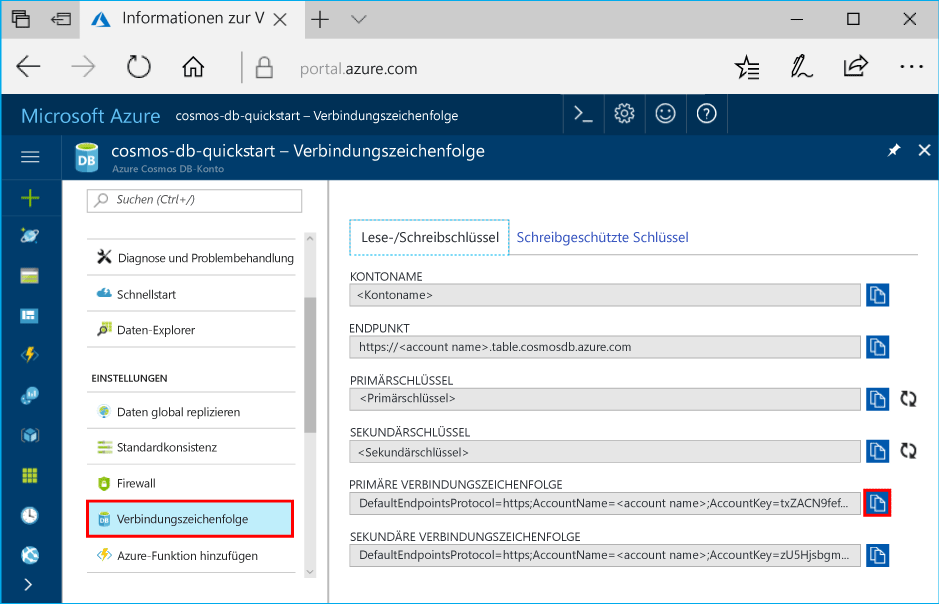

# <a name="azure-cosmos-db-develop-with-the-table-api-in-net"></a>Azure Cosmos DB: Entwickeln mit der Tabellen-API in .NET

Azure Cosmos DB ist ein global verteilter Datenbankdienst von Microsoft mit mehreren Modellen. Sie können schnell Dokument-, Schlüssel/Wert- und Graph-Datenbanken erstellen und abfragen und dabei stets von den Vorteilen der globalen Verteilung und der horizontalen Skalierung profitieren, die Azure Cosmos DB zugrunde liegen.

Dieses Tutorial enthält die folgenden Aufgaben: 

> [!div class="checklist"] 
> * Erstellen eines Azure Cosmos DB-Kontos 
> * Aktivieren der Funktionalität in der Datei „app.config“ 
> * Erstellen einer Tabelle mithilfe der [Tabellen-API](table-introduction.md)
> * Hinzufügen einer Entität zu einer Tabelle 
> * Einfügen eines Entitätsbatchs 
> * Abrufen einer einzelnen Entität 
> * Abfragen von Entitäten mit automatischen sekundären Indizes 
> * Ersetzen einer Entität 
> * Löschen einer Entität 
> * Löschen einer Tabelle
 
## <a name="tables-in-azure-cosmos-db"></a>Tabellen in Azure Cosmos DB 

Azure Cosmos DB bietet die [Tabellen-API](table-introduction.md) für Anwendungen, die einen Schlüsselwertspeicher mit schemalosem Design benötigen. Sowohl die Azure Cosmos DB-Tabellen-API als auch [Azure Table Storage](../storage/common/storage-introduction.md) unterstützen jetzt die gleichen SDKs und REST-APIs. Mit Azure Cosmos DB können Sie Tabellen mit hohen Durchsatzanforderungen erstellen.

Dieses Tutorial wendet sich an Entwickler, die mit dem Azure Table Storage-SDK vertraut sind und die verfügbaren Premium-Features mit Azure Cosmos DB verwenden möchten. Es basiert auf [Erste Schritte mit Azure Table Storage mit .NET](table-storage-how-to-use-dotnet.md) und zeigt, wie zusätzliche Funktionen wie sekundäre Indizes, bereitgestellter Durchsatz und Multihosting genutzt werden können. In diesem Tutorial werden die Verwendung des Azure-Portals zum Erstellen eines Azure Cosmos DB-Kontos und anschließendes Erstellen und Bereitstellen einer Tabellen-API-Anwendung beschrieben. Wir zeigen Ihnen auch .NET-Beispiele zum Erstellen und Löschen einer Tabelle sowie zum Einfügen, Aktualisieren, Löschen und Abfragen von Tabellendaten. 

Wenn Sie derzeit Azure Table Storage verwenden, bietet Ihnen die Azure Cosmos DB-Tabellen-API folgende Vorteile:

- Sofort einsetzbare [globale Verteilung](distribute-data-globally.md) mit Multihosting und [automatischen und manuellen Failovers](regional-failover.md)
- Unterstützung für automatische schemaunabhängige Indizierung aller Eigenschaften („sekundäre Indizes“) und schnelle Abfragen 
- Unterstützung für eine beliebige Anzahl von Regionen übergreifende [unabhängige Skalierung von Speicher und Durchsatz](partition-data.md)
- Unterstützung für [dedizierten Durchsatz pro Tabelle](request-units.md), der von Hundertern auf Millionen Anforderungen pro Sekunde skaliert werden kann
- Unterstützung für [fünf optimierbare Konsistenzebenen](consistency-levels.md) zur Abstimmung von Verfügbarkeit, Latenz und Konsistenz basierend auf Ihren Anwendungsanforderungen
- 99,99 % Verfügbarkeit innerhalb einer einzelnen Region sowie die Möglichkeit zum Hinzufügen weiterer Regionen für höhere Verfügbarkeit und [branchenführende umfassende SLAs](https://azure.microsoft.com/support/legal/sla/cosmos-db/?ref=microsoft.com&utm_source=microsoft.com&utm_medium=docs&utm_campaign=visualstudio) zu allgemeiner Verfügbarkeit
- Arbeiten mit dem vorhandenen Azure Storage-.NET-SDK und keine Änderungen am Code der Anwendung

Dieses Tutorial erläutert die Azure Cosmos DB-Tabelle-API unter Verwendung des .NET SDK. Sie können das [Azure Storage SDK](https://aka.ms/tableapinuget) von NuGet herunterladen.

Weitere Informationen zu komplexen Azure Table Storage-Aufgaben finden Sie unter:

* [Einführung in die Tabellen-API von Azure Cosmos DB](table-introduction.md)
* Alle Details zu verfügbaren APIs finden Sie in der Referenzdokumentation für den Tabellenspeicherdienst: [Azure Cosmos DB Table API .NET SDK](https://docs.microsoft.com/dotnet/api/overview/azure/cosmosdb/client?view=azure-dotnet) (.NET SDK für die Azure Cosmos DB-Tabellen-API).

### <a name="about-this-tutorial"></a>Informationen zu diesem Lernprogramm
Dieses Tutorial wendet sich an Entwickler, die mit dem Azure Table Storage-SDK vertraut sind und die verfügbaren Premium-Features mit Azure Cosmos DB verwenden möchten. Es basiert auf [Erste Schritte mit Azure Table Storage mit .NET](table-storage-how-to-use-dotnet.md) und zeigt, wie zusätzliche Funktionen wie sekundäre Indizes, bereitgestellter Durchsatz und Multihosting genutzt werden können. Wir behandeln die Verwendung des Azure-Portals zum Erstellen eines Azure Cosmos DB-Kontos, erstellen anschließend eine Tabellenanwendung und stellen sie bereit. Wir zeigen Ihnen auch .NET-Beispiele zum Erstellen und Löschen einer Tabelle sowie zum Einfügen, Aktualisieren, Löschen und Abfragen von Tabellendaten. 

Falls Sie Visual Studio 2017 noch nicht installiert haben, können Sie die **kostenlose** [Visual Studio 2017 Community-Edition](https://www.visualstudio.com/downloads/) herunterladen und verwenden. Aktivieren Sie beim Setup von Visual Studio die Option **Azure-Entwicklung**.

[!INCLUDE [quickstarts-free-trial-note](../../includes/quickstarts-free-trial-note.md)]

## <a name="create-a-database-account"></a>Erstellen eines Datenbankkontos

Zunächst erstellen wir ein Azure Cosmos DB-Konto im Azure-Portal.  

[!INCLUDE [cosmosdb-create-dbaccount-table](../../includes/cosmos-db-create-dbaccount-table.md)] 

## <a name="clone-the-sample-application"></a>Klonen der Beispielanwendung

Klonen Sie jetzt eine Tabellen-App aus GitHub, legen Sie die Verbindungszeichenfolge fest und führen Sie diese aus. Sie werden feststellen, wie einfach Sie programmgesteuert mit Daten arbeiten können. 

1. Öffnen Sie ein Terminalfenster von Git (z. B. Git Bash), und verwenden Sie den Befehl `cd`, um den Ordner zu ändern, in den die Beispiel-App gespeichert wird. 

    ```bash
    cd "C:\git-samples"
    ```

2. Führen Sie den folgenden Befehl aus, um das Beispielrepository zu klonen. Dieser Befehl erstellt eine Kopie der Beispiel-App auf Ihrem Computer. 

    ```bash
    git clone https://github.com/Azure-Samples/azure-cosmos-db-table-dotnet-getting-started.git
    ```

3. Öffnen Sie anschließend die Projektmappendatei in Visual Studio. 

## <a name="update-your-connection-string"></a>Aktualisieren der Verbindungszeichenfolge

Wechseln Sie nun zurück zum Azure-Portal, um die Informationen der Verbindungszeichenfolge abzurufen und in die App zu kopieren. Dadurch kann Ihre App mit Ihrer gehosteten Datenbank kommunizieren. 

1. Klicken Sie im [Azure-Portal](http://portal.azure.com/) auf **Verbindungszeichenfolge**. 

    Kopieren Sie die Verbindungszeichenfolge mithilfe der Kopierschaltfläche im rechten Bildschirmbereich.

    

2. Öffnen Sie in Visual Studio die Datei „app.config“. 

3. Fügen Sie den Wert der Verbindungszeichenfolge als Wert von „CosmosDBStorageConnectionString“ in die Datei „app.config“ ein. 

    `<add key="CosmosDBStorageConnectionString" 
        value="DefaultEndpointsProtocol=https;AccountName=MYSTORAGEACCOUNT;AccountKey=AUTHKEY;TableEndpoint=https://account-name.table.cosmosdb.net" />`    

    > [!NOTE]
    > Um diese App mit Azure Table Storage verwenden zu können, müssen Sie die Verbindungszeichenfolge in `app.config file` ändern. Verwenden Sie den Kontonamen als Tabellenkontonamen und den Schlüssel als Azure Storage-Primärschlüssel. <br>
    >`<add key="StandardStorageConnectionString" value="DefaultEndpointsProtocol=https;AccountName=account-name;AccountKey=account-key;EndpointSuffix=core.windows.net" />`
    > 
    >

4. Speichern Sie die Datei „app.config“.

Sie haben die App nun mit allen erforderlichen Informationen für die Kommunikation mit Azure Cosmos DB aktualisiert. 

## <a name="azure-cosmos-db-capabilities"></a>Azure Cosmos DB-Funktionen
Azure Cosmos DB unterstützt eine Reihe von Funktionen, die nicht in der Azure Table Storage-API verfügbar sind. 

Auf bestimmte Funktionen wird über neue Überladungen von CreateCloudTableClient zugegriffen, die es ermöglichen, eine Verbindungsrichtlinie und eine Konsistenzebene anzugeben.

| Verbindungseinstellungen für Tabellen | Beschreibung |
| --- | --- |
| Verbindungsmodus  | Azure Cosmos DB unterstützt zwei Konnektivitätsmodi. Im `Gateway`-Modus werden Anforderungen immer an das Azure Cosmos DB-Gateway gerichtet, das sie an die entsprechenden Datenpartitionen weiterleitet. Im `Direct`-Konnektivitätsmodus ruft der Client die Zuordnung von Tabellen zu Partitionen ab, und Anforderungen werden direkt an Datenpartitionen gerichtet. `Direct` (Standard) wird empfohlen.  |
| Verbindungsprotokoll | Azure Cosmos DB unterstützt zwei Verbindungsprotokolle – `Https` und `Tcp`. `Tcp` ist der Standard und wird empfohlen, da es einfacher ist. |
| Bevorzugte Standorte | Durch Trennzeichen getrennte Liste der bevorzugten Standorte (Multihosting) für Lesevorgänge. Jedem Azure Cosmos DB-Konto können 1-30+ Regionen zugeordnet werden. Jede Clientinstanz kann eine Teilmenge dieser Regionen in der bevorzugten Reihenfolge für Lesevorgänge mit geringer Latenz angeben. Die Regionen müssen mit ihren [Anzeigenamen](https://msdn.microsoft.com/library/azure/gg441293.aspx) benannt sein, z.B. `West US`. Siehe auch [How to setup Azure Cosmos DB global distribution using the Table API](tutorial-global-distribution-table.md) (Einrichten der globalen Verteilung für Azure Cosmos DB mit der Tabellen-API). |
| Konsistenzebene | Um Latenz, Konsistenz und Verfügbarkeit aufeinander abzustimmen, haben Sie fünf klar definierte Konsistenzebenen zur Auswahl: `Strong`, `Session`, `Bounded-Staleness`, `ConsistentPrefix` und `Eventual`. Der Standardwert ist `Session`. Die Auswahl der Konsistenzebene sorgt in Setups mit mehreren Regionen für einen deutlichen Leistungsunterschied. Weitere Informationen finden Sie unter [Einstellbare Datenkonsistenzebenen in DocumentDB](consistency-levels.md). |

Weitere Funktionen können über die folgenden `appSettings`-Konfigurationswerte aktiviert werden.

| Schlüssel | Beschreibung |
| --- | --- |
| TableThroughput | Reservierter Durchsatz für die Tabelle, ausgedrückt in Anforderungseinheiten (RU) pro Sekunde. Einzelne Tabellen können Hunderte Millionen von RU/s unterstützen. Weitere Informationen finden Sie unter [Anforderungseinheiten in DocumentDB](request-units.md). Der Standardwert ist `400`. |
| TableIndexingPolicy | Der Spezifikation der Indizierungsrichtlinie entsprechende JSON-Zeichenfolge. Unter [Indizierungsrichtlinien für DocumentDB](indexing-policies.md) erfahren Sie, wie Sie die Indizierungsrichtlinie ändern können, um bestimmte Spalten ein- bzw. auszuschließen. |
| TableQueryMaxItemCount | Konfigurieren Sie die maximale Anzahl von Elementen, die in einem einzelnen Roundtrip pro Tabellenabfrage zurückgegeben werden. Der Standardwert ist `-1`, sodass Azure Cosmos DB den Wert zur Laufzeit dynamisch bestimmen kann. |
| TableQueryEnableScan | Wenn die Abfrage den Index für keinen Filter verwenden kann, führen Sie sie dennoch über eine Überprüfung aus. Der Standardwert ist `false`.|
| TableQueryMaxDegreeOfParallelism | Der Grad der Parallelität für die Ausführung einer partitionsübergreifenden Abfrage. `0` ist seriell ohne Vorabruf, `1` ist seriell mit Vorabruf, und höhere Werte steigern den Grad der Parallelität. Der Standardwert ist `-1`, sodass Azure Cosmos DB den Wert zur Laufzeit dynamisch bestimmen kann. |

Um den Standardwert zu ändern, öffnen Sie die Datei `app.config` in Visual Studio im Projektmappen-Explorer. Fügen Sie den Inhalt des `<appSettings>` -Elements hinzu (wie unten dargestellt). Ersetzen Sie `account-name` durch den Namen Ihres Speicherkontos und `account-key` durch den Zugriffsschlüssel des Kontos. 

```xml
<configuration>
    ...
    <appSettings>
      <!-- Client options -->
      <add key="CosmosDBStorageConnectionString" 
        value="DefaultEndpointsProtocol=https;AccountName=MYSTORAGEACCOUNT;AccountKey=AUTHKEY;TableEndpoint=https://account-name.table.cosmosdb.azure.com" />
      <add key="StorageConnectionString" value="DefaultEndpointsProtocol=https;AccountName=account-name;AccountKey=account-key; TableEndpoint=https://account-name.documents.azure.com" />

      <!--Table creation options -->
      <add key="TableThroughput" value="700"/>
      <add key="TableIndexingPolicy" value="{""indexingMode"": ""Consistent""}"/>

      <!-- Table query options -->
      <add key="TableQueryMaxItemCount" value="-1"/>
      <add key="TableQueryEnableScan" value="false"/>
      <add key="TableQueryMaxDegreeOfParallelism" value="-1"/>
      <add key="TableQueryContinuationTokenLimitInKb" value="16"/>
            
    </appSettings>
</configuration>
```

Es folgt ein kurzer Überblick zu dem, was in der App geschieht. Öffnen Sie die Datei `Program.cs`. Mit diesen Codezeilen werden die Tabellenressourcen erstellt. 

## <a name="create-the-table-client"></a>Erstellen des Tabellenclients
Sie initialisieren einen `CloudTableClient`, um eine Verbindung mit dem Tabellenkonto herzustellen.

```csharp
CloudTableClient tableClient = storageAccount.CreateCloudTableClient();
```
Dieser Client wird mithilfe der Konfigurationswerte `TableConnectionMode`, `TableConnectionProtocol`, `TableConsistencyLevel` und `TablePreferredLocations` initialisiert, sofern in den App-Einstellungen angegeben.

## <a name="create-a-table"></a>Erstellen einer Tabelle
Dann erstellen Sie eine Tabelle mit `CloudTable`. Tabellen können in Azure Cosmos DB unabhängig voneinander im Hinblick auf Speicher und Durchsatz skaliert werden, und die Partitionierung wird automatisch vom Dienst durchgeführt. Azure Cosmos DB unterstützt sowohl Tabellen mit fester Größe als auch unbegrenzte Tabellen. Weitere Informationen finden Sie unter [How to partition and scale in Azure Cosmos DB](partition-data.md) (Partitionieren und Skalieren in Azure Cosmos DB). 

```csharp
CloudTable table = tableClient.GetTableReference("people");

table.CreateIfNotExists();
```

Bei den Methoden zum Erstellen von Tabellen gibt es einen wichtigen Unterschied. Im Gegensatz zu dem verbrauchsbasierten Modell für Transaktionen von Azure Storage reserviert Azure Cosmos DB Durchsatz. Der Durchsatz ist dediziert/reserviert, sodass niemals eine Drosselung erfolgt, wenn Ihre Anforderungsrate höchstens dem bereitgestellten Durchsatz entspricht.

Sie können den Standarddurchsatz konfigurieren, indem Sie die Einstellung für `TableThroughput` im Hinblick auf RUs (Anforderungseinheiten) pro Sekunde konfigurieren. 

Ein Lesevorgang für eine 1-KB-Entität ist als 1 RU normalisiert, und andere Vorgänge sind basierend auf ihrer CPU-, Arbeitsspeicher- und IOPS-Auslastung auf einen festen RU-Wert normalisiert. Erfahren Sie mehr über [Anforderungseinheiten in Azure Cosmos DB](request-units.md) und insbesondere über [Schlüsselwertspeicher](key-value-store-cost.md).

Als Nächstes betrachten wir die einfachen Lese- und Schreibvorgänge (CRUD) mit dem Azure Table Storage-SDK. Dieses Tutorial zeigt vorhersehbare niedrige Latenzen im einstelligen Millisekundenbereich und schnelle Abfragen mit Azure Cosmos DB.

## <a name="add-an-entity-to-a-table"></a>Hinzufügen einer Entität zu einer Tabelle
In Azure Table Storage sind Entitäten Erweiterungen der `TableEntity`-Klasse und müssen über die Eigenschaften `PartitionKey` und `RowKey` verfügen. Hier ist eine Beispieldefinition für eine Kundenentität.

```csharp
public class CustomerEntity : TableEntity
{
    public CustomerEntity(string lastName, string firstName)
    {
        this.PartitionKey = lastName;
        this.RowKey = firstName;
    }

    public CustomerEntity() { }

    public string Email { get; set; }

    public string PhoneNumber { get; set; }
}
```

Der folgende Codeausschnitt zeigt, wie eine Entität mit dem Azure Storage-SDK eingefügt wird. Azure Cosmos DB ist für eine weltweit garantierte geringe Latenz bei jeder Skalierung ausgelegt.

Schreibvorgänge werden für Anwendungen, die in der gleichen Region ausgeführt werden, in der sich auch das Azure Cosmos DB-Konto befindet, mit <15ms bei p99 und ~6ms bei p50 abgeschlossen. Diese Dauer ist darauf zurückzuführen, dass Schreibvorgänge dem Client erst dann bestätigt werden, nachdem sie synchron repliziert, dauerhaft festgeschrieben und alle Inhalte indiziert sind.


```csharp
// Create a new customer entity.
CustomerEntity customer1 = new CustomerEntity("Harp", "Walter");
customer1.Email = "Walter@contoso.com";
customer1.PhoneNumber = "425-555-0101";

// Create the TableOperation object that inserts the customer entity.
TableOperation insertOperation = TableOperation.Insert(customer1);

// Execute the insert operation.
table.Execute(insertOperation);
```

## <a name="insert-a-batch-of-entities"></a>Einfügen eines Entitätsbatchs
Azure Table Storage unterstützt eine Batchvorgang-API, mit der Sie Update-, Lösch- und Einfügevorgänge in den gleichen Batchvorgang kombinieren können.

```csharp
// Create the batch operation.
TableBatchOperation batchOperation = new TableBatchOperation();

// Create a customer entity and add it to the table.
CustomerEntity customer1 = new CustomerEntity("Smith", "Jeff");
customer1.Email = "Jeff@contoso.com";
customer1.PhoneNumber = "425-555-0104";

// Create another customer entity and add it to the table.
CustomerEntity customer2 = new CustomerEntity("Smith", "Ben");
customer2.Email = "Ben@contoso.com";
customer2.PhoneNumber = "425-555-0102";

// Add both customer entities to the batch insert operation.
batchOperation.Insert(customer1);
batchOperation.Insert(customer2);

// Execute the batch operation.
table.ExecuteBatch(batchOperation);
```
## <a name="retrieve-a-single-entity"></a>Abrufen einer einzelnen Entität
Abrufe (GETs) in der gleichen Azure-Region werden in Azure Cosmos DB in <10ms bei p99 und ~ 1ms bei p50 ausgeführt. Sie können Ihrem Konto beliebig viele Regionen für Lesevorgänge mit geringer Latenz hinzufügen und Anwendungen zum Lesen aus ihrer Region bereitstellen („mehrfach vernetzt“), indem Sie `TablePreferredLocations` festlegen. 

Mit folgendem Codeausschnitt können Sie eine einzelne Entität abrufen:

```csharp
// Create a retrieve operation that takes a customer entity.
TableOperation retrieveOperation = TableOperation.Retrieve<CustomerEntity>("Smith", "Ben");

// Execute the retrieve operation.
TableResult retrievedResult = table.Execute(retrieveOperation);
```
> [!TIP]
> Weitere Informationen über Multihosting-APIs finden Sie unter [How to setup Azure Cosmos DB global distribution using the Table API](tutorial-global-distribution-table.md) (Einrichten der globalen Verteilung für Azure Cosmos DB mit der Tabellen-API).
>

## <a name="query-entities-using-automatic-secondary-indexes"></a>Abfragen von Entitäten mit automatischen sekundären Indizes
Tabellen können mithilfe der `TableQuery`-Klasse abgefragt werden. Azure Cosmos DB besitzt ein schreiboptimiertes Datenbankmodul, das alle Spalten in der Tabelle automatisch indiziert. Indizierung ist in Azure Cosmos DB unabhängig von Schemas. Aus diesem Grund wird Ihr Schema auch dann automatisch indiziert, wenn es von Zeile zu Zeile unterschiedlich ist oder sich im Laufe der Zeit weiterentwickelt. Da Azure Cosmos DB automatische sekundäre Indizes unterstützt, können Abfragen von Eigenschaften den Index nutzen und effizient verarbeitet werden.

```csharp
CloudTable table = tableClient.GetTableReference("people");

// Filter against a property that's not partition key or row key
TableQuery<CustomerEntity> emailQuery = new TableQuery<CustomerEntity>().Where(
    TableQuery.GenerateFilterCondition("Email", QueryComparisons.Equal, "Ben@contoso.com"));

foreach (CustomerEntity entity in table.ExecuteQuery(emailQuery))
{
    Console.WriteLine("{0}, {1}\t{2}\t{3}", entity.PartitionKey, entity.RowKey,
        entity.Email, entity.PhoneNumber);
}
```

Azure Cosmos DB unterstützt die gleiche Abfragefunktionalität wie Azure Table Storage für die Tabellen-API. Azure Cosmos DB unterstützt auch Sortieren, Aggregieren, räumliche Abfrage, Hierarchie und eine Vielzahl von integrierten Funktionen. Die zusätzliche Funktionalität wird in einem zukünftigen Dienstupdate in der Tabellen-API bereitgestellt. Unter [SQL-Abfrage und SQL-Syntax in DocumentDB](documentdb-sql-query.md) finden Sie eine Übersicht dieser Funktionen. 

## <a name="replace-an-entity"></a>Ersetzen einer Entität
Um eine Entität zu aktualisieren, rufen Sie sie aus dem Tabellendienst ab, ändern Sie das Entitätsobjekt, und speichern Sie die Änderungen dann im Tabellendienst. Mit dem folgenden Code wird die Telefonnummer eines vorhandenen Kunden geändert. 

```csharp
TableOperation updateOperation = TableOperation.Replace(updateEntity);
table.Execute(updateOperation);
```
Auf ähnliche Weise können Sie die Vorgänge `InsertOrMerge` oder `Merge` ausführen.  

## <a name="delete-an-entity"></a>Löschen einer Entität
Eine Entität kann nach dem Abrufen problemlos gelöscht werden. Verwenden Sie dazu das gleiche Muster wie beim Aktualisieren einer Entität. Durch den nachstehenden Code wird eine Kundenentität aufgerufen und gelöscht.

```csharp
TableOperation deleteOperation = TableOperation.Delete(deleteEntity);
table.Execute(deleteOperation);
```

## <a name="delete-a-table"></a>Löschen einer Tabelle
Schließlich wird mit dem folgenden Codebeispiel eine Tabelle aus einem Speicherkonto gelöscht. Mit Azure Cosmos DB können Sie eine Tabelle löschen und sofort neu erstellen.

```csharp
CloudTable table = tableClient.GetTableReference("people");
table.DeleteIfExists();
```

## <a name="clean-up-resources"></a>Bereinigen von Ressourcen 

Wenn Sie diese App nicht weiterhin verwenden, löschen Sie mit den folgenden Schritten im Azure-Portal sämtliche Ressourcen, die mit diesem Tutorial erstellt wurden.   

1. Klicken Sie im Azure-Portal im Menü auf der linken Seite auf **Ressourcengruppen**, und klicken Sie auf den Namen der erstellten Ressource.  
2. Klicken Sie auf der Seite mit Ihrer Ressourcengruppe auf **Löschen**, geben Sie im Textfeld den Namen der zu löschenden Ressource ein, und klicken Sie dann auf **Löschen**. 

## <a name="next-steps"></a>Nächste Schritte

In diesem Tutorial haben wir die ersten Schritte mit der Tabellen-API in Azure Cosmos DB behandelt, und Sie haben die folgenden Aufgaben ausgeführt: 

> [!div class="checklist"] 
> * Erstellen eines Azure Cosmos DB-Kontos 
> * Aktivieren der Funktionalität in der Datei „app.config“ 
> * Erstellen einer Tabelle 
> * Hinzufügen einer Entität zu einer Tabelle 
> * Einfügen eines Entitätsbatches 
> * Abrufen einer einzelnen Entität 
> * Abfragen von Entitäten mit automatischen sekundären Indizes 
> * Ersetzen einer Entität 
> * Löschen einer Entität 
> * Löschen einer Tabelle  

Sie können jetzt mit dem nächsten Tutorial fortfahren und mehr über das Abfragen von Tabellendaten erfahren. 

> [!div class="nextstepaction"]
> [Abfragen mit der Tabellen-API](tutorial-query-table.md)
