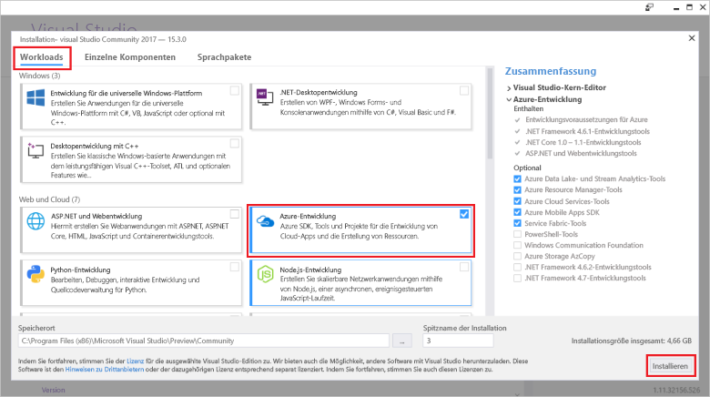

# <a name="create-an-azure-functions-http-trigger-with-an-azure-cosmos-db-input-binding"></a>Erstellen eines Azure Functions-HTTP-Triggers mit einer Azure Cosmos DB-Eingabebindung

Azure Cosmos DB ist eine global verteilte schema- und serverlose Datenbank mit Unterstützung mehrerer Modelle. Azure Functions ist ein serverloser Computedienst, der die bedarfsgesteuerte Codeausführungs ermöglicht. Kombinieren Sie diese beiden Azure-Dienste, und schaffen Sie so die Grundlage für eine serverlose Architektur. Dank dieser Architektur können Sie sich auf die Entwicklung großartiger Apps konzentrieren und müssen sich keine Gedanken über die Bereitstellung und Wartung von Servern für Ihre Compute- und Datenbankanforderungen machen.

Dieses Tutorial baut auf dem unter [Azure Cosmos DB: Erstellen einer .NET-Anwendung mit der Graph-API](create-graph-dotnet.md) erstellten Code auf. In diesem Tutorial wird eine Azure-Funktion mit einem [HTTP-Trigger](https://github.com/MicrosoftDocs/azure-docs-pr/azure-functions/functions-bindings-http-webhook.md#http-trigger) hinzugefügt. Der HTTP-Trigger verwendet eine Azure Cosmos DB-[Eingabebindung](https://github.com/MicrosoftDocs/azure-docs-pr/azure-functions/functions-triggers-bindings.md), um Daten aus der in der Schnellstartanleitung erstellten Diagrammdatenbank abzurufen. Dieser HTTP-Trigger fragt Daten aus Azure Cosmos DB ab. Mit Eingabebindungen von Azure Cosmos DB können Sie jedoch Dateneingabewerte für alles abrufen, was Ihre Funktion benötigt.

Dieses Tutorial enthält die folgenden Aufgaben:

> [!div class="checklist"]
> * Erstellen eines Azure-Funktionsprojekts 
> * Erstellen eines HTTP-Triggers
> * Veröffentlichen der Azure-Funktion
> * Herstellen einer Verbindung zwischen der Azure-Funktion und der Azure Cosmos DB-Datenbank

## <a name="prerequisites"></a>Voraussetzungen

- [Visual Studio 2017, Version 15.3](https://www.visualstudio.com/vs/preview/), einschließlich der Workload **Azure-Entwicklung**

    
    
- Nach der Installation von Visual Studio 2017 Version 15.3 oder dem Upgrade darauf müssen Sie die Visual Studio 2017-Tools für Azure Functions manuell aktualisieren. Sie können die Tools im Menü **Extras** aktualisieren. Navigieren Sie zu **Erweiterungen und Updates...** > **Updates** > **Visual Studio Marketplace** > **Azure Functions and Web Jobs Tools** > **Update**.

- Schließen Sie das Tutorial [Azure Cosmos DB: Entwickeln mit der Graph-API in .NET](tutorial-develop-graph-dotnet.md) ab, oder rufen Sie den Beispielcode aus dem GitHub-Repository [azure-cosmos-db-graph-dotnet-getting-started](https://github.com/Azure-Samples/azure-cosmos-db-graph-dotnet-getting-started) ab, und erstellen Sie das Projekt.
 
## <a name="build-a-function-in-visual-studio"></a>Erstellen einer Funktion in Visual Studio

1. Fügen Sie Ihrer Projektmappe ein **Azure Functions**-Projekt hinzu, indem Sie im **Projektmappen-Explorer** mit der rechten Maustaste auf den Projektmappenknoten klicken und dann auf **Hinzufügen** > **Neues Projekt** klicken. Wählen Sie im Dialogfeld **Azure Functions**, und geben Sie den Namen **PeopleDataFunctions** ein.

   

2. Nach dem Erstellen des Azure Functions-Projekts müssen einige NuGet-Updates und -Installationen ausgeführt werden. 

    a. Um sicherzustellen, dass das neueste Functions SDK vorhanden ist, aktualisieren Sie mit dem NuGet-Manager das Paket **Microsoft.NET.Sdk.Functions**. Klicken Sie im **Projektmappen-Explorer** mit der rechten Maustaste auf das Projekt, und wählen Sie **NuGet-Pakete verwalten** aus. Wählen Sie auf der Registerkarte **Installiert** den Eintrag „Microsoft.NET.Sdk.Functions“ aus, und klicken Sie auf **Aktualisieren**.

   

    b. Geben Sie auf der Registerkarte **Durchsuchen** den Namen **azure.graphs** ein, um das Paket **Microsoft.Azure.Graphs** zu suchen, und klicken Sie dann auf **Installieren**. Dieses Paket enthält das .NET Client SDK für die Graph-API.

   

    c. Geben Sie auf der Registerkarte **Durchsuchen** den Namen **mono.csharp** ein, um das Paket **Mono.CSharp** zu suchen, und klicken Sie dann auf **Installieren**.

   

3. Im Projektmappen-Explorer sollten nun wie hier gezeigt die installierten Pakete enthalten sein. 
   
   Als Nächstes muss Code geschrieben werden, daher fügen wir ein neues Element vom Typ **Azure-Funktion** zum Projekt hinzu. 

    a. Klicken Sie mit der rechten Maustaste auf den Projektknoten im **Projektmappen-Explorer**, und wählen Sie dann **Hinzufügen** > **Neues Element**.   
    b. Wählen Sie im Dialogfeld **Neues Element hinzufügen** die Option **Visual C#-Elemente** und dann **Azure-Funktion** aus, geben Sie als Name für Ihr Projekt **Search** ein, und klicken Sie auf **Hinzufügen**.  
 
   

4. Die Azure-Funktion reagiert auf HTTP-Anforderungen, daher eignet sich hier die HTTP-Triggervorlage.
   
   Klicken Sie im Feld **Neue Azure-Funktion** auf **HTTP-Trigger**. Diese Azure-Funktion soll außerdem so offen wie möglich sein. Daher legen wir **Zugriffsrechte** auf **Anonym** fest, sodass jeder darauf zugreifen kann. Klicken Sie auf **OK**.

   

5. Ersetzen Sie nach dem Hinzufügen von „Search.cs“ zum Azure-Funktionsprojekt die vorhandenen using-Anweisungen durch die folgenden **using**-Anweisungen:

   ```csharp
   using Microsoft.Azure.Documents;
   using Microsoft.Azure.Documents.Client;
   using Microsoft.Azure.Documents.Linq;
   using Microsoft.Azure.Graphs;
   using Microsoft.Azure.WebJobs;
   using Microsoft.Azure.WebJobs.Extensions.Http;
   using Microsoft.Azure.WebJobs.Host;
   using System;
   using System.Collections.Generic;
   using System.Configuration;
   using System.Linq;
   using System.Net;
   using System.Net.Http;
   using System.Threading.Tasks;
   ```

6. Als Nächstes ersetzen Sie den Klassencode der Azure-Funktion durch den folgenden Code. Der Code durchsucht die Azure Cosmos DB-Datenbank mithilfe der Graph-API entweder nach allen Personen oder nach der durch den Abfragezeichenfolgenparameter `name` angegebenen Person.

   ```csharp
   public static class Search
   {
       static string endpoint = ConfigurationManager.AppSettings["Endpoint"];
       static string authKey = ConfigurationManager.AppSettings["AuthKey"];

       [FunctionName("Search")]
       public static async Task<HttpResponseMessage> Run(
           [HttpTrigger(AuthorizationLevel.Anonymous, "get", "post", Route = null)]HttpRequestMessage req,
           TraceWriter log)
       {
           log.Info("C# HTTP trigger function processed a request.");

           // the person objects are free-form in structure
           List<dynamic> results = new List<dynamic>();

           // open the client's connection
           using (DocumentClient client = new DocumentClient(
               new Uri(endpoint),
               authKey,
               new ConnectionPolicy
               {
                   ConnectionMode = ConnectionMode.Direct,
                   ConnectionProtocol = Protocol.Tcp
               }))
           {
               // get a reference to the database the console app created
               Database database = await client.CreateDatabaseIfNotExistsAsync(
                   new Database
                   {
                       Id = "graphdb"
                   });

               // get an instance of the database's graph
               DocumentCollection graph = await client.CreateDocumentCollectionIfNotExistsAsync(
                   UriFactory.CreateDatabaseUri("graphdb"),
                   new DocumentCollection { Id = "graphcollz" },
                   new RequestOptions { OfferThroughput = 1000 });

               // build a gremlin query based on the existence of a name parameter
               string name = req.GetQueryNameValuePairs()
                   .FirstOrDefault(q => string.Compare(q.Key, "name", true) == 0)
                   .Value;

               IDocumentQuery<dynamic> query = (!String.IsNullOrEmpty(name))
                   ? client.CreateGremlinQuery<dynamic>(graph, string.Format("g.V('{0}')", name))
                   : client.CreateGremlinQuery<dynamic>(graph, "g.V()");

               // iterate over all the results and add them to the list
               while (query.HasMoreResults)
                   foreach (dynamic result in await query.ExecuteNextAsync())
                       results.Add(result);
           }

           // return the list with an OK response
           return req.CreateResponse<List<dynamic>>(HttpStatusCode.OK, results);
       }
   }
   ```

   Der Code stellt im Grunde die gleiche Verbindungslogik wie in der ursprünglichen Konsolenanwendung dar, die für das Seeding der Datenbank verwendet wurde, und enthält eine einfache Abfrage zum Abrufen der entsprechenden Datensätze.

## <a name="debug-the-azure-function-locally"></a>Lokales Debuggen der Azure-Funktion

Der Code ist vollständig. Nun können Sie mit den lokalen Debugtools und dem lokalen Emulator der Azure-Funktion den Code lokal ausführen, um ihn zu testen.

1. Damit der Code ordnungsgemäß ausgeführt werden kann, müssen Sie ihn mit den Azure Cosmos DB-Verbindungsinformationen für die lokale Ausführung konfigurieren. Sie können mit der Datei „local.settings.json“ die Azure-Funktion für die lokale Ausführung konfigurieren. Dabei gehen Sie ähnlich vor wie beim Konfigurieren der ursprünglichen Konsolenanwendung für die Ausführung mithilfe der Datei „App.config“.

    Fügen Sie dazu die folgenden Codezeilen zu „local.settings.json“ hinzu, und kopieren Sie dann „Endpoint“ und „AuthKey“ aus der Datei „App.Config“ im Projekt „GraphGetStarted“ hinein, wie in der folgenden Abbildung gezeigt:

   ```json
    "Endpoint": "",
    "AuthKey": ""
    ```

   

2. Aktualisieren Sie das Startprojekt mit der neuen Functions-App. Klicken Sie im **Projektmappen-Explorer** mit der rechten Maustaste auf **PeopleDataFunctions**, und wählen Sie **Als Startprojekt festlegen** aus.

3. Klicken Sie im **Projektmappen-Explorer** mit der rechten Maustaste im Projekt **PeopleDataFunctions** auf **Abhängigkeiten**, und klicken Sie dann auf **Verweis hinzufügen**. Wählen Sie in der Liste „System.Configuration“ aus, und klicken Sie dann auf **OK**.

3. Führen Sie die App nun aus. Drücken Sie F5, um das lokale Debugtool „func.exe“ auszuführen. Vergewissern Sie sich zuvor, dass der Azure-Funktionscode gehostet und verwendungsbereit ist.

   Am Ende der anfänglichen Ausgabe von „func.exe“ sehen wir, dass die Azure-Funktion unter „localhost:7071“ gehostet wird. Dies ist für Tests auf einem Client hilfreich.

   

4. Verwenden Sie zum Testen der Azure-Funktion [Visual Studio Code](http://code.visualstudio.com/) mit der Erweiterung [REST-Client](https://marketplace.visualstudio.com/items?itemName=humao.rest-client) von Huachao Mao. REST-Client bietet mit nur einem Rechtsklick eine Funktion für lokale HTTP-Anforderungen oder HTTP-Remoteanforderungen. 

    Erstellen Sie dazu eine neue Datei mit dem Namen „test-function-locally.http“, und fügen Sie den folgenden Code hinzu:

    ```http
    get http://localhost:7071/api/Search

    get http://localhost:7071/api/Search?name=ben
   ```

    Klicken Sie nun mit der rechten Maustaste auf die erste Codezeile, und klicken Sie wie in der folgenden Abbildung gezeigt auf **Anforderung senden**:

   

   Sie erhalten die unformatierte HTTP-Antwort aus den lokal ausgeführten Azure-Funktionsheadern, den JSON-Text und alles andere.

   

5. Klicken Sie nun auf die zweite Codezeile und dann auf **Anforderung senden**. Wenn der Abfragezeichenfolgenparameter `name` mit einem Wert hinzugefügt wird, von dem wir wissen, dass er sich in der Datenbank befindet, können Sie die von der Azure-Funktion zurückgegebenen Ergebnisse filtern.

   

Wenn die Azure-Funktion überprüft wurde und zu funktionieren scheint, muss sie in einem letzten Schritt in Azure App Service veröffentlicht und für die Ausführung in der Cloud konfiguriert werden.

## <a name="publish-the-azure-function"></a>Veröffentlichen der Azure-Funktion

1. Klicken Sie im **Projektmappen-Explorer** mit der rechten Maustaste auf das Projekt, und wählen Sie **Veröffentlichen** aus.

   

2. Das Projekt kann nun zum Testen in einem öffentlich verfügbaren Szenario in der Cloud veröffentlicht werden. Klicken Sie auf der Registerkarte **Veröffentlichen** auf **Azure-Funktionen-App**, wählen Sie **Neu erstellen**, um eine Azure-Funktion in Ihrem Azure-Abonnement zu erstellen, und klicken sie auf **Veröffentlichen**.

   

3. Gehen Sie im Dialogfeld **Veröffentlichen** wie folgt vor:
   
    a. Geben Sie unter **App-Name** der Funktion einen eindeutigen Namen.

    b. Wählen Sie unter **Abonnement** das zu verwendende Azure-Abonnement aus.
   
    c. Erstellen Sie unter **Ressourcengruppe** eine neue Ressourcengruppe, und verwenden Sie den gleichen Namen wie für die App.
   
    d. Klicken Sie unter **App Service-Plan** auf **Neu**, um einen neuen nutzungsbasierten App Service-Plan zu erstellen, da für die serverlose Azure-Funktion die nutzungsbasierte Abrechnung verwendet werden soll. Verwenden Sie auf der Seite **App Service-Plan konfigurieren** die Standardwerte, und klicken Sie dann auf **OK**.
   
    e. Klicken Sie unter **Speicherkonto** ebenfalls auf **Neu**, um ein neues Speicherkonto für die Verwendung mit der Azure-Funktion zu erstellen, falls jemals Unterstützung für Blobs, Tabellen oder Warteschlangen zur Auslösung der Ausführung einer anderen Funktion erforderlich sein sollte. Verwenden Sie auf der Seite **Speicherkonto** die Standardwerte, und klicken Sie dann auf **OK**.

    f. Klicken Sie anschließend im Dialogfeld auf **Erstellen**, um alle Ressourcen in Ihrem Azure-Abonnement zu erstellen. Visual Studio lädt ein Veröffentlichungsprofil (eine einfache XML-Datei) herunter, die bei der nächsten Veröffentlichung des Azure-Funktionscodes verwendet wird.

   

    In Visual Studio wird eine Veröffentlichungsseite angezeigt, die Sie verwenden können, falls Sie Änderungen an der Funktion vornehmen und sie erneut veröffentlichen müssen. Auf dieser Seite müssen jetzt keine Schritte ausgeführt werden.

4. Nach der Veröffentlichung der Azure-Funktion können Sie die [Azure-Portalseite](https://portal.azure.com/) für Ihre Azure-Funktion aufrufen. Dort wird ein Link zu den **Anwendungseinstellungen** der Azure-Funktion angezeigt. Öffnen Sie diesen Link, um die Azure-Livefunktion für Konnektivität mit der Azure Cosmos DB-Datenbank mit Ihren Personendaten zu konfigurieren.

   

5. Wie zuvor in der Datei „App.config“ der Konsolenanwendung und der Datei „local.settings.json“ der Azure-Funktions-App müssen Sie „Endpoint“ und „AuthKey“ zur Azure Cosmos DB-Datenbank und zur veröffentlichten Funktion hinzufügen. Auf diese Weise müssen Sie nie den Konfigurationscode überprüfen, der Ihre Schlüssel enthält: Sie können sie im Portal konfigurieren und sicher sein, dass sie nicht in der Quellcodeverwaltung gespeichert werden. Klicken Sie zum Hinzufügen der einzelnen Werte auf die Schaltfläche **Neue Einstellung hinzufügen**, fügen Sie **Endpoint** und Ihren Wert aus „app.config“ hinzu, und klicken Sie dann erneut auf **Neue Einstellung hinzufügen**. Fügen Sie anschließend **AuthKey** und Ihren benutzerdefinierten Wert hinzu. Nachdem Sie die Werte hinzugefügt und gespeichert haben, sollten Ihre Einstellungen etwa wie folgt aussehen:

   

6. Wenn die Azure-Funktion in Ihrem Azure-Abonnement ordnungsgemäß konfiguriert wurde, können Sie erneut mit der REST-Clienterweiterung von Visual Studio Code die öffentlich verfügbare Azure-Funktions-URL abfragen. Fügen Sie in „test-function-locally.http“ die zwei nachfolgenden Codezeilen hinzu, und führen Sie dann die einzelnen Zeilen aus, um die Funktion zu testen. Ersetzen Sie den Namen der Funktion in der URL durch den Namen Ihrer Funktion.

    ```json
    get https://peoplesearchfunction.azurewebsites.net/api/Search

    get https://peoplesearchfunction.azurewebsites.net/api/Search?name=thomas
    ```

    Die Funktion antwortet mit den aus Azure Cosmos DB abgerufenen Daten.

    


## <a name="next-steps"></a>Nächste Schritte

In diesem Tutorial haben Sie die folgenden Aufgaben ausgeführt:

> [!div class="checklist"]
> * Erstellen eines Azure-Funktionsprojekts 
> * Erstellen eines HTTP-Triggers
> * Veröffentlichen der Azure-Funktion
> * Herstellen einer Verbindung zwischen der Funktion und der Azure Cosmos DB-Datenbank

Sie können jetzt mit dem Abschnitt „Konzepte“ fortfahren, um weitere Informationen zu Cosmos DB zu erhalten.

> [!div class="nextstepaction"]
> [Globale Verteilung](distribute-data-globally.md) 

Dieser Artikel basiert auf einem Blog aus der Blogserie [Brady Gaster's Schemaless & Serverless](http://www.bradygaster.com/category/%20Serverless%20&%20Schemaless) (Schemalos und serverlos von Brady Gaster). Besuchen Sie seinen Blog, um weitere Beiträge in dieser Serie anzusehen.
