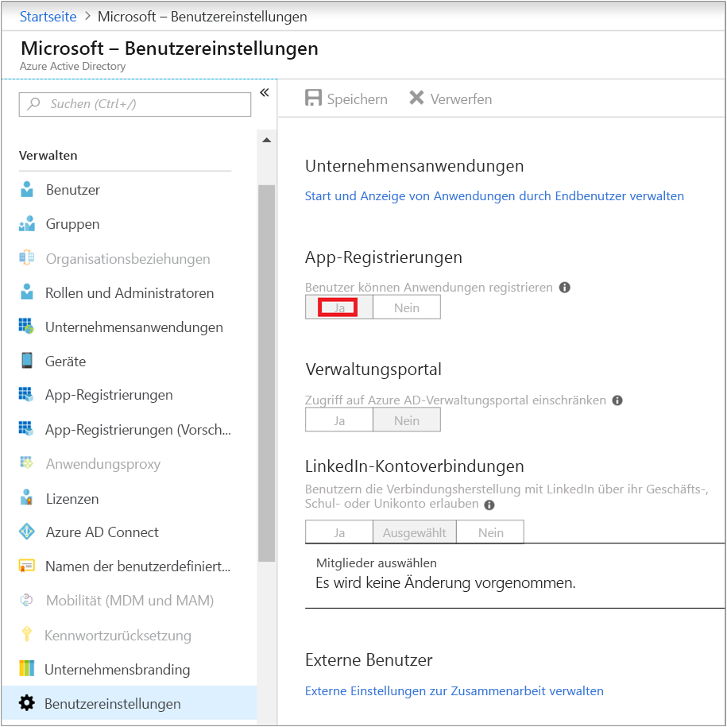
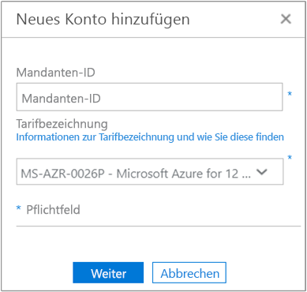
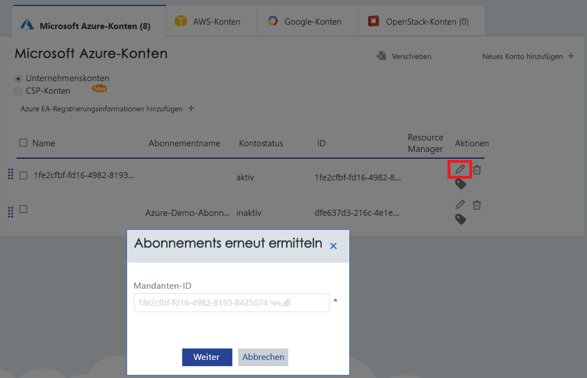

# <a name="activate-azure-subscriptions-and-accounts-with-cloudyn"></a>Aktivieren von Azure-Abonnements und -Konten mit Cloudyn

Durch das Hinzufügen oder Aktualisieren Ihrer Azure Resource Manager-Anmeldeinformationen kann Cloudyn alle Konten und Abonnements in Ihrem Azure-Mandanten ermitteln. Wenn Sie auf Ihren virtuellen Computern außerdem die Erweiterung „Azure-Diagnose“ aktiviert haben, kann Cloudyn erweiterte Metriken wie CPU- und Arbeitsspeicherdaten sammeln. In diesem Artikel wird beschrieben, wie Sie den Zugriff mithilfe von Azure Resource Manager-APIs für neue und vorhandene Konten aktivieren. Darüber hinaus wird erläutert, wie Sie häufige Probleme im Zusammenhang mit Konten beheben.

Cloudyn kann auf die meisten Ihrer Azure-Abonnementdaten nicht zugreifen, wenn das Abonnement _nicht aktiviert_ ist. Sie müssen _nicht aktivierte_ Konten bearbeiten, damit Cloudyn darauf zugreifen kann.

## <a name="required-azure-permissions"></a>Erforderliche Azure-Berechtigungen

Um die in diesem Artikel beschriebenen Verfahren ausführen zu können, werden bestimmte Berechtigungen benötigt. Entweder Sie oder Ihr Mandantenadministrator müssen beide der folgenden Berechtigungen besitzen:

- Berechtigung zum Registrieren der CloudynCollector-Anwendung bei Ihrem Azure AD-Mandanten.
- Fähigkeit zum Zuweisen der Anwendung zu einer Rolle in Ihren Azure-Abonnements.

Die Konten in Ihren Azure-Abonnements müssen über `Microsoft.Authorization/*/Write`-Zugriff verfügen, um die CloudynCollector-Anwendung zuweisen zu können. Diese Aktion wird über die Rolle [Besitzer](../role-based-access-control/built-in-roles.md#owner) oder [Benutzerzugriffsadministrator](../role-based-access-control/built-in-roles.md#user-access-administrator) gewährt.

Wenn Ihr Konto der Rolle **Mitwirkender** zugewiesen ist, verfügen Sie nicht über die erforderliche Berechtigung zum Zuweisen der Anwendung. Sie erhalten einen Fehler, wenn Sie versuchen, Ihrem Azure-Abonnement die CloudynCollector-Anwendung zuzuweisen.

### <a name="check-azure-active-directory-permissions"></a>Überprüfen der Azure Active Directory-Berechtigungen

1. Melden Sie sich beim [Azure-Portal](https://portal.azure.com) an.
2. Wählen Sie im Azure-Portal die Option **Azure Active Directory** aus.
3. Wählen Sie in Azure Active Directory die Option **Benutzereinstellungen** aus.
4. Überprüfen Sie die Option **App-Registrierungen**.
    - Wenn die Option auf **Ja** festgelegt ist, können Nicht-Administratoren AD-Apps registrieren. Diese Einstellung bedeutet, dass jeder Benutzer im Azure AD-Mandanten Apps registrieren kann.  
    
    - Wenn die Option **App-Registrierungen** auf **Nein** festgelegt ist, können nur Mandantenadministratoren Azure Active Directory-Apps registrieren. Ihr Mandantenadministrator muss die CloudynCollector-Anwendung registrieren.


## <a name="add-an-account-or-update-a-subscription"></a>Hinzufügen eines Kontos oder Aktualisieren eines Abonnements

Wenn Sie ein Konto hinzufügen oder ein Abonnement aktualisieren, gewähren Sie Cloudyn Zugriff auf Ihre Azure-Daten.

### <a name="add-a-new-account-subscription"></a>Hinzufügen eines neuen Kontos (Abonnements)

1. Klicken Sie im Cloudyn-Portal auf das Zahnradsymbol in der rechten oberen Ecke, und wählen Sie **Cloud Accounts** (Cloudkonten) aus.
2. Klicken Sie auf **Neues Konto hinzufügen**. Das Feld **Neues Konto hinzufügen** wird angezeigt. Geben Sie die erforderlichen Informationen ein.  
    

### <a name="update-a-subscription"></a>Aktualisieren eines Abonnements

1. Wenn Sie ein _nicht aktiviertes_ Abonnement aktualisieren möchten, das bereits in der Kontoverwaltung von Cloudyn vorhanden ist, klicken Sie zum Bearbeiten auf das Stiftsymbol rechts neben der übergeordneten _Mandanten-GUID_. Abonnements werden unter einem übergeordneten Mandanten zusammengefasst, aktivieren Sie Abonnements daher nicht einzeln.
    
2. Geben Sie, falls erforderlich, die Mandanten-ID ein. Wenn Sie Ihre Mandanten-ID nicht kennen, führen Sie die folgenden Schritte aus, um sie nachzusehen:
    1. Melden Sie sich beim [Azure-Portal](https://portal.azure.com) an.
    2. Wählen Sie im Azure-Portal die Option **Azure Active Directory** aus.
    3. Wählen Sie zum Abrufen der Mandanten-ID die Option **Eigenschaften** für Ihren Azure AD-Mandanten aus.
    4. Kopieren Sie die „Verzeichnis-ID“. Dieser Wert ist Ihre Mandanten-ID.
    Weitere Informationen finden Sie unter [Abrufen der Mandanten-ID](../active-directory/develop/howto-create-service-principal-portal.md#get-tenant-id).
3. Wählen Sie ggf. Ihre Abrechnungs-ID aus. Wenn Sie Ihre Abrechnungs-ID nicht kennen, führen Sie die folgenden Schritte aus, um sie nachzusehen.
    1. Klicken Sie oben rechts im Azure-Portal auf Ihre Benutzerinformationen und anschließend auf **Meine Rechnung anzeigen**.
    2. Klicken Sie unter **Abrechnungskonto** auf **Abonnements**.
    3. Wählen Sie unter **Meine Abonnements** das gewünschte Abonnement aus.
    4. Ihre Abrechnungs-ID wird unter **Angebots-ID** angezeigt. Kopieren Sie die Angebots-ID für das Abonnement.
4. Klicken Sie in „Neues Konto hinzufügen“ (oder „Abonnement bearbeiten“) auf **Speichern** (oder **Weiter**). Sie werden zum Azure-Portal umgeleitet.
5. Melden Sie sich beim Portal an. Klicken Sie auf **Akzeptieren**, um Cloudyn Collector Zugriff auf Ihr Azure-Konto zu gewähren.

    Sie werden auf die Verwaltungsseite für Cloudyn-Konten weitergeleitet, und Ihr Abonnement wird aktualisiert, sodass als Kontostatus **aktiv** angezeigt wird. Unter der Resource Manager-Spalte sollte ein grünes Häkchen angezeigt werden.

    Wenn für einige Abonnements kein grünes Häkchen angezeigt wird, bedeutet dies, dass Sie nicht zum Erstellen der Lese-App (CloudynCollector) für das Abonnement berechtigt sind. Ein Benutzer mit höheren Berechtigungen für das Abonnement muss den Vorgang wiederholen.

Sehen Sie sich das Video [Connecting to Azure Resource Manager with Cloudyn](https://youtu.be/oCIwvfBB6kk) (Herstellen einer Verbindung mit Azure Resource Manager über Cloudyn) an, das Sie durch diesen Vorgang leitet.

>[!VIDEO https://www.youtube.com/embed/oCIwvfBB6kk?ecver=1]

## <a name="resolve-common-indirect-enterprise-set-up-problems"></a>Beheben häufiger indirekter Probleme bei der Enterprise-Einrichtung

Wenn Sie das Cloudyn-Portal zum ersten Mal verwenden, werden möglicherweise die folgenden Meldungen angezeigt, wenn Sie ein Benutzer von Enterprise Agreement oder Cloud Solution Provider (CSP) sind:

- Im *Assistenten für die Einrichtung von Cloudyn*: **Der angegebene API-Schlüssel ist kein Schlüssel für die Registrierung auf der obersten Ebene**.
- Im Enterprise Agreement-Portal: *Direkte Registrierung – Nein*.
- Im Cloudyn-Portal: *No usage data was found for the last 30 days. Please contact your distributor to make sure markup was enabled for your Azure account* (Für die letzten 30 Tage wurden keine Nutzungsdaten gefunden. Wenden Sie sich an Ihren Distributor, um sicherzustellen, dass für Ihr Azure-Konto Markup aktiviert wurde.).

Mit den obigen Fehlermeldungen wird angegeben, dass Sie über einen Handelspartner oder CSP ein Azure Enterprise Agreement (EA) erworben haben. Ihr Handelspartner oder CSP muss _Markup_ für Ihr Azure-Konto aktivieren, damit Sie Ihre Daten in Cloudyn anzeigen können.

Sie können die Probleme wie folgt beheben:

1. Ihr Handelspartner muss _Markup_ für Ihr Konto aktivieren. Die Anleitung finden Sie unter [Indirect Customer Onboarding Guide (Anleitung für indirektes Kundenonboarding)](https://ea.azure.com/api/v3Help/v2IndirectCustomerOnboardingGuide).
2. Sie generieren den Azure EA-Schlüssel für die Verwendung mit Cloudyn. Entsprechende Anweisungen finden Sie unter [Registrieren eines Azure Enterprise Agreements und Anzeigen von Kostendaten](https://docs.microsoft.com/azure/cost-management/quick-register-ea).

Sie müssen die Azure-Abrechnungs-API aktivieren, bevor Sie den Azure EA-API-Schlüssel für die Einrichtung von Cloudyn generieren können. Befolgen Sie hierfür diese Anleitungen:

- [Überblick über Berichterstellungs-APIs für Unternehmenskunden](../billing/billing-enterprise-api.md)
- [Microsoft Azure Enterprise Portal-Berichterstellungs-API](https://ea.azure.com/helpdocs/reportingAPI) unter **Aktivieren des Datenzugriffs für die API**

Unter Umständen müssen Sie auch Abteilungsadministratoren, Kontobesitzern und Unternehmensadministratoren Berechtigungen zum _Anzeigen von Gebühren_ per Abrechnungs-API gewähren.

Cloudyn kann nur von einem Azure-Dienstadministrator aktiviert werden. Co-Administrator-Berechtigungen sind nicht ausreichend. Sie können die Administratoranforderung jedoch umgehen. Sie können anfordern, dass der Azure Active Directory-Administrator die Berechtigung zum Autorisieren von **CloudynAzureCollector** mit einem PowerShell-Skript gewährt. Das folgende Skript gewährt die Berechtigung zum Registrieren des Azure Active Directory-Dienstprinzipals **CloudynAzureCollector**.


```powershell
#THE SOFTWARE IS PROVIDED "AS IS", WITHOUT WARRANTY OF ANY KIND, EXPRESS OR IMPLIED, INCLUDING BUT NOT LIMITED TO THE WARRANTIES OF MERCHANTABILITY, FITNESS FOR A PARTICULAR PURPOSE AND NONINFRINGEMENT. IN NO EVENT SHALL THE AUTHORS OR COPYRIGHT HOLDERS BE LIABLE FOR ANY CLAIM, DAMAGES OR OTHER LIABILITY, WHETHER IN AN ACTION OF CONTRACT, TORT OR OTHERWISE, ARISING FROM, OUT OF OR IN CONNECTION WITH THE SOFTWARE OR THE USE OR OTHER DEALINGS IN THE SOFTWARE.

#Tenant - enter your tenant ID or Name
$tenant = "<ReplaceWithYourTenantID>"

#Cloudyn Collector application ID
$appId = "83e638ef-7885-479f-bbe8-9150acccdb3d"

#URL to activate the consent screen
$url = "https://login.windows.net/"+$tenant+"/oauth2/authorize?api-version=1&response_type=code&client_id="+$appId+"&redirect_uri=http%3A%2F%2Flocalhost%3A8080%2FCloudynJava&prompt=consent"

#Choose your browser, the default is Internet Explorer

#Chrome
#[System.Diagnostics.Process]::Start("chrome.exe", "--incognito $url")

#Firefox
#[System.Diagnostics.Process]::Start("firefox.exe","-private-window $url" )

#IExplorer
[System.Diagnostics.Process]::Start("iexplore.exe","$url -private" )

```

## <a name="next-steps"></a>Nächste Schritte

- Falls Sie das erste Tutorial zu Cloudyn noch nicht abgeschlossen haben, lesen Sie es unter [Überprüfen der Nutzung und der Kosten](tutorial-review-usage.md).
